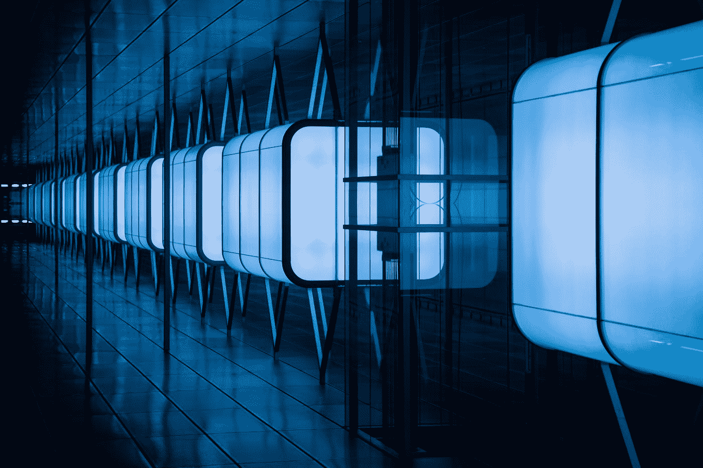

# 光线行进简介:GPU 上的真实感渲染

> 原文：<https://medium.com/geekculture/an-introduction-to-raymarching-photorealistic-rendering-on-gpu-970fdd02e31d?source=collection_archive---------15----------------------->

## GLSL 在《阴影》中写道

Photo by [Paul Steuber](https://unsplash.com/@paulsteuber?utm_source=medium&utm_medium=referral) on [Unsplash](https://unsplash.com?utm_source=medium&utm_medium=referral)

# 为什么射线行进

在虚拟 3D 场景中，虚拟光线负责生成数字图像中的像素。光线追踪技术计算每条光线如何与物体表面相遇，结果可能令人吃惊，但找到珍贵的交点是…