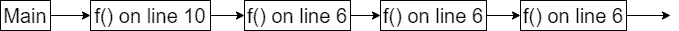
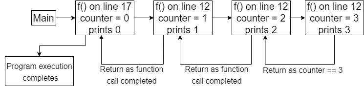

# 递归入门

> 原文：<https://medium.com/geekculture/an-introduction-to-recursion-bb13dc6035cb?source=collection_archive---------16----------------------->

Photo by [Max Harlynking](https://unsplash.com/@harlynkingm?utm_source=medium&utm_medium=referral) on [Unsplash](https://unsplash.com?utm_source=medium&utm_medium=referral)

读者你好！你一定听说过**递归**。这对于编程来说是一个重要的概念——无论是竞争性的还是学术性的，以及技术性的面试。本文将向您介绍递归。

*注意:学习这个概念没有先决条件，但是要知道函数和一点点任何编程语言。点击* [*此处*](https://python.plainenglish.io/day-7-functions-in-python-e8cb75ebae61) *可简单阅读功能。*

## 那么到底什么是递归呢？

> a)函数调用自身
> b)直到满足基本情况

因此，递归的一部分意味着函数调用自身的情况。

Sample Code for Recursion

在上面的示例代码中，第 10 行的主函数调用自己，然后调用第 6 行的函数()，再调用第 6 行的函数()，依此类推。

下图描述了程序的执行方式:

Recursive Calls to f()

但是，在上面的场景中有一个问题。输出 1 继续无限制打印，导致 ***无限递归*** 或***stack overflow***。

> 我们都知道当一个程序编译时，一些内存(就堆栈而言)被分配给该程序。然而，当计算机程序试图在调用的堆栈中使用比分配的更多的内存空间时，就会导致溢出，通常称为 StackOverflow。

这就把我们带到了定义递归的下一个要点，即函数调用一直进行到满足特定的条件/标准。这种情况也被称为**基本情况**(基本情况)。

现在让我们通过包含一个基本情况来转换上面的示例，即打印 1，直到计数器的值达到 3。

Sample Code for Recursion

让我们来理解一下，当递归调用函数 f()时，程序是如何执行的，基本条件是“直到计数器为 3”。

Recursive calls to function f() with the counter condition

上图非常类似于递归程序执行时内存空间(堆栈)的消耗方式。

为了简化函数调用描述，使用了 ***递归树*** 。因此，它们是图形化表示递归调用过程的一种便捷方式。

对于上面的例子，可以使用下面的递归树。

Recursion Tree Example

我们总结一下:

*   递归是一个概念，涉及到任何调用自己的任意函数，直到达到基本情况。
*   当出现无限递归时，即在函数定义期间没有指定基本情况时，会出现 StackOverflow。
*   递归树是描述递归程序执行的一种图形化方式。

*感谢阅读！一定要订阅并与社区中的每个人分享，不要忘记点赞和评论。跟随我的中页* [*日什卡古普塔*](https://medium.com/u/6521c7f86bab?source=post_page-----20f19b748021--------------------------------) *。*