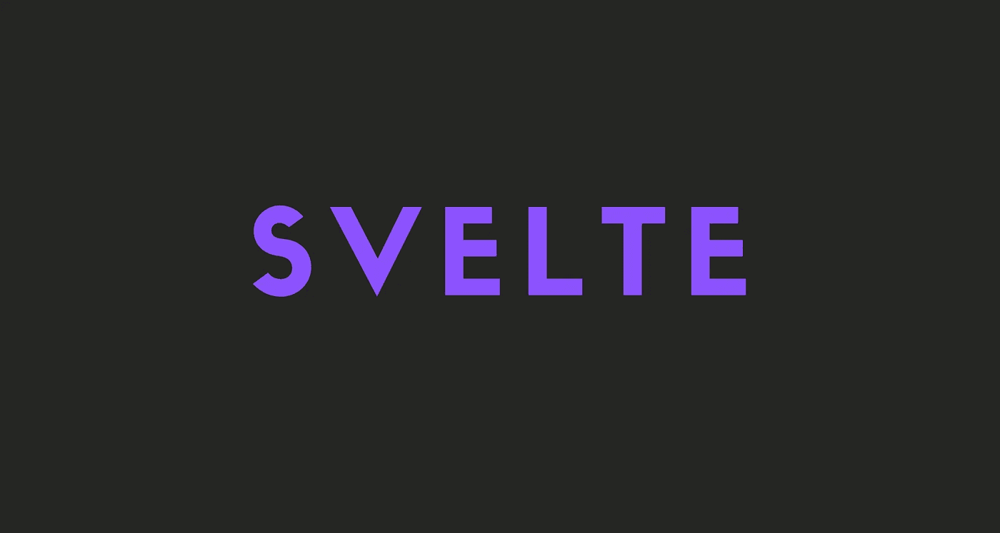

# 苗条身材简介

> 原文：<https://medium.com/geekculture/an-introduction-to-svelte-a21498746cca?source=collection_archive---------20----------------------->

苗条框架的快速介绍。

在这个故事中，我将谈论什么是苗条，什么时候使用它等等。

## 注意

我没有把 Svelte 包括在我的 2021 年最佳前端 JavaScript 框架的比较中，因为我没有足够的经验。你可以把这个故事看作是那个故事中最纤细的部分。

开始吧！

# 什么是苗条？

Svelte 是一个前端、开源的 JavaScript 框架，用于制作交互式网页。Svelte 类似于 React 和 Vue 等已有的框架，因为它使开发者能够制作 web 应用程序。然而，Svelte 带来了几个特性，为开发人员提供了独特的体验。

即使 svelite 开发者不喜欢这句话，我认为 svelite 是 React 和 Vue 的混合。

# 苗条的特征

*   较少代码
*   没有虚拟 DOM
*   真正的反应
*   更快的性能

# 较少代码

编写更少的代码行可以节省时间，减少错误，提高可读性。

Svelte 并没有限制开发者只能使用一个额外的顶级元素。此外，Svelte 允许您通过使用赋值操作符(`=`)轻松地更新变量的本地状态。然而，在 React 中，用户必须使用`useState`钩子，这使得代码更重。

# 没有虚拟 DOM

从最基本的意义上来说，虚拟 DOM 是一种通过比较以前的定制对象树的快照和当前的快照来更新状态的方法。这是在 React 中使用的。

Svelte 是一个编译器，因此用户不需要将库加载到浏览器来运行 Svelte 代码。相反，页面上加载了一个简单的`.js`文件来呈现应用程序。所有的对象更新都是在编译时进行的。这有助于 Svelte 减少虚拟 DOM 产生的开销。此外，不必加载整个库，大大减小了文件的大小。这对移动设备尤其有利。

# 真正的反应

Svelte 在构建时像外科手术一样更新 DOM。这使得用户可以根据自己的需求构建应用程序，而不必担心不必要的开销。

为了让用户的生活更加轻松，Svelte 在语言中融入了反应。

要改变 React 或 Vue 中的状态，用户需要使用`hooks`。尽管`hooks`是更新状态的基本元素，但是它们为垃圾收集器产生了不必要的工作。

# 更快的性能

因为 Svelte 编译成优化的 JS 文件，而不是 JS、HTML 和 CSS，所以它比其他框架快得多。用户测试显示，Svelte 比其他常见框架快 30%左右。

# 什么时候使用苗条

*   你根本不想要任何样板文件
*   你想要一个简单优雅的语法
*   比起大框架，你更喜欢小框架

# 最后的想法

在我看来，Svelte 对于小型项目非常有用。但是我还是不确定你是不是应该用在大的上。

我希望这个故事能帮助你，让你对苗条有新的认识。

## 仅此而已。感谢您阅读这个故事！

如果你喜欢这个故事，一定要让我们在评论中知道，并随时问我你想问的任何问题。

在 Twitter 上关注我:

 [## re _ ally 边缘

twitter.com](https://twitter.com/Re_allyedge) 

在 Patreon 上支持我:

 [## 阿里木阿尔斯兰卡亚是创造编程故事和教程。帕特里翁

### 今天就成为阿里木阿尔斯兰卡亚的赞助人:在世界上最大的…

www.patreon.com](https://www.patreon.com/allyedge)