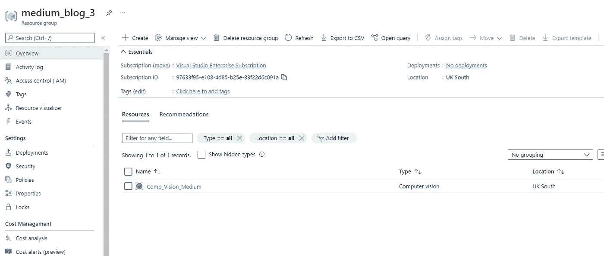
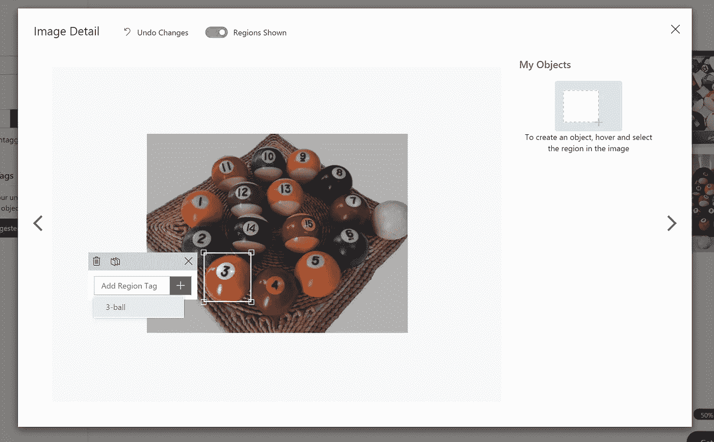
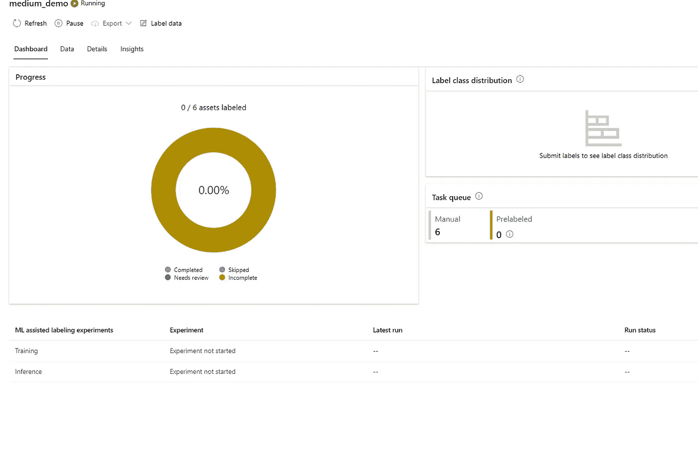

# Azure 上的计算机视觉服务简介

> 原文：<https://medium.com/geekculture/an-introduction-to-the-computer-vision-services-on-azure-fbbd5096cca3?source=collection_archive---------10----------------------->

## 了解 Azure 计算机视觉服务，包括 AutoML for Imagery。


# 介绍

Azure 是一个相当广泛的云平台，有时似乎有无数不同的服务；今天，我们将重点介绍其中的一小部分—计算机视觉或 CV 服务。Azure 提供低代码/无代码的 CV 服务，例如 Custom Vision，以及编程性服务，例如用于图像的 AutoML。我们还将简要介绍用于创建资源组和资源的 Azure CLI。

## Azure 上的选项

在撰写本报告时，我们在 Azure 上有以下 CV 选项:

*   **Azure Computer Vision**——作为 Azure 认知服务的一部分，Computer Vision 为用户提供了使用各种用例的现成算法的机会。
*   **Azure Custom Vision**——Custom Vision 为用户提供了在低代码/无代码环境中进行实践和培训自己的定制模型的机会，同时为编程开发提供了一个易于使用的 SDK。
*   **AutoML for imaging(*Public Preview*)**——作为 Azure ML 产品的一部分，AutoML for imaging 为用户提供了一种代码优先的方法来培训和部署模型。

现在，我们已经了解了这些服务，让我们更深入地了解一下它们。请随意直接跳到您感兴趣的服务，而不是阅读整篇文章！

# 天蓝色计算机视觉

Azure 的计算机视觉服务是 Azure 认知服务产品的一部分，允许用户通过 API 端点与一系列专业的现成模型交互。计算机视觉服务提供光学字符识别功能以及图像和空间分析。

## 创建资源— Azure 命令行界面设置

在深入讨论该示例之前，我们首先需要在我们的 Azure 订阅中创建一个 Computer Vision 资源——您可以在此处创建免费订阅。我们将使用 [Azure CLI](https://docs.microsoft.com/en-us/cli/azure/install-azure-cli-windows?tabs=azure-cli) 创建该资源，但也可以在门户中轻松完成。

一旦您通过上面的链接安装了 CLI，我们就可以开始创建新的资源组和计算机视觉资源了。

```
**az login**
```

首先，我们想使用上面的命令登录。运行后，您应该会进入 Azure 登录页面，登录后，应该会显示您的订阅列表。

```
**az group create -l uksouth -n medium_blog_3**
```

接下来，让我们使用上面的命令创建一个资源组——确保替换位置和名称标志以满足您的需要。

```
**az cognitiveservices account create -n "Comp_Vision_Medium" -g "medium_blog_3" --kind "ComputerVision" --sku "S1" -l UKSouth --yes**
```

接下来，我们将使用上面的命令创建一个计算机视觉资源。在门户中查看时，应该会出现以下情况:



在这里，您需要通过 Azure 门户导航到计算机视觉资源中的*密钥&证书*选项卡，从您的资源中获取密钥和端点。

## 编程示例

现在我们来看一个使用一些计算机视觉 API 的编程示例。请记住这个例子是用 Python 写的，所以假设你已经在你的机器上运行了它。

这看起来像是一大块代码，但是我们会分解它——不要担心！在这里，我也遵循了我在博客中提出的关于文档字符串的指导方针和建议，以帮助提高代码可读性——点击[这里](/geekculture/the-importance-of-writing-clear-docstrings-in-programming-62bffffa3881)！

*   第 1–14 行涵盖了模块的 docstring 和脚本所需的导入库！就在这一点之后，你可以看到全局变量，它们将存储你的键和端点，我们在上一节的末尾获取了它们。
*   第 20–39 行包含脚本的命令行参数，包括任何图像路径或 URL，以及该脚本的自定义打印功能。

第 40 行及以上是脚本开始充实的地方…

*   定义的下一个函数是 *auth_client()* 函数，它使用密钥和端点来认证我们的客户机，以便查询任何 API 端点。
*   第 49–76 行是我们第一个 API 调用的地方——这里我们将使用远程图像查询 OCR 端点。如您所见，我们传入了经过身份验证的客户端、图片 URL 的可选参数以及我们是否希望打印边界框。第 62 行之前是请求和处理响应的地方。
*   第 78–103 行基本上是远程图像函数的翻版，但用于本地图像——不同之处在于第 89 行，这里我们调用了不同的端点。
*   之后，我们找到了决定程序流程的 *main()* 函数。

# Azure 自定义视觉

Azure Custom Vision 是一种图像识别服务，允许用户构建和训练自己的自定义模型——该服务允许用户指定自己的标签，并随后检测它们。该服务以 SDK 或无代码友好的[门户网站](https://customvision.ai/)的形式提供——您可以根据自己的喜好在任一界面中创建、测试和训练模型。

## 创建自定义视觉资源

首先，让我们通过导航到位于 [Custom Vision — Home](https://www.customvision.ai/) 的门户来创建一个自定义 Vision 项目。登录后，系统会提示您创建一个资源，然后创建一个项目—在本例中，我们将选择一个对象检测项目，并选择 *General [A1]* 作为我们的[域](https://docs.microsoft.com/en-us/azure/cognitive-services/custom-vision-service/select-domain)。

## 模型的无代码开发

所以，我们已经准备好了资源和项目，这意味着我们现在可以开始创建我们的模型了！对于这个例子，我将创建一个模型来检测美国台球中的 3 号球。

首先，我们需要将我们的图像上传到项目中，这可以使用“*添加图像*按钮直观地完成。从那里，下一步是现在用我们自己的标签标记我们的图像——添加新的标签类可以通过选择一个图像，然后在框右上角的文本框中输入标签来完成。

与 Azure ML Studio 中的功能类似，UI 使标记您的图像变得非常容易——我们只需在我们希望检测的对象周围拖动一个框，然后为该边界框添加一个标签……简单吧？



一旦我们标记了我们的图像，我们可以点击*训练*按钮来训练我们的模型的第一次迭代。在这里，您可以选择快速训练或高级训练——不需要太多的细节，高级训练会解冻底层神经网络中的最后几层，而快速训练会使它们保持冻结状态。

训练好模式后，您将看到指标——精确度、召回率和地图(平均精确度)。从这里，您可以点击 UI 左上角的 *Publish* 按钮来发布模型，这样如果您对结果满意，就可以通过预测 API 访问它。

不过，对于这个例子，我将只使用*快速测试*功能来检查模型在测试图像上的输出。在这一阶段，您可以使用本地或远程图像测试模型，并更改阈值以查看模型的预测。

***如果有足够的兴趣，我可以更深入地研究定制的 Vision API&SDK——我不想让这个博客因为包含它而持续太久！***

# 图像自动绘制(*公开预览*)

AutoML 是 Azure 的机器学习功能，使专业和公民数据科学家能够快速构建机器学习模型。

最近，在公开预览中宣布了对视觉任务的支持。我们现在能够轻松地为图像分类(多类别、多标签)、对象检测和实例分割等场景生成基于图像数据训练的模型。

## 使用 AutoML for Imagery 和 Azure Kubernetes 服务培训和部署模型

我们将使用 Azure ML Studio 在笔记本中以编程方式开发和训练我们的模型，因此直观地说，我们将通过创建 Azure 机器学习资源来开始这一部分——我将通过门户来完成这一工作。

我不会花时间介绍工作室本身，但如果你想了解更多，我会在参考资料部分留下一些资源链接。

首先，我们将前往*计算*部分，创建一个轻量级计算来运行我们的笔记本电脑单元。在这一点上，我将添加警告**不要忘记把你的计算实例等。关**——你被警告了！

对于我们的数据，我们将使用 Azure ML Studio 中的数据标记功能来标记我们的数据并将其导出到注册的数据集中——有关准备数据的指导，请参见文档[页面](https://docs.microsoft.com/en-us/azure/machine-learning/how-to-prepare-datasets-for-automl-images)。为了方便起见，我将使用自定义视觉示例中的相同图像。

要标记您的数据，请前往工作室的*数据标记*部分，然后单击*新项目*。在这里，您将拥有定义标签项目的所有选项，即*媒体类型* &标签类型。对于我的项目，我将再次选择对象检测。按照屏幕上的指示，上传您的图像，直到您看到如下所示的用户界面:



这个仪表板提供了一个很好的标签项目概述，并将更新以及去。要开始贴标签，请前往*标签数据*选项卡，然后您会看到一个类似于自定义视觉的用户界面。

一旦数据集在 Azure ML Studio 中被标记，我们需要将其导出并注册为 Azure ML 数据集。要做到这一点，请回到您的项目，转到*导出*选项卡并选择 *Azure ML 数据集*。如果您现在前往左侧的*数据集*选项卡，您应该能够看到导出的数据集！

出于对这成为我的论文的恐惧，我会指引你到这个公共的[仓库](https://github.com/retkowsky/AutoMLforImages)去找一些完全成熟的笔记本——我只是在更高的层次上回顾这些步骤。 ***类似于自定义的 Vision SDK，如果有足够的需求为 AutoML 开发一个单独的图像博客，我会很乐意专门为它再写一篇文章。***

首先，我们想要定义我们的工作空间并创建我们的实验——这个实验充当了我所称的所有不同运行的“外壳”。它允许我们轻松地比较不同模型和超参数的指标，帮助我们选择想要部署的模型。

接下来，我们需要提供一个 GPU 来训练我们的模型，这可以在 UI 中完成，或者使用可用的 [SDK](https://docs.microsoft.com/en-us/python/api/overview/azure/ml/?view=azure-ml-py) 以编程方式完成。调配完成后，我们需要读入数据集并设置运行，如下所示:

```
image_config_yolov5 = AutoMLImageConfig(
task=ImageTask.IMAGE_OBJECT_DETECTION,
compute_target=compute_target,
training_data=training_dataset,                        hyperparameter_sampling=GridParameterSampling({'model_name': choice('yolov5')}),
iterations=1)automl_image_run = experiment.submit(image_config_yolov5)automl_image_run.wait_for_completion(wait_post_processing=True)
```

从代码片段中，我们可以看到我正在使用 YoloV5 模型在。为了清楚起见， *compute_target* 是我的 GPU 实例， *training_dataset* 是我的标记数据集。

一旦运行完成，我们可以导航到工作室的*实验*部分，查看每个子运行的度量。

在这一点上，我们在下一步该做什么方面遇到了一个十字路口——我们要么提交另一次运行，进行一些超参数调整，要么根据我们对模型性能的满意程度，将我们的模型部署到 Kubernetes 集群。

在前面的例子中，我们以与上次几乎相同的方式设置和提交运行，代码如下所示:

一旦我们对模型的指标感到满意，我们就可以考虑部署到 AKS。要开始这个过程，我们必须从提供一个 GPU 推理集群开始——这也可以使用 UI 或使用 SDK 以编程方式完成。关于部署的更多细节，请参见[这里的](https://docs.microsoft.com/en-us/azure/machine-learning/how-to-deploy-and-where?tabs=python)，但这里是我笔记本中部署我的模型的代码:

在模型被部署之后，我们可以查询它的端点，使用一些测试数据使用 *requests* 库来测试它的输出——模型的端点只是一个 REST 端点，所以可以这样使用。

如果您想下载。ONNX 文件，并将其部署在边缘设备上，您可以在此了解更多详细信息[。](https://docs.microsoft.com/en-us/azure/machine-learning/how-to-inference-onnx-automl-image-models?tabs=multi-class)

# 结论

所以，我们有它！我们已经查看了 Azure 上的所有计算机视觉服务，从计算机视觉及其 API 到 AutoML for Imagery。

一如既往，保重

~伊森

# 参考

*   [https://tech community . Microsoft . com/t5/ai-machine-learning-blog/announcing-automated-ml-automl-for-images/ba-p/2843034](https://techcommunity.microsoft.com/t5/ai-machine-learning-blog/announcing-automated-ml-automl-for-images/ba-p/2843034)
*   [https://azure . Microsoft . com/en-us/services/cognitive-services/computer-vision/#概述](https://azure.microsoft.com/en-us/services/cognitive-services/computer-vision/#overview)
*   [https://azure . Microsoft . com/en-GB/services/cognitive-services/custom-vision-service/](https://azure.microsoft.com/en-gb/services/cognitive-services/custom-vision-service/)
*   [https://docs . Microsoft . com/en-us/azure/cognitive-services/computer-vision/quick starts-SDK/client-library？tabs = visual-studio&pivots =编程语言-python](https://docs.microsoft.com/en-us/azure/cognitive-services/computer-vision/quickstarts-sdk/client-library?tabs=visual-studio&pivots=programming-language-python)
*   retkowsky/AutoMLforImages:Azure AutoML for Images。AutoML for Images 是 Azure ML 的一部分。AutoML for images 在 public preview 中可用。(github.com)
*   [Azure AutoML for Images:Baseline and beyond for Computer Vision models | by Mercy ran JIT | Microsoft Azure | Medium](/microsoftazure/azure-automl-for-images-baseline-and-beyond-for-computer-vision-models-7a9631644d02)