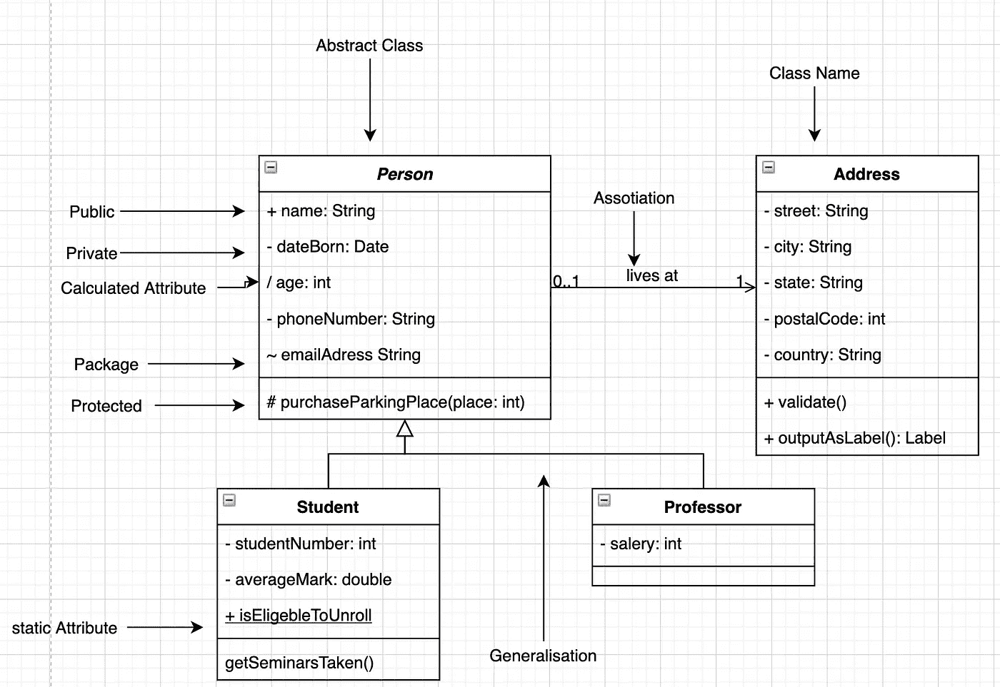
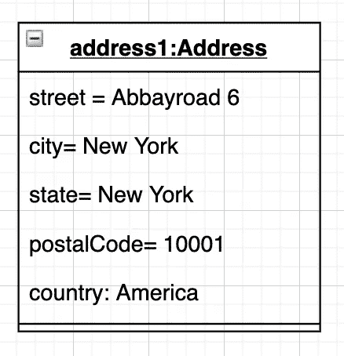
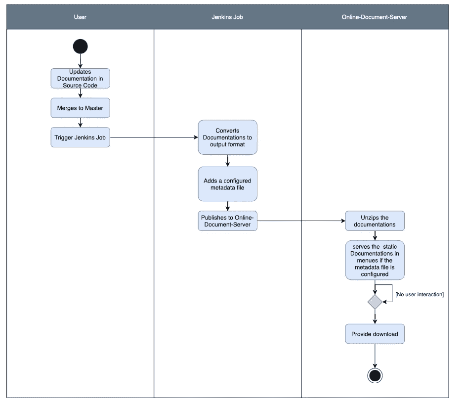

# UML 介绍|以及如何使用它

> 原文：<https://medium.com/geekculture/an-introduction-to-uml-and-how-to-use-it-baabd6723637?source=collection_archive---------27----------------------->

Photo by [Philippe Bout](https://unsplash.com/@flipboo?utm_source=medium&utm_medium=referral) on [Unsplash](https://unsplash.com?utm_source=medium&utm_medium=referral)

上周我写了一个关于 arc42 的故事，这是一个标准的文档模板。当我写这篇文章的时候，我终于明白了有多少不同的 UML 图。因为我在开始的时候有点困惑，也有点被这些不同的图表弄得不知所措，所以我决定就此写一篇新的帖子。

# 什么是 UML

[UML](http://www.omg.org/spec/UML/) ，统一建模语言的缩写，是一种标准化的建模语言，由一组集成的图表组成，旨在帮助系统和软件开发人员指定、可视化、构建和记录软件系统的工件，以及业务建模和其他非软件系统。

UML 代表了在大型复杂系统建模中被证明是成功的最佳工程实践的集合。UML 是开发面向对象软件和软件开发过程中非常重要的一部分。UML 主要使用图形符号来表达软件项目的设计。使用 UML 有助于项目团队交流，探索潜在的设计，并验证软件的架构设计。

## UML 图有多少种类型？

有各种各样不同的图表，因为每个图表都有不同的用例。当谈到为每个用例选择正确的图类型时，UML 留下了很多解释的空间。总之，UML 中有 13 种不同的图。这 13 个分为两节，一节叫动态模型，一节叫静态模型。

## 静态图表

静态图显示了系统的结构及其不同抽象和实现级别上的部分，以及它们之间的关系。结构图中的元素代表系统中有意义的概念，可能包括抽象概念、现实世界概念和实现概念，结构图有以下七种类型:

*   **类图**
*   **部件图**
*   **部署图**
*   **对象图**
*   **包装图**
*   **复合结构图**
*   **剖面图**

## 动态图表

动态图显示了不同参与者或对象之间的关系和交互。它们显示了系统的动态行为和系统本身的变化。动态图表包括:

*   **用例图**
*   **活动图**
*   **状态机图**
*   **顺序图**
*   **通信图**
*   **交互概述图**
*   **时序图**

## 最重要的图表

这可能很大程度上取决于你的需求和在公司的职位。在我看来，有四张图，你会比其他人用得更多。这些“更重要”的是:

*   **类图**
*   **对象图**
*   **用例图**
*   **活动图**

在下一节中，我将尽可能好地解释这些图的基本概念。

## 类图

类图是迄今为止最常用的一种。它由不同的盒子组成，包含类名、一些属性和方法(如果有的话)。所有这些字段都可以有特殊的注释，如访问配置。

这个类图应该包含一个好的类图最重要的东西。请记住，Person 类是以*斜体*文本样式编写的。

## 对象图

对象图或多或少是一个包含具体值的类图。

唯一显著改变的是类名之前可以有一个带“:”的对象名。如果不需要，这个也可以拿走。整个上半部分都加了下划线。

## 用例图

用例图是我列表中的第一个动态图。它展示了一个系统中不同的参与者以及他们能做什么。

在本例中，Max 和 CI 构建系统是参与者。参与者总是需要置身于系统本身之外。蓝色和紫色的椭圆形是这些演员可以执行的动作。它们用黑线连接到相应的演员。箭头定义了一件事对另一件事的依赖关系。

或者在代码中:一个函数调用它体内的另一个函数。

## 活动图

活动图显示了与用例图相同的东西，但是也有机会在动作中添加 if 语句。我甚至认为这是一种更容易理解系统基本原理的方式。

这个图有一个起点和一个终点。您可以准确地看到动作在哪里被触发，什么时候被执行。在这个图中，你还可以看到什么时候以及为什么执行东西。

# 反射

# 什么进展顺利

这些图中的大部分都非常简单明了，在 IT 世界中也确实存在，所以我至少听说过一次。类图或对象图也很容易理解和使用。

# 什么需要改进

根据您的工作地点和工作内容，您可能从未听说过这些图表。例如，我不知道时间表应该是什么，或者它是用来做什么的。我需要找个时间读读这方面的书。因为不同图的 UML 符号有很多变化，这取决于你在哪里，很难说这是对的，或者这是错的。在学校里，我们学习了不同的注释，在商业世界里，也有其他的注释。