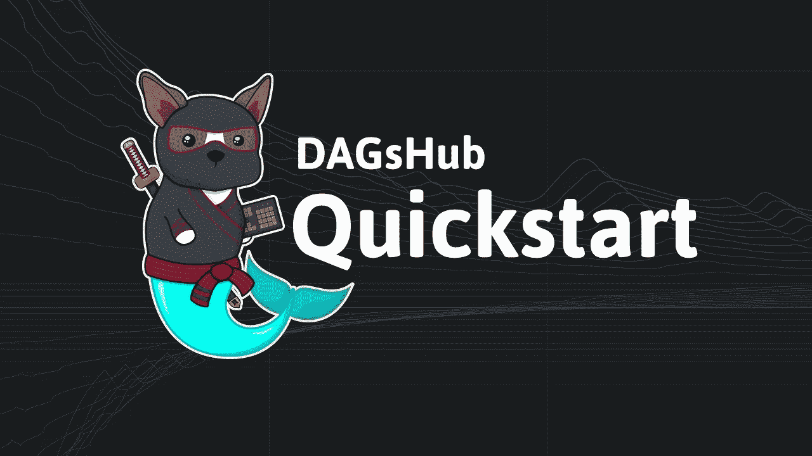
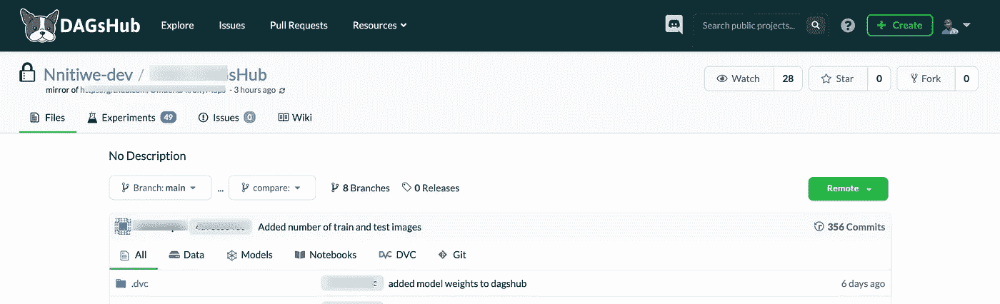
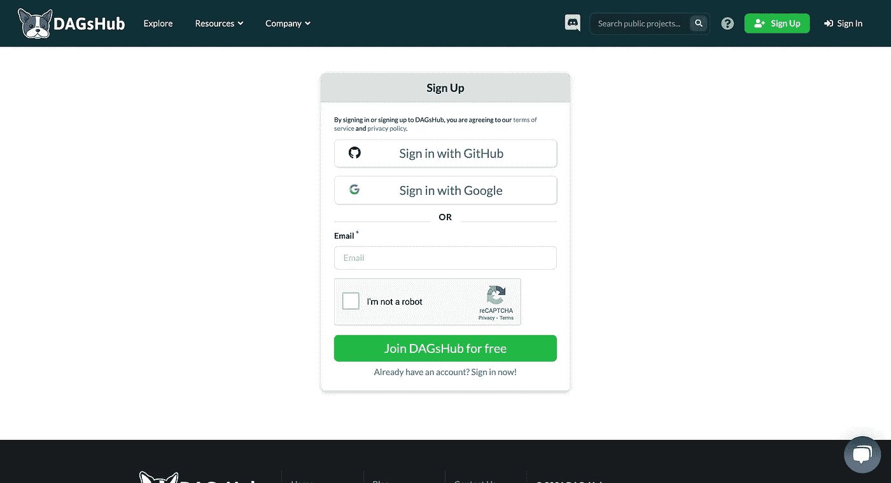
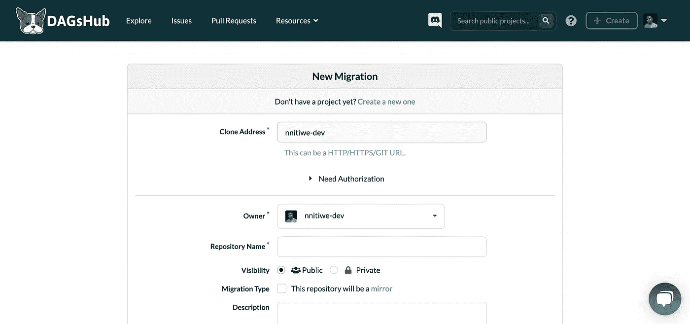
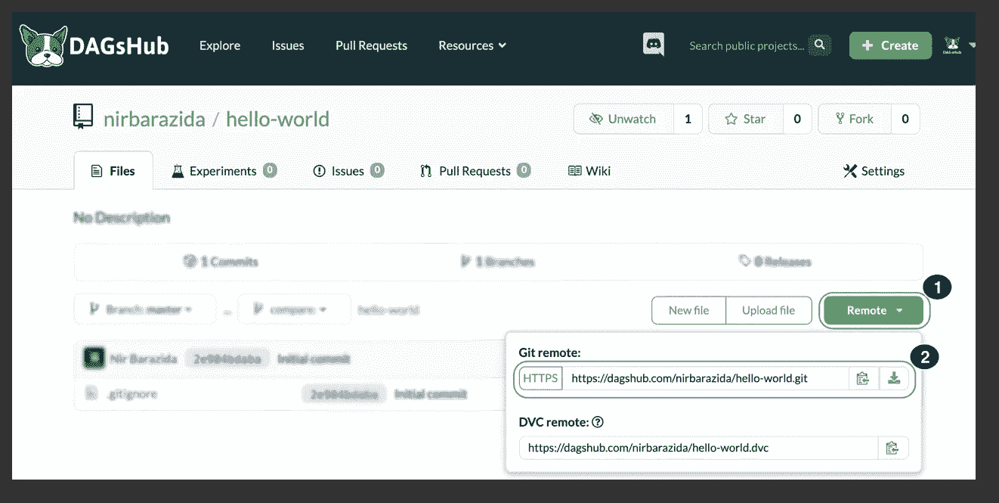
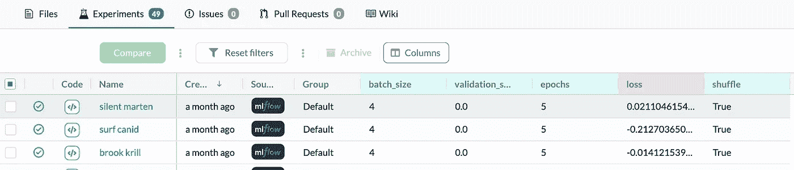

# 介绍:使用 DAGsHub 对数据科学项目进行版本控制

> 原文：<https://medium.com/geekculture/an-introduction-version-control-for-data-science-projects-with-dagshub-dfb60cd3b32c?source=collection_archive---------50----------------------->

[DAGsHub](https://i.ytimg.com/vi/lrzdqEwzoo8/maxresdefault.jpg)· The home for data science collaboration

像 GitHub 这样的平台已经成为控制软件项目版本的工具。然而，机器学习项目在与 GitHub 合作时面临着新的挑战:“**模型&数据版本控制**”。

**GitHub** 有严格的**文件限制**100 MB。这意味着数据科学家& ML 工程师将不得不随机应变，以便与 GitHub 合作，因为这种限制阻止了对大型数据集和模型权重的版本控制。好消息是 DAGsHub 解决了这个挑战，从而允许对数据科学项目进行有效的版本控制！

# **DAGsHub 是什么？**

[DAGsHub](https://dagshub.com) 是一个为数据科学家和机器学习工程师提供数据版本控制和协作的网络平台。它建立在 git 和 DVC 之上，后者是一个为数据和管道版本控制而构建的开源命令行工具。

使用 DAGsHub，您可以使用 git 做与常规代码项目完全相同的事情。DAGsHub 增加了可视化和自动化功能。这是可能的，因为 DVC 在现有 git 的基础上添加了数据科学和机器学习的命令，但语法类似于 git，所以并不完全陌生。大多数 git 命令在 DVC 都有直接的对等物。请随意查看 [**DAGsHub 常见问题解答**](https://dagshub.com/docs/faq/index.html) 了解更多信息。

# 什么是 DVC？

DVC 是机器学习项目的开源版本控制工具，旨在处理大型文件、数据集、机器学习模型和指标。它工作在 Git 之上，因此可以很容易地与您现有的 Git 代码库集成。更多关于 DVC 的信息，请访问 DAGsHub 的- [**什么是 DVC**](https://dagshub.com/docs/integration-guide/integration-guide/#what-is-dvc) **。**

# 管理机器学习工作流

典型的 ML 项目包括尝试不同的算法、模型、库和数据集。有必要管理和跟踪项目和实验的生命周期。DAGsHub 允许用户通过使用库 [**ML 流**](https://www.mlflow.org/docs/latest/concepts.html) 或简单地使用 **metrics.csv** 和 **params.yml** 文件来跟踪实验。

Preview of DAGsHub Repository

# 入门指南

1.  **创建账户**

如果您没有 DAGsHub 帐户，请访问[https://dagshub.com/](https://dagshub.com/)并以与您在 GitHub 上类似的方式注册(您可以使用您的 GitHub 帐户注册，以将您的 DAGsHub 个人资料与您的 GitHub 个人资料链接起来)。

2.**创建新的资源库或镜像 GitHub 资源库**

*创建新的 DAGSHUB 回购*:访问此 [**链接**](https://dagshub.com/repo/create) 创建新的回购(您必须登录您的帐户)。

*镜像 GITHUB REPO* :如果您想从 GITHUB 工作，并且只在 DAGsHub 上跟踪您的模型&数据集，您可以简单地创建一个 [**镜像 repo**](https://dagshub.com/repo/migrate) **。**

3.**克隆存储库**

[Source](https://dagshub.com/docs/getting-started/assets/2-git-remote.png)

***运行命令:***

*git 克隆 https://dagshub.com/<DAGsHub-user-name>/hello-world . git*

更多信息请访问 [**链接**](https://dagshub.com/docs/getting-started/create-a-dagshub-project/) 。

4.**设置 DVC**

***运行命令:***

> pip 安装 dvc
> 
> dvc 初始化

如果您在尝试执行时遇到错误，请使用以下代码重试:

> pip 安装 dvc *-* 忽略-已安装
> 
> dvc 初始化

现在，下一步是**将 DAGsHub** 配置为远程存储。这使您能够通过 DAGsHub 在云上保存大文件。

> dvc 远程添加原点—https://dagshub.com/本地 <dagshub-user-name>/hello-world.dvc</dagshub-user-name>
> 
> dvc 远程修改原点—本地验证基本
> 
> dvc 远程修改原点—本地用户<dagshub-user-name></dagshub-user-name>
> 
> dvc 远程修改原点—本地 ask_password true

5.使用 DVC 配置和跟踪文件(模型和数据)

GitHub 将追踪所有**。dvc** 文件，除非它们包含在**和*中。git ignore*文件。同样，将不想让 DAGsHub 跟踪的文件添加到 ***。dvcignore*** 。**

更多信息请访问 [**链接**](https://dagshub.com/docs/getting-started/create-a-dagshub-project/) 。

6.**创造&追踪实验**

如果您想知道如何开始使用 ML FLow 来创建和跟踪实验，请访问此 [**链接**](https://www.mlflow.org/docs/latest/tracking.html) 。

使用 DAGSHUB LOGGER 进行日志记录:将使用 ***metrics.csv*** 和 ***params.yml*** 来跟踪模型:

> ！pip 安装 dagshub
> 
> 导入 dagshub
> 
> 使用 dagshub.dagshub_logger()作为记录器:
> 
> …
> 
> 模型定义
> 
> …
> 
> # log 模型的参数 logger . log _ hyperparams(model _ class = type(model _ obj))。_ _ name _ _)logger . log _ hyperparams({ ' model ':model _ obj . get _ params()})
> 
> #训练模型
> 
> #记录模特的表现
> 
> logger . log _ metrics({ ' roc _ AUC _ score ':<roc_auc_score>})</roc_auc_score>

更多信息请访问 [**链接**](https://dagshub.com/docs/getting-started/track-experiments/) 。

ML 流量测井

> ！pip 安装 mlflow
> 
> 导入 mlflow
> 导入 os
> 导入请求
> 导入日期时间
> 导入时间
> 
> REPO _ NAME = " nni tiwe-dev \ \ Hello-DAGsHub \ \ "
> 用户名= < DAGsHub 用户名>
> 
> OS . environ[' ml flow _ TRACKING _ USERNAME ']= USER _ NAME
> OS . environ[' ml flow _ TRACKING _ PASSWORD ']=<Dag shub 访问令牌或密码>
> token = < DAGsHub 访问令牌>
> 
> ml flow . set _ tracking _ uri([https://dagshub.com/](https://dagshub.com/)DAGsHub 知识库>)。ml flow’)
> 
> mlflow.keras.autolog()
> 
> run_id = None
> ，ML flow . start _ run(Experiment _ ID =<实验 ID >)作为 run:
> run _ ID = run . info . run _ ID
> ML flow . log _ params({ " Name ":<实验名>，" Group": <组名>，" Contributor Name ":<" Contributor Name>，【Model】:<模型名>，" Extra Model Values ")

有关如何使用 ML Flow 实时记录和监控实验的更多信息，请查看 DAGsHub 的 **Colab 示例**:

*   [DVC DAGsHub—Git 的基本用法&实验跟踪](https://colab.research.google.com/drive/1JJIwAH0TBSY49um5s2FD0GEA6bw3SKrd?usp=sharing)
*   [将 Tensorflow 的模型记录到 DAGsHub 上的 MLflow 服务器](https://colab.research.google.com/drive/1TrN7YEgiIzt7EelvshJPx2n4j-Qa6LBf?usp=sharing)
*   [将 fast.ai 的模型记录到 DAGsHub 上的 MLflow 服务器](https://colab.research.google.com/drive/1DhHzI5blVbniFwx98EKXYSi0z_Icm07t?usp=sharing)
*   [通过 GitHub 的镜像存储库使用 Dag shub](https://colab.research.google.com/drive/18k1aiqjUoWp04sCUlYBItW3l8cU6KPNV?usp=sharing)

