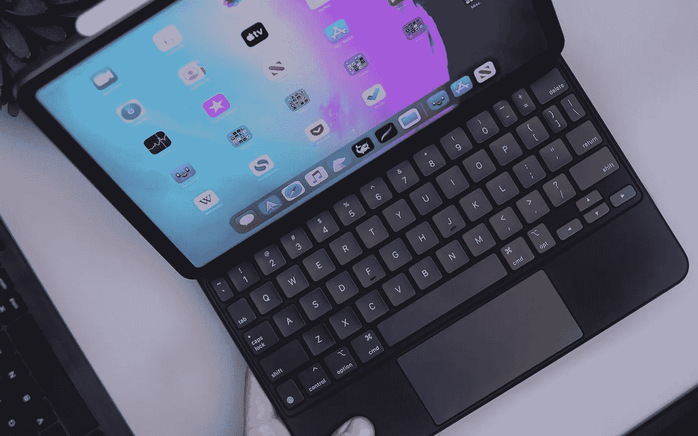

# iPad Pro 的“专业模式”听起来可能不错，但这要看情况而定

> 原文：<https://medium.com/geekculture/an-ipad-pro-pro-mode-may-sound-nice-but-it-all-depends-5262aa882f23?source=collection_archive---------3----------------------->

## 苹果可能正计划向许多消费者提供他们长期以来所要求的东西……但有一些警告

Two different sources suggesting that Apple could be working on a “Pro Mode” function for iPadOS, both in the space of a few days, is too much of a coincidence, isn’t it? (Daniel Romero, Unsplash)

**好吧，永远不要让别人说**我们的希望和梦想关于使用 iPad Pro 作为真正的生产力工具的表达、[我们对它的不断唠叨](/geekculture/ipados-15-this-is-how-it-will-not-disappoint-b98a702e8e15)或者[我们对它没有发生的最终沮丧](https://topp.today/enough-with-the-gaslighting-apple-there-is-no-ipad-pro-d7c171934d8b)置若罔闻…