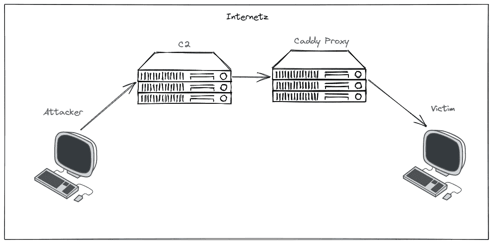

# C2 重定向的 Nginx/Apache 替代方案

> 原文：<https://medium.com/geekculture/an-nginx-apache-alternative-for-c2-redirecting-61e92a917101?source=collection_archive---------10----------------------->

## 为 C2 手动生成 TLS 证书的日子已经一去不复返了

H ello，🌎！Caddy 是一个“强大的、企业级的、开源的 web 服务器，带有用 Go 编写的自动 HTTPS”。我已经使用 Caddy 大约两周了，非常喜欢它的配置和部署如此简单。我最喜欢的 Caddy 功能是内置的 TLS…