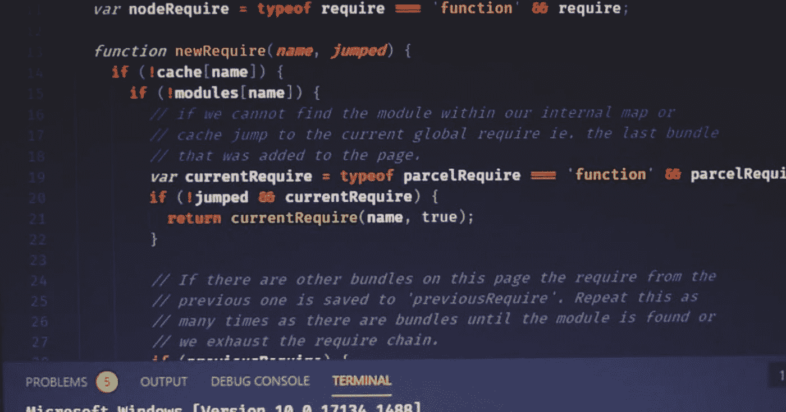

# 作为完全初学者的 TypeScript 概述和设置

> 原文：<https://medium.com/geekculture/an-overview-and-setup-of-typescript-as-a-complete-beginner-27a653bd96c4?source=collection_archive---------17----------------------->

在本文中，我们将对本地环境中的 TypeScript 进行概述和设置。

# 以打字打的文件

它是一种开源语言，通过添加一些额外的功能建立在 JavaScript 之上，也称为 JavaScript 的超集。

也可以称为 JavaScript +一些其他特性*(静态类型是主要原因)*。

# TypeScript 有什么不同？？

TypeScript 有许多不同类型的好处，如下所示:

*   它为静态类型的 JavaScript 提供了额外的特性。
*   使用类型是完全可选的。
*   编译成普通的 JavaScript。
*   也可用于前端 JavaScript 和后端 Node.JS。
*   包括 ES6、ES7 的大部分功能(类、箭头功能等。).
*   第三方库中的类型可以添加类型定义。
*   所以这些是普通打字稿可以提供的基本打字稿好处。

# 编程语言的类型

在编程中，有两种类型的编程语言:

*   动态类型语言
*   静态类型语言

# 动态类型语言

在这种情况下，类型与运行时值相关联，并且没有在代码中显式命名。

动态类型语言的例子:- JavaScript、Python、Ruby、PHP

# 静态类型语言

在这种情况下，类型被明确地分配给变量、函数、参数、返回值等。

静态类型语言的例子:- Java，C，C++，Rust，Go。

# 但是使用 TypeScript 而不是普通的 JavaScript 有什么好处和坏处呢

所以使用 TypeScript 而不是普通的 JavaScript 有很多优点和缺点

## 下面列出了优点:-

*   它比普通的 JavaScript 更健壮
*   轻松发现漏洞
*   可预测性
*   可读性
*   流行的

每当好事来临时，总会有坏事随之而来。

## 下面列出了缺点

*   更多的代码要写。
*   更多要学习的
*   要求的汇编
*   不是真正的静态类型(根据一些程序员)

# 编译类型脚本

因此，编译 TypeScript 是您在使用 TypeScript 时必须面对的主要头痛之一，所以下面是您可能认为在使用 TypeScript 时会派上用场的好处。

*   TypeScript 使用`.ts`和`.tsx`扩展名。
*   TSC *( TypeScript 编译器)*用于将`.ts`或`.tsx`文件编译到`.js`
*   TSC 可以在编译时监视文件并报告错误。
*   默认可能包含`.ts`编译。
*   大多数 IDE 都非常支持 TypeScript。
*   `tsconfig.json`用于配置 TypeScript 将如何工作。

所以让我们用真正的 JavaScript 来编码它(不是用幻灯片，而是用实际的代码)。

# 让我们安装 TypeScript

因为我使用的是 Windows，所以让我们在全球范围内安装它，因为 TypeScript 是我所有项目的必要组成部分。

所以让我们试着点击这个命令

## 在 Windows => `npm i --global typescript`

## 在 Mac OS => `sudo npm i --global typescript`

你可以在 Linux 中尝试使用与 Mac OS 相同的命令，我也不确定什么命令适用于 Linux。

成功安装 TypeScript 后，您可以运行此命令来检查它是否已成功安装。

`tsc -v`

截止到日期`10 September 2021`，输出应该类似于`Version 4.4.2`。

## 这就是您的本地环境中 TypeScript 的基本设置。

## 现在让我们写 JavaScript +类型安全我指的是类型脚本

成功安装后，创建一个名为 typescript Learning 的新目录(您可以随意命名)

然后创建一个类似于`<desiedNameHere>.ts`的新文件名(输入任何你想要的名字来代替‘desiedNameHere’)

所以让我们在这里写普通的 JavaScript】

然后启动您的终端，您现在可以输入这个命令将常规 JavaScript 转换成常规 JavaScript(目前为止)。

`tsc filename.ts`(文件类型不是强制的，只需指定名称)

它主要做的是将你的代码从`.ts`格式的文件类型编译成常规的 JavaScript 到 *ES5* (这是默认设置)。

现在，您可以在同名但扩展名为`.js`的文件中检查编译下来的 JavaScript 代码。

现在，您可以看到 TypeScript 将代码编译为默认设置的 *ES5* ，因为 let 和 arrow 函数是随 *ES6* 一起发布的，所以它不会使用那个*(目前)*。

您还可以让这个 TypeScript 编译器监视这段代码，并将我们写下的任何 TypeScript 代码编译成常规 JavaScript。

您可以通过点击此命令来完成此操作

`tsc --watch <fileName>.ts`

所以现在让我们尝试将 TypeScript 代码转换成 ES6 JavaScript

# 设置 tsconfig.json

让我们设置类型脚本，并编辑类型脚本代码将类型脚本代码编译成常规 JavaScript 的方式。

要进行设置，您必须首先在终端中点击该命令

`tsc --init`

这将基本上创建一个 tsconfig.json 文件，并允许您进行任何可能在 TypeScript 中有用的设置，TypeScript 将仅基于该文件工作。

所以现在打开你的 tsconfig.json，找出*目标*写在哪里*(基本上你会在第 7 行找到)*

如果需要，将目标更改为 *ES6* 。

因此，根据我的偏好，我尝试将我编译的常规 JavaScript 放在另一个目录中，将类型脚本文件放在另一个目录中。

所以我要改变 outDir 设置*(你会在第 17 行找到)*。

并将设置更改为`./dist`

并且在那之后添加一个新的行，使它成为 rootDir，并设置它的值为`./src`。

根目录基本上是获取源 TypeScript 文件。

因此，现在将 t =你先前的类型脚本文件移到名为`src`的目录中，类型脚本编译器将在那里查找类型脚本文件。

现在让我们编译 TypeScript 文件，但是这次我们将编译所有的文件，而不指定任何特定的文件。

在你的终端中输入这个命令

`tsc --watch`

这个命令基本上只是监视 SRC 目录中的每个文件，如果发现它们是一个类型脚本文件，就将它们转换成常规的 JavaScript。

你也可以只运行`tsc`,它只会编译文件，不会观察它们的任何进一步的变化。

# 结论

因此，现在这是一个基本的设置为普通的 TypeScript(正如我的导师所说)，这是一个基本的文件结构的 TypeScript 为一个完整的初学者。

现在我们将更深入地研究 TypeScript，但那是另一篇文章的内容。

在此之前，我将在这个平台上写开发日志，只是要确保检查这一点。

顺便说一句，你可以订阅我的官方博客平台 [codeitdown](https://codeitdown.ml/) 并让你自己订阅，我会确保每当我在那里得到一篇好文章，我会亲自给你发电子邮件，没有任何垃圾邮件。