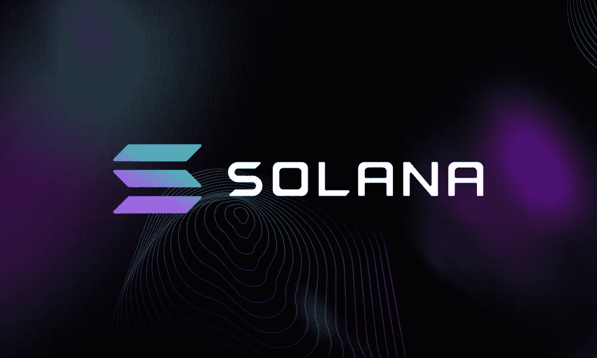

# 2023 年 Solana 区块链开发服务概述

> 原文：<https://medium.com/geekculture/an-overview-of-the-solana-blockchain-development-services-in-2023-84fc4a7ee4df?source=collection_archive---------18----------------------->

区块链技术不再是一种短暂的趋势，它已经在广泛的业务中找到了应用。这篇文章将讨论 Solana，它声称自己是最快的区块链网络，以及 S [**olana 区块链开发**](https://www.turnkeytown.com/nft-marketplace-on-solana) 工具。

**是什么让索拉纳从其他区块链网络中脱颖而出？**

由于各种不同的优势，如可见性、完整性、可靠性和开源性质，区块链技术被视为计算的未来。以太坊是最早的区块链技术之一，它有许多缺陷，这一事实鼓励了其他几个区块链的形成。

Solana 就是这样一种尖端技术，它促进了更快的交易、更低的交易成本和更大的网络可扩展性。使用 Solana 区块链，你可以为 NFT 市场、DeFi 平台和其他 Web3 应用建立最快的交易生态系统。

**SOL 令牌及其功能**

对于每个区块链网络来说，可用于赌注或治理的本地令牌/货币将是唯一的。这一行中索拉纳的本土代币被称为 SOL，现在有 2600 万枚在流通。这些 SOL 代币的所有者可以在一段时间内持有这些代币，从而增加整体流动性，他们这样做会得到回报。

**Solana 区块链的哪些特性至关重要？**

**历史证明:**

共识机制被称为历史证明，用于验证交易的顺序，使它们更容易跟踪，并提高网络的整体效率。

**涡轮**

区块链网络历来关注交易量。由于网络拥塞，事务之间的时间可能会延迟。Solana 采用 Turbine 协议来解决这个问题，该协议将数据分成许多数据包，然后将它们传输到节点。

**云破**

通过使用允许并发读写的 Cloudbreak 数据结构，Solana 能够扩展其网络。

归档器归档器是存储数据的分布式分类帐存储，类似于节点网络。

**管道**

在所有与交易相关的信息在网络上得到验证之前，数据不能保存在节点上。当所有的数据输入都通过管道分配给适当的硬件时，信息验证就变得简单了。

**海平面**

智能合同引擎 Sealevel 支持并行数据事务。由于事务的同步性，Solana 的效率得到了提高。

**列出 Solana 的区块链开发解决方案**

大名鼎鼎的 [**区块链发展公司**](https://www.turnkeytown.com/nft-marketplace-on-solana) ，Turnkeytown。在 NFTs、dApps、DeFi 平台、智能合同和其他领域拥有丰富的项目开发专业知识。我们比竞争对手更有优势，因为我们的区块链开发人员拥有各种区块链技术的丰富实践经验。以下是我们提供的索拉纳区块链开发服务列表。

**索拉纳的 NFT 市场**

NFT 市场需要快速和可伸缩，以适应大量的交易。我们可以在索拉纳区块链为您创建一个非常有效的 NFT 交易平台。您可以从我们预先设计、随时部署的 NFT 市场开发服务的各种调整中进行选择。

**DeFi Solana 平台**

在 Solana 上，我们创建了 DeFi 平台和 DeFi 应用程序。我们有预建的 DeFi 平台解决方案，包括借贷、赌注、收益农业、钱包、保险和基金管理等功能。此外，我们还根据专业计划提供 DeFi 营销服务。

**密码索拉纳交易所**

如果您计划在 Solana 上开发比特币交易平台，我们可以为您提供帮助。我们已经有了预建的加密货币交易所，这些交易所有各种安全保障措施来保证可靠性。在 Solana 上，您可以从头开始创建一个加密货币交易所，以确保更快的交易速率。

**索拉纳智能合约**

我们专注于区块链的服务之一是智能合同开发，我们为索拉纳和其他区块链创建智能合同。

Solana Launchpad 区块链项目在分散的网站 Launchpad 上发布项目白皮书，以吸引投资者投资。在索拉纳区块链，您可以创建这样一个发射台，在部署之后，我们当然会提供维护服务。

**最终想法**

我们是最好的区块链咨询公司之一。除了 [**Solana 的区块链开发**](https://www.turnkeytown.com/nft-marketplace-on-solana) 解决方案，我们还在不同的区块链技术上构建平台、市场、dApps 和交易所。