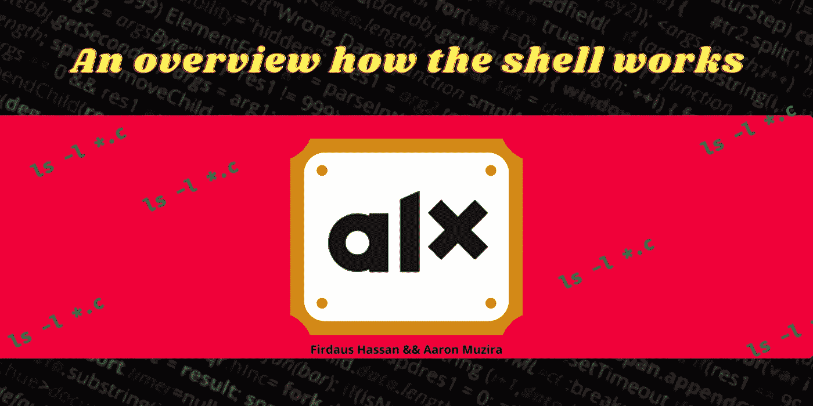
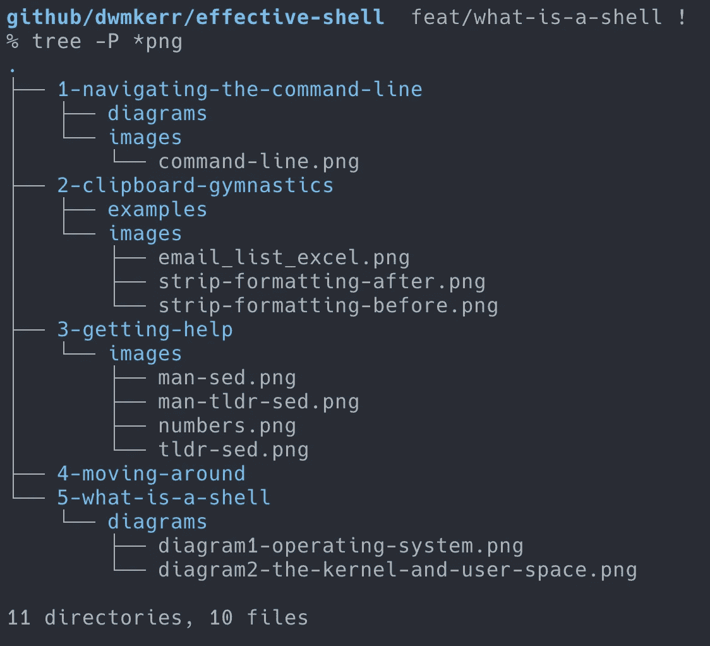
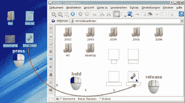
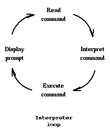
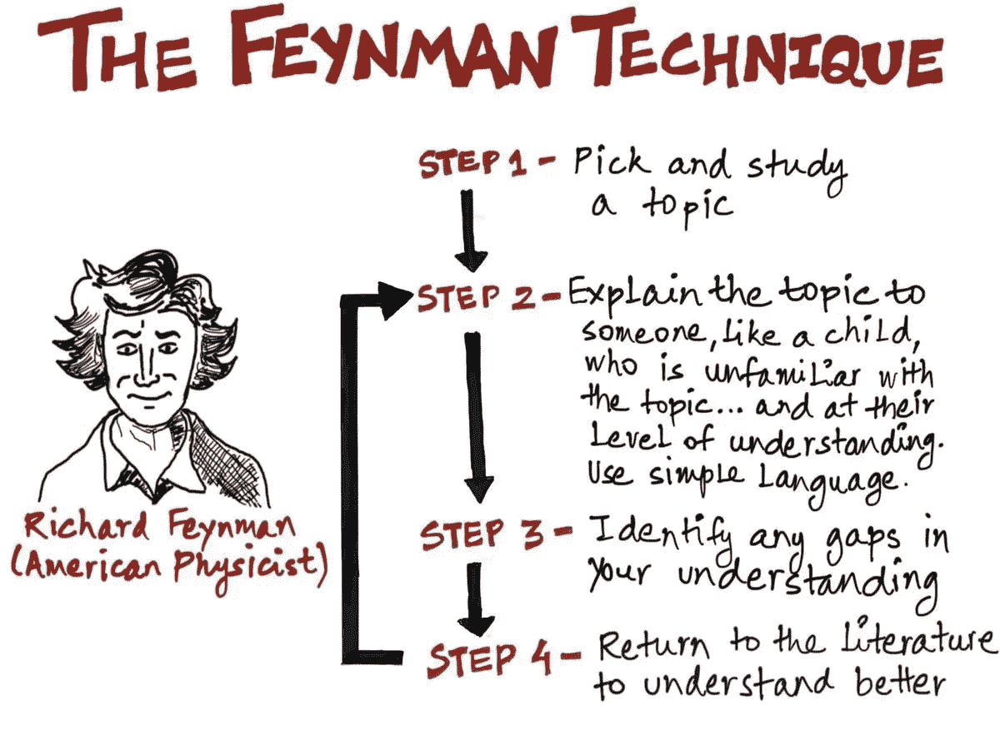

# BASH shell 如何工作的概述

> 原文：<https://medium.com/geekculture/an-overview-of-the-working-of-the-bash-shell-f063e7f09945?source=collection_archive---------19----------------------->



All Rights Reserved

在本文中，我们将看看 BASH(又是 Bourne SHell)以及它如何解释命令`ls -l *.c`

在我们匆忙离开之前，让我们一步一步地讨论这个问题。什么是贝壳？bash shell 有何独特之处？外壳和终端有什么区别？shell 如何解释命令？让我们一次分解一个细节。

# 什么是贝壳？

在计算中，外壳是一个计算机程序，它向人类用户或另一个程序公开操作系统的服务。根据计算机的角色和特定操作，操作系统外壳使用(CLI)命令行界面或(GUI)图形用户界面。shell 以树形结构呈现计算机的内容，如下所示。

**命令行 shell**要求用户熟悉命令及其调用[语法](https://en.wikipedia.org/wiki/Syntax)，并理解关于特定于 shell 的脚本语言的概念(例如， [bash](https://en.wikipedia.org/wiki/Bash_shell) )。



Command-line shell. All Rights reserved: dwmkerr.com

图形外壳对初学计算机的用户来说负担很轻，并且以易于使用而闻名。由于它们也有某些缺点，大多数支持 GUI 的操作系统也提供 CLI 外壳。



Graphical shell. All Rights Reserved: wikipedia.org

# Bash shell 有何独特之处？

在大多数 Linux 系统上，一个名为`[**bash**](https://linuxcommand.org/lc3_man_pages/bash1.html)`的程序(它代表 Bourne Again SHell，是最初的 Unix shell 程序的增强版本，`**sh**`，由 Steve Bourne 编写)充当 SHell 程序。此外，还有其他适用于 Linux 系统的 shell 程序。其中包括:`**ksh**`、`**tcsh**`和`**zsh**`。

# 什么是*端子*？

这是一个叫做*终端模拟器*的程序。这是一个打开窗口并让你与外壳交互的程序。根据您的 Linux 发行版，有许多不同的终端模拟器，其中一些是；`**gnome-terminal**`、`**konsole**`、`**xterm**`、`**rxvt**`、`**kvt**`、`**nxterm**`和`**eterm**`。

# 内核是什么？

**内核**是一个[计算机程序](https://en.wikipedia.org/wiki/Computer_program)在计算机的[操作系统](https://en.wikipedia.org/wiki/Operating_system)的核心，对系统中的一切拥有完全的控制权。它是“总是驻留在内存中的操作系统代码的一部分”,促进了硬件和软件组件之间的交互。我们使用 shell 来访问内核及其功能。

# shell 如何解释命令？

shell 是一种叫做*解释器*的程序。解释器在一个简单的循环中运行:它接受命令，解释命令，执行命令，然后等待另一个命令。shell 显示一个“提示”，通知您它准备好接受您的命令。



Interpreter execution loop

shell 只能识别有限的一组命令，您必须以 shell 能够理解的方式向它发出命令:每个 shell 命令都包含一个命令名，后跟命令选项(如果需要的话)和命令参数(如果需要的话)，所有命令都用空格分隔。

当您在 bash 中键入一个命令时，它会经历一个特定的过程，这个过程要么导致正确的输出，要么导致错误。我们来看看解读过程。

当您在终端中编写命令时，shell 需要能够正确地解释它，以便知道具体要做什么。也许您有多个选项，或者将输出重定向到一个文件。在任何情况下，shell 都要经历几个步骤来确定需要做什么。

我的一个问题是，“每件事是按照什么顺序完成的？”我们要扩展 shell 变量，可能要处理别名或函数、“真正的”命令、管道和输入/输出重定向。在确定做什么和什么时候做时，shell 必须考虑很多事情。

在大多数情况下，这并不重要。命令不会变得如此复杂，以至于知道求值顺序成为一个问题。然而，在一些情况下，我遇到了事情没有按照我想的那样运行的情况。通过我自己评估这个命令(就像 shell 会做的那样)，发生了什么变得很清楚。让我们来看看。

要做的第一件事是，shell 计算出该行中有多少条命令。(请记住，您可以在一行中用分号分隔多个命令。)这个过程决定了命令行上有多少个*令牌*。在这种情况下，令牌可以是一个完整的命令，也可以是一个控制字，如`if`。这里，shell 也必须处理输入/输出重定向和管道。

一旦 shell 确定了有多少个标记，它就检查每个标记的语法。如果出现 ***语法错误*** ，shell 将不会尝试启动*的任何*命令。如果语法正确，它开始解释标记。

首先，展开您可能有的任何 ***别名*** 。别名是一些 shells 允许您定义自己的命令的一种方式。如果命令行上的任何标记实际上是您已经定义的别名，它会在 shell 继续之前展开。如果一个别名包含另一个别名，那么在继续下一步之前，它们都会被展开。

外壳检查的下一件事是函数。与 C 等编程语言中的函数一样，shell 函数可以被视为一个小子程序。

一旦别名和函数都完全展开，shell 就会对变量求值。最后，它使用任何通配符将它们扩展为文件名。这是根据我们之前讨论的规则完成的。

在 shell 评估了所有内容之后，仍然*没有准备好运行命令。它首先检查第一个令牌代表的是 shell 中内置的命令还是外部命令。如果不是内部的，shell 需要经过搜索路径`$PATH`。*

此时，它设置重定向，包括管道。很明显，这些必须在命令开始前准备好，因为命令可能从键盘以外的地方获得输入，也可能从屏幕以外的地方发送输出。

这是过于简单化了。事情以这种顺序发生，尽管在这些步骤中发生的事情比我在这里列出的要多得多。我试图描述的是当 shell 试图解释您的命令时发生的一般过程。

一旦外壳确定了每个命令是什么，并且每个命令是一个可执行的*二进制*程序(不是一个外壳脚本)，外壳就使用`fork()`系统调用来复制自己。这个副本是 shell 的一个 ***子进程*** 。然后*副本*使用`execive()`系统调用用它想要执行的二进制代码覆盖它自己。请记住，即使子进程正在执行，原始 shell 仍然在内存中，等待子进程完成(假设该命令不是用&在后台启动的)。

如果需要执行的程序是一个 shell 脚本，那么用`fork()`和`exec()`创建的程序就是另一个 shell。这个新的 shell 开始读取 shell 脚本并解释它，一次一行。这就是为什么 shell 脚本中的语法错误不是在脚本启动时发现的，而是在第一次遇到错误行时发现的。

理解在运行 shell 脚本时会创建一个新进程有助于解释 UNIX 下一个非常常见的误解。当您运行一个 shell 脚本并且该脚本更改了目录时，您的原始 shell 对这一更改一无所知。这让许多刚接触 UNIX 的人感到困惑，因为他们来自 DOS 世界，在 DOS 世界中，从批处理文件*中改变目录并不会改变原来的 shell。这是因为 DOS 和 UNIX 没有相同的进程概念。*

这样看:子 shells 环境已经更改，因为当前目录不同了。然而，这是*而不是*传递回父节点。就像“真正的”亲子关系一样，只有孩子可以从父母那里继承特征，而不是相反。因此，对环境的任何更改，包括目录更改，都不会被父级注意到。同样，这与 DOS 的行为*不同*。蝙蝠文件。

# 使用波浪号(~)

在许多 shells 下，您可以使用波浪号作为指向特定用户主目录的快捷方式。例如，如果我的个人文件夹中有一个程序，我可以这样启动它:

`~firdaus/bin/mycommand`

注意，如果我已经作为用户 firdaus 登录，我不需要指定我自己的用户名。相反，我可以这样运行命令:

`~/bin/mycommand`

一些 shells 在`OLDPWD` 环境变量中跟踪您的*最后一个*目录。每当您更改目录时，在将您更改到新位置之前，系统会将您当前的目录保存在`OLDPWD`T24 中。

只需输入`cd $OLDPWD`即可使用。因为变量`$OLDPWD`是在 cd 命令执行之前展开的，所以您最终会回到之前的目录。

# ls -l *命令的完全分解。c

对于上述的 shell 操作，这个简单的命令可以解释为:

```
ls -l *.c
```

`ls`一个命令用来列出指定目录下的所有文件和目录。
`-l`是`ls`命令的一个选项，以长格式列出文件。
`*.c`显示指定目录下所有扩展名为`.c`的文件。*代表所有。

当您在终端中输入命令`ls -l *.c`时，输出如下

```
**firdaus@Firdaus-PC:~/$** dir
AUTHORS  README.md  extra_strings.c  main.c    parser.c  strings.c
BAShell  builtin.c  extra_tools.c    memory.c  shell.h   tools.c
**firdaus@Firdaus-PC:~/$** ls -l *.c
-rwxrwxrwx 1 firdaus firdaus 2380 Aug 23 12:41 builtin.c
-rwxrwxrwx 1 firdaus firdaus  576 Aug 23 12:43 extra_strings.c
-rwxrwxrwx 1 firdaus firdaus 1851 Aug 23 12:43 extra_tools.c
-rwxrwxrwx 1 firdaus firdaus 3379 Aug 23 16:44 main.c
-rwxrwxrwx 1 firdaus firdaus 1533 Aug 23 12:37 memory.c
-rwxrwxrwx 1 firdaus firdaus 1392 Aug 23 12:43 parser.c
-rwxrwxrwx 1 firdaus firdaus 2026 Aug 23 12:44 strings.c
-rwxrwxrwx 1 firdaus firdaus 1503 Aug 23 12:44 tools.c
**firdaus@Firdaus-PC:~/$**
```

恭喜你读到这里。现在测试你自己是否能使用[费曼技巧](https://fs.blog/2021/02/feynman-learning-technique/)来回答这些问题；如果不能，向上滚动，重读一遍。什么是贝壳？bash shell 有何独特之处？外壳和终端有什么区别？shell 如何解释命令？当你在终端中输入`ls -l *.c`并按回车键时会发生什么？
参见[本教程](https://www.pcwdld.com/linux-commands-cheat-sheet)了解更多关于 Linux 命令的入门知识。



# 参考

[维基百科](https://en.wikipedia.org/wiki/Shell_(computing))
[Bash man page](https://linuxcommand.org/lc3_man_pages/bash1.html)
[linuxcommand.org](https://linuxcommand.org/index.php)
[费曼技巧](/taking-note/learning-from-the-feynman-technique-5373014ad230)
[Linux 命令入门](https://www.pcwdld.com/linux-commands-cheat-sheet)

# 你喜欢我的文章吗？多吃点

[](/geekculture/how-i-tackle-my-projects-at-alx-holberton-school-610f3f5a6448) [## 我如何处理我在 alx-Holberton 学校的项目

### 按时完成项目是一回事，掌握项目的概念是另一回事。但是您可以同时管理这两者…

medium.com](/geekculture/how-i-tackle-my-projects-at-alx-holberton-school-610f3f5a6448) [](/geekculture/an-easy-guide-to-understand-dynamic-memory-allocation-in-c-programming-language-bb34d29f7a06) [## 理解 C 语言中动态内存分配的简易指南

### 一个有趣的挑战性概念的简化版本，随时可以输入大脑。享受这种内在化…

medium.com](/geekculture/an-easy-guide-to-understand-dynamic-memory-allocation-in-c-programming-language-bb34d29f7a06) [](https://betascribbles.medium.com/why-programmers-choose-linux-over-windows-8f556c303b14) [## 为什么程序员选择 Linux 而不是 Windows

### 大多数程序员选择在 Linux 环境中工作，因为它有很多优点。然而，这并不能概括…

betascribbles.medium.com](https://betascribbles.medium.com/why-programmers-choose-linux-over-windows-8f556c303b14)