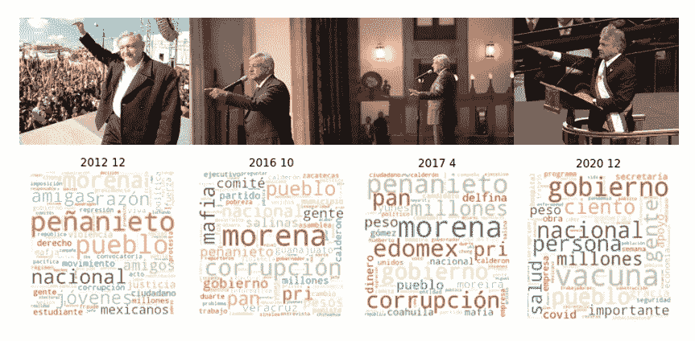

# 安德烈斯·曼努埃尔·洛佩斯·奥夫拉多尔演讲的文本分析

> 原文：<https://medium.com/geekculture/an-text-analysis-of-amlo-speeches-864dbdb15e9a?source=collection_archive---------15----------------------->

## 使用 python 进行文本分析

Text Analysis of Andres Manuel Lopez Obrador’s Speeches

本文旨在分析墨西哥现任总统的演讲、会议和采访的文本，并具有教育目的，在这份文件中没有政治利益的目的，你可以自由地以自己的方式解读数据。我个人认为，正式这种类型的做法…