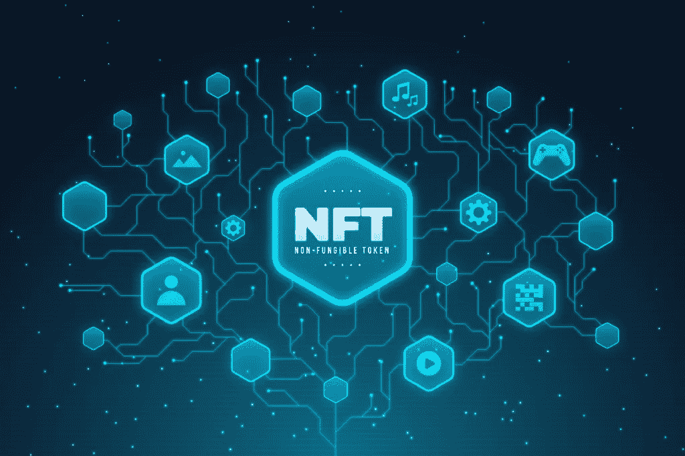

# 2022 年上半年后 NFT 市场发展公司的最新名单！

> 原文：<https://medium.com/geekculture/an-updated-list-of-top-nft-marketplace-development-companies-after-the-first-half-of-2022-2a5e896972a1?source=collection_archive---------21----------------------->

在当前时代，非功能性桌面已经成为主流数字资产，NFT 市场长期以来一直是 NFT 采纳者的切入点。这一事实吸引了许多 NFT 创业爱好者积极考虑推出他们的 NFT 市场开展贸易业务。但是，新手创业者面临的一个难题是，雇佣内部开发人员来建设他们的 NFT 市场的机会减少了。然而，有许多 [***NFT 市场开发***](https://bit.ly/3HAcCs3) 公司已经生产出了正在成功运行的优质平台。在这篇博客中，我们将看到 2022 年上半年后 NFT 市场的顶级发展公司。

## [区块链 App 工厂](https://bit.ly/3HAcCs3)

区块链应用工厂是一家 NFT 市场开发公司，其业务和客户群遍布全球。该公司长期以来一直在开发 NFT 市场平台，其专家在为客户构建一流平台方面表现出色。该公司有能力从零开始创建 NFT 市场，定制白色标签解决方案，以及基于流行平台的解决方案。区块链应用工厂因其在 NFT 市场开发过程中以客户为中心的立场而广受欢迎，满足了其所有需求。

## [AppDupe](https://bit.ly/3b0Gv8H)

AppDupe 是 NFT 市场开发公司的先驱，拥有令人印象深刻的平台组合。AppDupe 的专家已经在区块链各地建立了最先进的 NFT 市场平台，同时确保所有客户的需求都能得到满足。该公司擅长在他们开发的 NFT 市场平台中包含多种功能，这些功能甚至设定了新的标准和趋势。AppDupe 的专家还擅长开发 NFT 市场平台，从零开始提供多链和跨链功能以及白标解决方案。

## [无限块技术](https://bit.ly/39vfoCq)

Infinite Block Tech 是一家 NFT 市场开发公司，以其开发战略而闻名。该公司一直在为新的密码企业家提供质量无与伦比的 NFT 市场平台。Infinite Block Tech 的开发专业人员已经在区块链世界工作了很长时间，这使他们熟悉该领域的创新。他们确保他们的产品包含一些当时存在的创新。

## [Maticz](https://bit.ly/3tEesm9)

Maticz 是另一家受欢迎的 NFT 市场开发公司，已经在这个领域发展了很长时间。事实上，Maticz 熟练的专业人员拥有独特的白色标签 NFT 市场解决方案，已经成为许多成功的 Web3 创业的基础。不要忘记，他们还可以从头开始开发 NFT 市场，因为他们可以构建易于管理和升级的平台，以适应不断提高的标准。Maticz 拥有在 Web3 开发方面经验丰富的专家。

## [安提尔溶液](https://bit.ly/3NW8gOv)

Antier Solutions 是一家全球性的区块链企业，也是一家非常出色的 NFT 市场开发公司。该公司一直为许多基于区块链的应用提供解决方案，但开发 NFT 市场一直是它的强项。Antier Solutions 一直在从零开始创造 NFT 市场和现成的解决方案。将“客户友好”作为一项工作座右铭，已经成为公司的一个成功方案，因为专业人士确保客户的每一个需求都得到满足。

# 最后的想法

因此，我们可以说，上述公司是 2022 年上半年后 NFT 市场的顶级公司。如果你正在寻找 [***建立一个 NFT 市场平台***](https://bit.ly/3HAcCs3) ，以上公司可以用他们优秀的解决方案和友好的服务帮助你。最重要的是，这些公司之所以出现在我们的名单上，是因为它们只对 NFT 市场的发展收取经济成本，这尤其有利于新手加密企业家。因此，现在就和一家 NFT 市场开发公司谈谈，开始你的新的 Web3 事业。