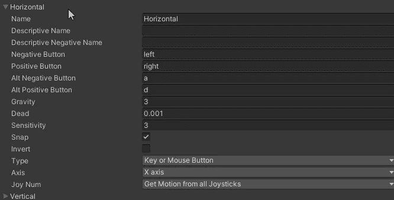
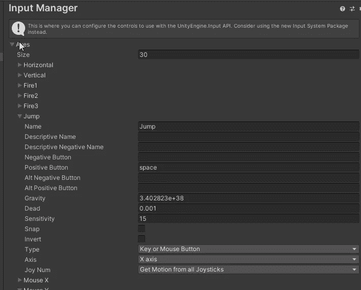
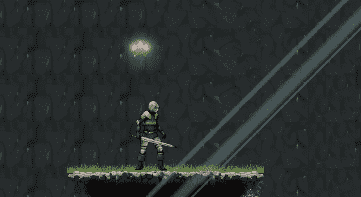
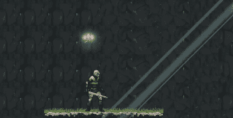

# 类模拟跳跃系统—输入管理器发现

> 原文：<https://medium.com/geekculture/analogue-like-jumping-system-input-manager-discovering-18a64a307e1c?source=collection_archive---------17----------------------->

**目标**:重新考虑跳跃系统，让它可以在几个高度跳跃

我在考虑制造一个关卡，如果你错误判断了距离，跳得太长或太短，从狭窄的悬崖上掉下来，你可能会死。

当我在做测试时，我注意到达到目标是多么困难，有这样一个**固定**跳跃系统:按下空间，设定速度。

我想要一个类似水平运动的行为。所以我需要一个输入轴。如果你进入编辑- >项目设置，你会发现输入管理器部分，其中列出了许多轴，如水平或垂直。

还有火和跳。像 jump 这样的轴与水平轴和垂直轴有很大的不同，让我们找出原因。

每个轴都有相同的属性，只有值不同。在运动轴(水平、垂直)中，想法是模仿操纵杆的**模拟**感觉。当然，键盘不能，但一些技巧可以让我们更接近。在详细探究之前，我们必须知道轴产生-1 到+1 之间的浮点值，其中 0 对应于没有输入。

这次“仿真”涉及的属性有**重力**、**死**和**灵敏度**。

1.  **重力**代表当我们停止输入时，轴的浮动值**多快会回到 0** :如果我向右移动，按下 D 键，角色不会在释放键后立即停止，重力越高，它会越快停止。
2.  **死点**代表零值附近的**死区**:只有绝对值超过死点，轴才会开始工作。
3.  **灵敏度**类似于重力，表示给定输入时**轴值从 0 开始多快达到最大值** (+1)或最小值(-1)。

这三个属性将模拟行为转化为时间:如果通过将操纵杆推到最大值已经达到了最大值，那么对于键盘来说，等待值达到最大值只是时间问题。这个时间是由重力和敏感度决定的。

为了将这些知识应用到我跳跃的新想法中，我修改了跳跃轴。

重力被设置为最大浮动值，让我们说，当空格键释放值几乎立即下降到 0。灵敏度被调整，直到找到最佳匹配。因为没有负按钮，所以不允许有负值。

有了这个全新的轴，我不得不修改代码。

现在以输入为轴，对返回值`_jumpAxis`进行检查。该值包含在速度评估中。

因为这种检查在每一帧都要执行，而且因为重力很大，但不是无限的，所以可能会发生这样的情况，我们再次落入 if 语句中，不是因为我们按了键，而是因为速度仍然大于 0。这将导致角色接触地面时重新触发跳跃动画(这是进入 if 语句所需的第二个条件)。

为了避免这种丑陋的事情发生，我们将使用一个机器状态行为脚本，附加到跳转动画中。

简单来说，一旦动画结束，脚本将会取消激活触发器，确保每个输入只执行一次。

这里是如何短期和高跳将出现。

如果你喜欢，就鼓掌吧！看看我的游戏或者给我买杯咖啡:感谢每一种支持！！

