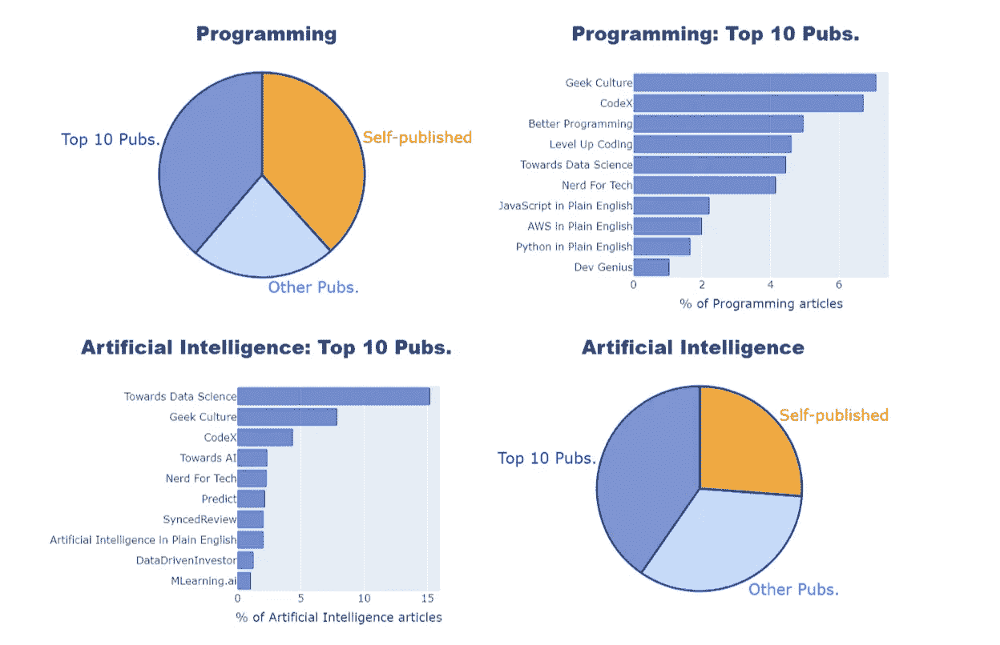

# 分析媒体主题

> 原文：<https://medium.com/geekculture/analysing-medium-topics-384eb0df42b8?source=collection_archive---------40----------------------->

## 有着美丽的汤和情节

All images by author

这篇文章解释了我是如何分析 Medium 网站的数据来回答这个问题的:“每个 Medium 主题中的文章在哪里发表？”。

以下是四个关键步骤:

1.  [检查 HTML](#ae8d)
2.  [解析 HTML 与美汤](#65c4)
3.  [用 Plotly 制作图表](#24b2)