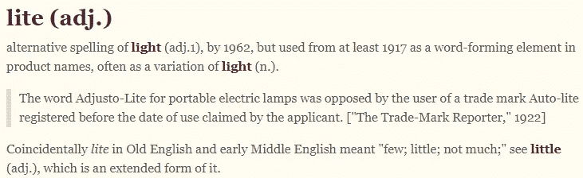

# 英语拼写规则分析

> 原文：<https://medium.com/geekculture/analysis-of-english-spelling-rules-965c7a72ab14?source=collection_archive---------19----------------------->

**我在 E 之前还有所有那些**

## 介绍

事后看来，我被自己发明的创造性方法震惊了，这些方法是用来记忆我们在小学里习以为常的一连串英语单词的拼写的。我们没有学会拼写大多数单词；我们开始熟悉整理他们的信件。在学校的时候，我记得在一次听写中，老师会背一个单词，然后背出它的上下文，但我写错了“一”。正确的回答是“赢了”，这引起了怀疑和困惑。试火法是我们学会的区分同音词的方法。

*在获得我们的文凭后..*


Photo by [Leon Wu](https://unsplash.com/@leonjaywu?utm_source=unsplash&utm_medium=referral&utm_content=creditCopyText) on [Unsplash](https://unsplash.com/s/photos/graduation?utm_source=unsplash&utm_medium=referral&utm_content=creditCopyText)

大多数人从**那里**出来，发现**没有**他们的**智能手机，他们就**一无所知。从电子邮件到日记，下面的三个分析可以帮助你避免我们古怪语言的陷阱。

**打破规则** 在这一节中，我们将看看经典的拼写谚语“I before E except after C”以及其他两个让所有说英语的人感到困惑的常见来源。主要的一点是探索语言的工作，希望提高我们的能力和知识。

1) **I** 在 **E** 之前， **C** 之后除外

全世界的教室都习惯了臭名昭著的“I 在 E 之前，C 在助记符之后”的催眠押韵。这些学生很快发现，这条规则与其说是规则，不如说是例外，因为例外很容易找到。Grammarly 的博客为这条规则提供了一个扩展:

*I 在 E 之前，C 之后除外，除非听起来像 A，如在 neighbor 或 weigh*


Photo by [NeONBRAND](https://unsplash.com/@neonbrand?utm_source=unsplash&utm_medium=referral&utm_content=creditCopyText) on [Unsplash](https://unsplash.com/collections/953524/people---school---education?utm_source=unsplash&utm_medium=referral&utm_content=creditCopyText)

作者接着提供了以下例子:

> *-E 之前的 I*
> 
> 你想要一块 ***的*** *的蛋糕吗？杰瑞会* ***相信*** *任何事情。他们正在足球场***上种植新草。**
> 
> **-除了在 C 之后**
> 
> *达内尔在拼写考试中得了一个 A。杰里米在 ***天花板*** *上发现了一只蜘蛛。我万万没想到你会这样***！***
> 
> ***——除非听起来像***
> 
> ***我们的邻居住在一栋* ***米黄色*** *的房子里。小猫* ***多重*** *？***

**按语法列出的一些例外有:
*s****ei****ze，****ei****ther，w***ei***rd，h***ei***ght，for****ei*** *counterf****ei****t，for f****ei****t，n****ei****ther，sc****ie****nce，spec* ***ie*****

**在 [CMUdict](http://www.speech.cs.cmu.edu/cgi-bin/cmudict) 数据库的 115767 个不同条目中，41 个包含-cie-而 175 个包含-cei-。即使有了扩展规则，反例也比追随者多。**

**2)清淡还是清淡？**

****

**Definition from [Etymoline](https://www.etymonline.com/word/lite)**

**在英语方言中，词尾-ight 和-ite 分别作为后缀出现 149 次和 205 次，通常表示同一个音位(大致是声音)。在现代，在我看来-ite 特别适用于商业应用。卡路里意识饮料被称为“精简版”，我们也看到脸书发布了他们的低功耗姐妹应用程序，“脸书精简版”。**

****

**Lite used in the context of app content**

**历史上 -ight 被读作[腭擦音](https://en.wikipedia.org/wiki/Palatal_fricative#:~:text=Palatal%20Fricatives%20are%20a%20subset,palate%20behind%20the%20alveolar%20ridge.&text=A%20palatal%20fricative%20is%20a,is%20also%20a%20palatal%20consonant.)。随着时间的推移，一些语言的变化给了字素现代的发音，导致了与-ite 的对应。**

**作为这种融合的结果，同音异义词如权利和仪式出现。在历史上的某个时刻，这两个词会有不同的发音。**

**那么，我什么时候知道该用哪种拼写呢？**

**根据[在线词源词典](https://www.etymonline.com/word/-ite#etymonline_v_35159)，后缀-ite 被定义为，**

**-ite (1)**

**表示来源或派生的构词成分，从法语-ite 和直接从拉丁语-ita，从希腊语-ites (fem。——itis)，**构词成分使形容词和名词表示“与……有关或属于……的”**特别是在古典时期用于形成种族和地方名称(例如在-i 希伯来语名称的七十年代译本中)以及宝石和矿物的名称。**

**-ite (2)**

****化学盐后缀**，来源于法语-ite，由-ate 的变体[……]**

**虽然一般来说，人们不会特意去讨论矿物的性质，但我们知道一些常见化合物的名称。方解石、钟乳石、石笋等。**

**了解这些词尾的来源和它们的语言历史有助于决定哪个拼写对应于正在讨论的单词。**

```
**+------------------------------------------+
| **Words ending in 'ite'   **                 |
+------------------------------------------+
| Preceding Phoneme | IPA | No. Occurrences|
+-------------------+-----+----------------+
| AY                | aɪ  |            170 |
+-------------------+-----+----------------+
| AH                | ʌ   |             11 |
+-------------------+-----+----------------+
| EY                | eɪ  |              7 |
+-------------------+-----+----------------+
| IY                | i   |              7 |
+-------------------+-----+----------------+
| IH                | ɪ   |              4 |
+-------------------+-----+----------------+
| OY                | ɔɪ  |              2 |
+-------------------+-----+----------------+
| UW                | u   |              1 |
+-------------------+-----+----------------+
| Total             |     |            **202** |
+------------------------------------------+

+------------------------------------------+
| **Words ending in 'ight'   **                |
+------------------------------------------+
| Preceding Phoneme | IPA | No. Occurrences|
+-------------------+-----+----------------+
| AY                | aɪ  |            126 |
+-------------------+-----+----------------+
| EY                | eɪ  |             22 |
+-------------------+-----+----------------+
| OY                | ɔɪ  |              1 |
+-------------------+-----+----------------+
| Total             |     |            **149** |
+------------------------------------------+**
```

**3)比较- *空气*和*-是***

**护理，母马，皮重，椅子，一对。前面的单词在标准英语中有相同的结尾音素。就原始数字而言，我们更有可能遇到以-are 结尾的单词，总共有 141 个条目，而不是 79 个。此外，根据下表，这两个字素最常以 EH (ARPAbet) /ɛ (IPA)开头。**

```
**+------------------------------------------+
| **Words ending in 'air'   **                 |
+------------------------------------------+
| Preceding Phoneme | IPA | No. Occurrences|
+-------------------+-----+----------------+
| EH                | ɛ   |             73 |
+-------------------+-----+----------------+
| L                 | l   |              4 |
+-------------------+-----+----------------+
| EY                | eɪ  |              1 |
+-------------------+-----+----------------+
| N                 | n   |              1 |
+-------------------+-----+----------------+
| Total             |     |             **79** |
+------------------------------------------+

+------------------------------------------+
| **Words ending in 'are'   **                 |
+------------------------------------------+
| Preceding Phoneme | IPA | No. Occurrences|
+-------------------+-----+----------------+
| EH                | ɛ   |            111 |
+-------------------+-----+----------------+
| EY                | eɪ  |              5 |
+-------------------+-----+----------------+
| IY                | i   |              3 |
+-------------------+-----+----------------+
| AA                | ɑ   |              2 |
+-------------------+-----+----------------+
| AO                | ɔ   |              1 |
+-------------------+-----+----------------+
| IH                | ɪ   |              1 |
+-------------------+-----+----------------+
| K                 | k   |              1 |
+-------------------+-----+----------------+
| S                 | s   |              1 |
+-------------------+-----+----------------+
| Total             |     |            125 |
+------------------------------------------+**
```

**以下是使用字素的单词，但由于它们的词源，代表了另一种声音。在没有引用出处的情况下，下面的例外看起来是源于罗曼语/拉丁语，在英语中不常用。IY 对应*拍*中的 *ea* 。EY 对应*诱饵*中的 *ai* 。**

```
**+-------------------------------------------+
| **Exceptions to '*are*' rule  **                |
+-------------------------------------------+
| word              | ARPAbet               |
+-------------------+-----------------------+
| ABARE             | AA B AA R IY          |
+-------------------+-----------------------+
| ALTOMARE          | AA L T OW M AA R IY   |
+-------------------+-----------------------+
| BALDASSARE        | B AA L D AA S AA R IY |
+-------------------+-----------------------+
| BUTARE            | B UW T AA R IY        |
+-------------------+-----------------------+
| CESARE            | CH EY Z AA R EY       |
+-------------------+-----------------------+
| CURARE            | K Y UW R AE R EY      |
+-------------------+-----------------------+
| DECESARE          | D IH CH EH S AA R IY  |
+-------------------+-----------------------+
| DEGUTARE          | D EH G UW T AA R IY   |
+-------------------+-----------------------+
| DICESARE          | D IH CH EH S AA R IY  |
+-------------------+-----------------------+
| DIMARE            | D IH M AA R IY        |
+-------------------+-----------------------+
| HARARE            | HH ER AA R IY         |
+-------------------+-----------------------+
| LAZARE            | L AA Z AA R EY        |
+-------------------+-----------------------+
| LEGARE            | L EH G AA R IY        |
+-------------------+-----------------------+
| POPOLARE          | P AA P OW L AA R IY   |
+-------------------+-----------------------+
| ROBARE            | R OW B AA R EY        |
+-------------------+-----------------------+
| SISTARE           | S IY S T AA R IY      |
+-------------------+-----------------------+**
```

**从 Weekly 的词源词典中，我们发现同音异义词都来自古英语语境。总之，我们不能仅仅依靠这些单词的词源来帮助我们记忆它们的拼写。**

****楼梯**
盎格鲁撒克逊人，楼梯段，楼梯。这仍然是苏格兰楼梯的意思，而在英语中，复数形式已经从 14 世纪开始流行；
与盎格鲁撒克逊语 stgan 同源，为 ascend(普通条顿语；授予荷兰斯蒂根，德国斯蒂根，古斯堪的纳维亚语。stga，哥特式。
授予荷兰史泰格，楼梯。楼梯是 17 世纪的。从前也指石阶，如泰晤士河上的石阶。**

****瞪**
盎格鲁撒克逊人，斯塔里安人；
授予荷兰语 staren，古高地德语，starn，古挪威语。斯塔拉；
与德语 starr 同源，刚性，如 starr anschauen 中的“凝视”**

**虽然听一个单词并不清楚，但知道词源有助于通过将概念与有形的东西联系起来来巩固知识。**

****结论****

**词源有时可以帮助我们理解为什么我们在英语中有特定的拼写规则，并为发音相似但书写不相似的拼写提供上下文。希望这个分析能启发你继续探索这个话题。**

**由于我不是语言学家，有什么批评和问题请在评论里留下！**

**感谢阅读，
凯尔**