# 西班牙综合酒店数据分析

> 原文：<https://medium.com/geekculture/analysis-of-synthetic-hotel-data-in-spain-d6bb5070c2fe?source=collection_archive---------11----------------------->

## 应用数据科学

## 一个抓取项目是什么样子的？

Photo by [Maksim Ivanov](https://unsplash.com/@withmaksim?utm_source=medium&utm_medium=referral) on [Unsplash](https://unsplash.com?utm_source=medium&utm_medium=referral)

在数据科学项目中，我们总是渴望获得更多数据。解决这个问题的一个好方法是我们自己收集更多的数据。在本文中，我将带您了解一个分析原始数据的项目可能是什么样子。

> 声明:本文中的所有数据都是合成的，不是真实的酒店数据。这些酒店都不存在，它们是作者通过拒绝抽样制造的。

# 介绍

当需要更多的数据时，互联网抓取可以用来收集更多的数据。互联网抓取归结为访问网络来收集数据。互联网上有很多可访问的数据，但由于它不是表格格式，我们不能很容易地使用它。为了将数据转换为有用的状态，我们可以使用“机器人”来为我们访问网络，我们可以让它们收集相关数据，并将其排列在我们想要的模式中。

我不会通过一个真实的例子来描述一个抓取项目，我只是概述一个抓取过程可能是什么样子。

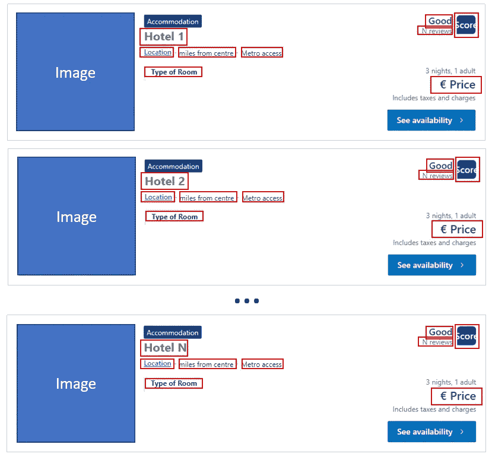

All images by author unless specified

当抓取时，我们寻找可以迭代生成数据行的网站。一个很好的例子是酒店网站，酒店一个接一个地被列出来(见上图)。抓取算法将遍历每个实例，每次抓取我们想要的信息并以表格格式保存。

在每一次迭代中，我们都在网站的 HTML 代码中寻找我们想要的信息被编码的特定位置。例如，如果我们想要一个酒店的价格，它将总是在每个酒店框中的相同位置，所以我们可以只在那里查找每个酒店。在上图中，您可以看到您可能有兴趣为每个酒店收集的字段。

# 抓取数据

我过去使用 python 搜集过数据，我可以告诉你这很痛苦。第一个主要缺点是，编写抓取网页的算法可能会非常繁琐和挑剔。有些字段的位置有时会改变，很难准确得到您想要的。

抓取的另一个主要缺点是网站保护政策。如果你自己制作你的 bot，很难知道你刷新网站得到你想要的数据的最大速度是多少。设置速度太高会让你被网站暂停，设置速度太低会导致一个极其缓慢的过程。

现在有软件公司使这个过程变得更容易，而不需要你自己写任何代码。我推荐 [Octoparse](https://www.octoparse.com/?diego=) ，因为它过去对我很有效。

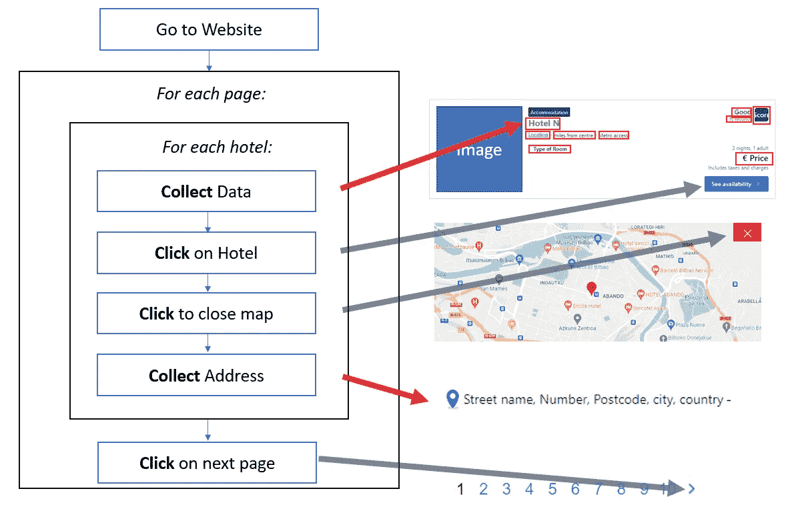

Flow Process of a theoretical scraping process

上面是一个流程图，显示了一个抓取算法可能是什么样子。对于每个酒店房间，我想首先提取初始数据，如酒店名称、评级、价格、离中心的距离以及离海滩的距离。然而，为了获得地址，我首先必须进入酒店的页面，然后关闭弹出的地图，最后收集酒店的地址。

让我们看一下流程图中的每一步:

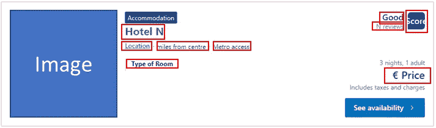

Information about each hotel

上面是一个酒店的手机，我可以抓取除了地址以外的所有数据。对于地址，我需要告诉机器人点击酒店。

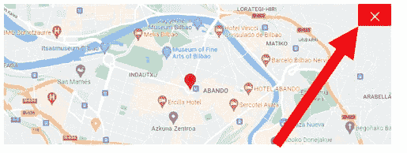

Closing Map

一旦我点击酒店，地图就会出现，我们可以告诉机器人点击十字关闭地图，以便访问酒店的地址。

Collecting Hotel Address

一旦地图被关闭，酒店的地址是可访问的。在分析酒店数据时，该地址会很有用。

# 后处理

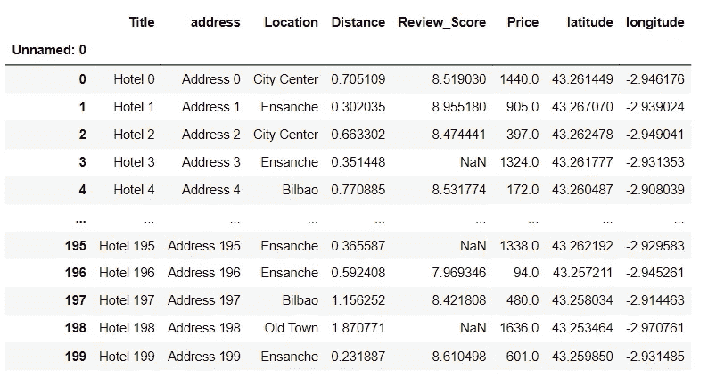

Post-processed synthetic Hotel data

抓取数据几乎总是需要大量的后处理。列的格式不正确，或者需要以其他方式处理。

大多数时候，所有的原始数据字段都是字符串格式。其中一些字段需要转换成整数或浮点数。以下是示例变量，以及它们在后处理前后的样子:

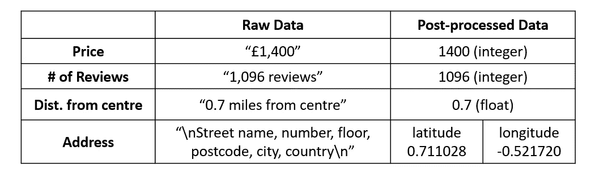

Raw Data vs Processed Data

前三个变量(价格、评论数量和距中心的距离)只是修改字符串，直到我们得到原始数字，然后将数字转换为整数或浮点数。

最后一个变量要复杂得多。地址是字符串格式的，我们正在寻找酒店的坐标。要进行这种转换，可以使用 Python 中的 Google Maps API。

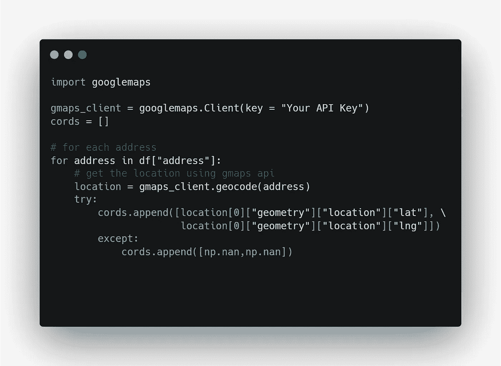

Get Latitude and Longitude from a set addresses

上面的代码是我如何将数据框中的地址从字符串转换为地理坐标。

因此，正如您所看到的，处理原始数据不一定只是改变值类型，还可能涉及更困难的过程。一旦模式中有了我们想要的数据，我们就可以继续进行分析了。

# 酒店分析

我模拟了西班牙两个城市的酒店数据。我看的第一个城市是毕尔巴鄂，我的家乡。

# 分析-合成毕尔巴鄂酒店

Photo by [Jorge Fernández Salas](https://unsplash.com/@jorgefdezsalas?utm_source=medium&utm_medium=referral) on [Unsplash](https://unsplash.com?utm_source=medium&utm_medium=referral)

我首先想看看数据中的相关性。我有兴趣看看是否有酒店的属性对价格有很大的影响，例如。

为了分析相关性，我首先去除了一些异常值。我只是把它们拿出来做相关性分析，剩下的就留在里面了。

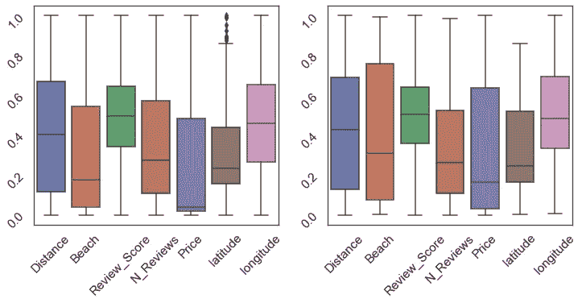

Removing outliers using IQR (left with outliers, right without outliers)

我用基于四分位数范围(IQR)的阈值去除了异常值。我考虑了不在 Q1 -1.5 IQR 和 Q3 + 1.5 IQR 之间的异常点。这在上面的方框图中可以看到。胡须外的所有点都被移除。

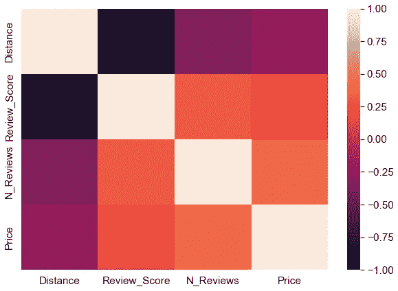

Pearson’s correlation for data columns in Bilbao hotels (outliers removed)

在使用 IQRs 移除一些异常值后，我可以绘制毕尔巴鄂酒店属性之间的线性相关性。事实证明，平均评论分数(满分 10 分)与距中心的距离有很强的负相关性。这意味着离市中心越近的酒店平均得分越高。

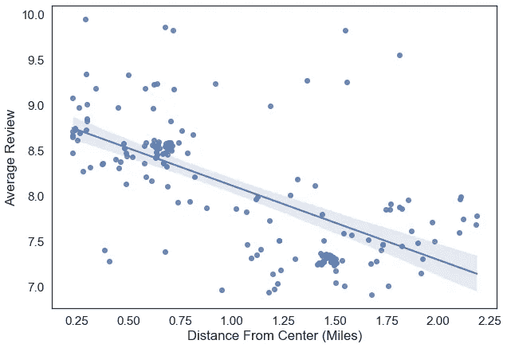

Average Review vs Distance from Center

我们可以看到平均点评和酒店离中心有多近有很强的负相关关系。也有一些酒店集群，这只是由于我如何生成数据。

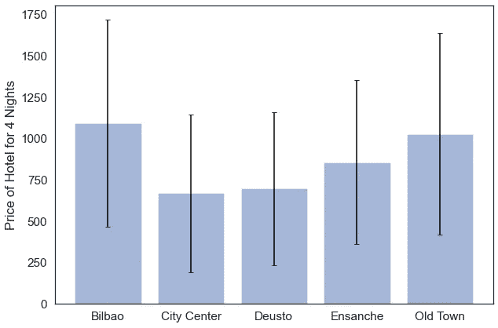

Price of Hotel vs Location in the City (error is shown as the standard deviation)

以上是毕尔巴鄂每个地点的酒店价格。酒店分为 5 个位置。每个地方的价格都有很大的差异。在其余的分析中，为了简单起见，我将“毕尔巴鄂”、“市中心”和“恩桑奇”合并为一个位置。

我想做的最后一件事是在地图上显示酒店(这就是我想要纬度和经度的原因)。我使用 Python 上的 google maps API 完成了这项工作。有了它和酒店坐标，我可以在地图上显示所有的酒店。

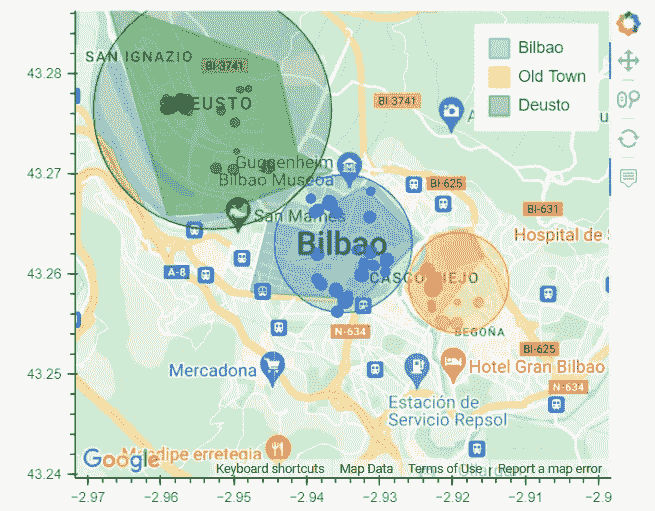

Generated hotel data shown on Google Maps (These hotels do not exist)

该地图是用一个名为 Bokeh 的库绘制的，它是用 Python 交互式绘制的，你可以将鼠标悬停在每个酒店上，工具提示会显示关于酒店的信息，如价格和位置。

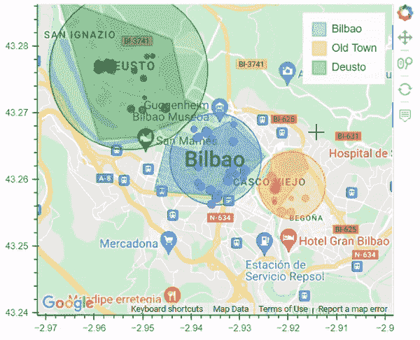

GIF of interactive tool

# 分析-贝尼多姆酒店

Photo by [Dimitry Anikin](https://unsplash.com/@anikinearthwalker?utm_source=medium&utm_medium=referral) on [Unsplash](https://unsplash.com?utm_source=medium&utm_medium=referral)

我对贝尼多姆的酒店做了类似的分析。这座城市有海滩，深受英国人喜爱。这里的酒店数据一定很有趣。

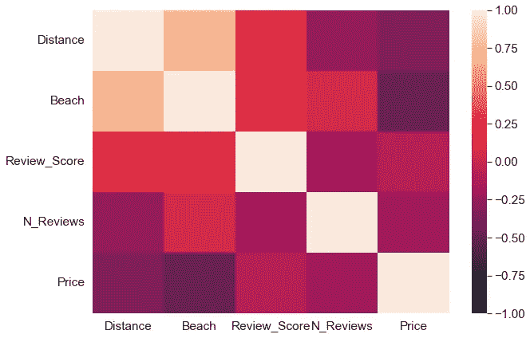

Pearson’s correlation for data columns in Benidorm hotels (outliers removed)

查看线性相关性，我们可以立即看到数据的一些有趣的属性。例如，价格和离市中心的距离之间并不像毕尔巴鄂那样有很强的负相关性。靠近市中心并不是衡量酒店价格的好指标。这可能是因为靠近海滩比靠近市中心更重要。我们可以从价格和离海滩的距离之间更强的负相关关系中看出这一点。

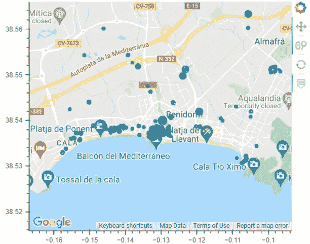

Benidorm Hotels with size of circles proportional to price (non of these hotels exist)

我在贝尼多姆的酒店数据没那么好。如果你仔细看，有些酒店就在海滩上，甚至在水里！尽管如此，这些数据为一个涉及收集和分析数据的项目提供了一个小小的模拟。

# 结论

在这篇文章中，我展示了一个抓取网页的算法是什么样子的。我分析了西班牙两个城市的定制酒店的数据。当使用原始数据处理项目时，后处理是关键。在本文中，我探讨了后处理可能涉及的内容，以及如何从酒店地址中提取地理坐标并在 google maps 上绘制它们。

## 支持我👏

希望这对你有所帮助，如果你喜欢，你可以 [**关注我！**](/@diegounzuetaruedas)

你也可以成为 [**中级会员**](https://diegounzuetaruedas.medium.com/membership) 使用我的推荐链接，获得我所有的文章和更多:[https://diegounzuetaruedas.medium.com/membership](https://diegounzuetaruedas.medium.com/membership)

## 你可能喜欢的其他文章

[利用人工智能检测欺诈](https://towardsdatascience.com/how-to-deal-with-unbalanced-data-d1d5bad79e72)

[什么是爬虫，它是如何工作的](https://tinyurl.com/2p8jc3bt)