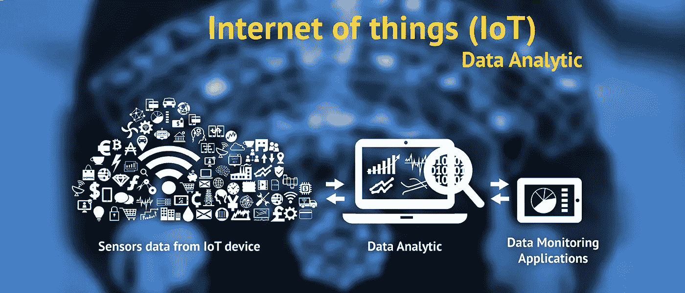
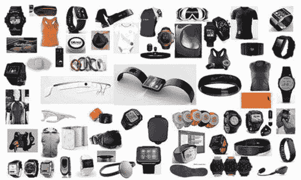
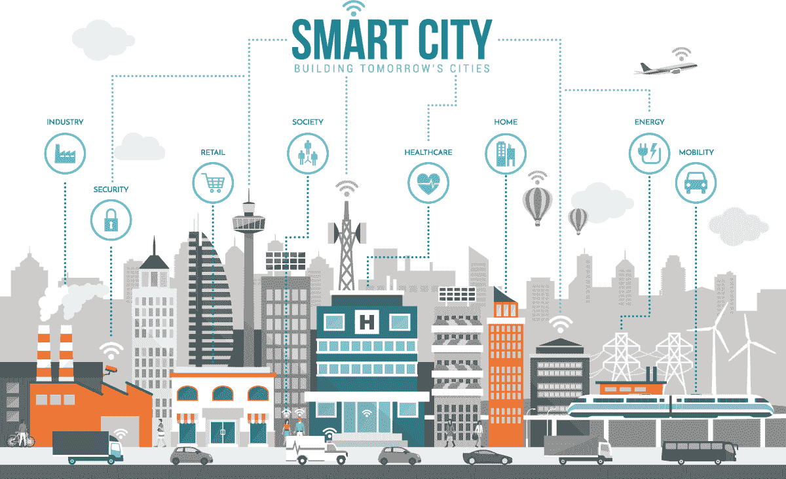

# 物联网分析

> 原文：<https://medium.com/geekculture/analytics-of-iot-a4bea2478d54?source=collection_archive---------20----------------------->

Source: Fingent.com

> AIOT:人工智能和 IOT 的交叉将如何推动未来几十年的创新

## AIOT 是什么？

AIoT 是将人工智能技术与[物联网](/illumination/current-trends-in-iot-c132acd089ea)基础设施相集成的任何系统，可提高效率、人机交互、数据管理和分析。

[物联网](/illumination/current-trends-in-iot-c132acd089ea)使设备能够收集、存储和分析大数据。设备操作员和现场工程师通常控制设备。AI 增强了物联网的现有系统，使它们能够采取下一步措施，根据对数据的分析来确定并采取适当的行动。

通过将 AI 嵌入基础设施组件，包括程序、芯片组和边缘计算，AIoT 使智能、互联系统能够学习、自我纠正和自我诊断潜在问题。

一个常见的例子出现在监控领域。监控摄像头可以用作图像传感器，将每一帧发送到物联网系统，该系统分析特定对象的馈送。AI 可以分析帧，并仅在检测到特定对象时发送帧-由于排除了不相关的帧，因此大大加快了过程，同时减少了生成的数据量。

## 可穿戴设备:-

Source: The Internet of Things

到 2022 年，全球可穿戴设备市场预计将超过 870 亿美元。智能手表等可穿戴设备上的人工智能应用有许多潜在的应用，特别是在健康科技领域。

台湾的研究人员一直在研究 AIoT 可穿戴系统用于心电图(ECG)分析和心脏病检测的潜力。该系统将集成一个基于物联网的可穿戴系统和一个用于心脏疾病检测的人工智能平台。可穿戴设备收集实时健康数据，并将其存储在云中，人工智能算法检测疾病的平均准确率为 94%。目前，Apple Watch Series 4 或更高版本包括一个心电图应用程序，可以捕捉心跳不规则、快速或跳过的症状。

## 智能城市

Source: arcweb.com

随着城市渴望投资改善公共安全、交通和能源效率，AIoT 将推动智能城市领域的创新。

AIoT 分析数据和行动的能力为优化物联网系统的能耗开辟了许多可能性。智能路灯和能源网可以分析数据，在不给市民带来不便的情况下减少能源浪费。

一些智能城市已经在交通领域采用了 AIoT 应用。新德里拥有世界上最糟糕的交通，其智能交通管理系统(ITMS)可以对交通流量做出实时动态决策，以加速交通。

## 零售

AIoT 有可能通过数字增强来增强零售购物体验。我们前面提到的智能摄像机正被用来检测商店扒手。沃尔玛最近证实，它已经在 1000 多家商店安装了智能安全摄像头。

AIoT 的一大创新涉及智能购物车。加拿大和美国的杂货店正在试验高科技购物车，包括来自 Caper 的一款购物车，它使用图像识别和内置传感器来确定一个人将什么放入购物车。

智能购物车的潜力是巨大的——这些购物车将能够通知客户交易和促销信息，根据他们的购买决定推荐产品，使他们能够查看他们当前购买的物品清单，并结合室内导航，引导他们找到他们想要的物品。

**一家名为 IMAGR 的智能购物车公司最近在首轮融资前筹集了 1400 万美元，预示着智能购物车的光明前景。**