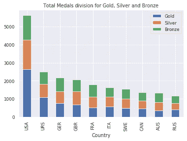
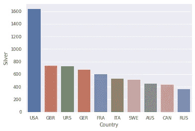
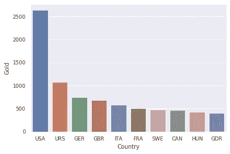
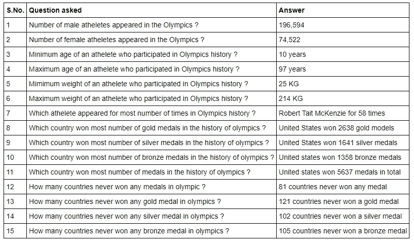

# 分析 120 年的奥运会数据——使用 Python 和 Pandas 进行数据分析的初学者练习

> 原文：<https://medium.com/geekculture/analyzing-120-years-of-olympics-data-a-beginners-exercise-to-data-analysis-with-python-and-ebee106526d1?source=collection_archive---------18----------------------->


# 概观

这个笔记本是一个分析奥运数据集的练习，该数据集在 [Kaggle](https://www.kaggle.com/mysarahmadbhat/120-years-of-olympic-history/) 上公开。本次活动我们有以下目标-

*   从我们现有的数据中获得一些有趣的见解，比如说奥运会历史上赢得最多金牌的人，每年参加的国家数量等等。
*   学习目的—使用 pandas、matplotlib 和 seaborn 库来分析数据，并为我们提供一个有趣的用例来应用这些技能

# 主要步骤

我们将执行以下主要步骤-

*   设置您的工作环境—下载像 pandas、numpy、matplotlib、seaborn 这样的库
*   使用由 [jovian](https://jovian.ai/) 开发的 [opendatasets](https://github.com/JovianML/opendatasets) 库从 [Kaggle](https://www.kaggle.com/mysarahmadbhat/120-years-of-olympic-history/) 下载数据
*   执行基本分析并绘制 seaborn 图
*   总结你的统计数据
*   可选—在网页上展示您的见解

# 步骤 1 —设置我们的工作环境

```
*#Import required libraries* 
**import** **pandas** **as** **pd**
**import** **matplotlib.pyplot** **as** **plt**
**import** **seaborn** **as** **sns***#Ensures that matplotlib and seaborn graphs are visible within notebook*
%matplotlib inline 

*#Setup up style and theming for seaborn graphs* 
sns.set_theme(style="darkgrid")
sns.set_context("paper")
plt.figure(figsize=(8,6))

*#Ensures that you see all (500) columns within notebook*
pd.set_option('display.max_columns', 500)
pd.set_option('display.width', 1000)
```

# 步骤 2-下载数据

```
**import** **opendatasets** **as** **od**
dataset_url = "https://www.kaggle.com/mysarahmadbhat/120-years-of-olympic-history/"

*#This will prompt to ask for your Kaggle username and access key. Please provide as an input*
*#If not, you can download your kaggle.json from kaggle and upload it in same working directory of this notebook*
*#It will then pick your credentials from kaggle.json*
*#I will manually provide those inputs*
od.download(dataset_url)Skipping, found downloaded files in "./120-years-of-olympic-history" (use force=True to force download)
```

你的数据集被下载到一个名为“120 年奥林匹克历史”的特殊目录中。让我们使用操作系统模块来处理目录，并获取下载文件的列表

```
**import** **os** 
datadir = "./120-years-of-olympic-history"

data_files = os.listdir(datadir)
print("List of downloaded files - ", data_files)
```

我们每个人有四个文件夹。在 excel 中查看文件是一个很好的做法，可以快速查看您正在处理的数据，但我们也将使用 pandas 来完成这一工作。让我们将所有 4 个文件导入到我们的熊猫数据框架中

```
*#Create file paths for all files present in the directory*
file_country_definition_data_dictionary = datadir + "/" + data_files[0]
file_country_definition = datadir + "/" + data_files[1]
file_athelete_events_data_dictionary = datadir + "/" + data_files[2]
file_athelete_events = datadir + "/" + data_files[3]#Let us now import data into our dataframe and see if they are important for our analysis or are just helping data dictionary to understand manual datacountry_definition_data_dictionary_df = pd.read_csv(file_country_definition_data_dictionary)
print("Dataframe for Country Definition data dictionary file")
print(country_definition_data_dictionary_df)country_definition_df = pd.read_csv(file_country_definition)
print("Dataframe for Country Definition file")
print(country_definition_df)
```

上面的数据框是一个带有国家代码和国家名称的国家列表。如果您观察到第一个数据集文件中的值的列被用作第二个文件中的列

```
athelete_definition_data_dictionary_df = pd.read_csv(file_athelete_events_data_dictionary)
print("Dataframe for Athelete events data dictionary file")
print(athelete_definition_data_dictionary_df)
```

这也是元数据，但很重要，它提供了我们将在主数据文件中看到的所有列的详细信息。让我们知道做导入最后和关键数据文件的重要工作

```
athelete_events_df = pd.read_csv(file_athelete_events)
print("Dataframe for Athelete events file")
print(athelete_events_df)
```

# 步骤 3 —进行基本数据分析

## 有多少男性和女性出现在奥运会上？

```
males_count = athelete_events_df[athelete_events_df["Sex"] == "M"]["Sex"].count()
females_count = athelete_events_df[athelete_events_df["Sex"] == "F"]["Sex"].count()

print("Number of males - ", males_count)
print("Number of females - ", females_count) #Output#Number of males -  196594
#Number of females -  74522
```

# 许多其他被回答的问题-

*   哪个运动员在奥运会上出场时间最长？
*   奥运会历史上哪个国家获得的奖牌数最多？
*   有多少国家从未获得过奥运会奖牌？
*   有多少国家从未获得过奥运会金牌？
*   有多少国家从未获得过奥运会银牌？
*   有多少国家从未获得过奥运会铜牌？
*   获得奥运会数据库中唯一的运动项目列表？

# 形象化



Simple basic graphs for basic visualization performed on the data

# 关于各种问题的结论

这是我们所提问题的汇总答案图片



Answers to the questions we asked to Olympics dataset

# 注意

既然，我想保持简短，我将我所有的详细解释和源代码添加到我的 [**Google Colab 笔记本**](https://github.com/AMMLRepos/Data-Analysis-120-years-of-olympic-history/blob/main/data_analysis_120_years_of_olympic.ipynb) 中，可从我的 [**GitHub 资源库**](https://github.com/AMMLRepos/Data-Analysis-120-years-of-olympic-history/blob/main/data_analysis_120_years_of_olympic.ipynb) 中获得。请随意下载并尝试运行代码片段，探索更多内容。我会更新那个 [**Google Colab 笔记本**](https://github.com/AMMLRepos/Data-Analysis-120-years-of-olympic-history/blob/main/data_analysis_120_years_of_olympic.ipynb) 更有趣的见解。