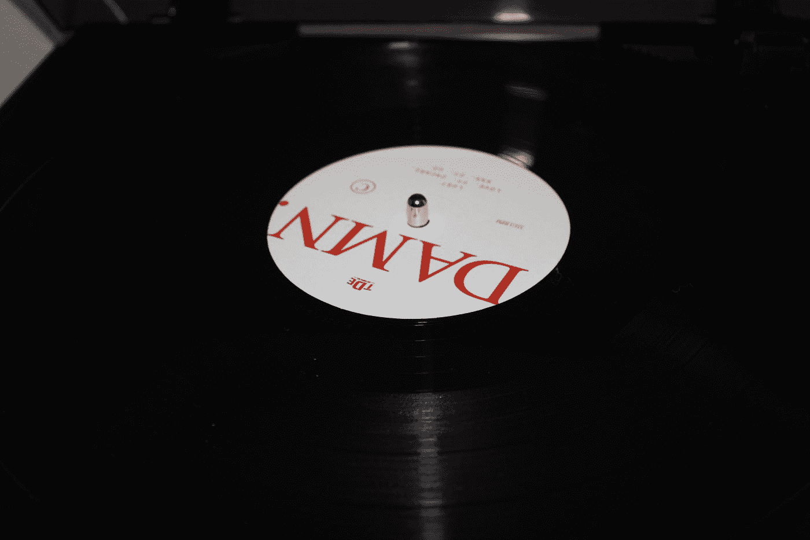

# 用 Python 可视化 Kendrick Lamar 的歌词

> 原文：<https://medium.com/geekculture/analyzing-and-scraping-the-lyrics-of-every-kendrick-lamar-album-in-python-b0551dcb563a?source=collection_archive---------10----------------------->

Photo by [Roger Cosby](https://unsplash.com/@cosbyr?utm_source=medium&utm_medium=referral) on [Unsplash](https://unsplash.com?utm_source=medium&utm_medium=referral)

肯德里克·拉马尔可以说是当今一代的声音，也是 2010 年代最有影响力的说唱歌手。5 月 13 日，G.O.A.T .发布了他的最新专辑《士气先生&大踏步者》,该专辑首次登上 Billboard 200 专辑排行榜第一名。我从中学开始就听着 Kendrick Lamar 的歌长大，从数据科学的角度来看，我很好奇他的歌词是如何随着时间的推移而变化的。