# 用 Python 分析客户流失数据

> 原文：<https://medium.com/geekculture/analyzing-customer-churn-data-with-python-ddfef75e8149?source=collection_archive---------2----------------------->

# 什么是客户流失？

术语“客户流失”指的是客户的流失。也就是说，如果顾客或客户停止接受公司的服务，就说他/她已经离职。

客户流失与公司的财务表现密切相关。一个人对买家的行为了解得越多，他就能赚更多的钱。分析客户流失也有助于发现和改进公司提供的服务的缺点。

# 收集和清理数据

在这个实验中，我使用了著名的电信客户流失数据。这些数据可以从不同的来源找到。您也可以从[这里](https://github.com/AashiqReza/DataAnalysiswithPython/tree/main/Classification)下载数据。

下载数据后，应该将其加载到 python 中，然后获得数据的概述。在此之前，应该将所有必需的库导入到环境中。

```
# Import libraries
import sklearn as sk
import pandas as pd
import matplotlib as plt
import xgboost as xgb
import seaborn as sn
import matplotlib.pyplot as plt
import os
import numpy as np# ML algorithmsfrom sklearn.model_selection import train_test_split, cross_val_score
from sklearn.impute import SimpleImputer
from sklearn.metrics import accuracy_score, classification_report, roc_auc_score, plot_roc_curve, confusion_matrixfrom sklearn.linear_model import LogisticRegression
from sklearn.ensemble import RandomForestClassifier
from sklearn.neural_network import MLPClassifier
from sklearn.tree import DecisionTreeClassifier## For hyperperameter tuningfrom sklearn.model_selection import RepeatedStratifiedKFold
from sklearn.model_selection import GridSearchCV
```

现在读数据，看一看。

```
# Reading data
data = pd.read_csv('WA_Fn-UseC_-Telco-Customer-Churn.csv', sep=',')
# Overview of the data
data.head()
```

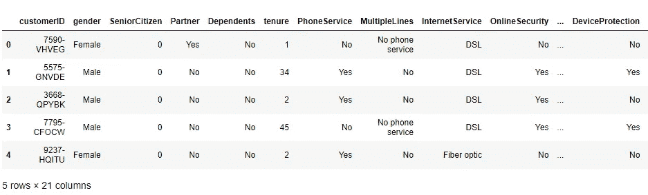

Data overview

数据集有 21 个变量，7032 个观察值。第一列代表 customerID，我将考虑删除此列以进行进一步分析。我使用以下代码检查了该数据集中缺少的值和数据类型。

```
# Checking the summary of missing values
data.isnull().values.any() # The result false implies there is no missing values in the data
FALSE
data.dtypes
```

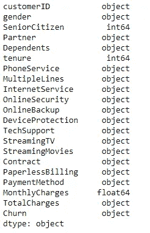

Data types

大多数变量都是对象类型的。正如我在分析中提到的，由于 TotalCharges 是一个对象，应该是浮动格式的，所以出现了一些问题。同样，即使上面的代码显示数据集没有任何丢失的值，我也注意到数据集中的空白区域出现了一些丢失的值。执行以下代码，将这些空格转换为 NA，并省略包含 NA 的数据集的行，并将相关列转换为浮点类型。

```
# Removing variables we are not interested in
data.drop(data.columns[[0]], axis = 1, inplace = True)
## Missing values occured in terms of blank spaces in this dataset
print (data[pd.to_numeric(data.TotalCharges, errors='coerce').isnull()])## Replace all the blank spaces to NA's
nan = float("NaN")
data.replace(" ", nan, inplace=True)
data.dropna(subset = ["TotalCharges", "MonthlyCharges"], inplace=True)
data.MonthlyCharges = pd.to_numeric(data.MonthlyCharges)
data.TotalCharges = pd.to_numeric(data.TotalCharges)
```

# 数据可视化

既然我们已经完成了数据收集和初步的数据清理，现在是时候可视化数据集以从数据集获得有用的见解了。性别与流失的数字显示，男性和女性流失的客户数量几乎相等。下一个数字，老年人与流失率显示，从数量上看，年轻人更喜欢流失率，但如果我们考虑比率，那么老年人的流失率更高。可以说，从合同长度与流失率的数字来看，有逐月合同长度的人更有可能流失。与那些仍在考虑公司提供的服务的人相比，那些已经跳槽的人的任期更短。最后一张图显示了数据集中数值变量之间的关系。

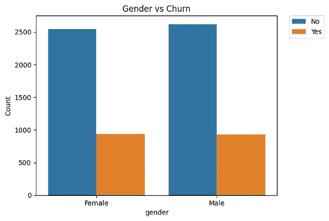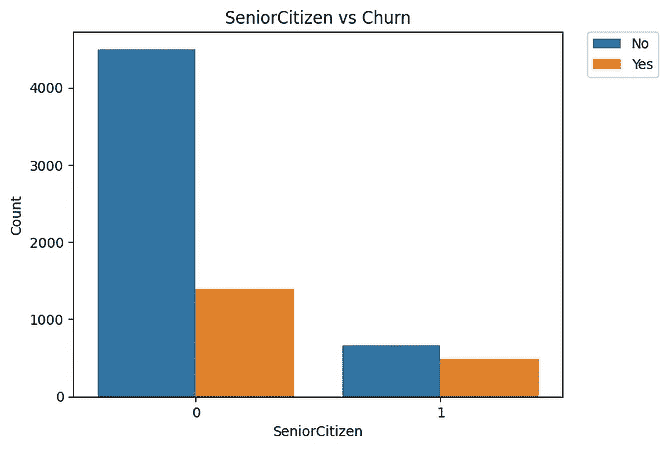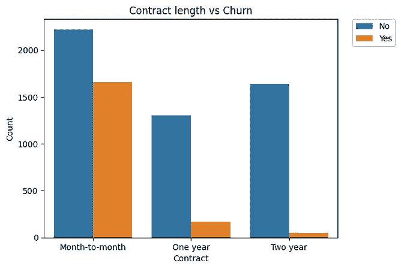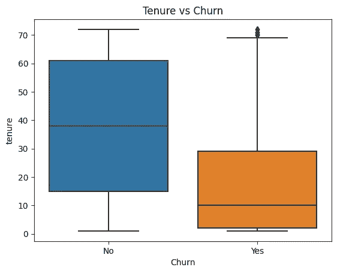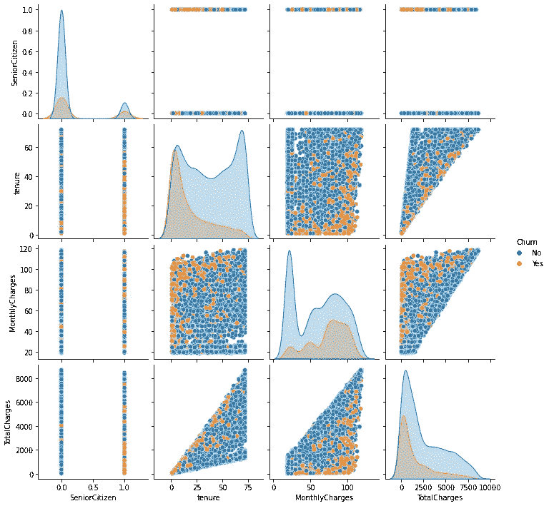

Some visualizations

生成上述图形的代码:

```
# pairplots
sn.pairplot(data = data, hue='Churn')
plt.show()## Average time to churn
sn.boxplot(data['Churn'], data['tenure'])
plt.title('Tenure vs Churn')# Effect of Contract length on customer attrition
counts = (data.groupby(['Contract'])['Churn']
  .value_counts()
  .rename('Count')
  .reset_index())
sn.barplot(x="Contract", y="Count", hue="Churn", data=counts)
set_title('Contract length vs Churn')
plt.legend(bbox_to_anchor=(1.05, 1), loc=2, borderaxespad=0)# Effect of age on customer attrition
counts = (data.groupby(['SeniorCitizen'])['Churn']
  .value_counts()
  .rename('Count')
  .reset_index())
sn.barplot(x="SeniorCitizen", y="Count", hue="Churn", data=counts)
set_title('SeniorCitizen vs Churn')
plt.legend(bbox_to_anchor=(1.05, 1), loc=2, borderaxespad=0)
plt.savefig('fig4.png')# Effect of Contract length on customer attrition
counts = (data.groupby(['gender'])['Churn']
  .value_counts()
  .rename('Count')
  .reset_index())sn.barplot(x="gender", y="Count", hue="Churn", data=counts).set_title('Gender vs Churn')
plt.legend(bbox_to_anchor=(1.05, 1), loc=2, borderaxespad=0)
plt.savefig('fig5.png')
```

# 建模和准确性测试

在这一节中，我将展示一些对数据集进行预测的模型，并测试它们的准确性。为此，首先，数据集将被分为训练和测试部分，数据集的 30%的观察值将被视为测试数据，其余数据将用于训练模型。

```
# Splitting into test and train sets
x = data.drop('Churn', axis=1)
y = data['Churn']
x_train, x_test, y_train, y_test = train_test_split(x, y, test_size=0.30, random_state=1)
x_train = pd.get_dummies(x_train)
x_test = pd.get_dummies(x_test)
```

所有需要的库和算法都已经在代码的开头加载了。在这个实验中，我考虑使用逻辑回归、随机森林、决策树和 MLP 分类器来进行预测。在训练数据中训练模型，并在测试数据集上评估性能指标。

*   首先，在数据集中训练了逻辑回归模型，我们在测试集上获得了 80%的准确度。

```
logmodel = LogisticRegression()
logmodel.fit(x_train, y_train)predictions = logmodel.predict(x_test)
print(classification_report(y_test, predictions))
print(confusion_matrix(y_test, predictions))
print(accuracy_score(y_test, predictions))
```

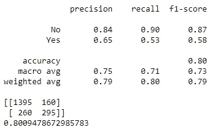

Results from logistic regression

*   接下来，我训练了 MLP 分类器，混淆矩阵显示，该模型在测试集上的准确率也是 80%。

```
mlp = MLPClassifier()
mlp.fit(x_train, y_train)
predictions = mlp.predict(x_test)
print(classification_report(y_test, predictions))
print(confusion_matrix(y_test, predictions))
print(accuracy_score(y_test, predictions))
```

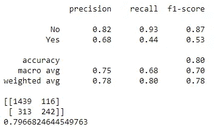

Results from MLP classifier

*   决策树在测试集上显示了 72%的准确率。

```
dtree = DecisionTreeClassifier()
dtree.fit(x_train, y_train)
predictions = dtree.predict(x_test)
print(classification_report(y_test, predictions))
print(confusion_matrix(y_test, predictions))
print(accuracy_score(y_test, predictions))
```

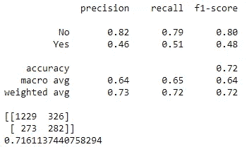

Results from the decision tree

*   最后，对随机森林模型进行了训练，我发现这个模型在测试集上有大约 79%的准确率。

```
rand = RandomForestClassifier()
rand.fit(x_train, y_train)
predictions = rand.predict(x_test)
print(classification_report(y_test, predictions))
print(confusion_matrix(y_test, predictions))
print(accuracy_score(y_test, predictions))
```

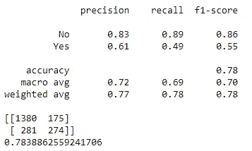

Results from random forest

# 超参数调谐

超参数调整对于提高模型的预测能力非常重要。超参数是其值影响学习过程并影响学习算法学习的模型参数的参数。并且这些超参数的调整意味着选择超参数值的最佳集合。有许多不同的方法来调整超参数。网格搜索是最简单的调优方法之一。以下代码可用于调整任何模型的超参数。对于不同的模型，只需要改变参数列表。每个模型都有许多不同的参数。要调整的参数的选择取决于使用情况和问题。

```
solvers = ['newton-cg', 'lbfgs', 'liblinear']
penalty = ['l2']
c_values = np.logspace(-4, 4, 50)
# define grid search
grid = dict(solver=solvers,penalty=penalty,C=c_values, max_iter = [1000])
cv = RepeatedStratifiedKFold(n_splits=10, n_repeats=3, random_state=1)
grid_search = GridSearchCV(estimator=logmodel, param_grid=grid, n_jobs=-1, cv=cv, scoring='accuracy',error_score=0)
grid_result = grid_search.fit(x_train, y_train)
# summarize results
print("Best: %f using %s" % (grid_result.best_score_, grid_result.best_params_)Result:
Best: 0.807123 using {'C': 0.013257113655901081, 'max_iter': 1000, 'penalty': 'l2', 'solver': 'liblinear'}
```

在这种情况下，提高的精度并不多。在这种情况下，采用了一种非常简单的方法来调整超参数。这可以进一步发展，准确率应该提高到 90–95%。

# 结论

*   在本文中，我展示了如何使用 python 中的电信客户流失数据来分析客户流失。
*   可视化可以从数据中显示一些有用的见解。比如我们可以借助可视化找到客户流失背后的影响因素。
*   已经进行了预测分析，并且已经比较了不同的机器学习算法来解决这个特定的问题。
*   最后，超参数调整显示了如何优化学习模型的参数值，以获得最佳预测准确性。

注意:完整的代码可以从[这里](https://github.com/AashiqReza/DataAnalysiswithPython/tree/main/Classification)下载。