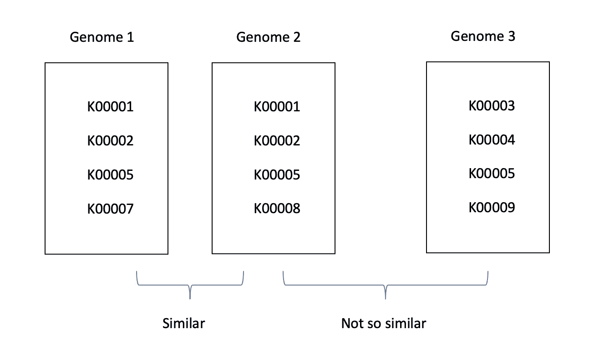
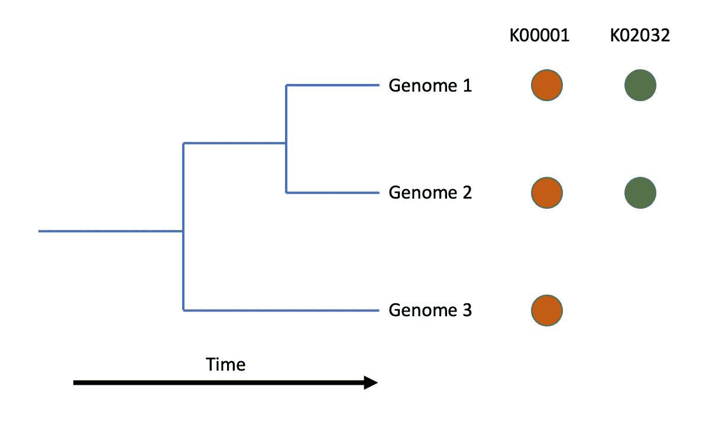
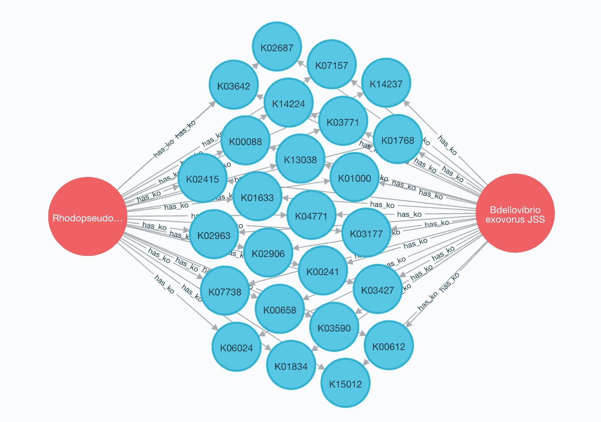
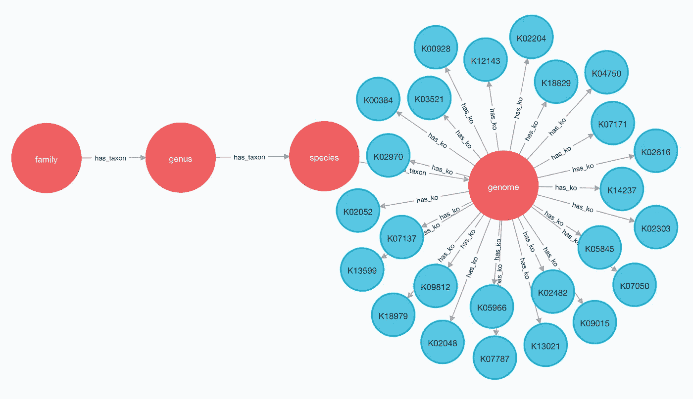
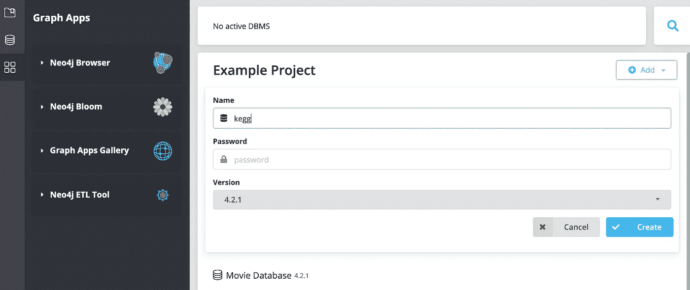
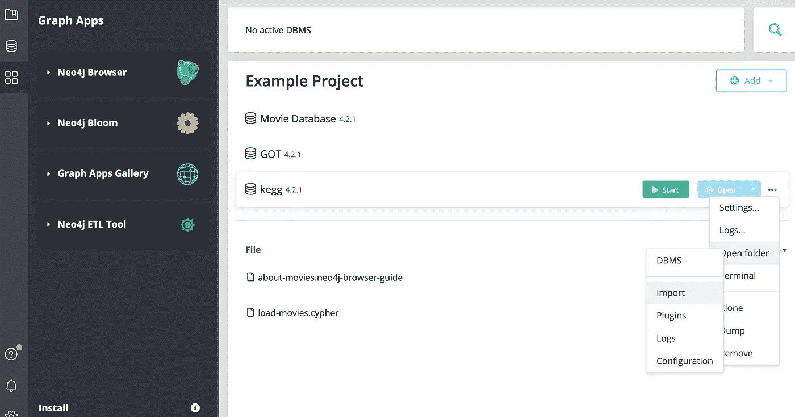
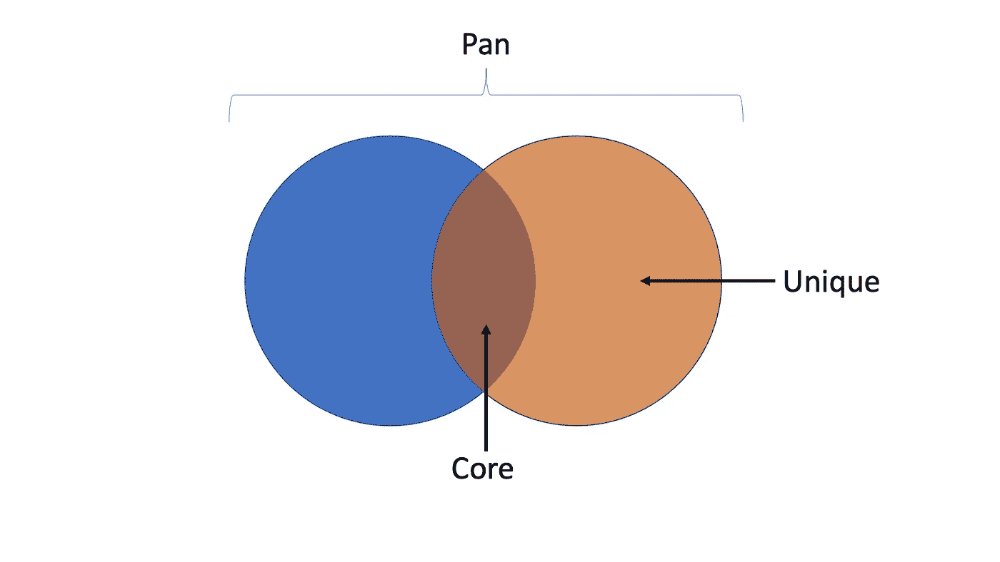
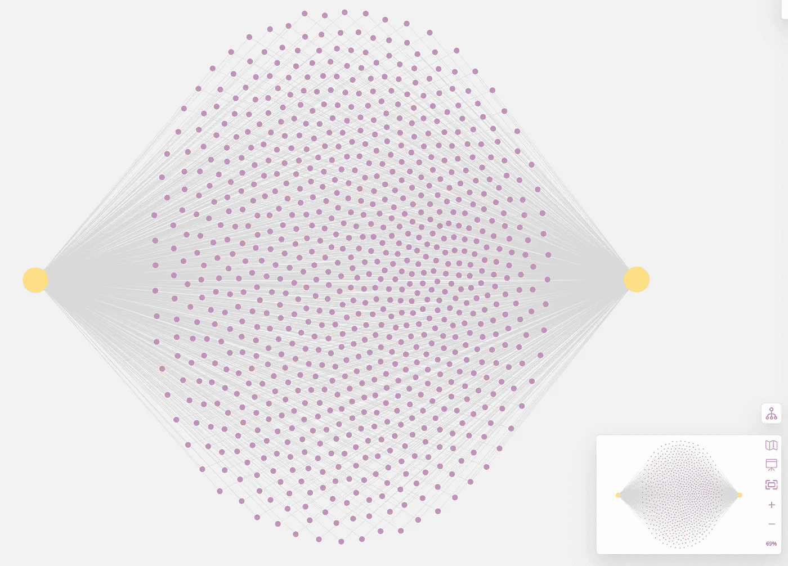
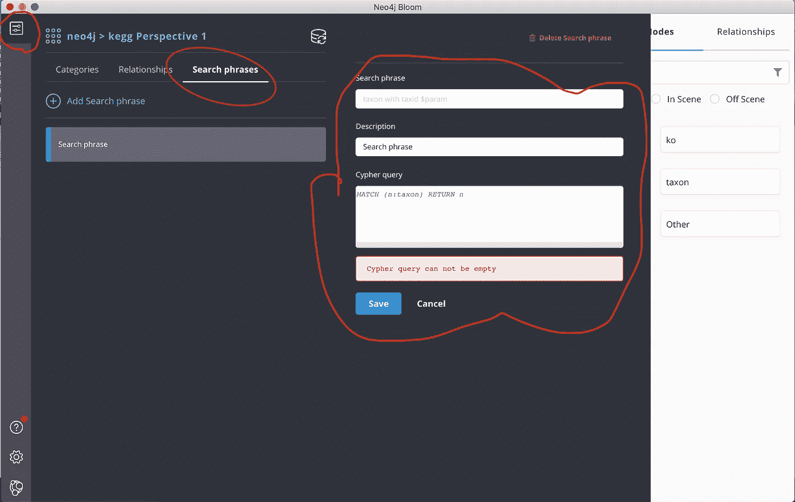

# 在图形数据库中分析基因组

> 原文：<https://medium.com/geekculture/analyzing-genomes-in-a-graph-database-27a45faa0ae8?source=collection_archive---------2----------------------->

基因组是生物体内部所有遗传物质的总和，无论是病毒、细菌还是人类。这是一本只用四个字母写成的生命之书:A、T、C 和 g。不管它的字母表多么简单，这本书包含了它的主人繁殖和生存所需的所有指导。就像一本有许多句子的书一样，一个基因组包含许多基因。有了这些基因，细胞可以制造蛋白质来构建自身并实现各种生化功能。因此，科学家可以通过对其基因组中的基因进行测序和分析来了解该生物体的许多信息。

科学家们通过实验搞清楚了许多基因的功能。假定具有相似 DNA 序列的基因应该实现相同的功能。于是科学家将序列相似的基因归为一类，用本体论的方式命名。今天广泛使用的一个本体是[京都基因和基因组百科全书(KEGG)](https://www.genome.jp/kegg/) 。基因簇标有 KEGG Orthology (KO)号，如 K00001 或 K02392。通过给基因组中的每一个基因标上 KO 数，我们可以很快地了解生物体在生物化学上能做什么。

事实上，我们可以做得更多。由于一个基因组可以包含许多 KO 数，并且一个 KO 数可以出现在许多基因组中，我们一方面可以识别相似的基因组，如果它们共享许多共同的 KO 数(图 1)。另一方面，我们可以根据 KO 星团在生命之树中的位置来推断它的进化史(图 2)。然而，科学家将基因组和 KO 信息存储在关系数据库中，如 MySQL，这使得很难获得答案，因为它涉及表之间的大量“连接”操作。在这种情况下，图形数据库可以帮助您。

Figure 1\. Use KO to identify similar genomes. In this case, Genome 1 and 2 are similar because they share more KO than Genome 3.

Figure 2\. With phylogeny it is possible to infer the evolutionary history of KO clusters. In this case, K00001 appeared earlier in the evolution than K02032, because the latter is only shared by two close relatives while K00001 is even found in a remote genome.

在图形数据库中，数据点及其关系存储为节点和边，因此称为图形。数据本质上被表示为一个网络(图 3)。在图数据库中制定关系查询比在关系数据库中要容易得多。事实上，图查询在很大程度上是以“节点-边-节点”的形式构造的。市面上有几个比较流行的图形数据库，比如 AWS Neptune，DGraph，Neo4j。其中 Neo4j 是开源的，比较成熟，比较好用。它使用密码查询语言。

Figure 3\. A simple genome analysis in Neo4j

今天在本教程中，我将展示如何在 Neo4j 中存储 KEGG 网站上所有 Proteobacteria 的 KO 注释，并使用 Cypher 快速了解数据。每个基因组的分类也被建模为图中的连接节点，以便我们可以进行一些进化分析。这个项目的所有代码和数据(在 2021.01.19 访问)都存放在我的 Github 存储库中:

 [## GitHub - dgg32/neo4j_genome_ko

### 这个存储库在一个图形数据库中存放用于后分析基因组的代码和数据。如果你想准备…

github.com](https://github.com/dgg32/neo4j_genome_ko) 

# 1.准备数据

首先，我们需要通过 [KEGG API](https://www.kegg.jp/kegg/rest/keggapi.html) 获取所有基因组的 KO 注释。对于这个项目，我们需要基因组和每个 KO 的详细信息。我已经编写了一个 Python 脚本来将它们下载到两个文件夹中。其次，我们需要将所有这些数据处理成四个 CSV 文件。他们是 1。分类群 CSV，2。KO 详细 CSV，3。分类群和 4 之间的联系。KO 和基因组之间的联系。目标是建立一个网络，模拟分类学和 KO-基因组关系，如图 4 所示。

Figure 4\. This tutorial aims to establish a network that models both the taxonomy and the KO-genome relationship.

对于本教程，我只研究了变形细菌基因组。变形菌是最多样和丰富的细菌门之一。包含了与我们日常生活高度相关的*大肠杆菌*、*豆科根瘤菌*和*嗜肺军团菌*等成员。

# 2.将数据导入 Neo4j

现在是时候转向 Neo4j 了。目前，至少有四种方法可以启动 Neo4j 实例。分别是“社区服务器”、Docker、“Neo4j 桌面”、Neo4j 光环。前三个在本地运行不需要花钱，而最后一个是完全托管的云服务。

对于这个项目，任何本地解决方案都足够了。首先，创建一个名为“kegg”的项目。

Figure 5\. Create project

Neo4j 的一个特点是只能导入数据库安装中的“import”文件夹中的文件。在 Neo4j 桌面这里，我可以通过点击“…”->“打开文件夹”->“导入”来打开它。打开后，将所有四个 CSV 文件复制到那里。

Figure 6\. Import folder

准备就绪后，我们单击“开始”, Neo4j 浏览器随即打开。我们可以在上层控制台区域运行命令。发出以下命令，将分类法、KO 及其关系导入数据库。他们创建了两种类型的节点:“taxon”(图 4 中红色的)和“ko”(图 4 中蓝色的)节点。较高的分类单元通过“has_taxon”关系指向下一级较低的分类单元。基因组通过“has_ko”关系指向它们的 KO。“CREATE CONSTRAINT”命令是必需的，因为它们通过声明所有节点的唯一性来显著加速导入。

最后一个命令花了一些时间。如果在最后一次导入过程中遇到错误“Java heap space ”,可以取消对“`[dbms.memory.heap.max_size](https://neo4j.com/docs/operations-manual/current/reference/configuration-settings/#config_dbms.memory.heap.max_size)`”的注释，并在`neo4j.conf`中将它设置为 4G，错误应该会消失。

# 3.获取总体统计数据

现在有趣的部分开始了。在深入更详细的案例研究之前，我们可以先对图表进行一些统计。

要获得图表中分类群的总数，发出以下命令:

它返回 4131。这是分类单元节点的总数。注意，语法与 SQL 中的 SELECT 非常相似。“t”是别名，而:taxon 是节点类型。然而，这 4131 包括了从“细菌”分类群、“变形菌”分类群到每一个基因组的所有东西。要仅获得基因组计数，发出:

这个查询让您第一次看到了 Cypher 的强大功能。匹配部分本身简洁地反映了我们数据中的关系，也就是说，一个分类单元有 kegg。所以每个满足这个关系的节点都被返回。与上一个查询不同，这里的“DISTINCT”关键字是必要的，因为 Cypher 每次通过 genome -> kegg 对时都会重复计算基因组。

类似地，要获得 KO 数的总数，发出以下命令:

接下来我们可以计算哪些 KO 数是最常见的:

k.ko_id 和 k.name 用于限制这两列的输出。该查询返回

如你所见，列表中主要是核糖体蛋白。唯一进入前 10 名的局外人是 RNA 聚合酶α亚单位。最稀有的 KO 怎么样？只要在最后一个查询中删除“DESC ”,就会得到

乍一看，前 10 个最罕见的 KO 数似乎没有任何规律。事实上，在一个基因组中有 566 个 KO 数只出现一次。可以通过发出以下命令快速检索它们:

这个频率列表对未来的基因组分析非常有用。给定一个新的基因组及其 KO 注释，科学家通常首先研究其罕见的 KO，而不是常见的 KO。为此，他们可以简单地在列表中查找每个 its KO 的频率，并对结果进行排序。出于同样的原因，基因组频率列表可以突出哪些分类组已经被很好地测序，哪些等待更多的关注。总之，这些频率列表是基因组科学家的路标。例如，以下查询将列出*蛭弧菌* JSS 基因组中前 20 个最罕见的 KO:

它返回:

如你所见，在我们的纯变形菌数据集中，*蛭弧菌* JSS 是唯一编码 k 21148“[CysO 硫载体蛋白]-硫代羧酸依赖的半胱氨酸合酶”的基因组。根据列表，它与*蛭弧菌* sp .共享 K05665。qaytius 和*silvagniglellales*细菌 RF1110005，两个亲戚。第三个 KO，K12351，JSS，与一个亲戚*蛭弧菌* W. 共享，但奇怪的是，第三个主人是一个不太亲近的*管弧杆菌*、和*嗜蛋白杆菌。最后，JSS 编码了罕见的 [DNA 拓扑异构酶 VI](https://www.pnas.org/content/106/17/6986) 。*

# 4.核心基因组分析

寻找相似基因组的任务可以归结为:找出与它们的 KO 最相似的基因组。这些共享的 KO 子集可以称为它们的**核心 KO 或核心基因组**。相反，只有某些基因组才有的 KO 被称为**特有 KO** 。核心 KO 和独特 KO 一起形成**泛 KO 或泛基因组**。

Figure 7\. Core, unique and pan genomes

在图形数据库中生成基因组中的核心和唯一的 KO 是非常容易和快速的。例如，下面的命令可以快速找到所有核心 KO 在*沼泽红假单胞菌* BisB18 和*蛭弧菌* JSS 之间。

或者，稍微修改一下查询，我们可以通过 Neo4j Bloom 将结果可视化。

Figure 8\. All the common KO between *Rhodopseudomonas palustris* BisB18 and *Bdellovibrio exovorus* JSS

有了这个查询，现在很容易为一个基因组生成唯一的 KO。假设我们想要研究*色杆菌* sp .的基因组。ATCC 53434 号。这种细菌属于*色杆菌*属，它在我们的图表中有五个其他的姐妹基因组。我们想知道 ATCC 53434 中有哪些 KO，而其他的没有。为此，我们可以首先生成那些姐妹基因组中所有 KO 的列表作为“filter_list”。然后，我们迭代 ATCC 53434 中的每个 KO，只返回那些不在 filter_list 中的 KO。这个描述的密码版本是:

“WITH”语句就像 Unix 控制台中的“|”操作符。它准备第一个“匹配”的结果作为第二个“匹配”的输入。“COLLECT”命令只是将结果(DISTINCT k)格式化成一个列表，以便它可以被第 5 行中的“IN”包含测试使用。

该查询快速返回 50 个 KO 的列表，下面是它们的删节版本:

结果非常有趣。首先，ATCC 53434 奇怪地具有与耶尔森菌毒素相关的 KO。耶尔森氏菌素，顾名思义，是一种铁载体(铁载体分子)，存在于*耶尔森氏菌*或其他肠道细菌如*大肠杆菌*和*肠道沙门氏菌*中，这些都属于*γ肠道细菌*。但是 ATCC 53434 是β变形菌的一员。第二，该列表包含明显与绿脓菌素生物合成相关的 K12241 和 K12242。绿脓杆菌也是一种铁载体。第三，K10829、K23227 和 K23228 显然涉及异羟肟酸铁转运，换句话说，铁转运。最后，K13255 编码铁还原酶蛋白。总之，这个列表表明 ATCC 53434 不同于它的五个姐妹*色杆菌*具有独特的铁相关转运蛋白库。另外，结果还表明该细菌独特地具有丙酮羧化酶的所有三个亚基(K10854、K10855 和 K10856)、双组分系统(K18143 和 K18144)和多药物外排泵(K18145 和 K18146)。

通过对它们共有的 KO 总数进行分类，也很容易发现这些姐妹基因组与 ATCC 53434 的相似性:

它返回:

考虑到 ATCC 53434 总共有 1992 个 KO，看来其中 93%是由最近的亲戚*牛痘色杆菌*共享的。这比最远的亲戚*色杆菌*多了大约 7%。257–1.

目前，关于 ATCC 53434 的信息很少。关于它的栖息地、表现型和致病性，网上没有任何信息。因此，我们上面的“一个问题”分析可以很快产生一些关于其系统发育和生理学的有趣假设。当然，只有在实验中才能证实这些假设。但是这个假设练习可以极大地集中我们的实验，从而节省时间和精力。

# 5.Neo4j Bloom 中的可视化

Neo4j 浏览器虽然内置了可视化输出，但是在效果和造型上还是相当有限的。更糟糕的是，它很快就遇到了性能瓶颈。在查询中忘记“LIMIT”意味着冻结，因为大量节点可以同时出现在输出单元格中。

以前， [Gephi](https://gephi.org/) 是渲染大型 Neo4j 图形的好方法。不过幸运的是，Neo4j Desktop 现在附带了 Neo4j Bloom。Bloom 可以接管许多渲染任务。此外，它还提供了一些图形分析功能，如节点间的最短路径。要生成图 8，请在 Neo4j 桌面中打开 Neo4j Bloom。然后点击“创建透视图”——>“使用透视图”。在“视角”侧边栏中，激活“搜索短语”。

Figure 9\. Create a Search phrase in Neo4j Bloom.

在“搜索短语”中输入“沼泽红假单胞菌*bisb 18 和蛭弧菌* JSS 之间的共同 KO”；在“密码查询”中输入:

然后点击“保存”，折叠侧边栏。现在开始键入搜索输入“comm…”并且您可以使用自动完成提示来选择我们刚刚创建的短语。按下“enter”键，您应该可以看到交互式图形的完整外观。最后，将节点拖放到适当的位置并设置样式。瞧，你得到了一个很好的图形可视化。

关于网络可视化的一句话:一个有太多节点和边的可视化只会是一个装饰图，因为它太密集而无法显示标签。没有标签，没有细节。因此，对节点和边的数量设置一个巧妙的限制是关键。

# 结论

这个教程挺长的。但还是太短，无法展示 Neo4j 的全部威力。我没有接触过图算法和图机器学习。此外，它在基因组分析方面的潜力是巨大的。例如，我们可以在图形数据库中做系统生物学，因为图形比表格更自然地模拟生物化学。还有，我们可以在 Neo4j 中存储我们的生物知识图。我们甚至可以把它做成一个 [Arrowsmith，](https://www.ncbi.nlm.nih.gov/pmc/articles/PMC2693227/)一个可以把生物学文献中两个看似不相关的概念联系起来的工具，比如在缺镁和偏头痛之间，就像大卫·爱泼斯坦在他的书《范围》中所说的那样。

所以，请尝试使用图形数据库增压你今天的研究！

 [## 加入媒介与我的介绍链接-黄思兴

### 作为一个媒体会员，你的会员费的一部分会给你阅读的作家，你可以完全接触到每一个故事…

dgg32.medium.com](https://dgg32.medium.com/membership)