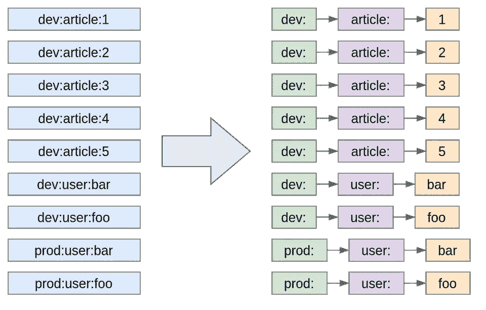
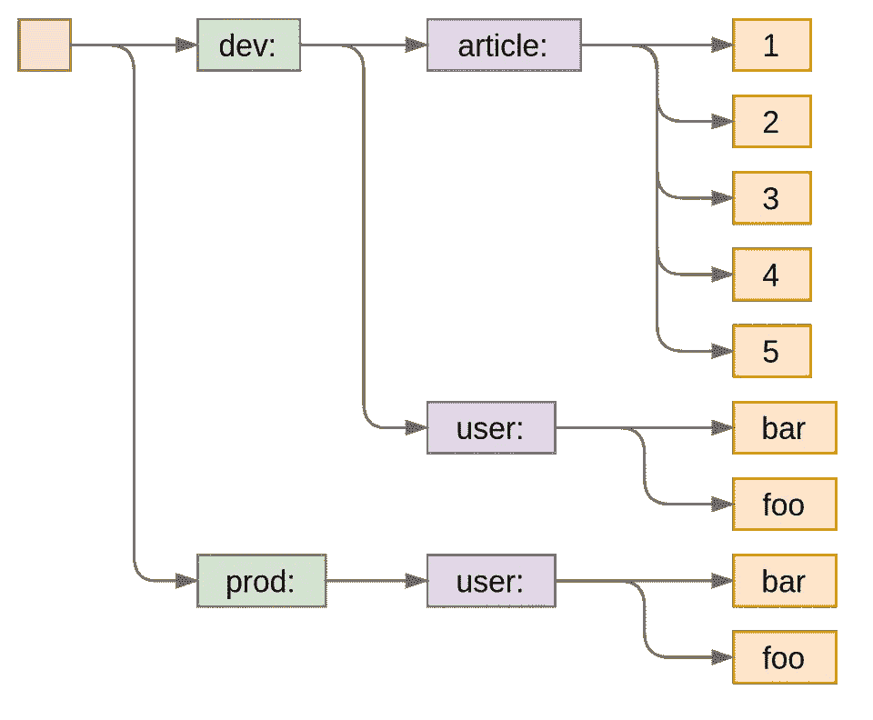
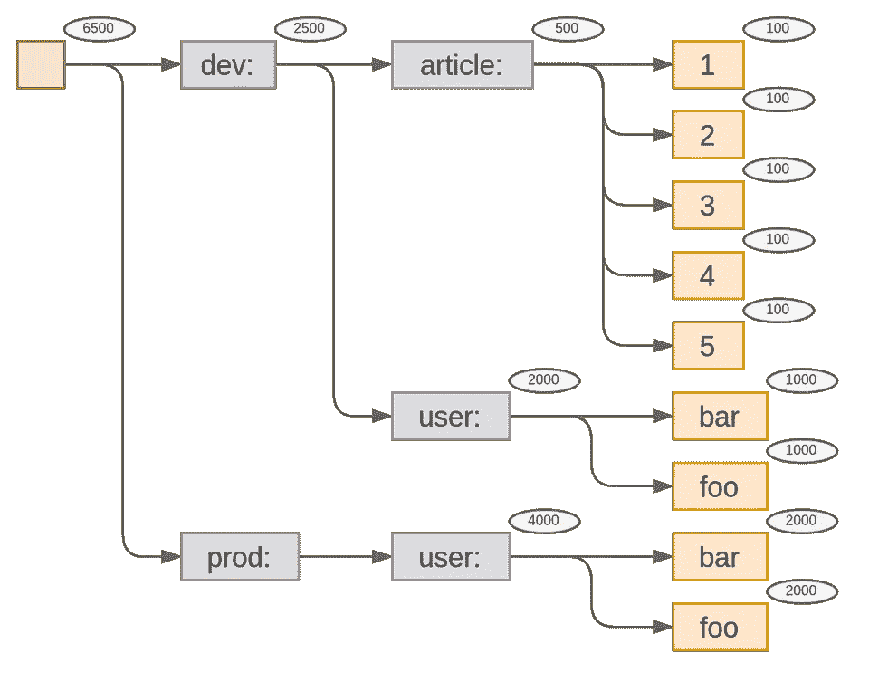
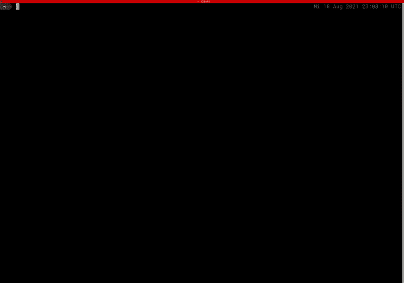
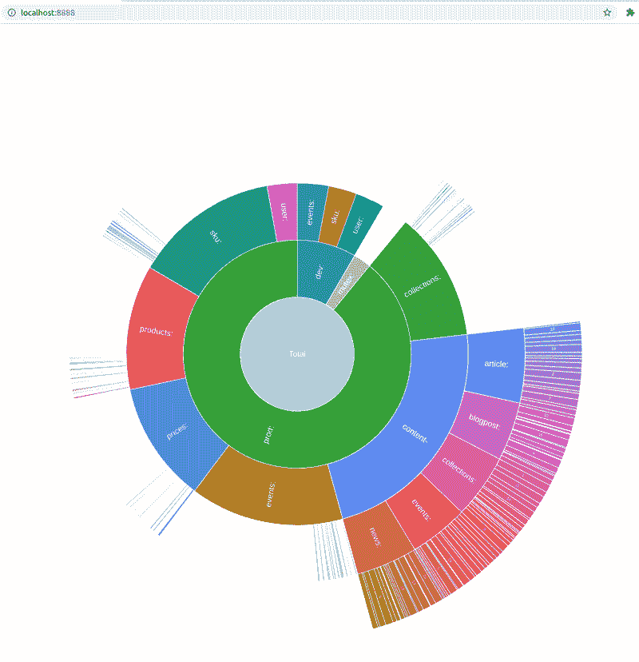

# 通过关键模式分析 Redis 中的内存使用情况

> 原文：<https://medium.com/geekculture/analyzing-memory-usage-in-redis-by-key-patterns-e36420a2c225?source=collection_archive---------31----------------------->

“ [Redis Inventory](https://github.com/obukhov/redis-inventory) ”是我作为开源项目开发的一个工具，用来练习一些编码技巧，同时也解决一个非常实际的问题。它从 Redis 实例(或集群)收集内存使用信息，检测关键模式，并以分层方式显示内存使用情况。

就像许多帮助你清理和组织硬盘的工具一样(例如“Disk Inventory X”或 Unbuntu 的“Disk Usage Analyzer”)，它甚至以类似于最新的方式可视化使用信息(sunburst 图)。但是也有一些细微的差别。让我们仔细看看！

# 那么它到底在解决什么问题呢？

有人可能会说，与硬盘不同，缓存服务器不是持久存储，所以为什么要分析它的使用呢？是的，理论上，缓存是完全短暂的，任何应用程序都应该能够在“冷”状态下启动和使用它。但实际上，在这种负载下，并不总是能够刷新缓存而不出现性能下降。此外，如果应用程序如何使用 Redis 出现问题，刷新将只是暂时的缓解，因为一段时间后，相同的问题将再次积累。有时，您只是在 Redis 指标中看到一般的键计数或内存消耗增加，但问题出在哪里并不明显，因此在没有事先调查的情况下，很难在代码中修复它。

我见过的关于缓存的两个最常见的问题是:缓存键泄漏和忘记设置 TTL 或设置得太多。当您意外地在密钥中添加了过于动态的内容时，就会发生密钥泄漏，例如时间戳或其散列。有了 TTLs，你可以依靠应用程序来删除它们，但在某些情况下，它不会发生，密钥将永远留在缓存中。这些问题在快速变化的大型应用程序中很难跟踪。分析所有可能导致这种情况的代码更改，而不提示有问题的键，可能需要几天时间。

# 该工具如何工作

为了分析内存使用情况，该工具会扫描密钥空间，并使用`[MEMORY USAGE](https://redis.io/commands/memory-usage)`命令测量每个密钥的大小。它构建了一个嵌套节点树，类似于磁盘上的文件夹结构。但是我们如何将普通的字符串键解释为层次结构呢？在缓存键中使用各种前缀是很常见的，我们只需要反过来。最简单的是使用一组“分隔符”并将字符串分成一组字符串段。

然后将这些片段中的每一个视为一个“文件夹”,构建一个节点树:

这种数据结构被称为“前缀树”或“trie”([维基百科](https://en.wikipedia.org/wiki/Trie)上的文章)，我在这个项目中使用了另一篇关于它的好文章作为来源([前缀树在行动中](/amboss/prefix-trees-in-action-404a6105b6d5))。在这种特殊情况下，这种结构非常方便，原因有几个:它节省内存，很容易在那里添加键，并且在构建它的阶段就已经可以聚集每个级别上的使用数据。我们可以为每个节点附加一个聚集指标的容器。当添加一个新的键到树中时，我们将沿着树向下并在路径的每一层上添加值(内存使用或其他)。

正如你所看到的，除了“prod:”部分。但是这没关系，因为它没有在树中引入分叉，并且那里的值本质上等于嵌套的“user:”段的值。一旦新的键出现(例如“prod:blog:1”)并且 fork 被引入，我们就可以从下一个拥有它的嵌套节点克隆聚合器。

# 内存优化

这种数据结构已经是紧凑的和功能性的，但是有时高速缓存可能有数千或数百万个具有相同前缀的实体。在这种情况下，我们通常不关心每个单独的实体 id，而是希望在它们开始分支的级别停止。

对于这种情况，执行`maxChildren`参数。如果任何特定节点的子节点的数量大于`maxChildren`值，它将停止创建子节点，只聚合该级别的值，同时递增`overflowChildrenCount`计数器，这样您至少可以知道有多少键“丢失”。

# 翻译

目前，有两种方法来呈现这些数据:文本表格和 sunburst 图表。表格视图直接显示在终端中，并有一些格式调整(更多信息参见[文档](https://github.com/obukhov/redis-inventory/blob/master/docs/usage.md))。

旭日图呈现在内置 web 服务器提供的 HTML 页面上。将鼠标悬停在任何线段上都会以工具提示的形式显示附加信息。它也是可缩放的:点击一个片段使它成为一个中心片段，并在其周围呈现子节点。

# “生活质量”功能

这里有一些不错的功能，虽然不是非常必要，但是可以让你在使用这个工具的时候更加轻松。

# 自定义分隔符

并非每个应用程序都使用冒号作为关键段的分隔符。其他常见的分隔符有，例如，下划线、破折号或点。要使用自定义分隔符，您可以在`--separators`选项(即`--separators=":_-."`)中将其作为单个字符串提供。如果它们中的一些不总是被用作分隔符，也不要担心:正如您所看到的，只有一个子节点的节点不会引入很大的开销。甚至可以通过实现`Splitter`接口来实现完全自定义的分段策略，例如，检测键的数字部分，并在单独的段中捕获它们，即使它们没有填充分隔符。这需要修改代码并构建自己的二进制文件。

# 节流

另一个有用的选项是`--throttle`，允许您指定工具在请求 Redis 服务器之间等待的纳秒数。如果您害怕在 Redis 实例上导致拒绝服务，这可能会很方便。

# 缓存索引结果

由于该工具支持不同的显示格式，您可以尝试其中一些格式，然后再找到最合适的格式。当使用`inventory`命令时，该工具每次都会重新索引数据库。这可能很耗时，并且会给服务器带来不必要的额外负载。

为了避免每次都重新索引，而不是运行`inventory`命令，您可以使用`index`命令一次来索引 Redis DB，并将索引保存为一个临时文件。之后，您可以使用各种参数多次运行`display`命令，它将使用缓存的数据，不再向 Redis 服务器发送任何查询。请记住，像`maxChildren`这样的选项会影响 trie 结构，并且不能在显示步骤中更改。

# 开源基础设施

这是我最近参与的项目的概要。虽然主要目标是练习我的编码技能，但我也学到了一些关于 OSS 项目基础设施的东西。我非常兴奋地知道，我能够在这个项目中完全免费地使用生产级工具链:

*   GitHub —用于版本控制托管我的代码和简化项目管理；
*   [Travis CI](https://travis-ci.com/) —用于持续集成和交付(在 docker 注册表中上传工件)；
*   [工作服](https://coveralls.io/)——关注单元测试覆盖率；
*   [DockerHub](https://hub.docker.com/) —工具的文档化版本的公共文档映像注册表；
*   [Go 报告单](https://goreportcard.com/) —用于静态代码分析(7 个林挺工具)。

更不用说项目中使用的开源库了:

*   [Radix](https://github.com/mediocregopher/radix) —全功能的围棋 Redis 客户端，
*   Cobra — CLI 应用框架，
*   [Go-pretty](https://github.com/jedib0t/go-pretty) —一套呈现文本表格和进度条的工具，
*   …还有几个小的。

还要特别感谢 [AnyChart](https://www.anychart.com/) 为这个项目发布了一个免费的开源许可证。

我在这里的观点是，如果你想为开源软件世界做贡献，现在你没有借口不这样做。它是免费的，方便的，你唯一要投资的就是你的时间和天赋。所以，继续创造你所缺少的工具，并与世界分享。

我们 AMBOSS 正在招聘一名高级后端工程师来创建、维护和改进为我们的用户带来价值的系统。 [*此处适用*](https://wrkbl.ink/1e7ZAqq) *！*