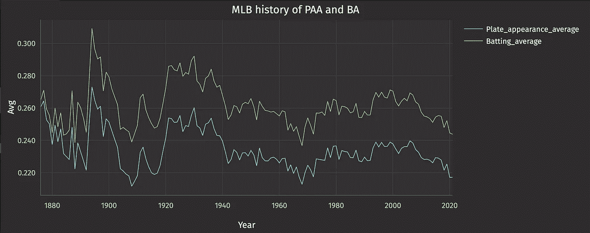
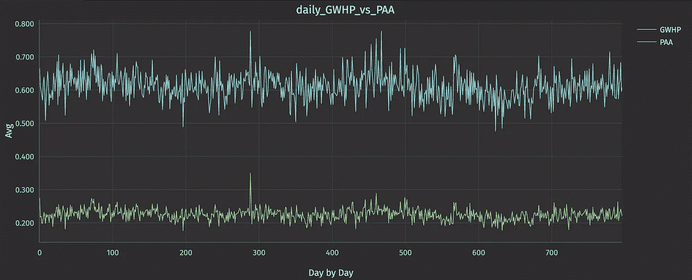
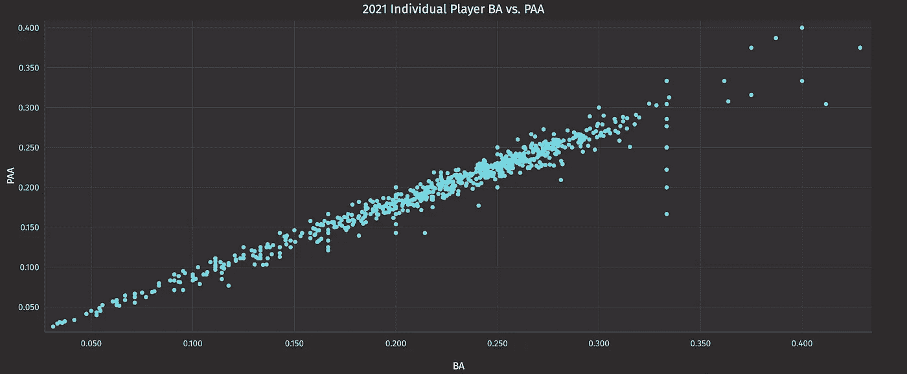
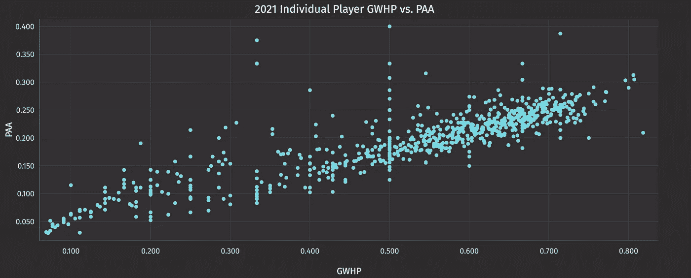
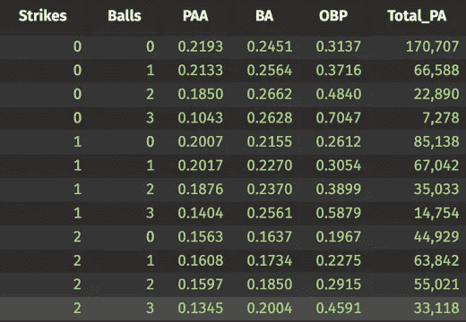
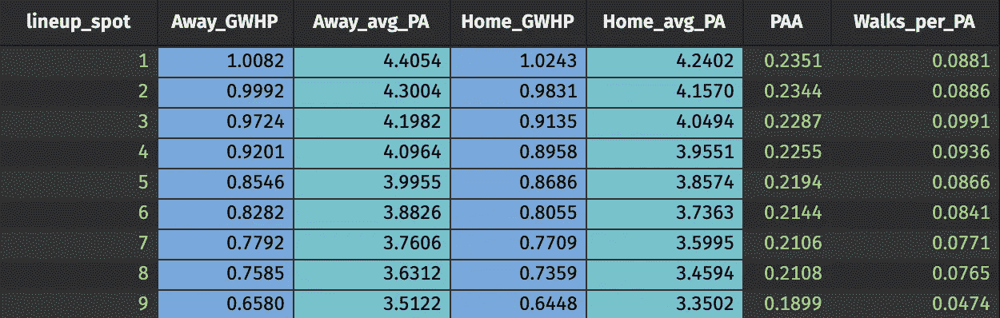
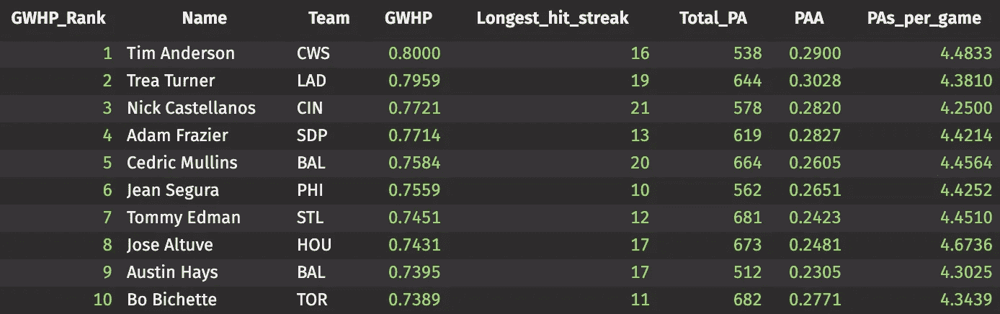

# 分析 MLB 击中 101:在数据科学春季训练的一个定量新秀

> 原文：<https://medium.com/geekculture/analyzing-mlb-hits-101-a-quant-rookie-at-data-science-spring-training-a5ab84497512?source=collection_archive---------16----------------------->

## 第三集:MLB 凭借《深海天堂》打破了连胜纪录

约书亚·科斯基

约吉·贝拉说得对:“很难做出预测，尤其是对未来。”

要赢得 MLB 的梦幻游戏[击败连胜](https://www.mlb.com/apps/beat-the-streak)(“BTS”)，你必须做到这一点。

> *:如果你能在下一场比赛中连续 57 次正确地识别出一个 MLB 玩家，560 万美元就是你的了。*

上周我们[暗示了](https://deephaven.io/blog/2022/06/21/deephaven-mlb-bts/)，然后[更公开地描述了](https://deephaven.io/blog/2022/06/23/mlb-analytics/)一些与我们今年夏天对抗 BTS 的目标相关的细节。我和我的好朋友保罗打算建立模型和体验来帮助每个人做出消息灵通的 BTS 预测，提供网络界面来帮助我们所有人跟踪行动，并创建实时游戏的实时模拟器。应该会很有趣。

保罗和我是创建棒球预测基础设施的新手，特别是预测 MLB 的命中率。因此，我们开始尝试一些历史观察。

首先，我们必须定义几个关键术语:

*   GWH:热门游戏。对于任何游戏中的任何首发玩家来说，这都是 1 或 0。
*   **GWHP:** 我们的发音:“G-Whip”(不要和投球统计鞭混淆)。这是游戏命中率，一个简单的比率:GWH /游戏开始。(我们将重点关注首发阵容中的击球手，因此这些统计数据只包括球员开始比赛的比赛。)
*   **PAA:** 平板外观平均值，以命中数/平板外观计算。(还是那句话，只针对玩家开始的游戏，因为如果他们没有开始，谁会关心他们做得怎么样？我们绝不会选他们做 BTS。)

赢得 BTS 仅与预测您选择的玩家在 GWH 获得“1”有关。然而，GWHP 和 PAA 显然是相关的。

# 测量基础知识

这是从 MLB 开始的 PAA 和 BA 的线形图。如你所见，自 2006 年以来，命中率一直呈下降趋势，这使得这个游戏更加艰难。

下面是过去 5 年联盟每日 GWHP 和 PAA 的历史。

PAA 和 BA 是非常相关的，这可以从下面 MLB 的历史中看出，甚至可以从去年的球员中看出。散点图的 r 平方为 0.966。

PAA 在某种程度上与每个球员的 GWHP 相关，如 0.583 的 r 平方所示。这是因为一个玩家可以通过一次点击进入许多游戏，或者通过多次点击进入一些游戏。这两个玩家都有相同的 PAA，但 GWHP 不同，导致 r 平方较低。这变得有点混乱，因为玩家在游戏中出现的盘子数量有实质性的影响。

因为 PAA 很重要，而且因为保送是一个糟糕的结果(与棒球运动员在实际比赛中对保送的重视形成鲜明对比)，所以在投球之前查看与计数相关的 PAA 似乎是有意义的。例如，如果计数是 1–1，那么在这个盘子外观中命中的概率是多少？将这个投球和所有后续投球合并到盘子外观中(如果你能跟上这个直播，就像 MLB 应用程序中的游戏胜率一样，这将非常酷)。

让我们再来看看 2021 年的结果:

Stas by count

如你所知，如果你在击球顺序的顶端，你可能会得到更多的击球。统计数据证明了主场对客场也很重要，因为客队总是保证有 9 局出场机会。

Home-field advantage?

# 最好的

在一个赛季中找到 GWHP 表现最好的人不太可能帮助你赢得 BTS，除非他们中的一个在现实生活中真的让迪马吉奥黯然失色。虽然他们的成就很可能主要与“你知道，他们只是很好”有关，但对于这些击球手在 GWHs 方面的成功，可能有一些系统的东西可以学习。以下是去年的前 10 名:

2021’s top 10 performers

# [预测，不是观察](https://docs-staging.deephaven.io/deploy-preview/deeae70ded618809ee1a083cad8fa65dd1fe3285/blog/2022/07/01/bts-basic-analysis/#prediction-not-observation)

挑选赢家比记分更难。有了上述分析，我们将在接下来的几周内尝试创建模型，帮助您做出准确的 BTS 选择。这是我们的方法:

1.  复制在这方面花费时间的其他人开发的模型；例如，这些模型中的大多数认为体育场特征、在阵容中的位置和击球统计是识别将在比赛中击中的球员的有用信号。这里我们将大量使用蒙特卡罗方法。
2.  将研究扩展到考虑其他因素，特别是那些与现在容易获得的 Statcast 数据相关的因素。我们的一般假设是，一个击球手在过去几场比赛中一场接一场表现出来的自信和状态是很重要的。
3.  构建模拟 BTS 联盟的基础设施，在该联盟中，成千上万的球员每天都在进行选择，并逐场跟踪他们的球员以及联盟的进展。

这就是计划。迈克·泰森有句名言，“每个人都有一个计划，直到他们被打脸。”让我们希望我们能避免这种气味。