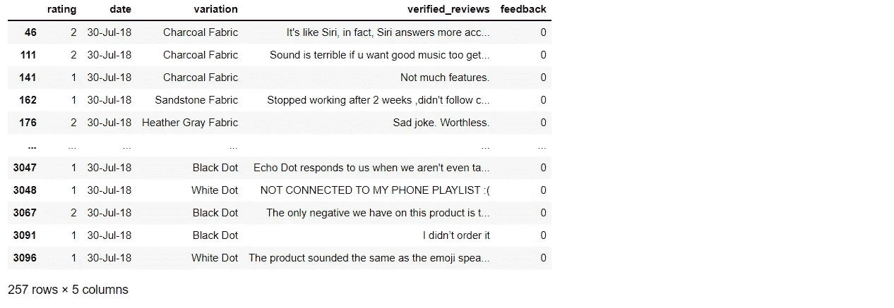
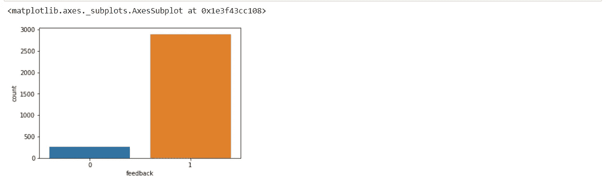
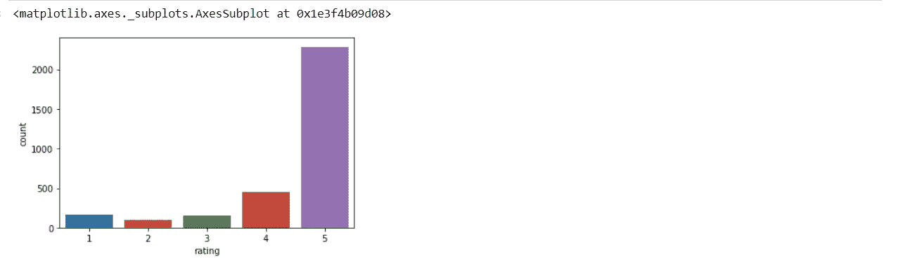
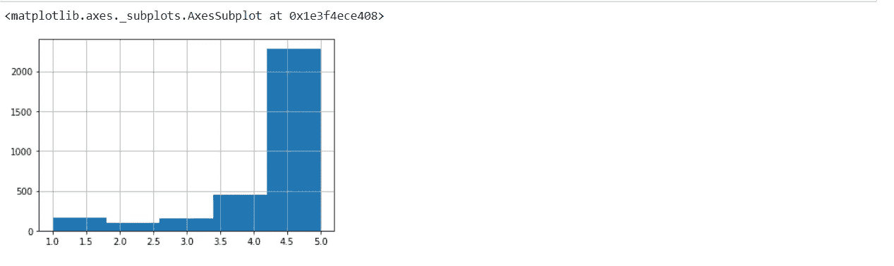
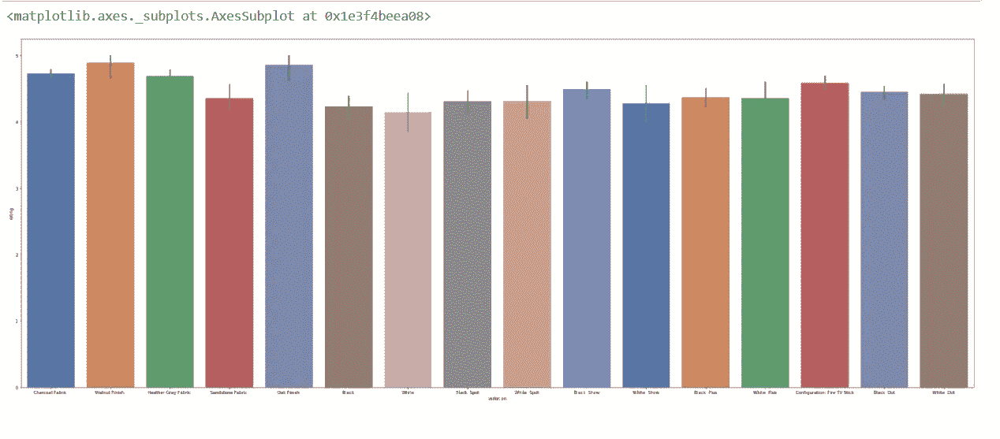
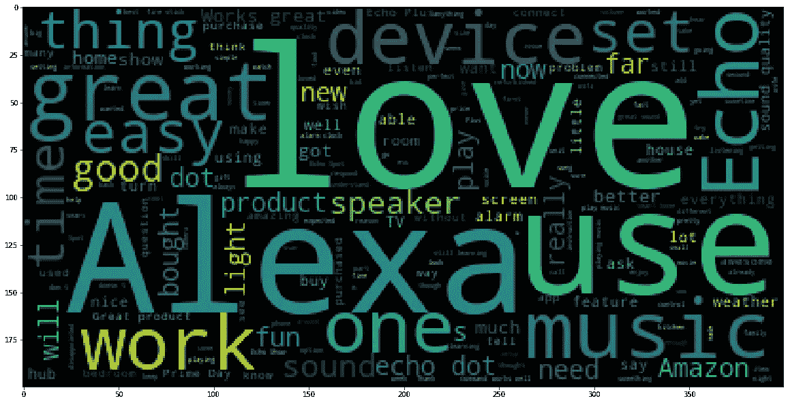
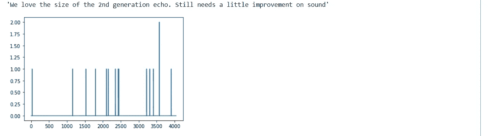
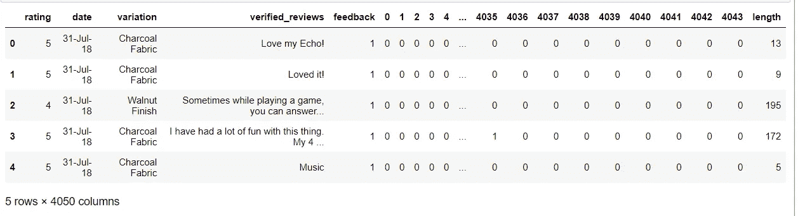
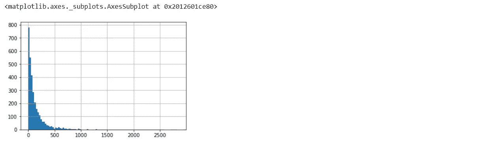
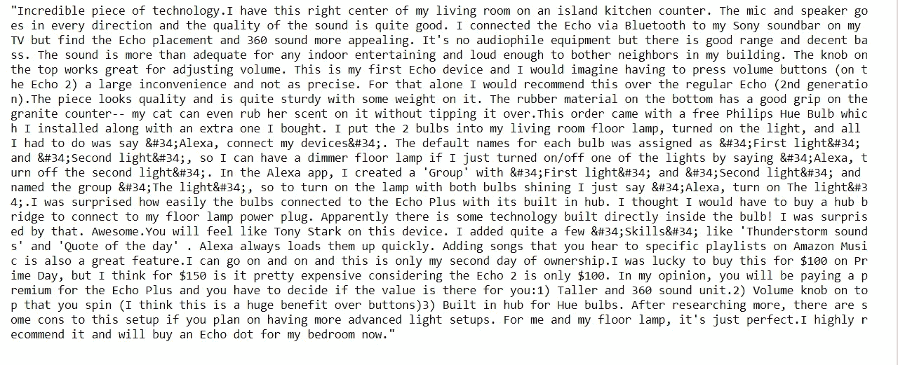

# 分析 Alexa 的评论

> 原文：<https://medium.com/geekculture/analyzing-reviews-of-alexa-80d37a0dd76?source=collection_archive---------14----------------------->


Credit: Unsplash

在这篇博客中，我们将了解如何分析和可视化亚马逊上的 Alexa 产品评论。我已经找到了 Kaggle 的数据集。你可以从[这里](https://www.kaggle.com/sid321axn/amazon-alexa-reviews)下载。

博客的主要目标是，

1.  **导入库**
2.  **使用 Matplotlib 和 Seaborn 可视化评级**
3.  **创建文字云**
4.  **特征工程**

亚马逊 Alexa，也简称为 Alexa，是亚马逊开发的虚拟助理技术，最早用于亚马逊 Echo 智能音箱和亚马逊 Lab126 开发的 Echo Dot、Echo Studio、亚马逊 Tap 音箱。Alexa 的主要竞争对手是 Google Home。

让我们深入数据集。

首先，从 Kaggle 下载数据。它是一个. tsv 文件(用制表符分隔的值)。

我们唯一需要安装的库是 WordCloud，我们用它来形象地理解数据集中出现最多的单词的意义。

要安装 WordCloud 类型，`pip install wordcloud`

该数据集由亚马逊客户评论、星级、评论日期、变体和各种亚马逊 Alexa 产品(如 Alexa Echo、Echo dots)的反馈组成。

我们的主要目标是对数据进行情感分析，并从客户评论中发现见解。

确保将下载的文件`amazon_alexa.tsv`放在您编写项目代码的同一个文件夹下。

## 导入数据

我们将导入必要的库和我们的。tsv 文件到我们的 python 代码中。

我们使用，

> pandas-使用数据框进行数据操作
> 
> numpy-用于数据的统计分析
> 
> matplotlib.pyplot-用于数据可视化
> 
> seaborn-用于高级(统计)数据可视化

```
import pandas as pd 
import numpy as np
import matplotlib.pyplot as plt 
import seaborn as sns
```

> 我们将使用 pandas 加载数据，并打印表中的前五行。您可以使用 df_alexa.tail()打印表中的最后五行。

```
df_alexa = pd.read_csv('amazon_alexa.tsv', sep='\t')
df_alexa.head()
```


> 打印列名

```
df_alexa.keys()**O/P:
Index(['rating', 'date', 'variation', 'verified_reviews', 'feedback'], dtype='object')**
```

> 让我们看看我们的`verified_reviews`专栏，因为我们将对该专栏进行大量分析

```
df_alexa[‘verified_reviews’]**O/P:****0                                           Love my Echo!
1                                               Loved it!
2       Sometimes while playing a game, you can answer...
3       I have had a lot of fun with this thing. My 4 ...
4                                                   Music
                              ...                        
3145    Perfect for kids, adults and everyone in betwe...
3146    Listening to music, searching locations, check...
3147    I do love these things, i have them running my...
3148    Only complaint I have is that the sound qualit...
3149                                                 Good
Name: verified_reviews, Length: 3150, dtype: object**
```

我们已成功导入数据。现在让我们把它们形象化。如果你觉得代码有点多，在每一节的结尾，我会在一个地方写下该节使用的全部代码。如果你清楚代码，你可以跳过它。

**该部分的完整代码(导入数据)**

```
import pandas as pd 
import numpy as np
import matplotlib.pyplot as plt 
import seaborn as snsdf_alexa = pd.read_csv('amazon_alexa.tsv', sep='\t')
df_alexa.head()df_alexa.keys()
df_alexa[‘verified_reviews’]
```

## 可视化数据

在我们的反馈栏中，正面评价编号为“1”，负面评价编号为“0”。

> 仅打印负面评价

```
negative = df_alexa[df_alexa['feedback']==0]
negative
```



> 让我们使用 seaborn 的计数图来绘制正面和负面的评论

`sns.countplot(df_alexa[‘feedback’], label = “Count”)`



> 绘制从 1 到 5 的评级栏

`sns.countplot(x = ‘rating’, data = df_alexa)`



> 我们也可以把它们想象成垃圾箱

`df_alexa[‘rating’].hist(bins = 5)`



> 让我们绘制一个尺寸为(40 * 15)的条形图，x 轴为变量，y 轴为评级

```
plt.figure(figsize = (40,15))
sns.barplot(x = 'variation', y='rating', data=df_alexa, palette = 'deep')
```



**该部分的完整代码(可视化数据)**

```
negative = df_alexa[df_alexa['feedback']==0]sns.countplot(df_alexa[‘feedback’], label = “Count”)sns.countplot(x = ‘rating’, data = df_alexa)df_alexa[‘rating’].hist(bins = 5)plt.figure(figsize = (40,15))
sns.barplot(x = 'variation', y='rating', data=df_alexa, palette = 'deep')
```

## 创建单词云

WordCloud 为字符串中可用的单词创建了一个漂亮的可视化效果。wordcloud 可视化数据的唯一要求是数据应该是字符串格式。

> 让我们创建一个示例 wordcloud。记得用`pip install wordcloud`安装 wordcloud

```
import matplotlib.pyplot as plt
from wordcloud import WordCloudblog_word_cloud = 'Love Machine Learning a lot. This is a Medium blog for Machine and Deep learning'plt.figure(figsize=(20,20))
plt.imshow(WordCloud().generate(blog_word_cloud))
```



> 在将 wordcloud 应用到我们的数据集之前，我们需要将它们转换成一个字符串。

```
words = df_alexa['verified_reviews'].tolist()len(words)**O/P:
3150**
```

输出显示我们的数据集中有 3150 条评论。

> 让我们把单词打印出来

`print(words)`


> 记住，Wordcloud 只能显示字符串，不能显示列表。所以让我们把列表转换成一个字符串

```
string_from_words =" ".join(words)
len(string_from_words)O/P:
419105
```

我们的评论有 419，105 个单词。我们可以用 wordcloud 将它们可视化，以获取任何有用的信息。

```
from wordcloud import WordCloudplt.figure(figsize=(20,20))
plt.imshow(WordCloud().generate(string_from_words))
```


我们已经成功地将我们的评论以 wordcloud 的形式可视化了。很明显,“爱”、“Alexa”、“太棒了”这些词在评论中被大量使用，这很大程度上表明了对 Alexa 的整体共识是积极的。

**该部分的完整代码(创建一个词云)**

```
words = df_alexa['verified_reviews'].tolist()string_from_words =" ".join(words)from wordcloud import WordCloud plt.figure(figsize=(20,20))
plt.imshow(WordCloud().generate(string_from_words))
```

## 特征工程

当我们稍微调整模型时，我们可以从我们的数据中获得更多的见解，例如更多地了解特定的评论或找出最大和最小的评论。为此，我们将使用 sklearn 库。

```
from sklearn.feature_extraction.text import CountVectorizervectorizer = CountVectorizer()
alexa_countvectorizer = vectorizer.fit_transform(df_alexa['verified_reviews'])
```

CountVectorizer 是 Python 中的 scikit-learn 库提供的一个很棒的工具。它用于根据每个单词在整个文本中出现的频率(计数)将给定文本转换为向量。

```
word_count_array = alexa_countvectorizer.toarray()
alexa_countvectorizer.shape**O/P:
(3150, 4044)**
```

输出(3150，4044)表明我们有 3150(评论总数-行)和 4044(计数矢量器-列)

> 让我们打印数组中的第一行

```
word_count_array[0,:] **O/P:
array([0, 0, 0, ..., 0, 0, 0], dtype=int64)**
```

> 我们将把它形象化为了更好地理解它，让我们取一个随机指数= 18，把它形象化。

```
index = 18
plt.plot(word_count_array[index, :])
df_alexa['verified_reviews'][index]
```



该指数(18)上的评论说:“我们喜欢第二代 echo 的尺寸。声音上还需要一点改进。

图表上的竖条表示数据的频繁计数。

> 让我们在数据集中创建一个新列，存储每个评论中每个字符的长度，并将其可视化。

```
df_alexa['length'] = df_alexa['verified_reviews'].apply(len)
df_alexa.head()
```



> 我们的新专栏已经创建。让我们用直方图来形象化每篇评论的长度。

```
df_alexa['length'].hist(bins=100)
```



从上面的可视化，我们可以得出结论，更多的评论是在 500 个字符的范围内，但是，也有一些评论超过 1500 个字符。

> 让我们想象一下最少的评论，

```
min_char = df_alexa['length'].min()
df_alexa[df_alexa['length'] == min_char]['verified_reviews'].iloc[0]**O/P:****'😍'**
```

> 可视化最大字符审查，

```
max_char = df_alexa['length'].max()
df_alexa[df_alexa['length'] == max_char]['verified_reviews'].iloc[0]
```



**该部分的完整代码(特征工程)**

```
from sklearn.feature_extraction.text import CountVectorizervectorizer = CountVectorizer()
alexa_countvectorizer = vectorizer.fit_transform(df_alexa['verified_reviews'])word_count_array = alexa_countvectorizer.toarray()index = 18
plt.plot(word_count_array[index, :])
df_alexa['verified_reviews'][index]df_alexa['length'] = df_alexa['verified_reviews'].apply(len)min_char = df_alexa['length'].min()
df_alexa[df_alexa['length'] == min_char]['verified_reviews'].iloc[0]max_char = df_alexa['length'].max()
df_alexa[df_alexa['length'] == max_char]['verified_reviews'].iloc[0]
```

这些是我们可以用来分析给定数据集的一些方法。

你可以在这里得到完整版本的代码。