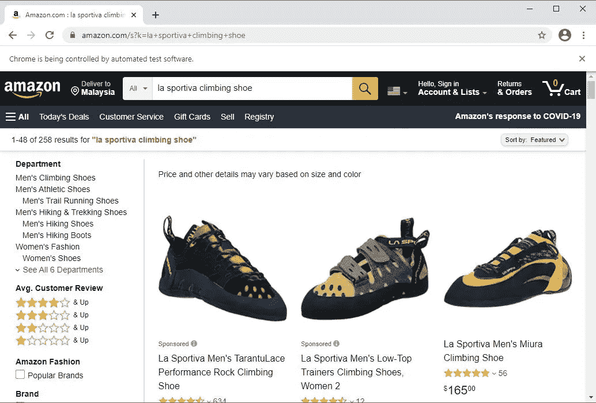
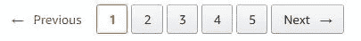
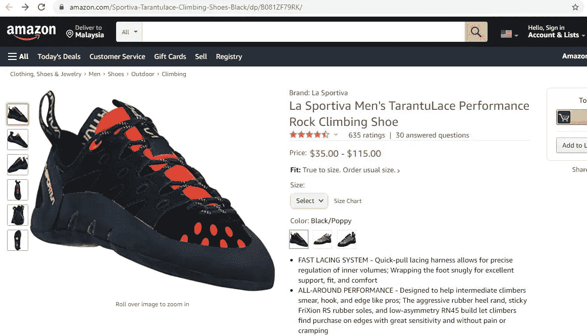
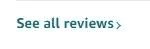
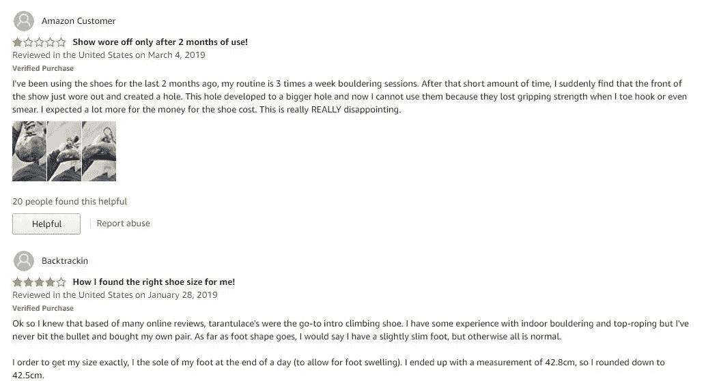
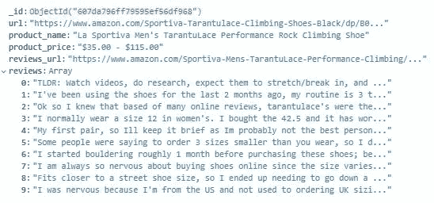
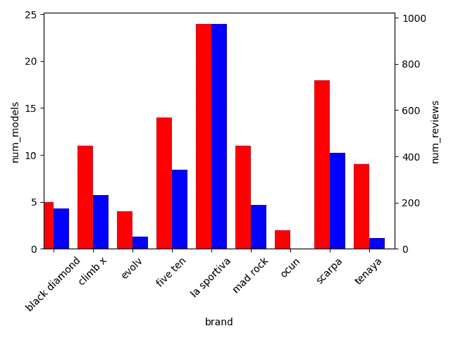
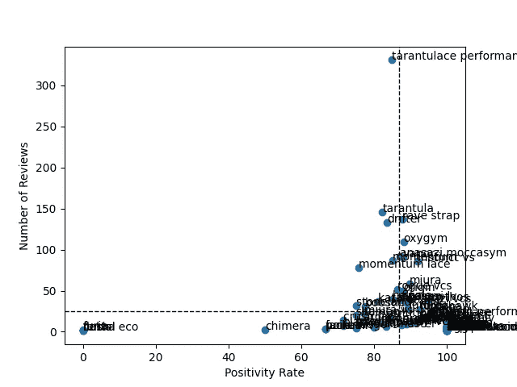
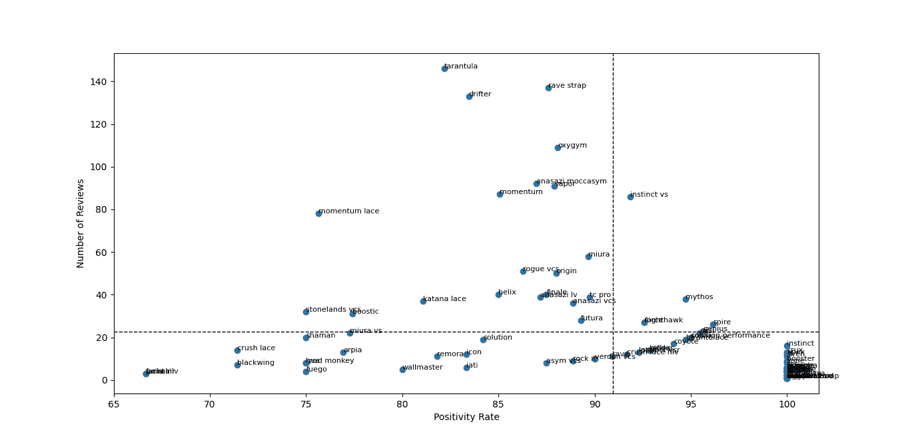

# 如何分析亚马逊评论:Python 中的登山鞋情绪分析

> 原文：<https://medium.com/geekculture/analyzing-rock-climbing-shoe-amazon-reviews-cb3e12c91a67?source=collection_archive---------20----------------------->

## 基于用户评论使用自然语言处理的能力来识别顶级鞋模

完整的代码可以在我的 [GitHub](https://github.com/kokkeanshern/blogpost_rockclimbingnlp) 上找到。


Photo by [Patrick Hendry](https://unsplash.com/@worldsbetweenlines?utm_source=unsplash&utm_medium=referral&utm_content=creditCopyText) on [Unsplash](https://unsplash.com/s/photos/rock-climbing-shoes?utm_source=unsplash&utm_medium=referral&utm_content=creditCopyText)

# **简介**

那些已经熟悉这项运动的人会知道，穿一双完全合脚的攀岩鞋是多么重要。不合脚的鞋子会在很多方面带来灾难。作为一项小众运动，买一双合身的鞋并不像走进商店试穿那样容易。根据一个人居住的国家，出售登山鞋的商店可能少之又少。这就是为什么许多人求助于网上购买。

然而，买一双不是一件容易的事，梳理数百条评论肯定会让我们中最系统的人疲惫不堪。因此，在这篇文章中，我对尽可能多的亚马逊攀岩鞋评论进行了探索性分析。

# 网络搜集数据集:亚马逊评论

为此，我使用 Python 中的 Selenium 库。我将把 web 抓取过程分成多个部分。

## 第 1 部分:获取产品 URL

与大多数 Selenium 任务一样，第一步是初始化 webdriver。在我的例子中，我使用了谷歌 Chrome 网络驱动，你可以在这里下载。下面的代码用于初始化 Chrome webdriver。

```
from selenium import webdriver
driver_path = <path to your chromedriver>
driver = webdriver.Chrome(executable_path=driver_path)
```

接下来，我使用 *get()* 方法访问亚马逊网站。为了避免模拟输入搜索查询和击键，我简单地将搜索查询附加到基本 URL 上。用户搜索产生的网页(结果页面)具有以下格式:[*https://www.amazon.com/s?k=*](https://www.amazon.com/s?k=)*<您的查询在此>。*

运行以下代码会打开搜索查询“la sportiva 攀岩鞋”的亚马逊结果页面。

```
base_url = 'https://www.amazon.com/'
query = 'la sportiva climbing shoe'
query_url = base_url+'s?k='+query
driver.get(query_url)
```



Screenshot of Amazon’s results page

下一步是将页面上的所有 URL 抓取并写入一个文件，然后转到下一页结果。如此重复，直到最后的结果页面。我为这个过程创建了几个实用函数。

这个函数将一个字符串写入一个文件。参数“a”指定创建新文件(如果尚未创建)或写入现有文件。

```
def write_to_file(filename,content):
      f = open(filename, "a")
      f.write(content+'\n')
      f.close()
```

这个函数抓取当前页面上的所有 URL。然后，如果 URL 中包含单词“climbing”和“shoe ”,它会将 URL 写入文件 *links.txt* (使用 write_to_file 实用程序函数)。添加了一个附加条件来只计算字符串( *type(link) == str* )，以避免 Python NoneType 错误，这是由 Selenium 拾取 NoneType 对象引起的。

```
def get_all_urls():
        # identify elements with tagname <a>
        links = driver.find_elements_by_tag_name("a")
        # traverse list
        for link in links:
            # get_attribute() to get all href
            link = link.get_attribute('href')
            if (type(link) == str) and ('climbing' in link) and ('shoe' in link):
                write_to_file('links.txt',link)
```

综合所有这些，我们从评估结果页面的数量开始。在 [DOM 树](https://www.google.com/search?q=dom+tree&rlz=1C1CHBF_enMY839MY839&oq=DOM+tree&aqs=chrome.0.0l2j0i20i263j0l3j0i20i263j0l3.1738j0j7&sourceid=chrome&ie=UTF-8)中，数字由类“a-normal”表示。我使用*find _ elements _ by _ class _ name*方法获得所有数字(在本例中是 1 到 5)，然后将最后一个数字赋给变量 *last_page* ( *)。text* 提取实际的文本值，并将其转换为 int 变量)。



Amazon’s page navigation buttons

```
pages = driver.find_elements_by_class_name("a-normal")
last_page = int(pages[-1].text)
```

将前面两行放入一个函数中，我通过遍历结果页面来抓取 URL。亚马逊的每个递增页码的 URL 结构是与搜索查询和页码连接的基本 URL，如下所示:[*https://www.amazon.com/s?k={query}&page = { page*](https://www.amazon.com/s?k={query}&page={page)*number }*。添加了一个异常处理程序，以防结果只有一页(页将评估为空列表)。其他顶级攀岩鞋品牌 *Ocun* 、 *Five Ten* 、 *Tenaya* 、*黑钻*、 *Scarpa* 、 *Mad Rock* 、 *Evolv* 和 *Climb X* 也重复了这一过程。

```
def iterate_pages():
      pages = driver.find_elements_by_class_name("a-normal")
          try:
              last_page = int(pages[-1].text)
              # base_url would evaluate to ...amazon.com/s?k=<query>
              base_url = driver.current_url
              for page in range(2,last_page+1):
                  get_all_urls()
                  driver.get(base_url+'&page='+str(page))
          except IndexError:
              get_all_urls()
```

第一次抓取产生了 2655 个 URL。然而，需要额外的清理来过滤掉不需要的 URL。检查以下不需要的 URL 示例:

```
https://www.amazon.com/gp/slredirect/picassoRedirect.html/ref=pa_sp_mtf_aps_sr_pg1_1?ie=UTF8&adId=A0187488H7LAC5K25U1L&url=%2FTenaya-Oasi-Climbing-Shoe-Womens%2Fdp%2FB00G2G1U5U%2Fref%3Dsr_1_14_sspa%3Fdchild%3D1%26keywords%3Dtenaya%2Bclimbing%2Bshoe%26qid%3D1618629457%26sr%3D8-14-spons%26psc%3D1&qualifier=1618629457&id=3206048678566111&widgetName=sp_mtf
https://www.amazon.com/s?k=five+ten+climbing+shoe#
https://www.amazon.com/s?k=mad+rock+climbing+shoe#s-skipLinkTargetForFilterOptions
https://www.amazon.com/s?k=mad+rock+climbing+shoe#s-skipLinkTargetForMainSearchResults
https://aax-us-east.amazon-adsystem.com/x/c/QmbTjAA2xKm5MsGgE8COatYAAAF43dZjkQEAAAH2AQqX8gE/https://www.amazon.com/stores/page/5F070E5E-577B-4B70-956A-02731ECF176A?store_ref=SB_A0421652LWRFVMVX8W4I&pd_rd_w=fsNZy&pf_rd_p=eec71719-2cb3-403b-a8de-e6266852cdb6&pd_rd_wg=uFHFp&pf_rd_r=5E5ZWZNV7GCVDNKR9EC7&pd_rd_r=a8ad5a25-3cd0-4a36-a529-3000b5271936&aaxitk=4VreBt7wvxz.JYuyg-2dbQ&hsa_cr_id=7601608740401&lp_asins=B07BJZTWGR,B07BKRBH7B,B07FQ5CYTK&lp_query=mad%20rock%20climbing%20shoe&lp_slot=desktop-hsa-3psl&ref_=sbx_be_s_3psl_mbd
```

第一个 URL 实际上是一个链接到类似产品的广告(这些是指在结果页面上有*赞助商*标签的产品)。第二、第三和第四个 URL 指向结果页面，而不是单个产品的页面。最后一个网址也是广告网址。

现在让我们将它与**指向特定产品页面的 URL 进行比较。**

```
https://www.amazon.com/Mad-Rock-Lotus-Climbing-Shoes/dp/B00L8BT7P4/ref=sr_1_15?dchild=1&keywords=mad%2Brock%2Bclimbing%2Bshoe&qid=1618629518&sr=8-15&th=1
https://www.amazon.com/SCARPA-Instinct-SR-Climbing-Shoe/dp/B07PW8ZLHN/ref=sr_1_93?dchild=1&keywords=scarpa+climbing+shoe&qid=1618629505&sr=8-93
https://www.amazon.com/Climb-Apex-Climbing-Shoe-Yellow/dp/B07MQ79LNZ/ref=sr_1_9?dchild=1&keywords=climb+x+climbing+shoe&qid=1618629539&sr=8-9
```

第一个观察是干净的 URL 不包含 *slredirect* 或【picassoRedirect.html】T2。接下来，如果我们分解干净 URL 的结构，可以看到 URL 的前两部分是基本 URL，后面是产品名称。这与那些有查询能指的“脏”URL 形成了对比， *s？k=* ，就在基本 URL 之后。另一个观察结果是，产品 URL 以[*【https://www.amazon.com/】*](https://www.amazon.com/)开头，这与脏 URL 的最后一个示例形成对比，后者不包含该字符串作为其基本 URL。因此，使用 [regex](https://en.wikipedia.org/wiki/Regular_expression) 实现了一些简单的数据清理来过滤掉这些脏 URL。

```
# Remove sponsored product URLs.
re.search('slredirect',line.strip("\n")):
# Remove results page URLs.
re.search('s?k=',line.strip("\n")):
# Remove URLs that do not start with base URL.
line.strip("\n").startswith("https://www.amazon.com"):
# Remove URLs with gp or ap following its base URL.
re.search('https://www.amazon.com/gp/',line.strip("\n")):
re.search('https://www.amazon.com/ap/',line.strip("\n")):
```

除此之外，还有许多 URL 指向同一个产品页面(尽管它们的 URL 不是 100%相同)。例如:

```
https://www.amazon.com/Sportiva-Ultra-Raptor-Running-Yellow/dp/B008I6J7YS/ref=sr_1_46?dchild=1&keywords=la+sportiva+climbing+shoe&qid=1618629379&sr=8-46#customerReviews
https://www.amazon.com/Sportiva-Ultra-Raptor-Running-Yellow/dp/B008I6J7YS/ref=sr_1_46?dchild=1&keywords=la+sportiva+climbing+shoe&qid=1618629379&sr=8-46
```

这篇[博文](https://www.joehxblog.com/amazon-url-anatomy-dissection/)分解了亚马逊的 URL 结构。总之，在 URL 中只有“/dp/”部分和 ASIN (Amazon 标准识别号)部分是重要的。因此，我删除了“ref=”部分的所有内容。最后一步是删除指向本项目未考虑的品牌的 URL。数据清理的结果产生了 425 个干净的、唯一的和相关的 URL。

# 第 2 部分:搜集产品信息

刮擦的流程如下:

进入产品页面(刮产品标题，产品价格)。



Example of Amazon’s product page

点击“查看所有评论”按钮。这将打开一个新的链接。



Amazon’s “See all reviews” button

刮所有评论。



Amazon reviews displayed after clicking the “See all reviews” button

然而，探索链接流揭示了潜在的重复问题。就拿下面两个 ASINs 不同的 URL 来说吧。

```
https://www.amazon.com/Sportiva-Tarantulace-Climbing-Shoes-Black/dp/B081ZF79RK/
https://www.amazon.com/Sportiva-Tarantulace-Climbing-Shoes-Black/dp/B081XVFMZ5/
```

根据产品名称，显示这些链接指的是相同的产品。他们各自的评论页面有相同的链接。

```
https://www.amazon.com/Sportiva-Mens-TarantuLace-Performance-Climbing/product-reviews/B07BCK9CWR/ref=cm_cr_dp_d_show_all_btm?ie=UTF8&reviewerType=all_reviews
https://www.amazon.com/Sportiva-Mens-TarantuLace-Performance-Climbing/product-reviews/B07BCK9CWR/ref=cm_cr_dp_d_show_all_btm?ie=UTF8&reviewerType=all_reviews
```

考虑到这一点，我决定如果两个或更多的产品链接延伸到同一个评论页面，那么只需要从其中一个产品链接中抓取评论。下面显示了几个代码片段:

```
# Scrapes the product name.
prod_name = driver.find_element(By.ID, 'productTitle').text
# Scrapes product price.
prod_price = driver.find_element(By.ID,'priceblock_ourprice').text
# Click translate reviews button.
translate_button = driver.find_element(By.XPATH,'/html/body/div[1]/div[3]/div/div[1]/div/div[1]/div[5]/div[3]/div/div[1]/span/a')
translate_button.click()
# Scrape all reviews on the current page.
reviews = driver.find_elements(By.XPATH,'//span[@data-hook="review-body"]')
for review in reviews:
    product_reviews.append(review.text)
```

生成的数据集具有以下结构:



Document structure as shown in the MongoDB console

# 数据清理和预处理

第一步是衍生两个新的领域，品牌和模式。品牌很容易从产品名称中提取出来。然而，提取模型被证明是一项棘手的任务。首先，我通过对 15 个文档进行采样并分析产品名称的组成，确定了产品名称的一般组成部分。我使用 MongoDB 查询语言(MQL)来实现这一点。

```
db.products.aggregate(
      [{$match:{"reviews_url":{$ne:null}}},
      { $sample: { size: 15 } },
      {$project:{"_id":0,"product_name":1}}]
      )
```

这提供了如下所示的子集(截断的输出):

```
{ "product_name" : "La Sportiva Otaki, Women's Climbing Shoes" }
{ "product_name" : "La Sportiva TX2 Women's Approach Shoe" }
{ "product_name" : "Five Ten Men's Coyote Climbing Shoe" }
{ "product_name" : "La Sportiva TX4 MID GTX Hiking Shoe - Men's" }
{ "product_name" : "Five Ten Men's Stonelands VCS Climbing Shoe" }
{ "product_name" : "Scarpa Women's Gecko WMN Approach Shoe" }
```

我重新抽取了另外 30 个产品名称进行调查，并确定了一个产品名称的以下组成部分:品牌、鞋型、型号、性别、年龄组、颜色、年份和尺码。此外，产品名称是这些成分中的一个或多个的组合。我还注意到一些徒步旅行、登山和休闲鞋设法通过了过滤器，所以用关键词搜索把它们删除了。

尽管我尽了最大努力，仍然需要对产品模型进行额外的清理。十二个文档在模型字段中有空值，所以我手工填充了它们。我还检查了模型列表，以手动验证模型名称的准确性。

在创建了派生变量之后，是时候清理评审了。以下是 3 篇评论的随机样本。

```
"I have narrow feet, but couldn't get my feet in these shoes.\nI prefer to wear comfortable climbing shoes, not meaning beginner shoes (though I'm a beginner).\nI asked around and talked with those die-hard climbers, they suggested me wear shoes that I fee comfortable with.\nI strongly agree.\nHow can you climb with shoes that hurt your feet? Not to speak of focusing on it.""I just started climbing regularly and these are great. Good grip.""Great shoes! They have good flexibility."
```

我使用 Python 中的 [NLTK](https://www.nltk.org/) 库进行文本清理和预处理。因为我的意图是使用 [VADER](https://github.com/cjhutto/vaderSentiment) 对亚马逊评论进行情感分析，所以我必须根据算法定制我的数据清理任务。[这篇文章](/analytics-vidhya/simplifying-social-media-sentiment-analysis-using-vader-in-python-f9e6ec6fc52f)很好地解释了 VADER 如何分析情绪。简而言之，VADER 通过以下方式分析情绪:

1.  标点符号。
2.  资本化。
3.  程度修饰符。
4.  连词。
5.  颠覆情感的话语。

除此之外，VADER 还可以处理表情符号、表情符号和常用俚语。因此，我进行了标记化、停用词删除和一般清理(删除文本中嵌入的“\n”)。我没有进行去大写和删除标点符号。下面是一个停用词被删除的评论的例子。可以定性地观察到，评论背后的意义仍然保留着。

```
Great aggressive shoe. I have a wider foot and these fit me great. The laces really allow me to tune the fit. I downsized a half size from my gym shoe size. Initially pretty uncomfortable, but a shower and a few climbing sessions and they fit just right.Great aggressive shoe . I wider foot fit great . The laces really allow tune fit . I downsized half size gym shoe size . Initially pretty uncomfortable , shower climbing sessions fit right .
```

此外，我希望每个文档代表一个品牌的一个型号。在关系数据库中，字段 *brand* 和 *model* 可以作为一个组合键。删除重复文档的代码可以在上面的 GitHub 资源库链接中找到。

为了将评论转化为可衡量的东西，我用 VADER 进行了情感分析。关于其实现的简明教程可以在[这里](https://www.geeksforgeeks.org/python-sentiment-analysis-using-vader/)找到。我的代码实现是这样的:

```
def get_sentiment_score(review):
    # Create a SentimentIntensityAnalyzer object.
    sid_obj = SentimentIntensityAnalyzer()

    # polarity_scores method of SentimentIntensityAnalyzer
    # oject gives a sentiment dictionary.
    # which contains pos, neg, neu, and compound scores.
    sentiment_dict = sid_obj.polarity_scores(review)

    print("sentence was rated as ", sentiment_dict['neg']*100, "% Negative")
    print("sentence was rated as ", sentiment_dict['neu']*100, "% Neutral")
    print("sentence was rated as ", sentiment_dict['pos']*100, "% Positive")
    print("sentence has a compound score of ", sentiment_dict['compound'])

    # decide sentiment as positive, negative and neutral
    if sentiment_dict['compound'] >= 0.05 :
        print("Sentence Overall Rated As Positive")

    elif sentiment_dict['compound'] <= - 0.05 :
        print("Sentence Overall Rated As Negative")

    else :
        print("Sentence Overall Rated As Neutral")
```

以下是两个输出示例:

```
"This shoe holds much better older Akashas . The fit requires size one euro size normal LS shoes . The cushion great long days rough terrain"
sentence was rated as  0.0 % Negative
sentence was rated as  70.8 % Neutral
sentence was rated as  29.2 % Positive
sentence has a compound score of  0.8591
Sentence Overall Rated As Positive"Get size bigger shoe sizes run small ."
sentence was rated as  0.0 % Negative
sentence was rated as  100.0 % Neutral
sentence was rated as  0.0 % Positive
sentence has a compound score of  0.0
Sentence Overall Rated As Neutral
```

如图所示，VADER 将一个句子的情感分为三部分:消极、积极和中性。这些分数加起来是 1，或者 100%。除此之外，该算法还产生一个“复合分数”，它是这三个分数的总和，范围从-1(完全为负)到 1(完全为正)。为了将评论分为负面/中性/正面，我使用了复合得分的典型阈值，即如果大于或等于 0.05，则为正面；如果小于或等于-0.05，则为负面；如果在-0.05 到 0.05 之间，则为中性。

从例子中可以看出，VADER 在衡量情绪方面做得相当不错。第一个例子清楚地表明，评论者使用该鞋进行户外攀登有积极的体验(“漫长的一天”，“崎岖的地形”暗示了这一点)。VADER 成功地对情感进行了分类。第二个例子也相当鼓舞人心。如果我要对这篇评论进行定性评估，我也会将其归类为中立，因为它只是一个建议，实际上并没有传达任何情绪。

# 分析和见解

# 第 1 部分:哪些是评论最多的品牌？

我自己作为电商行业的消费者，我进行购买的一个影响因素就是一个产品或者一个品牌在平台上的评论数。以下是每个品牌评论数量的细分。然而，数据集中的每个品牌都有不同数量的模型，这可能会影响评论的数量。因此，我通过创建一个双轴条形图，将每个品牌的模特数量和评论数量考虑在内。红条代表每个品牌的车型数量，蓝条显示每个品牌的点评数量。



Bar chart comparing number of models Vs number of reviews per model

如上图所示，我们现在可以调查哪些品牌相对于其销售的型号数量拥有良好的评论水平。La Sportiva 和 *Scarpa* 的评论数量最多，但这些品牌也销售了最多的车型。相比之下， *Climb X* 和 *Mad Rock* 的销量大致相同，但据观察 *Climb X* 是更受关注的品牌。此外， *Tenaya* 相对于其售出的车型数量而言，评价很少。*黑钻*、 *Evolv* 和 *Ocun* 有五个或更少的型号，但*黑钻*在评论数量方面远远超过其他两个品牌。

# 第二部分:哪些型号获得了最好的评价？

知道哪种型号评论最好不足以说服我购买。理想情况下，我不仅想知道哪些模特有最好的评价，还想知道哪些模特有最好的评价**和最多的评价**。为了这个分析，我画了一个散点图，分成四个象限。垂直线左边的每个模型都有低于平均水平的阳性率，反之亦然。水平线以下的每个模型都有低于平均水平的评论数，反之亦然。每个模型的阳性率计算为阳性分类数(VADER)除以综述数乘以 100。



Scatter plot comparing number of reviews against positivity rate per brand

如上图所示，平均阳性率约为 85，而平均评论数约为 25。可以观察到一些异常值，例如*的《狼蛛表演》*,其评论数量明显高于其他作品，以及*的《生态》*,其正面评价率较低。为了更仔细地分析模型，我删除了阳性率小于 50 且评论数量超过 300 的数据点(*即*模型)。



Scatter plot comparing number of reviews against positivity rate per brand (outliers removed)

现在我们可以更好地观察整体意见更好的车型。象限 1(右上框)显示阳性率和评论数高于平均水平的模型。这几款整体舆论最好。象限 2(左上方框)显示了已经过良好评审但低于平均阳性率的模型。象限 3(左下角的方框)显示了阳性率和评论数量最差的模型，而象限 4(右下角的方框)显示了许多阳性率高于平均水平但评论数量低于平均水平的模型。

对于想要在购买前快速了解哪些型号需要研究的人，我建议进一步研究象限 1 中的型号。

# 结论

在这篇文章中，我展示了一些关键的技能，比如网页抓取、数据清理、探索性数据分析和情感分析。我已经根据亚马逊的评论确定了一组值得进一步研究的攀岩鞋模型。这个框架可以推广到其他亚马逊产品，只需对代码做一些调整。

1.  [结论](https://kokkeanshern.github.io/2021/03/15/RockClimbingNLP.html#conclusion)