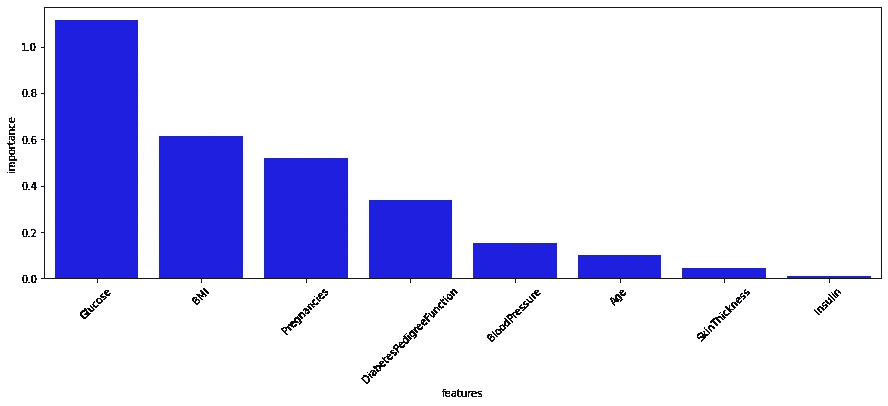
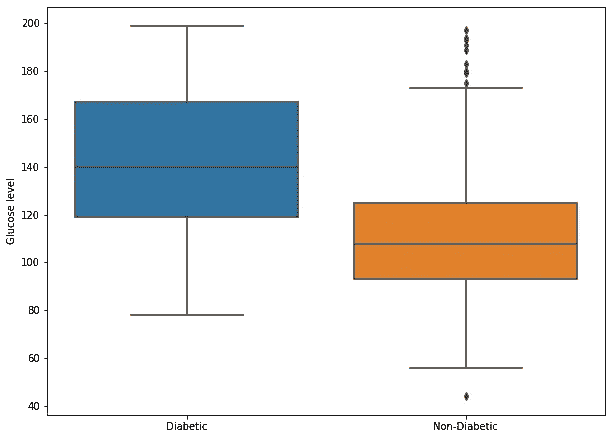
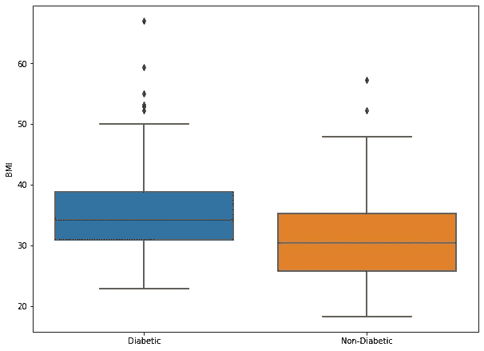
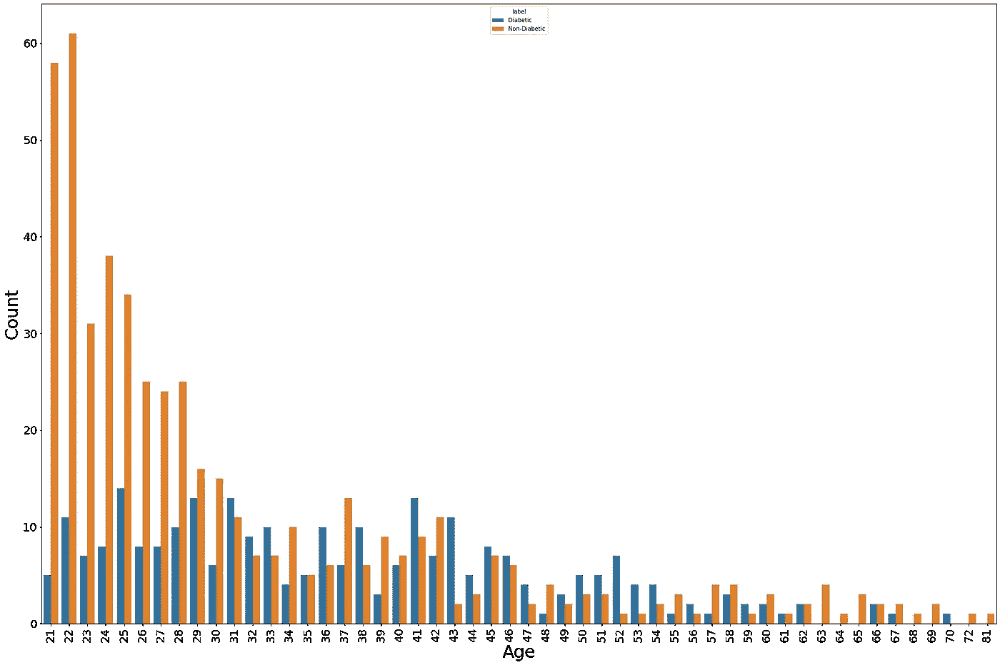
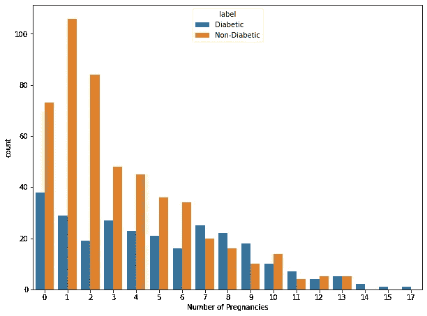

# 利用数据科学分析患糖尿病的风险

> 原文：<https://medium.com/geekculture/analyzing-the-risk-of-becoming-diabetic-using-data-science-3424e24c5ef8?source=collection_archive---------26----------------------->

image source — [here](https://mobisoftinfotech.com/resources/blog/data-science-in-healthcare-use-cases/)

我总是想知道，如果给定关于我们生活方式的信息，是否有人可以预言我们最终可能会处于的健康状况。如果有人能预测我在几年内可能会有糖尿病，我可能会去健身房，有意识地饮食，并很快改善我的习惯。

事实证明我们可以！鉴于我们生活在大数据的世界中，我们可以使用各种特征来预测患糖尿病的风险。

我在 UCI 上传的 Kaggle( [链接](https://www.kaggle.com/uciml/pima-indians-diabetes-database))里发现了一个很精彩的数据。它记录了糖尿病和非糖尿病患者的代谢状态(如葡萄糖水平、身体质量指数)。

利用这些数据，我找到了以下问题的答案，这些问题在我的脑海里已经存在了很久。

> 1.血糖水平高的人更容易患糖尿病吗？
> 
> 2.人们普遍认为超重的人患糖尿病的风险很高。是真的吗？
> 
> 3.老年人更容易患糖尿病吗？
> 
> 4.糖尿病一般会遗传吗？
> 
> 5.怀孕次数会增加患糖尿病的风险吗？

在这篇文章中，让我们试着回答这些问题。

# 概观

我计算了几个可以解释一个人患糖尿病风险的特征的重要性。生成的图像如下所示。

Feature Importance

正如我们所见，血糖水平、身体质量指数(身体质量指数)、怀孕次数等因素对糖尿病风险有很大影响。糖尿病糖尿病功能是一种测量方法，它告诉我们在给定遗传因素的情况下，我们患糖尿病的可能性有多大。糖尿病越严重，风险就越大。

# 1.血糖水平高的人更容易患糖尿病吗？

从数据中我们发现，

> 糖尿病患者的平均葡萄糖水平- 142.16
> 
> 非糖尿病患者的平均葡萄糖水平- 110.71

因此，很明显，血糖水平高的人更容易患糖尿病。

# 2.人们普遍认为超重的人患糖尿病的风险很高。是真的吗？

由于身体质量指数直接翻译为超重/肥胖，它可以回答我们的问题。

> 糖尿病患者的平均身体质量指数- 35.38
> 
> 非糖尿病患者的平均身体质量指数为 30.88

所以总的观点是正确的。数据表明，身体质量指数高的人(换句话说，超重的人)患糖尿病的风险很高。

# 3.老年人更容易患糖尿病吗？

我们可以从数据中推断，随着年龄的增长，我们更容易患糖尿病。

# 4.糖尿病一般会遗传吗？

如前所述，糖尿病糖尿病功能是一种测量方法，它告诉我们在给定遗传因素的情况下，我们患糖尿病的可能性有多大。糖尿病越严重，风险就越大。

> 糖尿病患者的平均糖尿病指标值- 0.55
> 
> 非糖尿病患者的平均糖尿病指标值- 0.43

由于糖尿病直接转化为遗传属性，我们可以推断，如果一个人有糖尿病遗传史，他比没有糖尿病的人更容易患糖尿病。

# 5.怀孕次数会增加患糖尿病的风险吗？

我们可以从数据中推断，随着患者怀孕次数的增加，患糖尿病的风险也会增加。

# 结论

在本文中，我们分析了糖尿病数据集，并检查了可以解释患糖尿病风险的各种特征。以下是我们所做的总结。

1.  从 Kaggle 收集糖尿病数据。
2.  训练机器学习模型以生成特征重要性
3.  收集关于血糖水平、身体质量指数、年龄、糖尿病、糖尿病功能、怀孕次数等如何影响糖尿病风险的统计数据
4.  绘制所需的图表，以分析上述特征如何影响患糖尿病的风险。

有了更多的数据、更多的特征和复杂的算法，我们可以更准确地模拟患糖尿病的风险。

感谢您的阅读。开始工作，有意识地饮食，降低患糖尿病的可能性。:)

所有的代码库都可以在这里找到链接- [GitHub 链接](https://github.com/msmkarthik/Udacity-Data-Scientist-Nanodegree/tree/main/Diabetes_Classification)