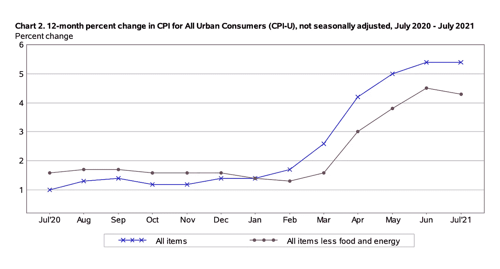
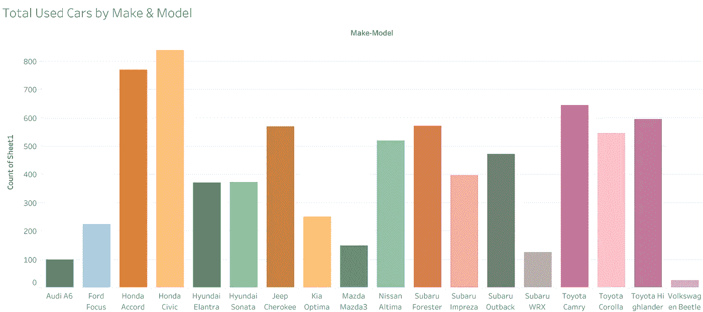
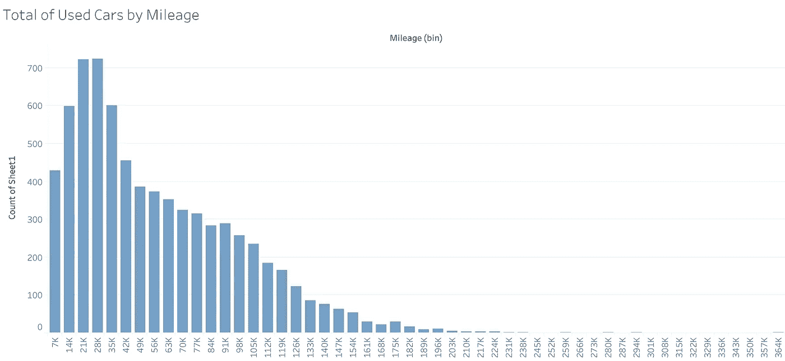
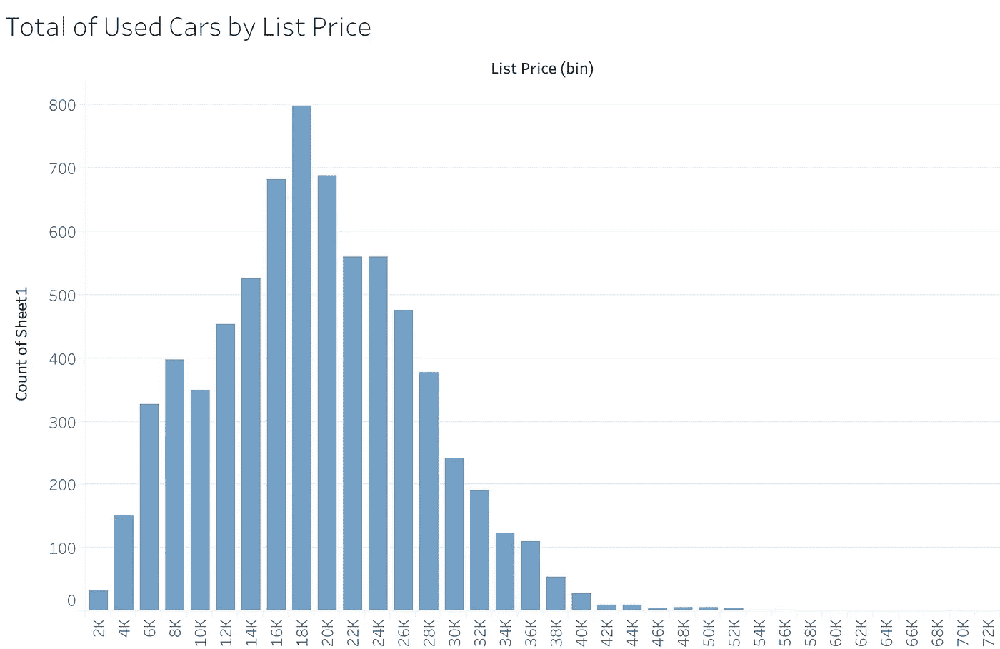
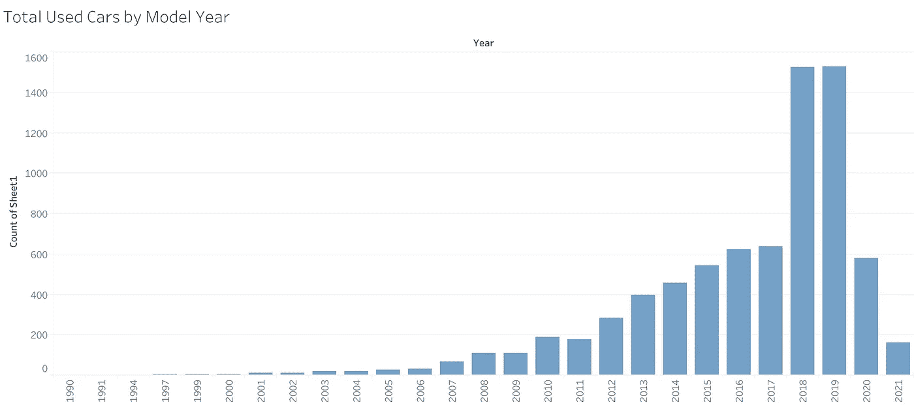
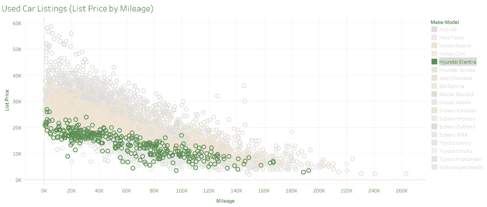
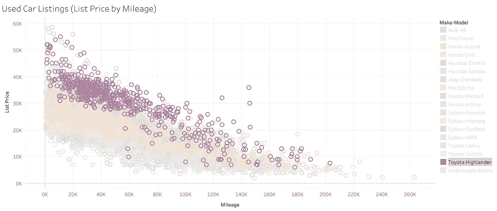
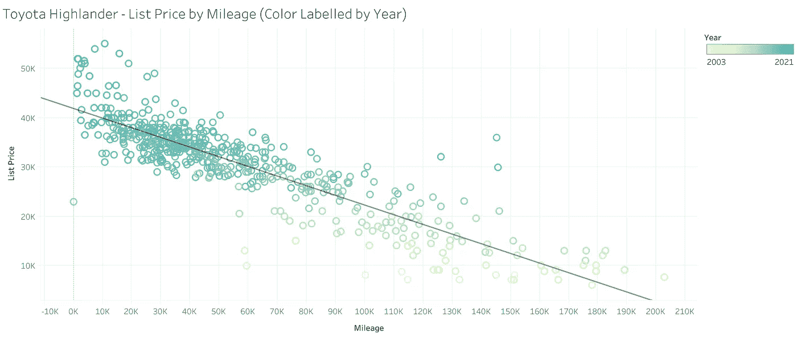
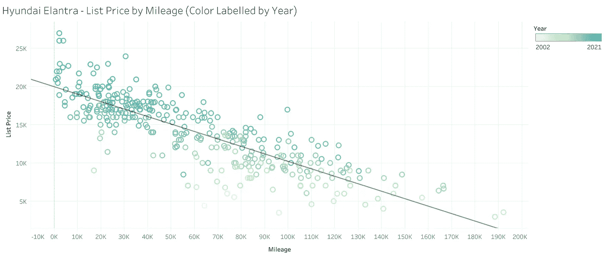
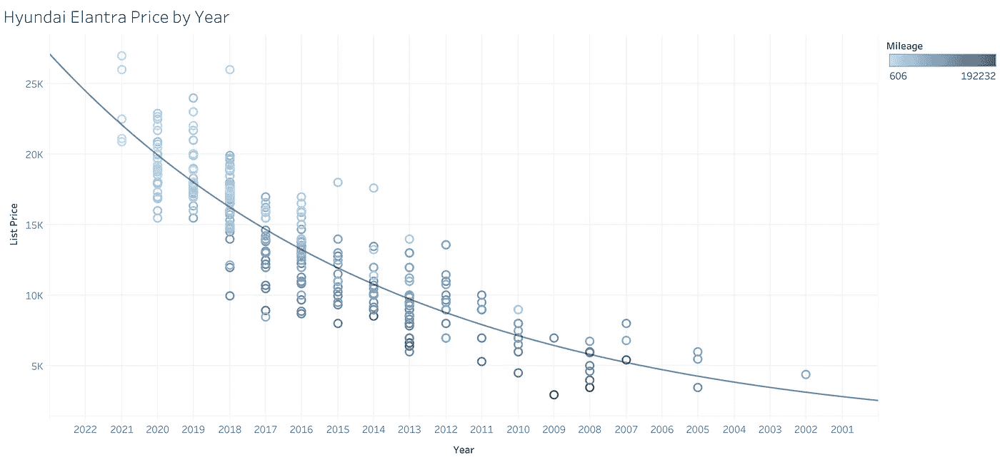

# 2021 年二手车市场分析

> 原文：<https://medium.com/geekculture/analyzing-the-used-car-market-in-2021-27fd460a9067?source=collection_archive---------11----------------------->

## 使用 Python 脚本和网络抓取实现购物流程自动化


Photo by [Chris Haws](https://unsplash.com/@therook?utm_source=medium&utm_medium=referral) on [Unsplash](https://unsplash.com?utm_source=medium&utm_medium=referral)

近几个月来，消费品价格已经全面见顶，这已经不是什么秘密了。从原材料到[房地产](https://i.redd.it/h29xxdj6rde71.png)的一切都在 2021 年经历了大规模的价格上涨。二手车也不例外。消费者没有其他选择，只能以这些过高的价格购买，或者推迟购买，并冒着承受更大损失的风险。我自己想买一辆新的二手车(我知道这有点矛盾)，并决定通过自动搜索和利用数据来通知购买过程。



from [BLS](https://www.bls.gov/news.release/pdf/cpi.pdf)

*作为免责声明，本文用于教育目的，并不意味着对网络抓取或未经授权的数据收集的认可。*

# 入门指南

如果你想买一辆二手车，但对它们没有太多的了解，这篇文章是为你准备的——尤其是如果你喜欢用数据为你的决定提供信息的话。

为了快速获得大量准确的二手车数据，我们可以使用 Python 中的一个简单的 web scraper 从 CarFax.com 获取列表，并将它们转储到 excel 文件中。scraper 的主要目标是快速收集有组织的数据，然后我们可以分析这些数据，以找到对当地二手车市场的关键见解。然后，我们可以利用这些信息更快、更有效地购买汽车，选择特定的汽车进行进一步研究。

幸运的是，来自 CarFax 的数据是用 JSON 构建的，这意味着访问数据相对容易，数据本身也是干净的。这里可以找到刮刀的[回购。要复制回购，只需:](https://github.com/grsahagian/carfax-scraper)

```
$ git clone [https://github.com/grsahagian/carfax-scraper](https://github.com/grsahagian/carfax-scraper)
```

按照自述文件中的说明，让刮刀在您的系统上运行。*您可能需要更换一些标题，因为 scraper 仅设置用于 Mac OS 上的 Google Chrome。*

# 可视化数据

有趣的部分来了。现在，我们可视化我们的数据，看看有什么趋势突出，看看我们可能需要进一步深入，并最终得出一些关于当地汽车市场的结论。

首先，用各种直方图可视化数据集的分布。下图显示了我们的 7168 二手车按品牌和型号、里程、标价和年款的分布情况。我主要关心车型的里程和年份如何影响标价。除了汽车品牌和型号，这两个因素是二手车的主要价值驱动因素。

请记住，所有数据和后续趋势都是从 Carfax.com 收集的；从其他来源可以发现价格和趋势的显著差异。



这里没有太多惊喜。该地区有很多本田和丰田轿车(这是我选择这些车型的部分原因)。



就里程而言，配送中心在 21，000 至 28，000 英里范围内，长尾在大约 346，000 英里处结束。我很惊讶有人会列出一辆行驶里程> 30 万英里的汽车；不确定一辆车还能行驶多久。



这个柱状图很有趣，因为在 8，000 美元(到 10，000 美元)处有一个峰值，然后在 10，000 美元(到 12，000 美元)处有一个谷值。分布以 18，000 美元箱为中心，也是正偏斜。



Figure 4

与前几年相比，2018 年和 2019 年的汽车数量有显著增加(每辆汽车的上市数量都是下一个最高年份的两倍以上)。这一次，分布显示了一个负偏差，由于资产出售贬值的性质，我们可以在没有可视化的情况下获得这个偏差。对 2017 年至 2018 年可用汽车急剧变化的一个可能的解释是，从新冠肺炎全球疫情开始，二手车市场需求增加。随着人们开始隔离、外出、购买商品而不是去度假，对消费品的需求激增。如果没有这个外部因素，分布可能会看起来更平滑。

下面是里程和标价之间的关系，图中挑选了两种特定的汽车品牌和型号(图 X 和 Y)。图中的每个点都是二手车列表；点击一个点，显示汽车的品牌、型号、里程、年份，以及 CarFax 上的列表链接。



我们可以选择删除数据集的其余部分，只查看每个特定汽车品牌和型号的数据，但是，我认为保留其余部分可以让我们更好地了解每个数据子集(汽车品牌和型号)与整个市场的关系。



## 分析继续进行:

我注意到给定里程的价格有很大的偏差。这种差异可能是由于在线列表以外的一些因素造成的，但有趣的是，无论里程数多少，老款车都比新款车便宜。

为了证实(或否认)我的假设，我采用了相同的里程价格图，并用颜色渐变按年份标记每个列表——旧型号较亮，新型号较暗。为了了解趋势，我每次只选择一个汽车品牌和型号进行展示。下面是丰田汉兰达和现代伊兰特的图表。

## 丰田汉兰达



这种关系似乎是线性的，所以我用一条线性回归线来拟合图表，以更清楚地显示增加的里程如何影响汽车的标价。下面是上面那条线的方程式。R 平方和 P 值告诉我们，自变量(里程)和因变量(标价)之间存在相对显著的关系。正如我所讨论的，一些差异可以归因于汽车制造的年份。

```
Y = -0.196X + 41866
# R-Squared: 0.771
# P-Value < 0.0001
```

一旦丰田汉兰达被脱手并转售，它的价值就接近 42，000 美元；每行驶 10，000 英里，汽车的价值就会下降到不到 2000 美元(根据大约 2021 年 9 月的 Carfax 列表)。

## 现代伊兰特



现代伊兰特的线性回归方程:

```
Y = -0.098X + 19974
# R-Squared: 0.703
# P-Value < 0.0001
```

当一辆现代伊兰特是新买的再卖的时候，它的起价在 20，000 美元左右；它的价值每行驶 10，000 英里减少 980 美元。

伊兰特的降价幅度几乎是汉兰达的一半，这是一个相当大的优势。

> 表明隐含折旧的回归斜率系数有助于评估汽车模型的整体可靠性和寿命。

我从数据中获得的另一个有趣的信息是年份和价格之间的关系。虽然里程和价格之间的关系似乎是线性的，但年份和价格之间的关系似乎是指数关系(见下图)。



换句话说，一辆汽车在发布后立即经历了最大程度的贬值，随后随着接近报废价值，贬值速度越来越慢。

## 其他考虑

定性因素，如汽车的整体状况和以前的事故也可以显著影响汽车的价值，但这些因素将不得不在审查过程的后期阶段加以考虑，因为它们不能从汽车的列表页面立即访问。一些模型有不好的年份，这些批次会比相同模型的其他年份更容易出错；这是另一个需要警惕的因素。

此分析范围之外的另一个要素是事后附加到汽车上的各种成本:各种加工费、税费和所有权成本以及保险成本。这些额外的费用很容易使汽车的价格上涨 2000 到 4000 美元。

## 关键要点

我们的数据和后续分析为我们购买任何品牌和型号的二手车提供了一个很好的基准。给定任何二手车列表，人们可以使用我们之前找到的相应线性回归函数(针对所述汽车品牌和型号)来评估汽车的价格。

*我们的购买流程现在看起来是这样的:*

**(1)** 根据成本承受能力和功能偏好浏览并选择汽车品牌和型号，

**(2)** 根据里程偏好(对我来说:60，000–100，000 英里)在品牌&车型中选择汽车，并寻找接近或最好低于回归线的较新汽车(车型年)。

**(3)** 询问车行，了解该二手车的整体状况和质量。重复步骤 1 到 3，直到你找到一些宝石，并给他们一个试驾。

*作者创作的所有未注图形*

## 使用的工具

*   **Python 3.8** 用于数据收集&组织
*   **可视化的画面**
*   **MS Excel** 用于数据存储和浏览

## 其他参考资料和资源

**特别感谢 Github 上的*[*Mike*](https://github.com/Michael001154)*帮助开发 web scraper*

[](https://www.carfax.com/) [## CARFAX 购物、购买、拥有和出售二手车

### 进一步了解你正在考虑的汽车、卡车或 SUV。查看照片并获取购买信息，包括专家…

www.carfax.com](https://www.carfax.com/)