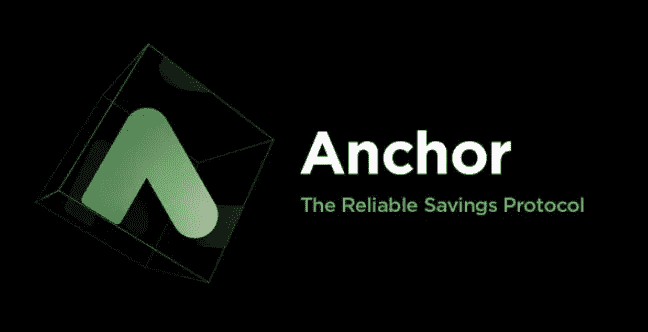

# 解释了锚协议

> 原文：<https://medium.com/geekculture/anchor-protocol-explained-57e35c439ea8?source=collection_archive---------21----------------------->

## Terra Blockchain 面向密码初学者的储蓄账户

**观看视频:**

https://www.youtube.com/watch?v=opndlSVNvC0

让我们来谈谈**银行。**

几个世纪以来，我们一直依靠它们来储存现金。

无论是储蓄账户、CD 还是债券，我们都盲目地…