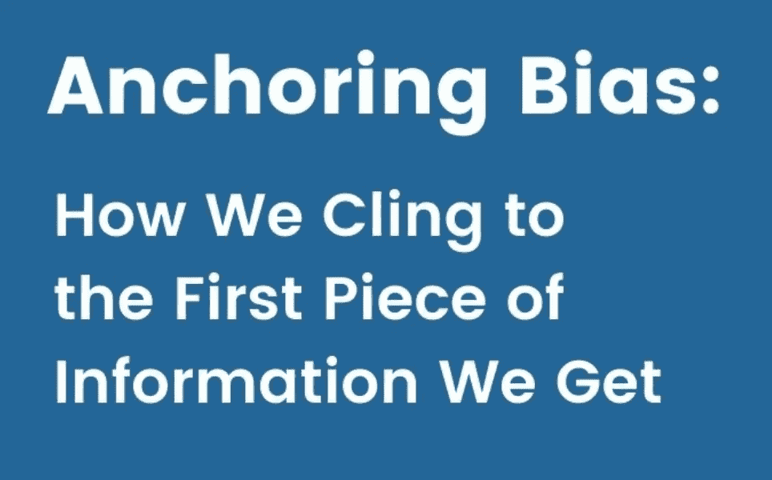

# 锚定偏差:它是什么，如何避免

> 原文：<https://medium.com/geekculture/anchoring-bf031330ebc0?source=collection_archive---------7----------------------->

## 处理锚定的最好方法不是避免它，因为那是不可能的。而是在你做决定之前，故意让你的大脑锚定相关信息。看这里。

Source: [Wikimedia](https://www.google.com/search?q=anchoring+effect+wikimedia&tbm=isch&ved=2ahUKEwiWwKWepvb1AhUAEmMBHalXBLoQ2-cCegQIABAA&oq=anchoring+effect+wikimedia&gs_lcp=CgNpbWcQAzoECAAQQzoFCAAQgAQ6BggAEAgQHjoECAAQGFDuCFiZJmDSKWgAcAB4AIABRIgBzQSSAQIxMZgBAKABAaoBC2d3cy13aXotaW1nwAEB&sclient=img&ei=_aAFYtbNM4CkjLsPqa-R0As&bih=772&biw=1386&hl=en#imgrc=nnPCitfkQy3JMM&imgdii=jTN1qMCwXdVk_M)

> 人类的大脑将锚定在几乎任何事物中…