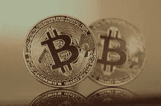

# 安德森·霍洛维茨推出 22 亿美元的加密基金

> 原文：<https://medium.com/geekculture/andreessen-horowitz-launches-2-2-billion-crypto-fund-23fc7344e2d0?source=collection_archive---------31----------------------->

Photo by [Executium](https://unsplash.com/@executium?utm_source=unsplash&utm_medium=referral&utm_content=creditCopyText) on [Unsplash](https://unsplash.com/s/photos/doge?utm_source=unsplash&utm_medium=referral&utm_content=creditCopyText)

像硅谷的安德森·霍洛维茨这样的风险投资公司一直在寻找投资热门区块链创业公司的机会。随着围绕加密货币市场的炒作越来越多，投资公司的资本正在涌入这个领域。根据分析公司 CB Insights 的数据，2021 年第二季度，区块链初创公司融资超过 40 亿美元。这比去年同期增长了 50%以上。

## 新安德森基金

安德森是一家风险投资公司。毫不奇怪，该公司宣布将推出一只 22 亿美元的专注于加密货币的基金，名为 Crypto Fund III。这家风投公司在一篇博客文章中表示，“我们相信下一波计算创新将由密码驱动。”

这家风投公司上一次推出加密基金是在 2020 年，名为 Crypto Fund II。该基金的承付款总额为 5.15 亿美元。它的第一个加密基金 Crypto Fund I 于 2018 年关闭，承诺投资 3 亿美元。

## 密码行业资深人士 Ariana Simpson 负责

Andreessen Horowitz 已经任命该公司 30 岁的合伙人 Ariana Simpson 领导新的加密基金。Simpson 女士是加密行业的知名人士，她在 24 岁时就创办了自己的风险投资公司，在区块链进行投资。安德森·霍洛维茨现有的加密团队包括前联邦检察官凯蒂·霍恩(Katie Haun)和著名的风险投资家克里斯·迪克森(Chris Dixon)。

Image credit: [Peqsels](https://www.piqsels.com/en/public-domain-photo-ffgue)

比特币的价格从 4 月份近 6 万美元的高点下跌。类似地，世界第二大最受欢迎的加密货币以太的价格已经从 5 月份的 4000 美元的纪录下跌了 50%以上。尽管价格下跌，辛普森女士对比特币和其他加密货币的长期轨迹持乐观态度。“你必须真正将短期价格与正在建设的基础分开——我们只是有点忽略头条新闻，只关注技术。她表示:“熊市往往是真正的工作发生的地方。

“这个基金的规模说明了我们面前的机会的规模:加密不仅是金融的未来，而且正如早期的互联网一样，将改变我们生活的方方面面，”凯蒂·焕说。

## 其他安德森基金成员

Andreessen Crypto Fund III 团队的其他成员将包括首席运营官 Anthony Albanese。艾博年以前在纽约证券交易所工作。另一位与政府监管机构有接触的雇员是托米卡·蒂勒曼(Tomicah Tillemann)，他将担任全球政策主管。蒂勒曼此前曾担任总统乔·拜登的高级顾问，并担任领先的行业组织全球区块链商业理事会的主席。

该公司的加密基金还在顾问名单中增加了一些有政府工作经验的人。美国证券交易委员会公司金融部前主任比尔·希曼将担任顾问。另外几名具有复杂证券法和不断变化的监管环境背景的人士也将担任顾问。随着加密行业日益受到监管，这可能是一项战略举措。

安德森·霍洛维茨从 2013 年开始投资区块链，在比特币基地也有投资。该公司也是脸书支持的数字货币项目 Libra 的早期投资者，该项目现在被称为 diem。它目前持有 Axoni、Oasis Labs、Maker 和 Talos 等初创公司的股份。

## 该公司在 NFT 也有投资

安德森·霍洛维茨基金还在快速增长的不可替代代币领域拥有股份。它投资的 NFT 初创公司包括 OpenSea 和 Dapper Labs。该公司关注的另一个与加密相关的类别是分散金融，称为“defi”Defi 指的是建立在区块链上的传统金融应用，如银行和贷款。

安德森·霍洛维茨当前投资组合中的许多与加密相关的初创公司最近已经起飞。CryptoKitties 和 NBA Top Shot 背后的公司 Dapper Labs 今年早些时候的估值达到了 75 亿美元。风投公司投资组合中的区块链基础设施初创公司 Dfinity 最近估值为 95 亿美元。

安德森·霍洛维茨基金总共管理着 188 亿美元。这家风投公司由马克·安德森和本·霍洛维茨在 2009 年创立，初始资本为 3 亿美元。随着对脸书、Twitter、Airbnb、Foursquare、Stripe 等公司的大量早期投资，该公司发展迅速。到 2011 年，Andreessen Horowitz 管理着超过 12 亿美元的资产。

在过去的一年里，对区块链创业公司的资助不断打破记录。CB Insights 的高级分析师克里斯·本特森(Chris Bendtsen)指出，“按照目前的速度，区块链的融资将打破之前的年终纪录——是 2018 年融资总额的三倍以上。”观察金融科技行业初创公司的融资情况，会发现一幅更加乐观的画面。2021 年第二季度，金融科技公司共融资 308 亿美元。这个数字是金融科技公司在 2020 年第二季度获得的融资额的近三倍。