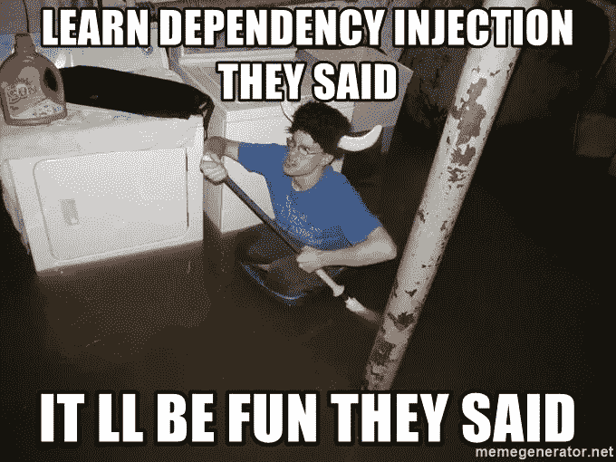

# Android 102:为什么 dagger 会为我们生成 MembersInjector？

> 原文：<https://medium.com/geekculture/android-102-why-does-dagger-generate-membersinjector-for-us-e6e80ae92290?source=collection_archive---------7----------------------->

我们用一个简单的依赖注入例子结束了上一篇 [**文章**](/p/db1300f9ce82) 。现在我想通过添加 MembersInjector 来使它变得稍微复杂一点😈！



我们引入了 MembersInjector，它可以帮助我们一次注入一个类中的所有依赖项，而不是为每个依赖项单独注入。即

```
**dummy = DaggerDummyComponent.create().getDummy()  <---- not this****DaggerDummyComponent.create().inject(this)      <---- all at once**
```

这就是 MembersInjector 出现的原因！
**Dagger 为将** `**@Inject**` **应用于字段或方法**的类生成成员注入器。它将用于一次注入任何类中的所有依赖项(对我们来说这是主要活动)。

> 在官方文件中也有对**成员注入器**的定义:
> 
> **成员注入方法**是组件上的`void`方法，接受特定类型的参数，允许 Dagger 设置其`@Inject`注释的字段并调用其`@Inject`注释的方法。

总之，这个示例 dagger 生成了一个**member injector**以及我们在上一篇文章中已经讨论过的两个类，即 **DaggerDummyComponent** 和 **DummyFactory。**

这是带有注入函数入口点的组件。

```
@Component
@Singleton
**interface DummyComponent {
    fun inject(activity: MainActivity)
}**
```

和生成的 dagger 组件代码。

```
@DaggerGenerated
**public final class DaggerDummyComponent implements DummyComponent {
**  private final DaggerDummyComponent dummyComponent = this;

  private Provider<Dummy> dummyProvider;

  private DaggerDummyComponent() {
    initialize();
  }

  public static Builder builder() {
    return new Builder();
  }

  public static DummyComponent create() {
    return new Builder().build();
  }

  @SuppressWarnings("unchecked")
  private void initialize() {
    dummyProvider = **DoubleCheck**.*provider*(Dummy_Factory.*create*());
  } **// We get one such overriden method for each binding we declare** @Override
  public void inject(MainActivity activity) {
    injectMainActivity(activity);
  }

  private MainActivity injectMainActivity(MainActivity instance) {
    MainActivity_MembersInjector.*injectDummy*(instance,             
                                         dummyProvider.get());
    return instance;
  }

  public static final class Builder {
    private Builder() {
    }

    public DummyComponent build() {
      return new DaggerDummyComponent();
    }
  }
}
```

由于我们已经以主活动本身的形式定义了一个绑定，所以组件使用了一个 membersInjector 类来获取主活动中注入的依赖项

```
public final class MainActivity_MembersInjector implements MembersInjector<MainActivity> {
  **// We will get one such factory for each dependency,  
  // Injected inside the mainActivity**
  private final Provider<Dummy> dummyProvider;

 public MainActivity_MembersInjector(Provider<Dummy> dummyProvider){
    this.dummyProvider = dummyProvider;
  }

  public static MembersInjector<MainActivity> create(Provider<Dummy> dummyProvider) {
    return new MainActivity_MembersInjector(dummyProvider);
  } @Override
  public void injectMembers(MainActivity instance) {
    *injectDummy*(instance, dummyProvider.get());
    **// we can have more injected members here**
  }

 @InjectedFieldSignature("com.example.dagger_demo.MainActivity.dummy)
 public static void injectDummy(MainActivity instance, Dummy dummy){
    instance.dummy = dummy;
  }
}
```

需要注意的细节！

1.  当我们在 lateinit 变量或任何类中的任何方法上添加 **@inject** 注释时，Dagger 会为类本身生成一个**member insjector**。该类中初始化了依赖关系的所有工厂。在这个例子中，类是主活动，注入的依赖项是 Dummy 类型的。
2.  Dagger 知道这不是一个普通的组件入口点方法，因为它不返回任何东西，并且接受一个参数。在上面的例子中，当您将 mainActivity 传递给 inject 方法时，Dagger 将设置任何`@Inject`字段并调用其上的任何`@Inject`方法。
3.  这是什么**双重检查？如果我们使用像 **@singleton 这样的作用域注释，它总是在生成的组件实现中弹出。****

```
private void initialize() {
  this.dummyProvider = DoubleCheck.*provider*(Dummy_Factory.*create*());
}
```

我想写点什么，但是看到了这篇文章，这篇文章解释了我想写的一切，所以因为懒，我没有写👀。

到目前为止，在 dagger [的文章](https://saurabhofficial.medium.com/android-101-what-does-dagger-really-generate-behind-the-scenes-db1300f9ce82)中，我们只讨论了拥有@inject 注释构造函数的类，也就是说，它们不需要一个模块来指定如何构造一个对象。
但是如果我们要求注入一个对象，但是我们没有访问它的构造函数的权限，会发生什么呢？也许是一些外部库类？
这时候模块进入了🥳.的派对

我们将在另一篇文章[中查看它们](https://saurabhofficial.medium.com/android-103-how-is-constructor-injection-different-from-provides-method-in-dagger-66ff0209ebb3)

如果你觉得这篇文章很有见地，请给我一个掌声😄，快乐阅读！