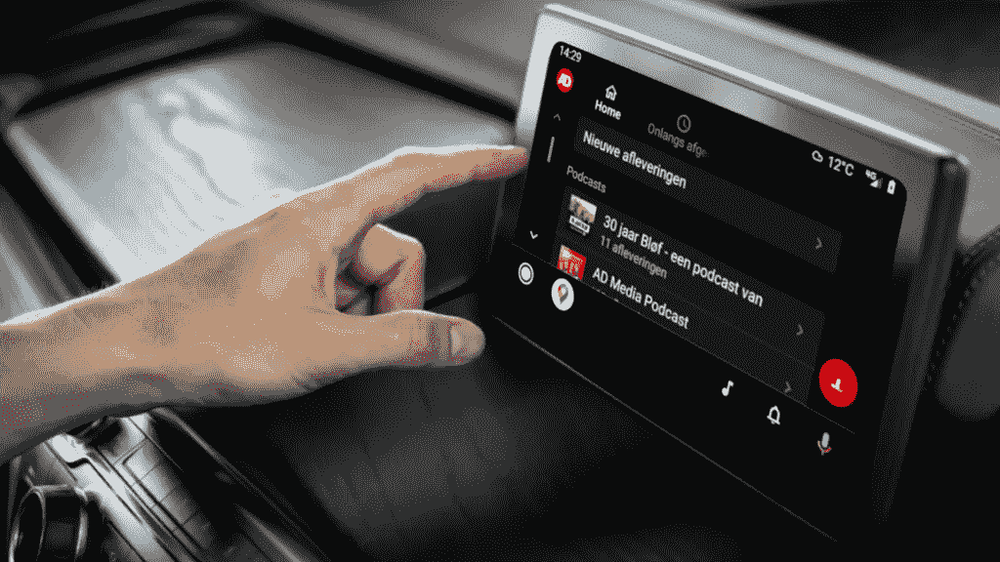

# 我们如何让我们的 Android 自动模块全速运行

> 原文：<https://medium.com/geekculture/android-auto-module-app-898ff00620d7?source=collection_archive---------8----------------------->

## 我们通向客户汽车的道路

*作者:安卓工程师 Aswin Ly*

**DPG 媒体的一些新闻品牌刚刚开始支持 Android Auto 和苹果 Carplay，比如 Algemeen Dagblad 和 Het Laatste Nieuws。在这篇博文中，我们将从 Android 的角度解释我们如何将这个功能作为一个模块集成到应用程序中。**

# 车里的播客

提供一些背景，你可能听说过苹果 CarPlay，但你听说过 Android 手机用户的 Android Auto 吗？这就是我们要关注的。拥有 Android Auto 有助于用户利用手机上现有的应用程序在车内无缝地继续娱乐。当然，我们希望你把注意力放在路上，而不是视频内容的屏幕上，如广告播放或 HLN 原创。但是你仍然可以在开车的时候用耳朵听播客。

我们的 Android Auto 模块在一个现成的模块中提供了播客功能。只要一个品牌支持播客，这个模块在技术上就是对 Android 应用的简单集成。你可以[在广告应用中点击](https://play.google.com/store/apps/details?id=be.persgroep.android.news.mobilead&hl=en&gl=US&pli=1)查看。我们的 iOS 团队也在 [iOS 应用](https://apps.apple.com/nl/app/ad-nieuws-sport-regio/id411536869)中为苹果 CarPlay 构建了类似的体验。

目前支持以下功能:

*   高亮显示的播客单集、播客节目和最近的播客单集的主概述
*   上次播放的播客剧集
*   播客的音频播放器
*   回放速度
*   向前 30 秒
*   10 秒倒带

# 为什么是模块？

我们的团队为不同的 DPG 媒体品牌提供视频和音频内容支持。每个品牌都有不同的需求，但我们也想要灵活性和可扩展性。所以构建一次，在很多 app 中使用。这就是为什么我们有一个内部 SDK 项目，它包含了视频和音频播放的模块化原生(iOS 和 Android)实现。

在这种情况下，Android Auto 模块是播客功能的扩展。因为不是 DPG 媒体的所有品牌都支持播客，所以可以灵活决定哪个品牌安装该模块。将该模块安装到该品牌的应用程序中会自动启用 Android Auto 功能。

# 我们面临的挑战

每个项目都伴随着挑战。不是所有的事情都像黄油一样光滑。首先，由于 Android Auto 在我们团队中是一个新的技术主题，我们必须了解 Android Auto 的技术集成是如何工作的。谷歌关于 Android Auto 的文档并不完整和完美，因为 API 文档并不总是与实际的 API 完全匹配，而且它缺乏关于在 Google Play 上发布 Android Auto 应用程序的先决条件的信息。这些不明确性推迟了我们应用的发布——Google Play 在 Android Auto 的第一次更新中拒绝了这些应用。

其次，由于这些不确定性，更难预先计划、估计和承诺 Android Auto 的交付。因此，我们在 Android 自动集成上进行了两次全速冲刺，接下来是一些小的收尾工作。最终，比预期的要顺利。

最后，为 Android Auto 构建用户界面不同于标准的 Android 手机应用程序开发。对于常规的 Android 手机应用程序，作为一名开发人员，您可以完全按照您想要的方式构建用户界面，以及用户界面的哪一部分是可交互的。然而，对于 Android Auto，构建用户界面的可能性是有限的，并由 Android Auto 预先定义为以下类型:媒体(音频)、消息、导航和兴趣点(POI)。对于这些类型中的每一种，都有一个严格的 API 可以遵循，从而产生一种一致类型的 Android Auto 应用程序，具有相同的用户界面，可提供驱动程序优化的应用程序体验。在我们的例子中，我们构建了一个 Android 汽车媒体(音频)应用程序。技术结构是，Android Auto 应用程序是一个“服务器”(你的手机)，而“客户端”是 Android Auto 屏幕，它将根据“客户端”的请求和“服务器”返回的响应来呈现用户界面。简而言之,“服务器”使用我们必须实现的 Android 媒体 API。

我们从挑战中学到了很多，从现在开始，我们只能改进 Android Auto 应用程序。