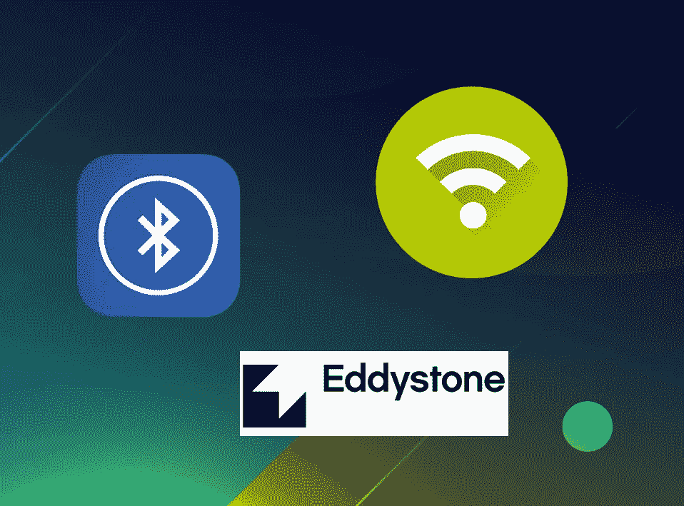
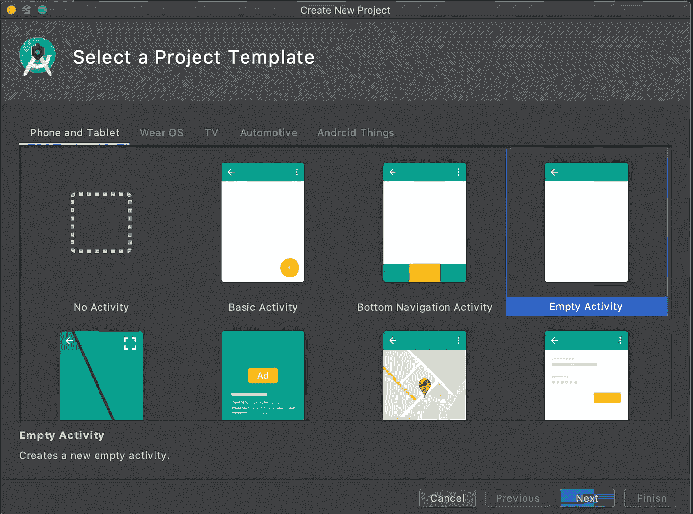
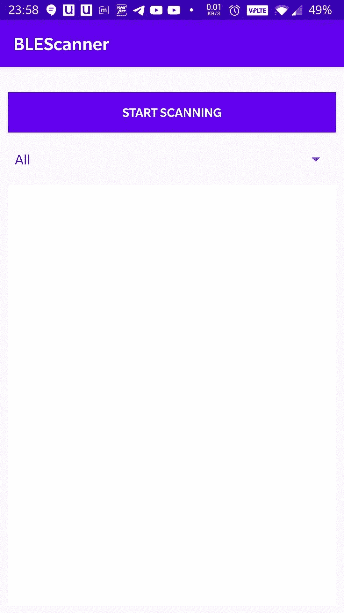
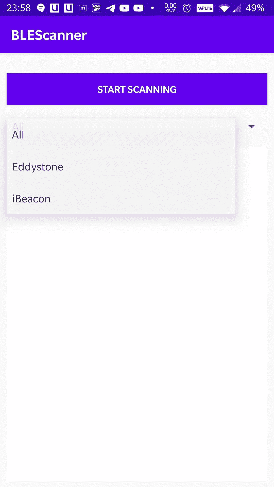
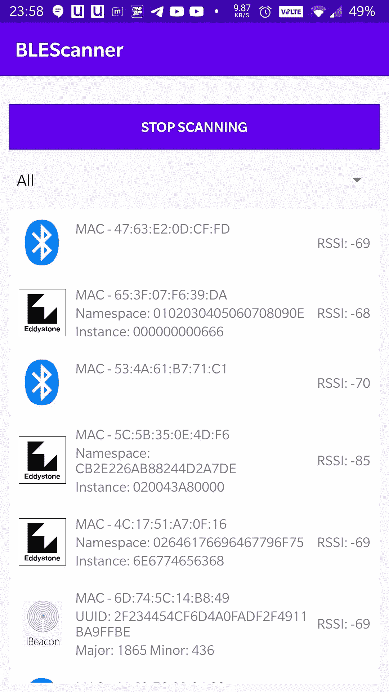

# 使用 Android BLE 扫描仪扫描 iBeacon 和 Eddystone

> 原文：<https://medium.com/geekculture/android-ble-scanner-to-scan-for-ibeacon-and-eddystone-96a0c0610d3d?source=collection_archive---------1----------------------->

# 介绍

本博客将向您介绍蓝牙低能耗，并将涵盖使用它的所有终端应用领域。此外，博客还将带您了解不同种类的 BLE 信标和流行的信标协议。

在本文的后半部分，我们将创建一个演示 android 应用程序来测试两个 BLE 信标协议，一个来自 Apple，另一个来自 Google。但是，在进入编码部分之前，让我们先看一下 BLE 和信标的一些基本定义和概述。

# 蓝牙低能耗

蓝牙低能量是由蓝牙 SIG 设计的无线个人区域网技术。蓝牙 SIG 确定了低能耗技术的不同市场，尤其是在智能家居、健康、运动和健身领域。一些主要优势包括:

*   纽扣电池的低功率需求可以运行数月/数年
*   体积小、成本低
*   与手机、平板电脑和电脑的兼容性

蓝牙低能耗(BLE)，可从 Android API 18(4.3-Jelly Bean)获得，后来在设备之间创建短连接以传输数据突发。BLE 当没有连接它保持在睡眠模式。这是因为与传统的蓝牙相比，它通过提供更低的带宽来利用更少的功率。它非常适合心率监测器或无线键盘等应用。要使用 BLE，设备需要有支持 BLE 的芯片组。谈到 BLE 信标，蓝牙信标是物理发射器——一种在附近的电子设备上广播其标识符的 BLE 设备。

# BLE 信标的使用案例

这些信标可用于许多近距离相关的应用，例如

*   **邻近警报**:当这些信标在附近时，它们可用于获取应用程序内的警报
*   **室内导航/定位**:通过在室内放置适当数量的信标，并适当利用所有信标的信号强度，我们可以创建一个室内导航或室内定位的工作解决方案。
*   **互动**:这些信标可以放置在电影院的电影海报/横幅上，一旦设备靠近它，应用程序就可以启动它的预告片或预告，博物馆也可以这样做，这些可以放置在艺术品上，人们可以将这些绘画的细节作为通知，还可以获得艺术品的视频/音频/文本信息。
*   **医疗保健**:可用于跟踪患者的运动和活动

它也可以用于许多其他用例。例如，你可以在你的钥匙里放一个 BLE 标签，然后用你的手机去寻找它，如果它在橱柜里或者就在沙发下面。

# 信标协议

*   **iBeacon** :苹果的蓝牙信标标准
*   AltBeacon :它是由 Radius Networks 创建的 iBeacon 的开源替代方案
*   **URIBeacon** :直接广播网址，可以立即理解
*   **Eddystone** :谷歌的蓝牙信标标准，支持三种类型的数据包，Eddystone-UID、Eddystone-URL 和 Eddystone-TLM。

现在，我们将看到如何通过创建一个演示 android 应用程序来扫描苹果的 iBeacon 和谷歌的 Eddystone-UID。

# 入门指南

创建一个新项目，并选择您所选择的模板。

我选择“空活动”。

# BLE 属地

对于扫描 BLE 信标来说，没有额外的 BLE 库依赖性。

打开 AndroidManifest.xml 并在 Manifest 元素中添加以下内容。

<uses-feature>将“需要”标记为“真”意味着此应用程序需要 ble 硬件才能运行，因此 Google play 将确保此应用程序仅对具有 BLE 硬件的设备可见。</uses-feature>

<uses-permission>标签需要获得在低能耗模式下使用蓝牙硬件粗略定位的许可。</uses-permission>

# 检查许可

蓝牙低能量扫描模式需要粗略定位许可。因此，我们应该确保我们拥有用户提供的所需权限。

检查是否获得权限，否则显示对话框让用户知道为什么我们需要这个权限。

# 设置蓝牙 API

初始化 *BluetoothManager* 以获取用于获取 *BluetoothLeScanner* 的 *BluetoothAdapter* 的实例，这是对蓝牙 LE 设备执行扫描相关操作所必需的。

*   ***Bluetooth manager***:高层管理器，用于获取 BluetoothAdapter 的实例，并进行全面的蓝牙管理。
*   ***蓝牙适配器*** :代表本地设备蓝牙适配器。 *BluetoothAdapter* 允许您执行基本的蓝牙任务，例如启动设备发现、查询绑定(配对)设备列表、使用已知 MAC 地址实例化一个 *BluetoothDevice* ，以及创建 *BluetoothServerSocket* 来侦听来自其他设备的连接请求并开始扫描蓝牙 LE 设备。
*   ***Bluetooth LE scanner***:这个类为蓝牙 LE 设备提供了执行扫描相关操作的方法。

# BLE 扫描回电

# BLE 启动/停止扫描仪

我们可以用一个按钮来控制 BLE 扫描仪的启动和停止。

# 解析 ScanResult 以获取相关数据

我们应该创建一个信标类来保存我们将从 onScanResult 回调的 ScanResult 中解析的不同信息。

正在提取 Eddystone UID 数据包信息(如果有)。

Eddystone UID:唯一的静态 ID，具有 10 字节的名称空间组件和 6 字节的实例组件。

*   ***scanRecord*** :广告和扫描响应的组合
*   ***device.address*** :该蓝牙设备的硬件地址。比如“00:11:22:AA:BB:CC”。
*   ***rssi*** :接收信号强度，单位为 dBm。有效范围是[-127，126]。
*   ***service UUIDs***:广告中用于标识蓝牙 GATT 服务的服务 uuid 列表。
*   ***eddystoneServiceId***:Eddystone UID 的服务 UUID，为“0000 feaa-0000–1000–8000–00805 F9 b 34 FB”
*   ***service data****:*与 serviceUuid 关联的服务数据字节数组，在我们的例子中是 *eddystoneServiceId*
*   ***eddystoneUID*** 包信息在从索引 2 到 18 的 serviceData 中，我们需要使用实用程序方法将这个字节数组转换成十六进制字符串

*   ***命名空间*** 为 10 字节，从 eddystoneUID 的 20 个字符开始
*   ***instanceId*** 为 6 个字节，为 eddystoneUID 的剩余 12 个字符

提取 iBeacon 数据包信息(如果有)。

**iBeacon** :唯一的静态 ID，具有 16 字节的邻近 UUID 成分、2 字节的主要成分和 2 字节的次要成分。

*   ***iBeaconManufactureData***:与制造商 id 相关联的特定于制造商的数据，对于 iBeacon 制造商 id 为“0X004c”(苹果)。

******让我们看看实际运行的代码******

************

******start screen******

************

******start screen with the options******

************

******result screen with Eddystone UID, iBeacon, generic BLE devices******

******BLE 信标 iBeacon 和 Eddystone-UID 互不相同，但可用于任何与接近度相关的应用。这是因为，在应用层，它们都使用不同的蓝牙模式解决类似的问题。******

******埃迪斯通确实有不同类型的数据包来解决不同的问题，比如-******

*   ********Eddystone-URL** :用于广播 URL******
*   ****埃迪斯通-TLM :广播信标信息。这可以包括电池电量、传感器数据、电池电压、信标温度、自上次启动以来发送的数据包数量、信标正常运行时间或其他与信标管理员相关的信息****

****更多细节和更深入的观点，你可以在这里找到代码。****

****【https://www.talentica.com】也发表于**由我。******