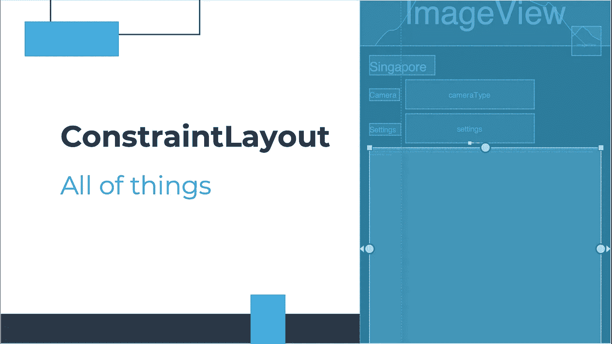

# Android ConstraintLayout —所有的东西

> 原文：<https://medium.com/geekculture/android-constraintlayout-all-of-the-things-7b74ba9a366b?source=collection_archive---------7----------------------->

作为一名 Android 开发者，我们都使用过传统布局:LinearLayout 和 RelativeLayout。对我来说，我认为这是一种适合每个人的方法，但它会给我们的应用程序带来很多性能方面的问题。此外，如今有许多复杂的布局，使用旧的布局来处理它们是如此困难。因此，谷歌在 2016 年谷歌 I.O 大会上介绍了该库…