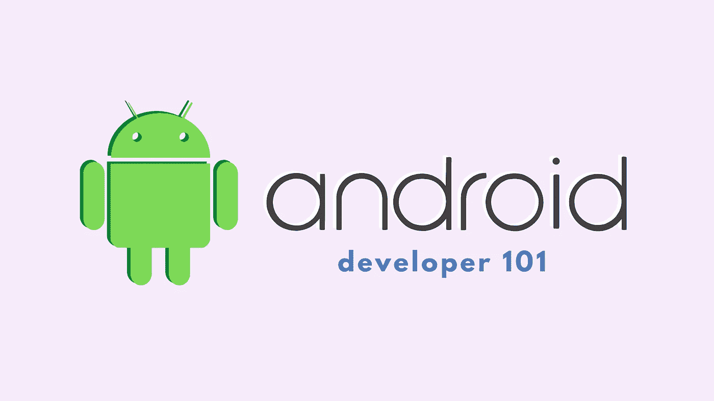
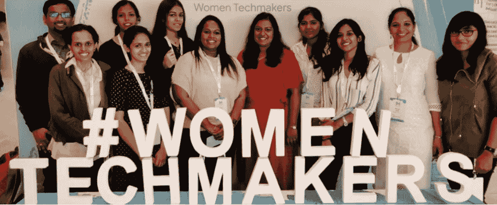
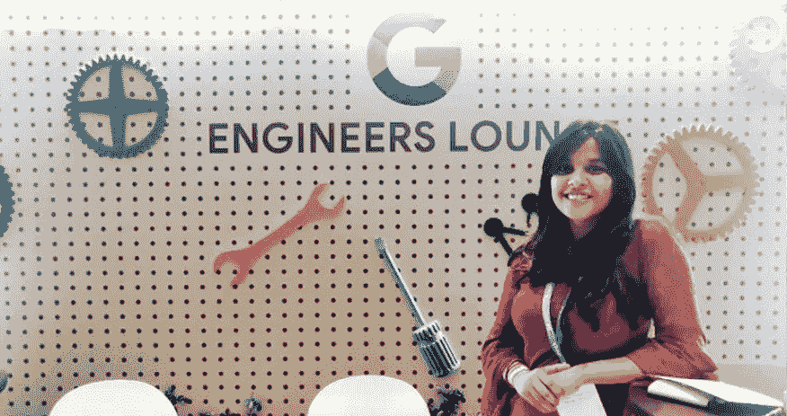

# 面向初学者的 Android 开发

> 原文：<https://medium.com/geekculture/android-development-for-beginners-72e6ac0dd67b?source=collection_archive---------24----------------------->

## 分享我的经验，我会的

我被问得最多的问题是，我是如何成为一名 Android 开发人员的，或者我发现哪些资源最有用。所以今天，我要试着整理所有帮助我开始旅程的东西。

注意:这不是成为开发人员的点对点指南，对我有效的可能对你无效。

既然你已经决定踏入黑暗面，那就开始吧。

## 坚持一个教程🔠

网上提供多种资源的一个主要问题是，人们往往会对开始的最佳课程感到困惑，最终放弃完成一门课程的想法。你选择的课程不一定是终极的、最好的、最有效的，但是我建议无论你决定坚持什么，都要完成它。

我发现最有效的一个是[**【https://developer.android.com/courses】**](https://developer.android.com/courses)，你会发现一堆针对不同开发水平的教程/代码实验室。

## 文档、StackOverflow、博客、Github 等等📄

提问！如果你有任何疑问，一定要查清楚。如今，有多种方法可以找到任何事情，首先也是最重要的是通过官方文件。谷歌一下每个疑问，不管它有多愚蠢或复杂。你会在 Github 或 Youtube 或 [StackOverflow](https://stackoverflow.com/) 上找到我个人最喜欢的博客/一些解决方案。

## 拿好工具，开始吧！🛠

当我告诉人们在第一天建立 [Android 工作室](https://developer.android.com/studio?gclid=Cj0KCQiA-eeMBhCpARIsAAZfxZDfHhJIrsKzlQJ5iXZF8UuiFIUC_KqD8b6CiFSzBMt4Y3ylGCHxjuMaAoVUEALw_wcB&gclsrc=aw.ds)进行实验和玩耍时，人们经常会觉得奇怪。这可能会有点困难，但是一旦你准备好了，你就可以开始做一个小项目了。

我从制作一个简单的带有倒计时器的火炬应用程序开始。除了我的课程，我还能够获得实践经验，对工具的熟悉帮助我更快地掌握它，所以我觉得没有比体验它更好的学习和记忆方法了。

现在，我知道，一次查看多个 kt/java 文件，试图理解什么是清单或活动或 Gradle，这可能有点令人不知所措，但一次专注于一件事是很重要的，教程将一个接一个地指导您完成所有事情。

## 加入开发者社区👩🏼‍💻

这是我旅途中最有帮助的事情之一。我一直是多个开发者俱乐部和分会的成员，我总是和像我一样的导师和初学者在一起！除了学习 Android 开发之外，我还学会了 Git，学会了成为一名优秀的开发人员和社区贡献者的基本知识。它还帮助我在多个开发者活动和社区项目中保持动力。

我是 GDG T1 和 T2 WTM T3 的一员。

## 挑战自我👊🏼

我最喜欢做的一件事是参加黑客马拉松。我已经参加了多个 hacks，我没有等到完成我的课程或成为初级开发人员就参加其中一个。我只是作为一名新手加入了 100 多名出色的开发人员。我总是带着通过开发应用程序来解决问题的座右铭，我喜欢完成挑战的通宵兴奋感。
现在我想说的是，不要让这个旅程变得单调。去找个黑客，试着在一夜之间开发一个应用程序，看看你能走多远，或者给自己一个有期限的项目，在进行过程中不断添加功能。制作项目，将它们推送到 Github，围绕它写博客，获得反馈，将你的应用发布到 Google Playstore，做一切你能想象到的事情，你会在途中学到很多东西。

## 保持一致，🧘‍♀️

这不仅仅是成为一名 android 开发者，而是在你想做的任何事情上做得更好。一致性将为进步创造动力。提交很重要(*，我也指 git 提交，但我们会在其他时间*)并确保你出现。

> 成长的关键是要记住，永远有进步的空间，没有停止学习的年龄！永远记住去适应、进化和信任你的技能。

好了，我想关于这个话题已经说得够多了。我希望这对你有所帮助，或者如果你还有什么要补充的，请随时发表评论，我们很乐意听到你的故事。如果你需要帮助，也可以联系我。感谢阅读。

愿原力与你同在✌️