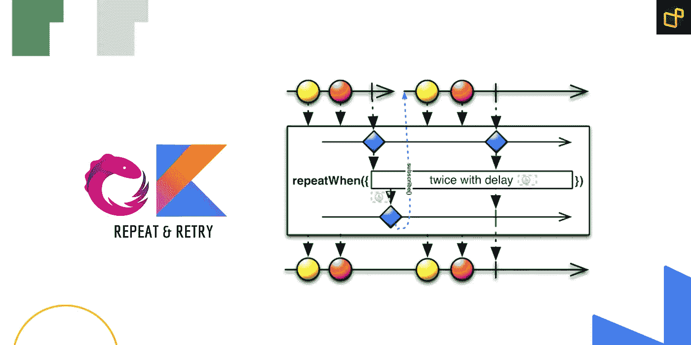

# Android:用 RxJava 进行服务器轮询操作。

> 原文：<https://medium.com/geekculture/android-server-polling-operations-with-rxjava-c8121e6a5e8c?source=collection_archive---------9----------------------->

# ⚡️概述

一个很常见的情况是当应用程序与服务器交互时，要确保服务器是否完成了任务，当然，还要加上延迟。有时我们需要重复检查几次，以确保我们的数据是最新的，并在服务器出现故障时重试。我有一个解决方案，而且很有效，所以我想把它分享给你们。在这篇文章中，我…