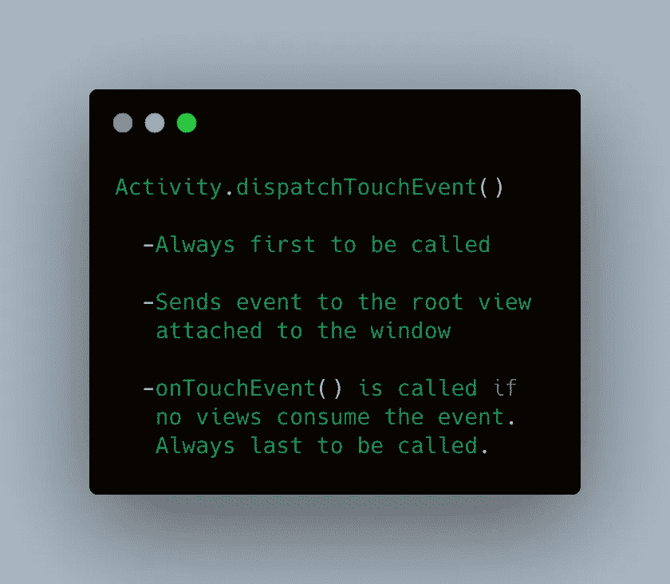
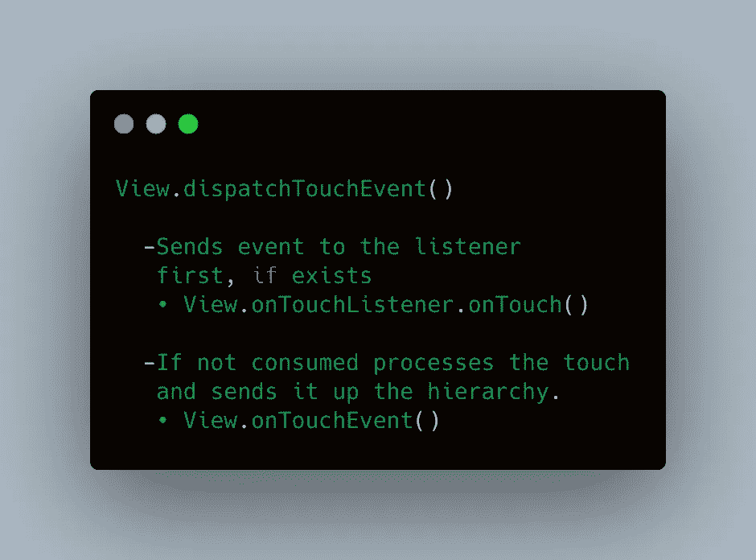
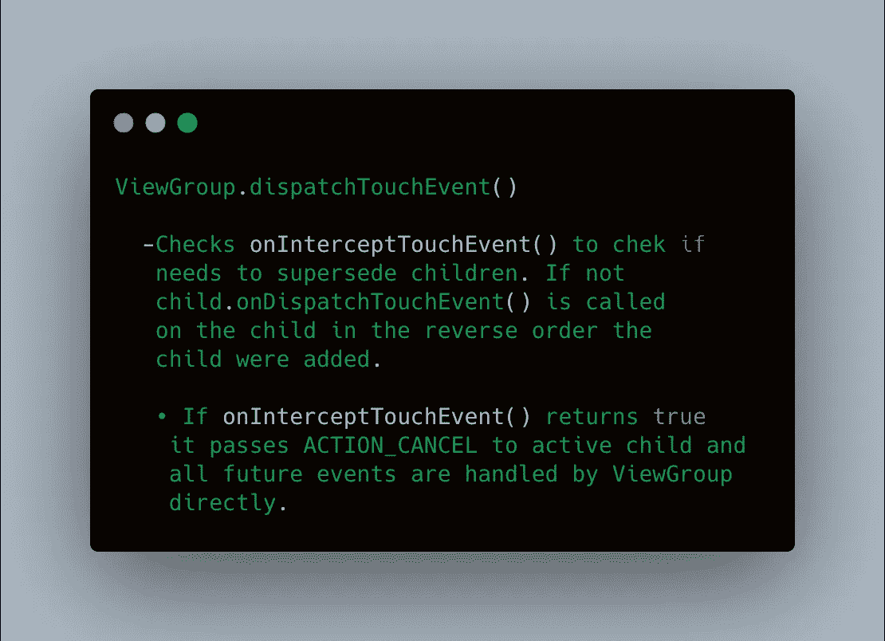
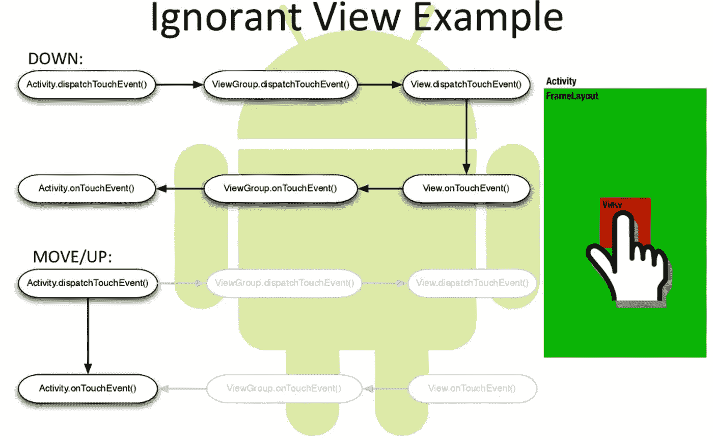
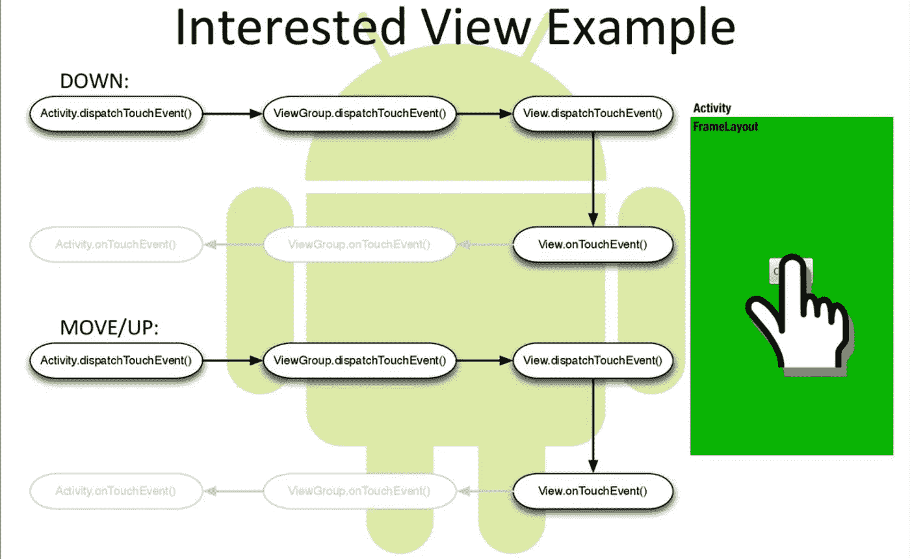
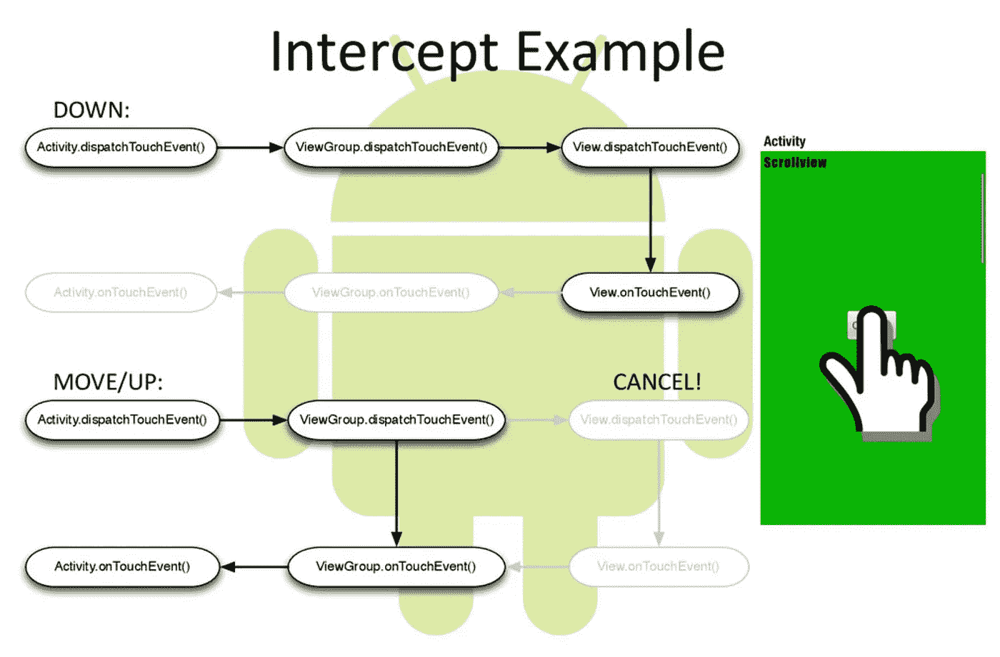

# Android 触摸框架

> 原文：<https://medium.com/geekculture/android-touch-framework-b5cc5a9926ed?source=collection_archive---------6----------------------->

理解触摸框架的概念

Android Touch

各位开发者好，在这篇文章中，我将讨论 Android 触摸框架，触摸如何在应用程序中流动，以及 Android 如何处理所有这些事件。

# Android 如何处理触摸

应用程序中的每个触摸事件都被包装成一个**运动事件**。这些**动作事件**包含动作的描述和一些元数据，例如屏幕上触摸事件的位置。一些行动如下:

*   **ACTION_DOWN** :手指触摸屏幕时
*   **ACTION_UP** :手指离开屏幕时
*   **动作 _ 指针 _ 向下**
*   **动作 _ 指针 _ 向上**
*   **动作 _ 移动**:在屏幕上移动手指时
*   **动作 _ 取消**

手势被定义为以**动作 _ 向下**开始，以**动作 _ 向上**结束。

1.  事件从带有`dispatchTouchEvent()`的活动开始
2.  事件通过视图从上到下流动

*   父母(视图组)将事件发送给他们的孩子
*   可以随时拦截事件。

3.事件沿层次结构向下流动，然后向上流动，直到被消费

> 当处理事件的调度时，层次结构的顶部位置起主导作用，但是当处理触摸时，使用 onTouchEvent 的子视图总是第一个，然后它继续向 ViewGroups 移动。
> 
> **触摸事件的工作方式类似于事件的分派，但从子到父的顺序相反。**

当拦截时，如果我们返回`true`，那么触摸事件是**而不是**传递给它的孩子，如果我们传递`false`，Android 生态系统得到通知，视图组想要将事件分派给它的孩子，

孩子可以调用`requestDisallowTouchIntercept()`在当前手势持续期间阻止`onInterceptTouchEvent()`。例如 Scrollview 中的一些滚动视图。我们希望在滚动子级时停止父级滚动。*该标志由框架在新手势(ACTION_DOWN)时重置*

# 场景 1—当没有视图正在使用事件时

# 场景 2 —当一个视图正在消费事件时

# 场景 3 —

在`ScrollView`内的按钮的情况下，按钮在被点击时消耗触摸事件，但是如果手势被改变为拖动，则`ScrollView`的`onInterceptTouchEvent`被调用，`ScrollView`开始处理触摸，并且按钮接收`ACTION_CANCEL`事件。

*   一切都取决于`onInterceptTouchEvent()`及其返回值**和**。dispatchTouchEvent 依赖于`onInterceptTouchEvent()`的值，如果它返回 true，则调度被取消，如果它返回 false，则触摸事件的调度继续进行，直到它被使用。
*   如果`onTouchEvent()`返回真，则意味着触摸被处理，但是如果它返回假，则意味着触摸未被处理。

## 对于复杂的触摸交互:

我们有手势检测器，通过`onTouchListener() or onTouchEvent()`处理:

*   `onDown(), onSingleTapUp(), onDoubleTap()`
*   `onLongPress()`
*   `onScroll()`
*   `onFling()`

# 触摸代表

帮助器类来处理您希望视图具有比其实际视图边界更大的触摸区域的情况。触摸区域发生变化的视图称为代理视图。该类应该由委托的祖先使用。

> **允许特定视图的触摸区域与其实际触摸边界不同。**

希望你学到了一些东西！感谢您的阅读。

*点击*👏表示你的支持，并与其他媒体用户分享。

你可以在 [***推特***](https://twitter.com/adilkhanforeal) **和**[***insta gram***](https://www.instagram.com/adilkhanforeal/)上找到我

 [## Adil Khan - BBD 大学-印度北方邦勒克瑙| LinkedIn

### 在世界上最大的职业社区 LinkedIn 上查看 Adil Khan 的个人资料。Adil 有 1 个工作列在他们的…

www.linkedin.com](https://www.linkedin.com/in/iadilkhan/)