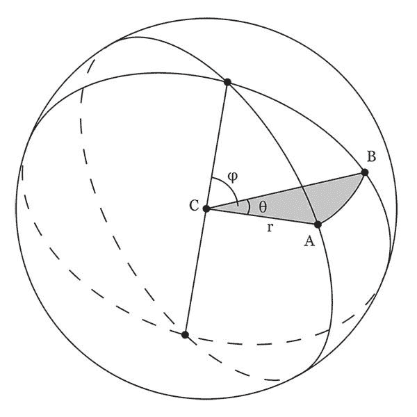
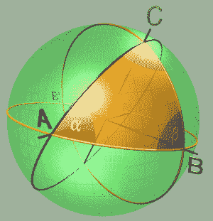
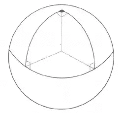

# 用球形几何学钓鱼度假

> 原文：<https://medium.com/geekculture/angling-for-vacation-with-spherical-geometry-8e99ab2263ba?source=collection_archive---------9----------------------->

## 茎中的宝石:球面几何的基础(第。2)

上次，我让你们所有人都有点紧张(完全是我的错)。特别是，我们已经定义了球面几何的基本工具(即大圆)，但是没有回答关于球面上其他物体的其他问题！比如，如果这个几何图形中没有直线，那么角度会发生什么变化？还是形状？(注意:如果你不确定球面几何是关于什么的，我推荐你先阅读我的[上一篇文章](/geekculture/how-to-run-the-world-with-spherical-geometry-3365482e5ad0)，它介绍了我们在这里工作的一切！)

首先，一个警告:地球是平的人注意了，以下(科学上准确的)信息可能会令人不安。

现在，我们从第一个问题开始:角度。在传统(欧几里得)几何中，角度是由两条相交的*直线*之间的空间定义的。在球面几何中，直线的概念被大圆所取代。因此，正如所料，球面几何中两条线之间的角度由相应的大圆定义；具体来说，就是大圆的*平面*之间的角度。例如，下图中两个大圆之间的角度为θ。

现在我们知道了什么是角度，我们能够处理一些稍微困难的事情:**球面三角学**，球面几何学的一个领域，涉及球面多边形(形状)上的触发函数如何与大圆相关。为了简单起见，我们不打算深入研究这个主题(否则这篇文章会变得非常难看，非常快)。但是，我们可以谈谈最简单的形状:三角形！

我们都熟悉欧几里得几何中的三角形:有三条直边和三个角的形状。啊哦，我们现在知道球面几何中的直边和角有点不同，所以我们必须相应地调整！**球面三角形**是球面上三个大圆的弧相交所围成的区域。一如既往，这里有一张图可以帮助我们更好地理解这个定义！

我们在球面几何中有角和三角形的概念，现在让我们试着把它们联系起来！一、关于欧几里德几何中的角和三角形的关系，我们知道什么？嗯，要说的东西很多，但最重要的一个关系是欧几里得几何中三角形的三个内角加起来是 180。

然后我们可以问一个自然的问题:同样的关系在球面几何中也成立吗？在我们回答这个问题之前，我鼓励你猜一猜！试着证明为什么你认为你的猜测是正确的。

剧透:答案是否定的。那不是很方便吗？不出所料，事情有点复杂。事实上，球面三角形的角加起来严格地大于 180°小于 540°。不相信我？是的，我不怪你。这里有一个例子来证明我不是骗子:

这个球形三角形有三个直角，这意味着它的角加起来有 270 度。(球面三角形的三个角之和总是大于 180°的原因是因为球面是曲面。)

但是，我们为什么要关心球面三角形呢？人们只是感到无聊，开始在地球仪上画形状吗？像往常一样，没有！作为对上一篇文章的回顾，球面三角形可以用来计算地球上两点之间的最短距离路线。(感谢你们这些球形三角帮我们尽快度假！)这种方法被称为(球面)三角形的**解。特别是，给定一个球面三角形的两条边 b 和 c，第三条边 A 满足:cos(A)= cos(b)* cos(c)+sin(b)* sin(c)* cos(A)，其中 A 是 b 和 c 之间的角度，确切的细节超出了本文的范围，但是如果你很好奇，我鼓励你去查一下！**

另一个有趣的事实是，我不能在这里向你证明(但我希望仍然会引起你的兴趣),球形三角形的面积与其角和负 180 度成正比。啊？！这不是很疯狂吗？不幸的是，因为我是邪恶的，我不会详细说明(但是，再次，搜索它，如果你有兴趣！).这个事实意味着任何两个角和相同的三角形面积相等。也说明了任意两个对应全等角的三角形都是全等的，意味着球面几何中不存在相似的三角形！疯狂的事情。

最后，走之前，你喜欢球面几何吗？因为你可以随时带我去度假；)(但前提是你接种了疫苗)。

下次见！如果您对此感兴趣，请务必查看下一篇专栏文章！如果你有任何问题或意见，请发电子邮件到 apoorvapwrites@gmail.com 给我。

*要成为第一个听到我所有新文章、最近事件和最新项目的人，请务必订阅我的简讯:* [**信？我几乎不认识她！**](http://apoorvapanidapu.substack.com/)

*这个* [*专栏*](https://apoorvapanidapu.medium.com/list/gems-in-stem-e5f24767d315) *，STEM 中的宝石，是一个了解各种 STEM 主题的地方，我觉得这些主题很精彩，我希望也会让你兴奋！它总是会被写得相当容易理解，所以你不必担心没有背景知识。然而，它偶尔会在接近尾声时变得更高级。感谢阅读！*