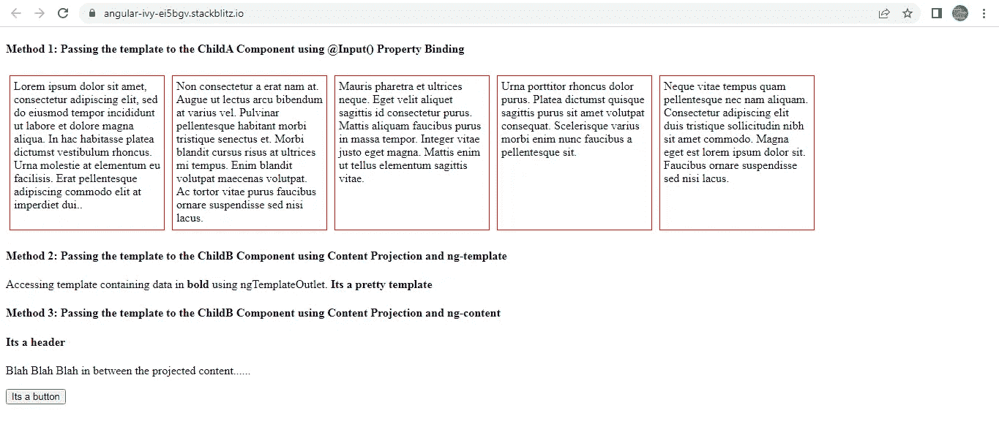
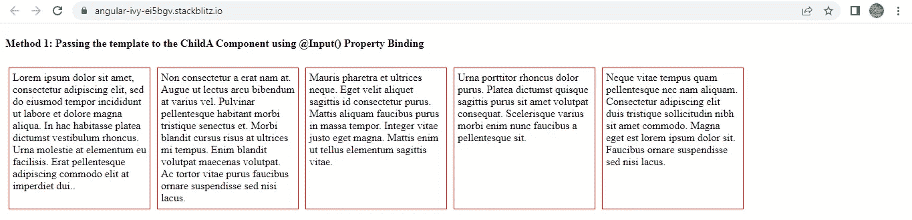
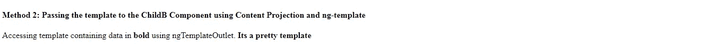

# Angular:有 3 种方法可以将模板从父组件传递到子组件，以提高可重用性

> 原文：<https://medium.com/geekculture/angular-3-ways-you-can-pass-templates-from-parent-to-child-components-to-promote-reusability-ba0a0bfb77c6?source=collection_archive---------0----------------------->

我在下面创建了一个小例子来演示我经常使用的从父组件到子组件传递模板的 3 种方法。这是非常基本的，应用程序中的实际场景可能要复杂得多。



被引导的 **AppComponent** 拥有 3 个子组件: **ChildAComponent，ChildBComponent，ChildCComponent**

每个组件演示了一种将模板从父组件传递到子组件的方法。

1.  **使用@Input()属性绑定传递模板。**

正如您将数据从父组件传递到子组件一样，您也可以使用属性绑定传递模板引用，并在子组件中轻松地访问它们。

由于 **AppComponent 模板**包含了所有 3 种方法，为了避免混淆，我现在只向您展示第一种方法的要点。

我们已经创建了一个模板 **#temp** ，它接受一个局部变量**数据。****这个局部变量数据的目的是在数据不同的父子组件中重用同一个模板。**

**这个**数据**被迭代以创建如下的多个盒子结构。 **ChildAComponent** 是这个**数据**的来源。**

****

**Method1**

**正如你所看到的，我们已经通过属性绑定将模板引用 **temp** 传递给了 **ChildAComponent** 。**

```
<app-child-a **[temp]=”temp”**> </app-child-a>
```

****ChildAComponent 类:**我们已经定义了包含模板引用的属性 **@Input() temp** ，我们还定义了将在模板内部使用的**数据**来构建上面已经显示的多框结构。**

****childa component Template:**正如您所看到的，我们已经将模板引用变量传递给了 **ngTemplateOutlet** 并且将**数据**传递给了**ngTemplateOutletContext**以便在模板内部显示。**

```
<ng-container 
**[ngTemplateOutlet]=”temp” 
[ngTemplateOutletContext]=”{ data: data }”**
></ng-container>
```

**2.**使用内容投影传递模板。****

**下面是 **AppComponent 模板**的要点，它只显示了第二种方法。我已经用**子组件**演示了这个方法。**

****

**Method2**

**最终结果看起来如上。我们在<app-child-b></app-child-b>之间传递了一个引用为 **temp2** 的模板。模板的**数据**的来源是**子组件**。**

**请注意，将<ng-template>包含在<app-child-b>中并不限制其仅用于**子组件。使用 ngTemplateOutlet 和 ngTemplateOutletContext** ，可以在父 AppComponent 中的任何地方轻松重用相同的模板。</app-child-b></ng-template>**

****子组件类:****

```
**@ContentChild('temp2') temp2: TemplateRef<any>;**
```

**我们使用 **@ContentChild()** 来访问投影内容，即< ng-template >。**

****ChildBComponent 模板:**这非常简单。只需将通过 **@ContentChild()** 访问的模板引用 **temp2** 传递给**ngtemplateetout**并将模板中要显示的数据传递给**ngtemplateeutletcontext**。**

```
<ng-container
**[ngTemplateOutlet]="temp2"
[ngTemplateOutletContext]="{ data: 'Its a pretty template' }"**
></ng-container>
```

**3.**使用内容投影传递模板和< ng-content >****

**以上两种方法通常可以解决大多数用例。**

**第三种方法也使用内容投影，但是这里的区别是我不会将包装在 <ng-template></ng-template> 中的 html 从父组件传递到子组件。相反，我会直接将 html 从父组件传递到子组件。**

**让我们看看这是如何工作的。**

**下面是 **AppComponent 模板**的要点，只显示第三种方法以避免混淆。**子组件**用于演示该方法。**

**如你所见，我们在<app-child-c>和</app-child-c>之间传递了一个**

#### **和一个**

**我们这里有两个选项:**单槽投影和多槽投影**。**

**在**单槽投影中，**将有单个< ng-content >元素，即单槽，所有内容，即< h4 >和<按钮>标签将被投影到这个单槽上，即< ng-content >元素**

**在**多槽投影**中，可以有不止一个< ng-content >元素，即多个槽，我们可以决定哪个内容将出现在子组件的哪个槽中。CSS 选择器用于此目的。**

**为了理解这是如何工作的，让我们首先检查一下**子组件模板**。**

```
<ng-content **select=”h4"**></ng-content><p>Blah Blah Blah in between the projected content……</p><ng-content **select=”button”**></ng-content>
```

**我们在**子组件**的不同位置有 2 个<ng-content>标签。1 个< ng-content >在< p >标签上方，另一个在< p >标签下方。</ng-content>**

**每个<ng-content>标签都有一个**选择属性**。您一定已经猜到了，这个属性决定了哪个内容将被投影到哪个< ng-content >元素上。</ng-content>**

**带有 **select="h4"** 的<ng-content>元素意味着使用< h4 >标签的内容将被投影到这个< ng-content >元素上。</ng-content>**

**带有 **select="button"** 的<ng-content>元素意味着使用<按钮>标签的内容将被投射到这个< ng-content >元素上。</ng-content>**

**您可以在下面找到完整的工作示例。**

**[](https://stackblitz.com/edit/angular-ivy-ei5bgv?file=src/app/app.component.html) [## 角状常春藤(分叉)- StackBlitz

### 基于@angular/animations、@angular/compiler、@angular/core、@angular/common 的 angular-cli 项目…

stackblitz.com](https://stackblitz.com/edit/angular-ivy-ei5bgv?file=src/app/app.component.html)**