# Angular |初学者指南

> 原文：<https://medium.com/geekculture/angular-a-beginners-guide-f8cd9ee7325?source=collection_archive---------3----------------------->

## 10 分钟后开始使用 Angular。

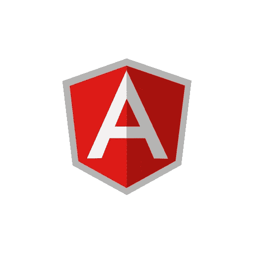

# 什么是有角？

*   Angular 是一个基于 Typescript 的开源 web 应用程序开发框架。
*   Angular 用于开发复杂的'*单页应用程序* ' ( *SPA* )项目。

# 为什么要学 Angular？

*   棱角分明的背后是*(即。由)* **谷歌**维护，所以它会在这里呆很久。
*   Angular 有一个庞大而活跃的开发者社区，所以如果被困在某个地方，你可以很容易地从社区获得支持。
*   Angular 为您的 web 应用程序提供了适当的结构，这有助于我们以更好的方式可视化项目。
*   MVC 架构:MVC 代表**模型-视图-控制器**。*数据*由*模型*管理，*视图*管理*数据显示*。而*控制器*作为视图层和模型层之间的*连接器*。
*   使用 Typescript 而不是 JavaScript，JavaScript 或多或少是 JS 的严格类型版本，帮助开发人员在编译时检测错误，从而减少整体开发时间。

# Angular 和 Angular JS 一样吗？

**Angular JS** 是 Angular 1，Angular 是 Angular 2+。谷歌为 Angular 2 完全重写了 Angular，使 Angular JS 基本上成为一个完全独立的框架。

> **简短打字稿**
> 
> Typescript 是由微软开发和维护的开源、面向对象的语言，它是 JavaScript 的类型化超集，可以编译成普通 JavaScript。
> 
> JavaScript 是一种动态编程语言，它不检查赋给变量的值& JavaScript 不支持面向对象的特性。
> 
> 类型系统提高了代码质量和可读性，并使维护和重构代码库变得容易。
> 
> 因此，选择 Typescript 而不是 JavaScript 的原因是，它可以在编译时检测错误，支持面向对象的编程特性。如果你熟悉 JavaScript，那么转向 Typescript 是小菜一碟
> 
> **角度更新**
> 
> Angular 的最后一个稳定版本:2021 年 3 月 10 日的 11.2.5。
> 
> 角度更新非常频繁，每 2-3 个月发布一次小版本，每 6 个月发布一次大版本。

# Angular 入门

## 装置

*   第一步是从 *npm (* 节点包管理器)——*安装 **Angular CLI** (如果 npm 不存在，则安装*[*Node . js*](https://nodejs.org/en/download/)*，npm 将随之而来。)*

> **Angular CLI** 是一个**命令行**界面工具，您可以使用它直接从命令外壳初始化、开发、搭建和维护 **Angular** 应用程序。

*   在终端输入命令安装 angular CLI `npm install -g @angular/cli`
*   为了创建一个新的角度项目，输入命令`ng new helloworld-app`，`ng new`在工作空间的根级创建一个初始的框架应用程序

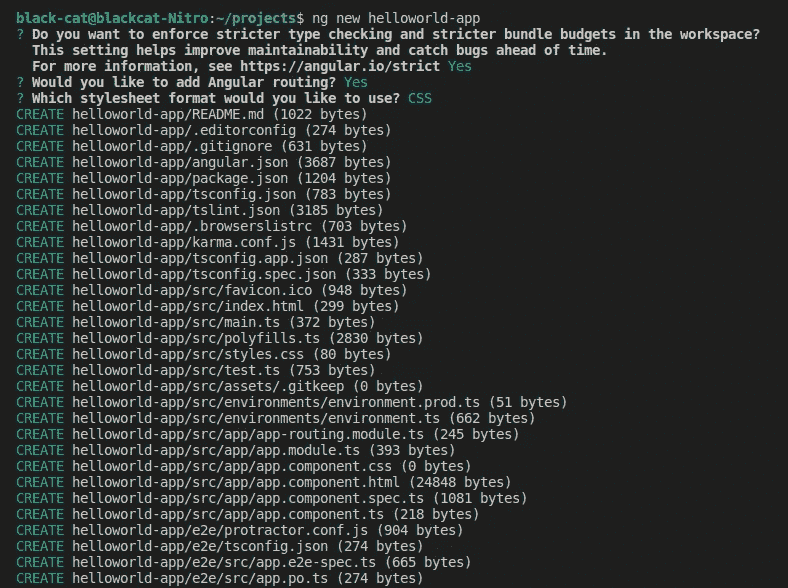

*   为了服务于创建的项目，从项目目录中输入`ng serve`。

## 文件结构


root folder

*   **package.json** :配置 [npm 包依赖关系](https://angular.io/guide/npm-packages)，可用于工作区中的所有项目。
*   **angular.json** :工作区中所有项目的 CLI 配置默认值，包括 CLI 使用的构建、服务和测试工具的配置选项。
*   **editorconfig.json** :代码编辑器的配置。
*   **/src** :存放源代码的目录。

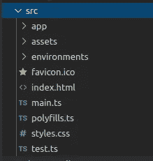

src folder

*   **index.html:**index.html 作为完整应用的默认或主页。
*   **styles.css :** 可以给这个文件添加全局样式，也可以导入其他样式文件。
*   这是我们网络应用的入口。它编译 web-app 并引导 AppModule 在浏览器中运行。
*   **/environments :** 该文件夹中有 2 个文件，您可以在其中指定 env。用于*生产*和*开发*构建的应用程序的变量。
*   **/assets :** 在该文件夹中，可以存储 web-app 的静态资产，如图像、图标等。
*   **/app :**

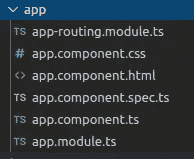

app folder

*   **app-routing.module.ts :** 您可以在这里为应用的不同组件或页面处理路线。
*   **app.module.ts :** 每个 **Angular app** 至少有一个 NgModule 类，根**模块**，习惯上称为 **AppModule** ，驻留在该文件中。

## **组件**

*组件是一个 Angular App 的* ***UI 积木*** *，它们是带有 html css 和 ts 文件的单元积木。*

*   **app.component.ts :** 这是默认的根/app 组件*控制器文件。*
*   app.component.html:这是应用组件的视图。
*   **app.component.css :** 这包含了 app 组件的样式。

## 提供您的内容

在终端中输入命令`**ng serve**`，默认情况下，应用程序将托管在端口 4200 上。— *(要在 4200 以外的端口上服务，您可以运行* `*ng serve --port <port>*`

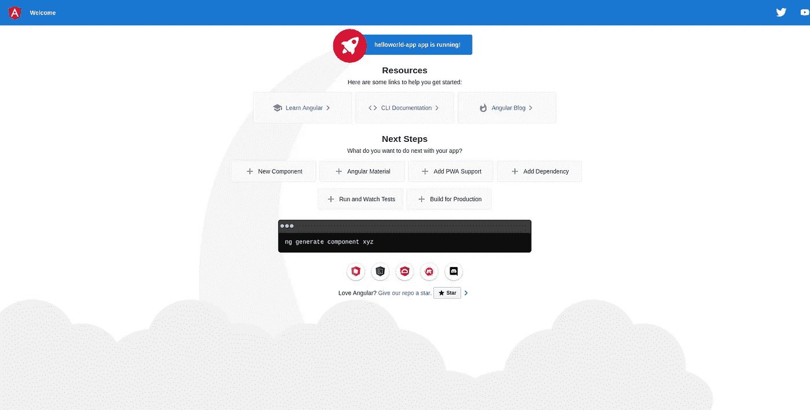

[http://localhost:4200](http://localhost:4200)

## Index.html

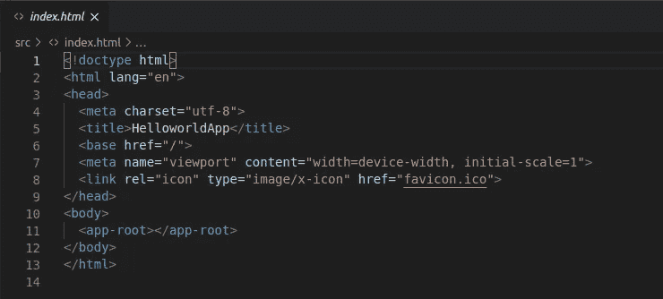

index.html file

*   主体部分包含标签`<app-root></app-root>`，它引用了应用程序模块中的应用程序组件。

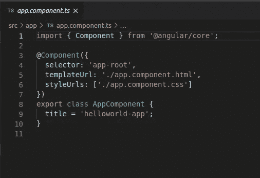

selector value is ‘app-root’ which can be used to add this component anywhere

*   这个 *App 组件*被添加到 body 标签中。
*   打开`**app.component.html**` 并替换它的内容，它会在网站上得到反映。

***角度绑定有两种形式:***

**单向绑定[]或{{}}**

*一种方式的数据绑定是只写数据绑定，它将从模型中读取一个属性并在视图中显示它。*

【app.component.html】

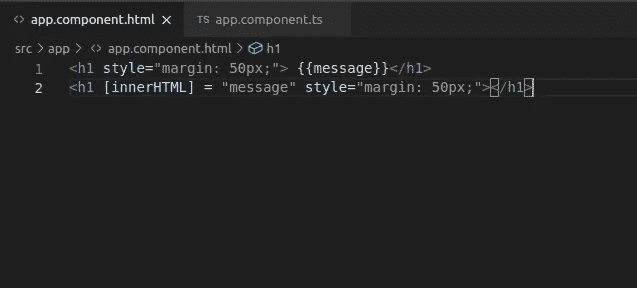

**app.component.ts**

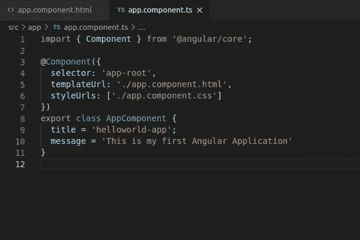

declared the variable ‘`message’` with content I want to show

> 文本插值允许你将动态字符串值合并到你的 HTML 模板中，插值使用双花括号`{{`和`}}`作为分隔符。

**双向装订[()]**

*双向绑定是从输入中读取并更新模型的绑定。他们通常被称为盒子里的香蕉，双向绑定监听特定事件*

*为此，您必须在****app . module . ts***中导入表单模块

并将其添加到导入列表中。

```
import { FormsModule } from '@angular/forms';
```

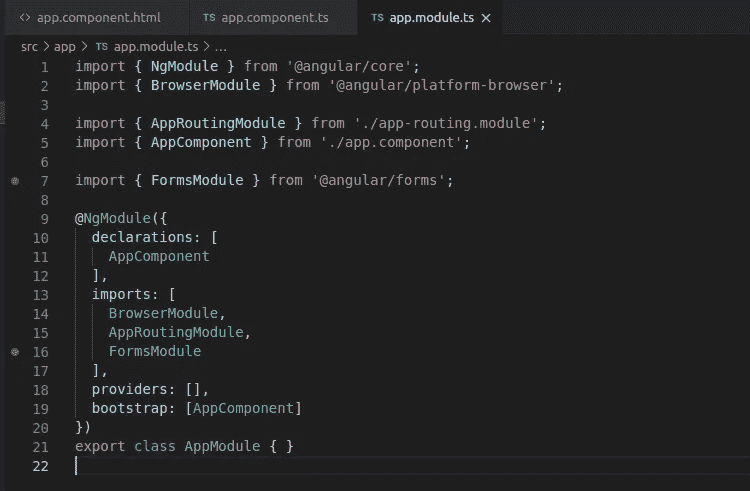

app.module.ts, import forms module and add it to the imports section

## **输出:**

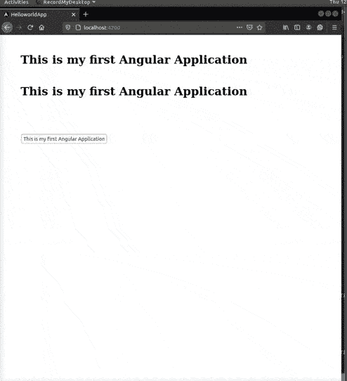

## 部署应用程序

输入命令`ng build -- prod`，它将为您准备一个以 index.html 为入口点的可部署构建。

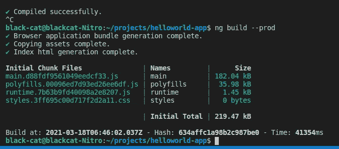

the output will be stored in dist folder

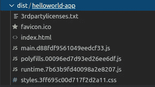

production build

*这是您准备部署的生产就绪应用程序，*

无论你在哪里部署它，请记住 index.html 是网站的入口。

我希望这篇文章能帮助你开始你的棱角之旅。

## 留下掌声👏，关注更多🔥不断学习🤓

[](https://mayankpatel99.medium.com/node-js-express-a-beginners-guide-edf205316ae9) [## Node.js + Express |初学者指南

### 在 10 分钟内编写第一个 Node.js 服务器应用程序

mayankpatel99.medium.com](https://mayankpatel99.medium.com/node-js-express-a-beginners-guide-edf205316ae9)