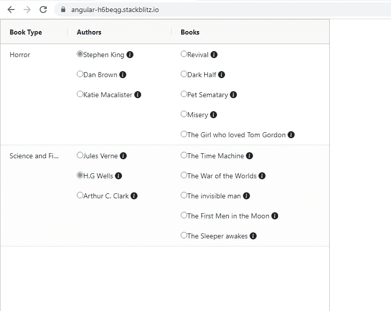
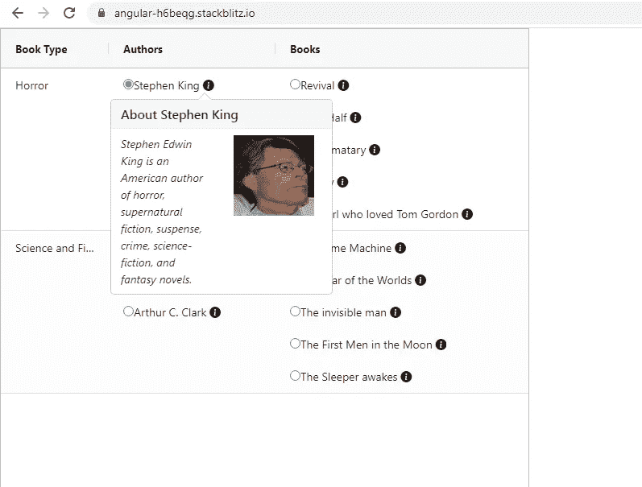
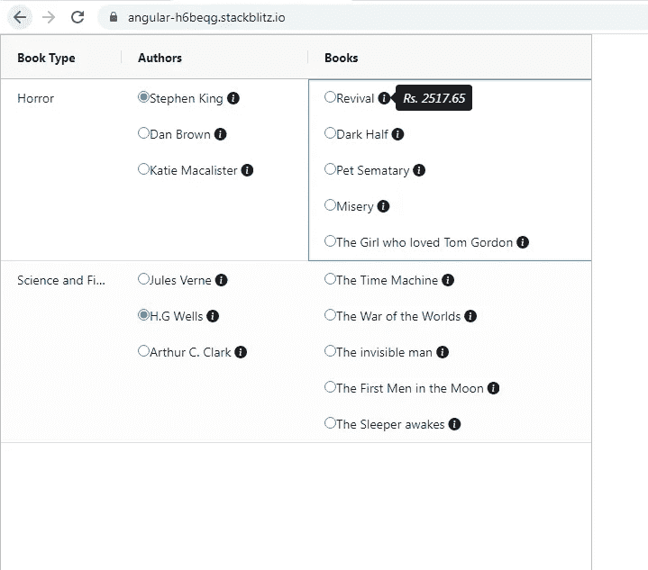
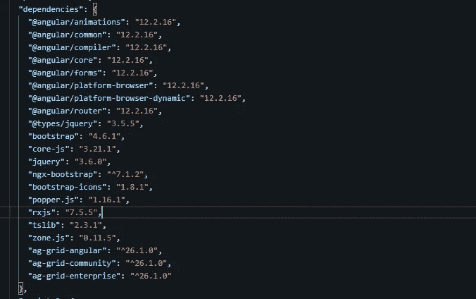
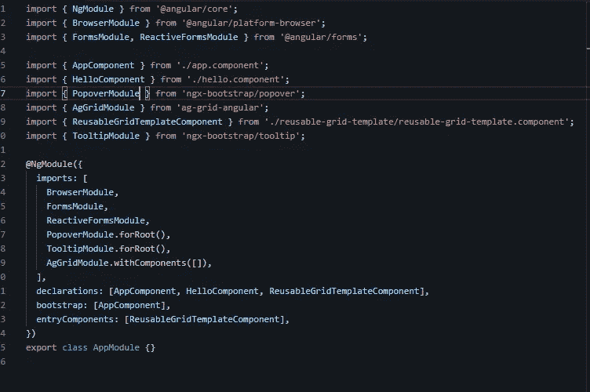
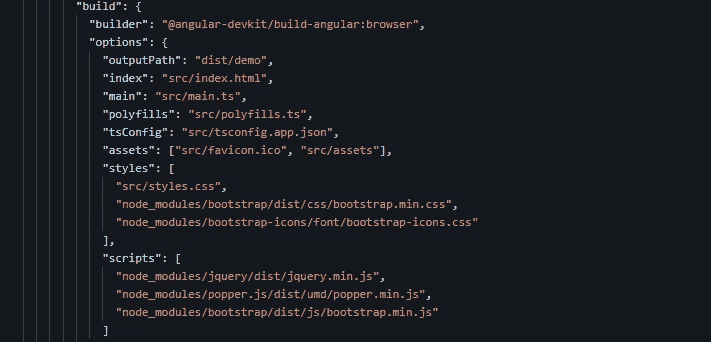

# Angular:将带有动态数据的引导弹出窗口和工具提示添加到 Ag-Grid 表中

> 原文：<https://medium.com/geekculture/angular-adding-bootstrap-popovers-and-tooltips-with-dynamic-data-to-an-ag-grid-table-f6b386b78279?source=collection_archive---------3----------------------->

我总是更喜欢使用 **ngx-bootstrap** npm 模块，以便将任何引导组件添加到我的 Angular 应用程序中。原因是，它不需要在组件中添加任何 Jquery 代码，也不需要任何复杂的设置。

我举了一个非常简单的例子，在 Ag-Grid 表中显示作者列表和这些作者写的书。过去我已经多次使用过这个例子，现在我将再次使用它来演示工具提示和弹出窗口:)

下面是我们将要使用的数据。这是一个从 **books.ts** 导出的对象数组

每个对象描述了书的类型、写了该类型的书的几个作者、关于作者的一些信息、作者的形象、他们写的书以及每本书的价格。

这些是我们的目标:

1.  将上述数据填入 Ag-Grid 表，如下所示。我们已经显示了**图书类型**和在该特定图书类型下著书的**作者列表**。点击一个特定的作者，我们会显示该作者写的几本书。

故事的重点不会放在如何使用<ng-template>将数据显示在表格上。这超出了故事的范围。如果你想理解这个概念，你可以看看下面的两个故事。</ng-template>

 [## Angular:如何创建一个在 Ag-Grid 表格中使用模板的可重用组件

### 如果你想让一个 Ag-Grid 表格与你的应用程序交互，在表格中插入模板是非常有用的。

javascript.plainenglish.io](https://javascript.plainenglish.io/creating-a-reusable-component-for-using-templates-in-ag-grid-tables-6d9a8dfc88e3)  [## 如何在 Ag-Grid 表格中使用表格数组和表格组

### Ag-Grid 确实提供了添加复选框和下拉框的功能，但是当我在……

javascript.plainenglish.io](https://javascript.plainenglish.io/using-formarrays-and-formgroups-in-ag-grid-tables-e02dd7af51f1) 

2.我们在每个作者的名字旁边和每本书的名字旁边显示一个信息图标。将**悬停在作者姓名**旁边的图标上，我们将显示一个**弹出窗口**，显示关于作者的**几行文字以及作者**的**图像。只有当我们点击弹出窗口之外的某个地方时，弹出窗口才会消失。**

在**上点击图书名称**旁边的图标，我们会显示一个**工具提示**，显示图书的**价格。当我们再次点击图标时，工具提示消失。**

PopOver showing the author details and image

ToolTip showing the price of the book

下面是安装在 **package.json** 中的依赖项。

package.json

这就是我们如何将 **ngx-bootstrap** 中的 **PopoverModule** 和 **TooltipModule** 添加到应用程序中。

AppModule

下面是 **angular.json** 的截图，在这里我们已经导入了 **bootstrap、jquery 和 popper.js 库**。

angular.json

下面是**弹出模板**，我们将应用于表中的作者姓名。该模板引用了 **popOverIcon。**传递给该模板的数据将是作者的姓名、作者的几行文字和一个包含作者图像的 url。

下面是我们将应用于每个书名的**工具提示模板**。该模板有一个引用 **toolTipIcon。**传递给该模板的数据将包含每本书的价格。

现在让我们看看这些模板将如何在表格中使用。我们使用 FormArrays 和 FormGroups 来显示表格数据。

下面是取自组件模板的一小段代码，我们在表格中作者姓名旁边使用了单选按钮。我们已经将模板引用 **popOverIcon** 传递给了**ngtemplateetout**属性，并且将要在 PopOver 中显示的数据传递给了**ngtemplateeutletcontext**属性。

类似地，我们在组件模板的下面部分应用了工具提示模板，在那里显示了图书名称旁边的单选按钮。我们已经将模板引用 **toolTipIcon** 传递给了**ngtemplateoutoutlet**属性，并将数据显示在**ngTemplateOutletContext**属性的 PopOver 中。

请点击下面的链接查看完整的工作示例。

 [## 角形(叉形)堆叠

### 一个基于 rxjs，tslib，core-js，zone.js，@angular/core，@angular/forms，@angular/common 的 angular-cli 项目…

stackblitz.com](https://stackblitz.com/edit/angular-h6beqg?file=src/app/app.component.html)