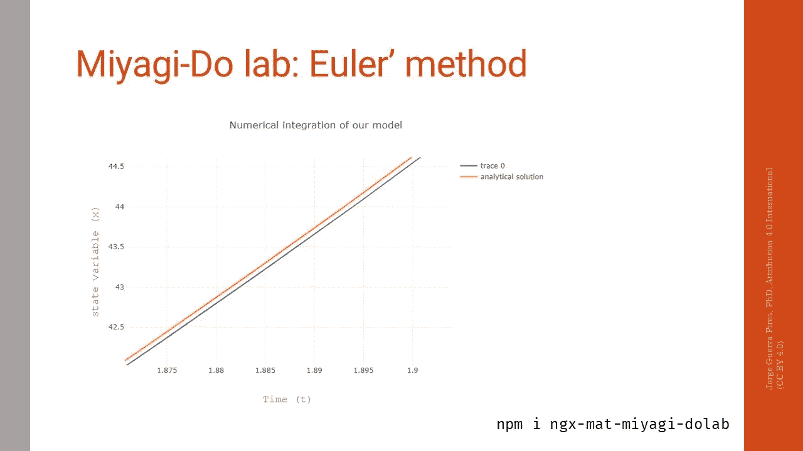
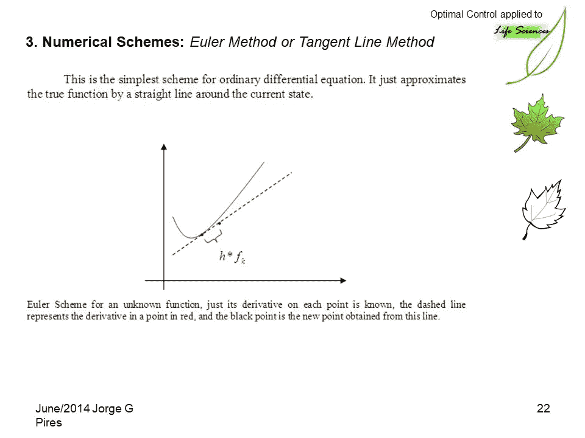
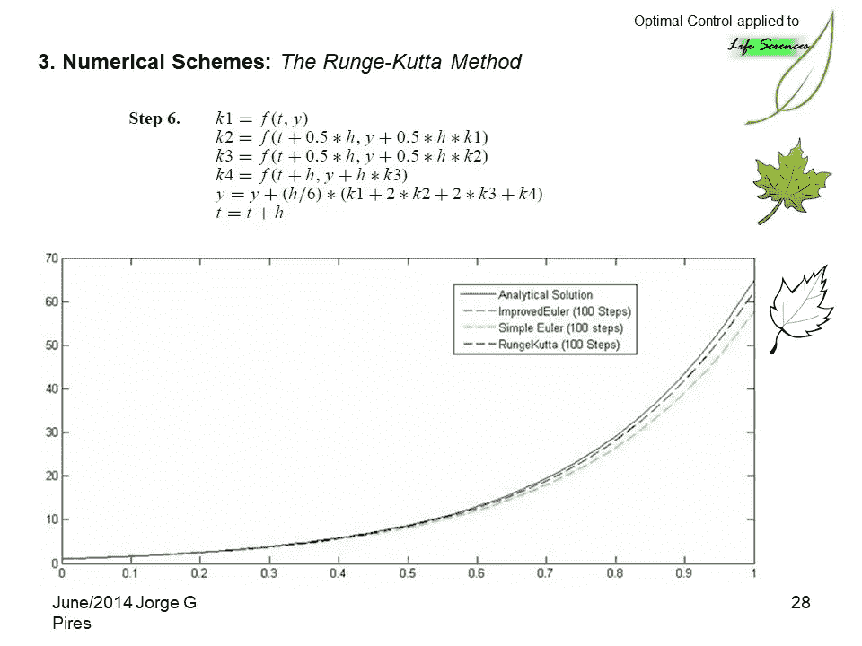
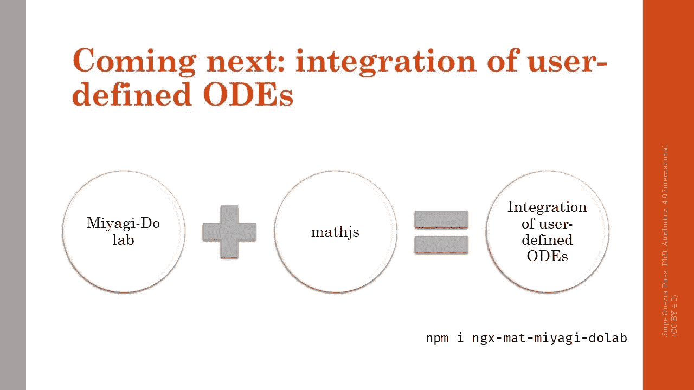
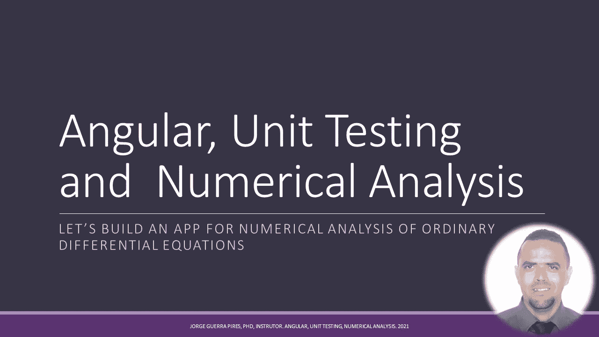

# 角度和数值分析:创建常微分方程数值积分库，欧拉方法

> 原文：<https://medium.com/geekculture/angular-and-numerical-analysis-creating-a-library-for-numerical-integration-of-odes-eulers-71f62966eefa?source=collection_archive---------21----------------------->

最近，我想用数值积分来计算角度。我找到了几个包，但是，它们都是针对 Node.js 的。

如今，我们在前端可以做的事情很多:我)[机器学习](https://jorgeguerrapires.medium.com/why-am-i-considering-seriously-javascript-and-deep-learning-and-i-would-suggest-you-to-do-so-976b7f89b4f0)；ii) [数据库连接](/geekculture/firebase-and-angular-connect-your-frontend-app-to-a-nosql-database-quickies-1-974c298316a9)；iii) [下棋并分析你的对手](https://lichess.org/)！我正在努力让你也能在前端运行数值模拟！

# 为什么我创建了这个库

我的第一次尝试:

*   使用 Octave，[就像我在我的电子书](https://www.youtube.com/watch?v=7b7NOBm0tKk&t=3s)上做的那样——问题是我找不到一个在前端使用 Octave 的简单解决方案，在后端也是如此；
*   使用 NPM 上已经建立的图书馆——找到了几个，没有一个是 Angular/Typescript，很快就要写一篇关于这个问题的文章了！
*   在我的第二个博士后期间，他们用 Galaxy 在一个单独的服务器上运行这些计算，真是一团糟！

 [## 将 Octave 代码集成到一个均值堆栈网站

### 感谢贡献一个堆栈溢出的答案！请务必回答问题。提供详细信息并分享…

stackoverflow.com](https://stackoverflow.com/questions/48243845/integrate-octave-code-to-a-mean-stack-website) 

Euler’s method compared to the actual solution

Optimal Control applied to life sciences: a numerical method based presentation. [https://www.academia.edu/18365349/Optimal_Control_applied_to_life_sciences_a_numerical_method_based_presentation](https://www.academia.edu/18365349/Optimal_Control_applied_to_life_sciences_a_numerical_method_based_presentation)

Optimal Control applied to life sciences: a numerical method based presentation. [https://www.academia.edu/18365349/Optimal_Control_applied_to_life_sciences_a_numerical_method_based_presentation](https://www.academia.edu/18365349/Optimal_Control_applied_to_life_sciences_a_numerical_method_based_presentation)

# 用户定义的衍生产品

刚刚增加了一个新功能:Cameleon 是一个通用函数，使用 mathjs，你可以定义自己的函数，并正常集成，就像库中已经有的函数一样。

总的来说，这个符号就像任何基于数学的软件，比如 Octave。看到这里一个记事本:[https://mathjs.org/](https://mathjs.org/)

thanks to mathjs now you can add your own function for integration, awesome!

我们的图书馆，玩得开心！😎

 [## ngx-mat-miyagi-dolab

### 目前，正在编写更好的文档，请参见…

www.npmjs.com](https://www.npmjs.com/package/ngx-mat-miyagi-dolab) 

这里使用这个库，如果你要使用它，请告诉我！

 [## 🚀宫城实验室

### 学习生物数学并从中获得乐趣😎

miyagi-do-lab.herokuapp.com](https://miyagi-do-lab.herokuapp.com/) 

# **问&答**

## Wolfram Online 怎么样？

询问 mathjs，我们将在未来将其添加到我们的应用程序中！这个问题适用于我们的情况！

来自:理论和数学生物学脸书小组

 [## 登录或注册查看

### 查看关于脸书的帖子、照片和更多内容。

www.facebook.com](https://www.facebook.com/groups/166785337147063/posts/1174522946373292/?comment_id=1174667626358824&notif_id=1636832765441983&notif_t=group_comment&ref=notif) 

是个不错的选择，但是是有偿的！而且还挺贵的！这个解决方案是免费的，你可以添加到你的应用程序！PS。付费，我的意思是，如果你想在你的在线应用程序中使用，你不能访问代码。

这里有一些来自他们的开源代码:[https://www.wolfram.com/open-materials/?FB clid = iwar 1 a 47 jq jw 6 khxjcgul 9 kzxnvkurz _ rz 9 lltyf 9 apqglwl 4a-1 r7o 7 GD 0 ls](https://www.wolfram.com/open-materials/?fbclid=IwAR1A47jqjw6KhxJcGul9KZxnvKURz_rZ9LLTyf9APqglwL4a-1R7o7GD0Ls)

对于那些不知道的人:Wolfram 是 Mathematica 背后的团队，Mathematica 是最强大的符号计算软件之一，我用在分叉理论上，以泰勒级数展开，相当有用。[甘娜教授还在建模上使用了 COVID](https://www.youtube.com/watch?v=LU0vndZMfbI&t=21s) 。

Upcoming course