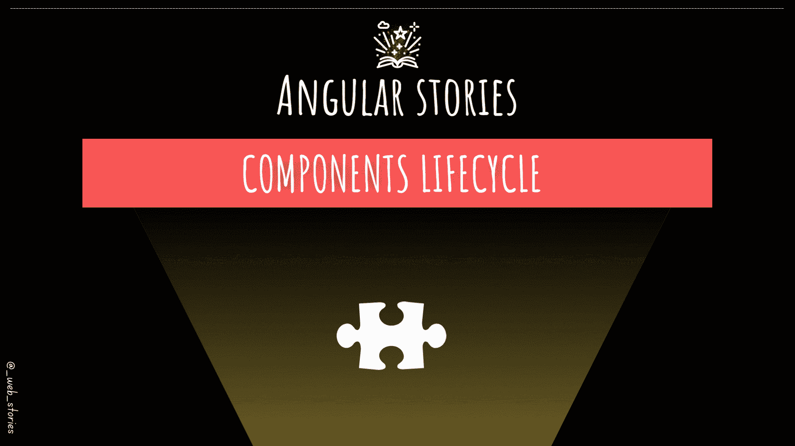

# 角形组件挂钩

> 原文：<https://medium.com/geekculture/angular-component-hooks-6fa0d9279d60?source=collection_archive---------11----------------------->

## [👀VV] —通过使用组件生命周期控制 Angular app

By FAM

## 你好👋

希望你没事！在上一集中，您学习了 Angular 中的组件构成: