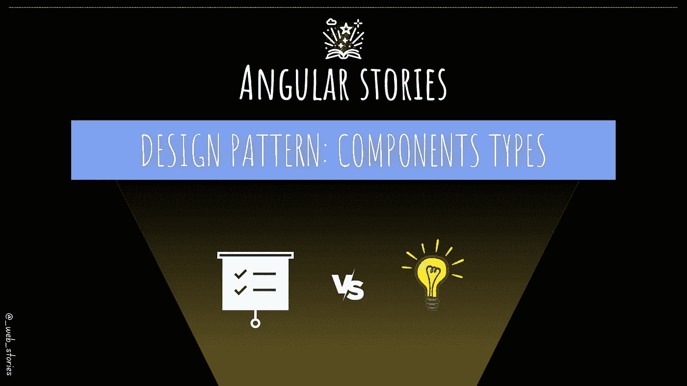

# 角度组件类型

> 原文：<https://medium.com/geekculture/angular-component-types-4b9c57877639?source=collection_archive---------7----------------------->

## [👀VV] —如何设计您的角形组件？

By FAM

## 你好👋

欢迎或者欢迎回到 Angular stories 系列。在继续今天的故事之前，我要感谢艾哈迈德·哈菲兹成为我的新推荐会员。非常感谢您的信任和支持。意义重大！