# 角分量单位测试

> 原文：<https://medium.com/geekculture/angular-component-unit-test-cfa8f650880e?source=collection_archive---------20----------------------->


# 介绍

组件是最小的单元，也是 Angular 中最常见的用例。到目前为止，我们已经学习了如何用 Angular 编写单元测试，涵盖了一些基本概念、[茉莉匹配器](https://simpleweblearning.com/writing-your-first-test-in-angular)和[与间谍一起工作](https://simpleweblearning.com/working-with-spies-in-angular-unit-test)。在本教程中，我们将应用到目前为止所学的知识，并演示如何用角度组件编写单元测试。

对于本教程，我们准备了一个简单的购物车应用程序:

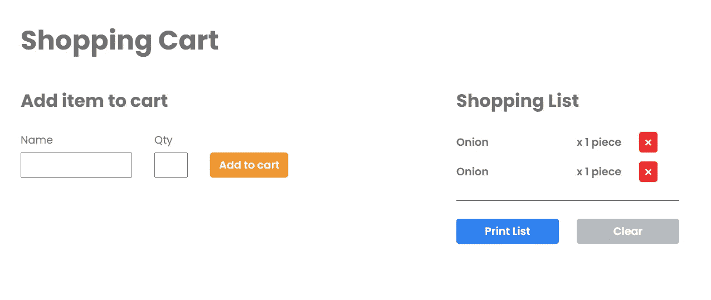

Shopping Cart Application

该应用程序由两个组件组成，我们将针对这两个组件编写单元测试 HomeComponent 和 ShoppingListComponent。该应用程序由两个组件组成，我们将针对这两个组件编写单元测试 HomeComponent 和 ShoppingListComponent。

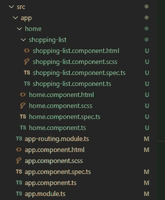

*Component Files*

# 准备试验台

当您通过运行 **ng test** 命令开始测试时，您会注意到，即使没有为这两个组件编写任何测试，输出浏览器上也已经出现了许多错误。

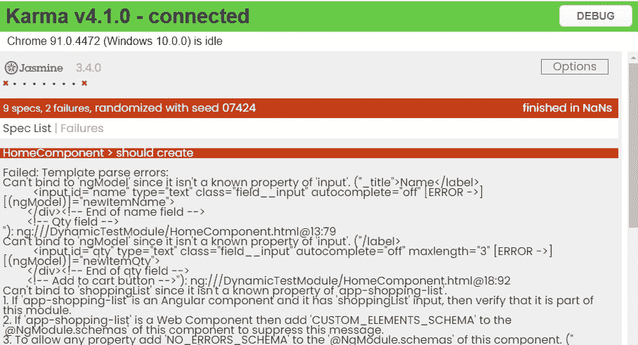

*Initial Fail Tests*

这是因为我们还没有建立我们的试验台。正如在第一篇教程中提到的，在角度测试环境中，我们必须明确定义测试床中需要的任何模块、服务或子组件。在控制台中，指令 **ngModel** 无法识别，因为我们还没有导入 FormsModule。

通过在测试床配置部分添加一个 **imports** 数组，我们可以很容易地将 FormsModule 导入到我们的测试床中。

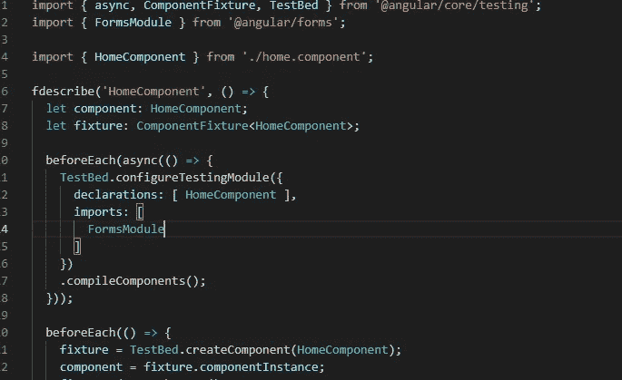

*Import FormsModule*

在我们导入 FormsModule 并再次保存后，我们将看到 ngModel 错误已经解决，现在又出现了新的错误。

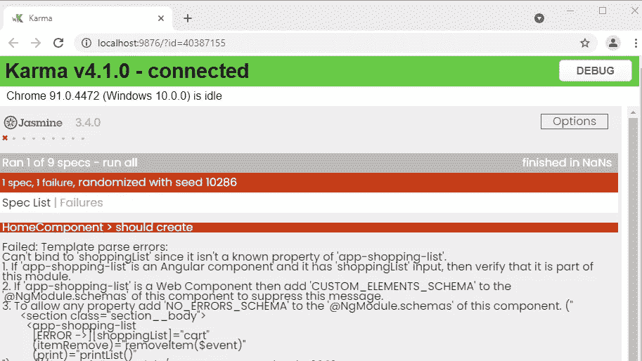

*After importing FormsModule*

这一次，Angular 抱怨它不能识别我们的 shipping-list 组件指令。为了解决这个问题，我们需要在我们的测试床中声明这个组件。

虽然您可以在声明数组中声明真正的组件，但是建议您创建一个模拟类组件，这样我们可以尽可能简单地保持模拟组件。

让我们定义一个模拟购物清单组件:


*Declare Mock Child Component*

您可以在测试套件之前直接声明一个模拟组件。正如您从上面的图片中看到的，在我们的模拟组件中，我们将组件模板设置为空，只是为了使它更简单。真正重要的是，您需要保持选择器与实际组件一致，以便 Angular 知道您在测试期间在 HTML 中引用了这个组件。此外，如果您的子组件包含任何输入或输出声明，您还必须将它们包含在您的模拟组件类中，以便您可以在父组件中引用它们。

修复后，我们将在屏幕上看到一个成功的输出。

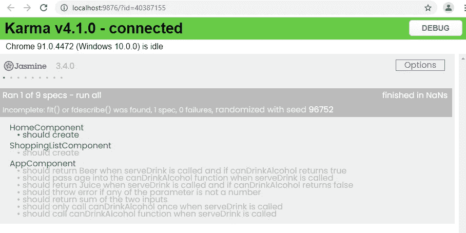

*Result after declaring mock component*

现在让我们也为 ShoppingListComponent 修复测试平台。

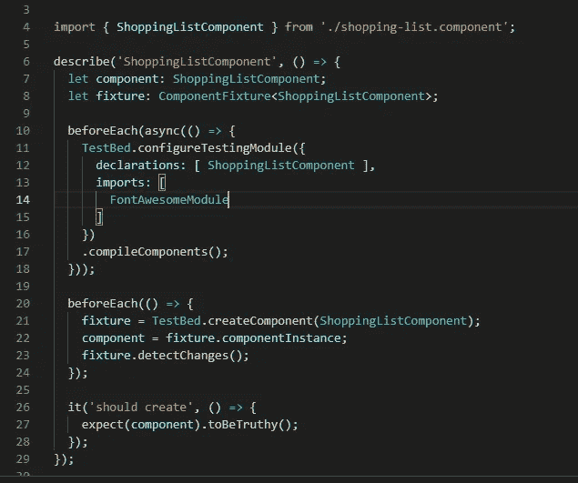

*Fix TestBed for the ShoppingListComponent*

在导入了 FontAwesomeModule 之后，我们现在看到了一个成功的屏幕，可以开始进行单元测试了。

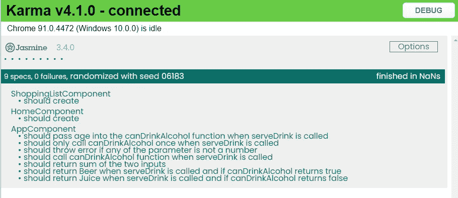

*Results after fixing TestBed for ShoppingListComponent*

# 角形部件要测试什么？

在 Angular 中的组件测试中，有三个主要方面需要在测试中涵盖:

1.  HTML
    在 HTML 相关的测试中，您想要测试 HTML 是否按照您期望的方式组织或编写。这种测试的目的是让您知道，如果有一天您或其他开发人员以不同于组件最初设计的方式更改了 HTML
2.  TypeScript
    TypeScript 是我们组件的主要逻辑所在，因此也是大多数单元测试的内容。通常，在为 component.ts 文件编写测试时，您希望测试每个函数是否有正确的输入/输出，以及它们是否以正确的顺序执行(例如，当函数 A 被执行时，函数 B 是否会被调用，等等)。
3.  TypeScript 与 HTML 的关系
    这种单元测试主要测试当 TypeScript 中的某些变量被更新时，HTML 是否被正确呈现。有些人会认为这种测试是集成测试，但是，我更愿意把它看作是组件单元测试的一部分..因为 HTML 和 TypeScript 都必须正确运行，组件才能被认为正常工作。

## HTML 测试

在我们针对 HTML 编写测试之前，让我们看看我们的 HTML 文件。

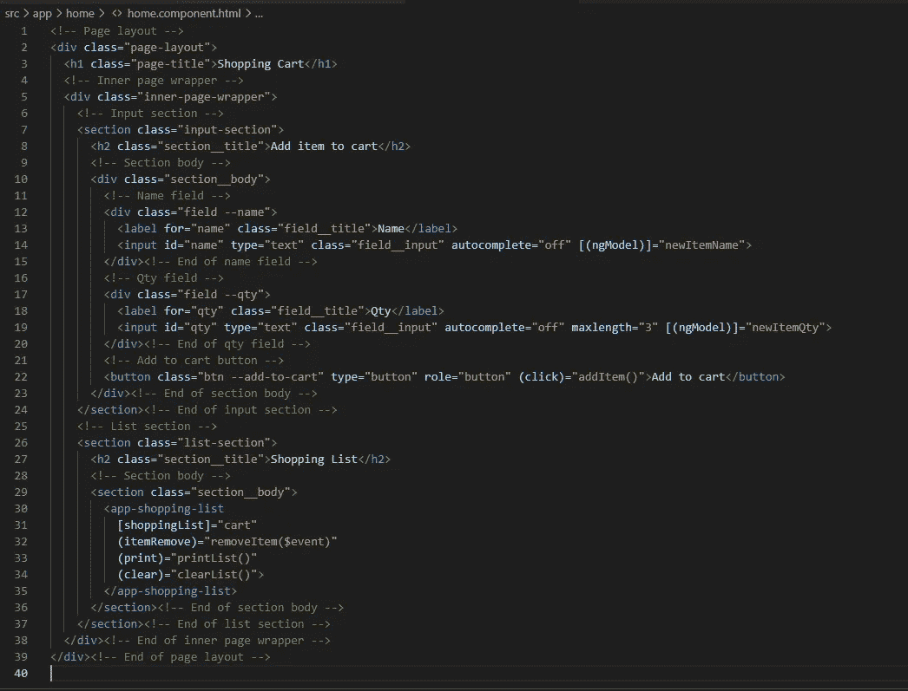

*home.component.html*

## 测试 DOM 元素是否存在

虽然 HTML 中没有多少行代码，但是如果你一行一行地测试它们，那就很奇怪了，而且很容易丢失。一个简单的方法是从外面的前两层开始一层一层地检查它们。

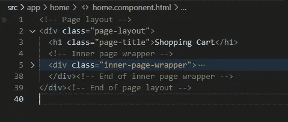

*First two layers of HTML of home.component.html*

对于这两个层，我们想要测试是否确实有一个具有 CSS 类 page-layout 的 div 元素，并且在 page-layout 元素内部，有一个 h1 元素和一个具有类 inner-page-wrapper 的 div 元素。

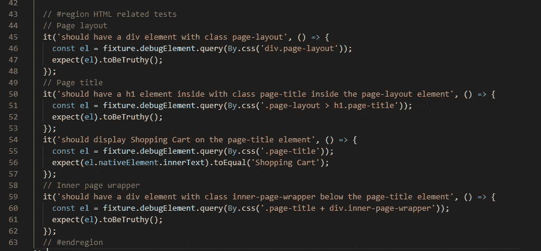

*First two layers tests*

完整的测试，请在 [GitHub](https://github.com/chen1223/unit-test-in-angular) 上找到。

为了测试 DOM 上是否存在 HTML 元素，我们使用了来自 **fixture.debugElement** 的**查询**函数。

在查询功能中，有几个选项可供您选择:

*   这种方法允许你用 css 选择器访问 DOM 元素。这是一个非常强大的功能，因为您可以使用 CSS 选择器选择 DOM 上的任何元素。语法将与使用 [document.querySelector](https://developer.mozilla.org/en-US/docs/Web/API/Document/querySelector) 相同。
*   如果您的目标是 HTML 上特定类型的 DOM 元素，这种方法更适合。您可以传递元素类型。举例来说，如果你正在使用有角度的材质按钮，并且你想要测试在 DOM 上是否有 MatButton。您可以像这样查询它们:

```
const el = fixture.debugElement.query(By.directive(MatButton));
```

注意。如果你想一次选择多个元素，使用 **queryAll** 代替 query。另外，当您通过功能导入**时，请确保您是从**@ angular/platform-browser**导入的。量角器实例仅用于角度端到端测试。**

## 测试 DOM 元素属性

有时我们想测试一个 DOM 元素是否确实具有我们期望的属性。在这种情况下，您可以首先查询元素，然后从 nativeElement 调用 **getAttribute** 函数。

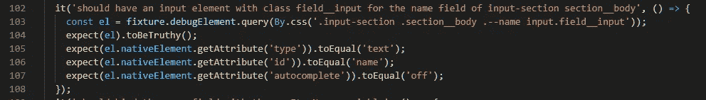

*Test DOM element attributes*

## 测试 DOM 元素显示的文本

要测试 DOM 元素(例如 span、h2 元素)中显示的文本，可以从 innerText 属性访问它们。


*Test DOM element displayed text*

## 测试 DOM 元素 CSS 类

DOM 元素 CSS 类可以通过 nativeElement.classList 属性进行测试。classList 属性将返回一个包含 DOM 元素上所有类的数组。为了测试一个类是否存在于 classList 数组中，我们可以使用 Jasmine 的 toContain 匹配器。

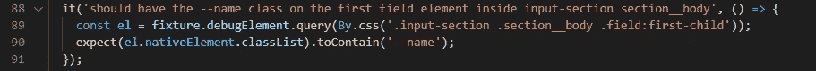

*Test DOM element CSS class*

## 触发 DOM 元素事件

如果您需要在单元测试期间触发 DOM 元素事件，有几种方法可以实现。


*Trigger Button Click event*

*   **triggerEventHandler**
    可以直接在查询函数返回的 debugElement 上调用 **triggerEventHandler** 函数来触发事件。
*   **dispatchEvent**
    你也可以使用原生 **dispatchEvent** 。然而，由于这是一个本机 DOM 方法，您将需要从 nativeElement 访问它，而不是直接从 debugElement 调用它。
*   一些 DOM 元素有自己的方法，你可以直接调用。为了调用它们的本地方法，您需要首先将 nativeElement 转换成相应的 DOM 元素。

# 类型脚本测试

我们来看看 HomeComponent 的 TypeScript 代码。

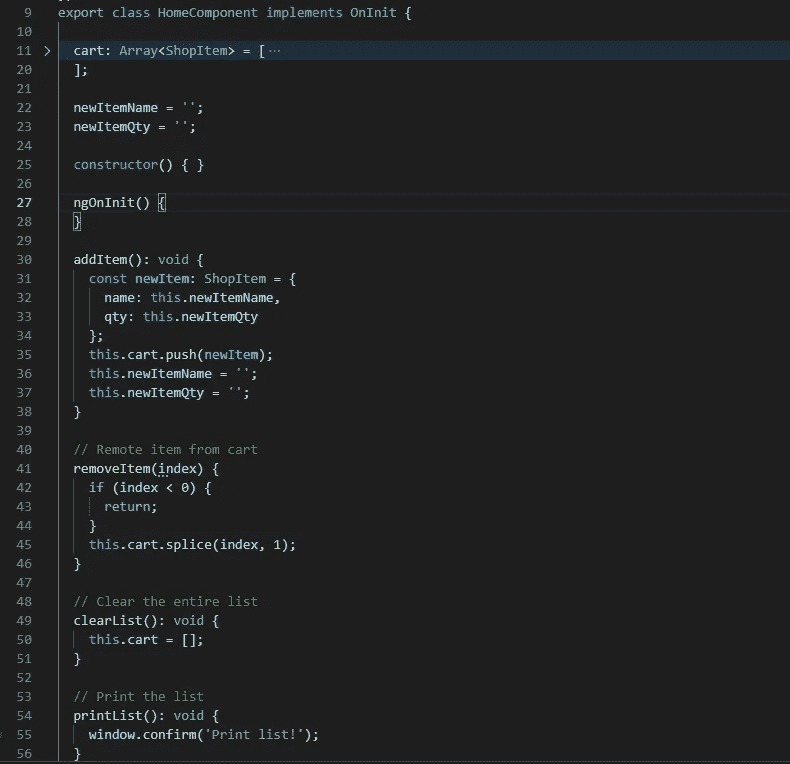

*home.component.ts*

在 TypeScript 测试中，我们可以通过与测试相关的函数对测试进行分组。

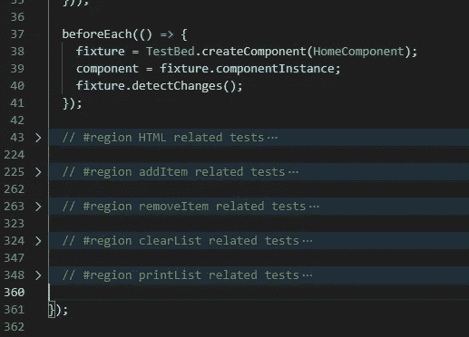

*Group tests by functions*

让我们来看看 addItem 函数，专门演示如何编写 TypeScript 单元测试。

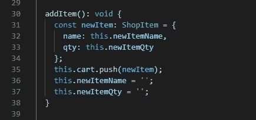

*addItem function*

调用 addItem 时，主要执行两个操作:

1.  具有 newItemName 和 newItemQty 值的新商品被推送到购物车数组
2.  newItemName 和 newItemQty 被清除

我们可以为每个动作编写单元测试。

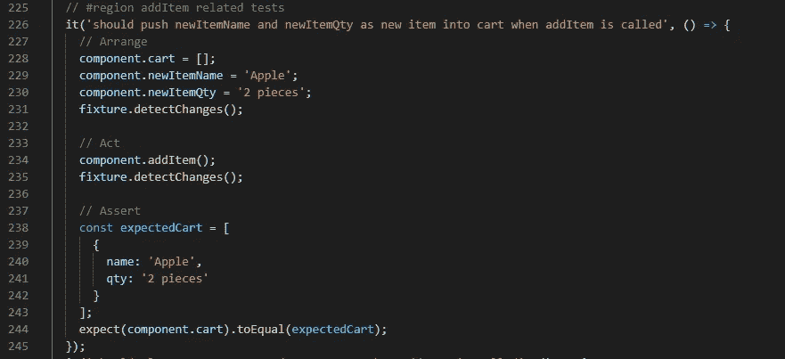

*Test new item added to cart*

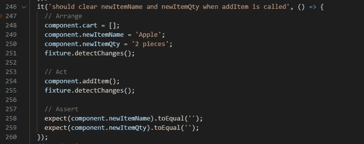

*Test newItemName and newItemQty are cleared*

在为 TypeScript 代码编写单元测试时要记住的一个要点是，要确保单元测试中包含了函数中的所有路径。例如，如果您的函数有一个 If 语句，那么您至少应该编写两个单元测试来测试到达和未到达 if 语句的情况。

# 测试 HTML 和 TypeScript 之间的关系

在一个组件中，通常有不同的方式来链接 HTML 和 ts 文件。我们希望确保我们的单元测试也涵盖了这些关系。

## 事件绑定

对于事件绑定，您希望确保在事件发出时调用相应的事件。

例如:

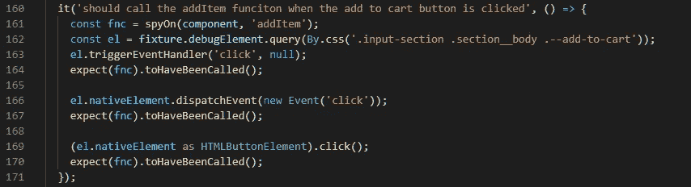

*Test function called on event triggered*

在本例中，我们在 addItem 方法上创建一个 Spy 实例，并检查当按钮发出 click 事件时是否会调用该函数。

# 角度指令测试

角度指令在角度应用中非常常见。让我们来看看本节中最常用的两个指令:ngFor 和 ngif。

## NgIf

NgIf 将隐藏/显示 DOM 上的 HTML 元素。当一个元素被 ngIf 隐藏时，Angular 实际上是将它从 DOM 元素中完全移除，而不是通过 CSS 隐藏。这最终实际上使测试变得更加容易。为了测试一个元素是否被 ngIf 隐藏/显示，我们只需要测试我们是否能成功地查询这个元素。

例如，在 ShoppingListComponent 中，当 shoppingList 输入中没有条目时，我们将显示空消息。

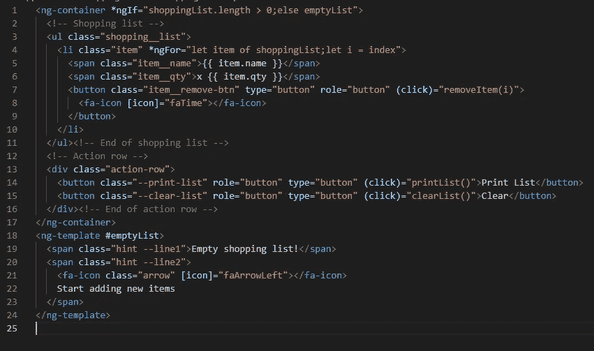

*shipping-list.component.html*

为了测试当 shoppingList 中没有项目时，空消息是否正确显示，我们准备了以下测试用例。

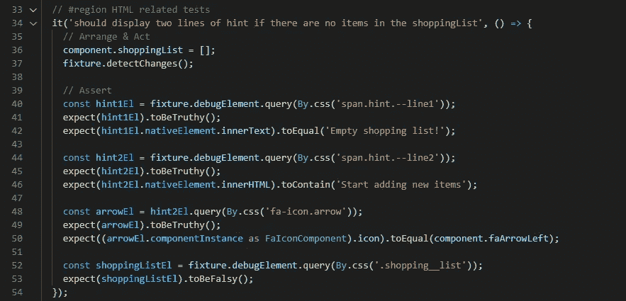

*Test empty messages shown correctly*

相比之下，我们可以测试购物清单是否正确显示，如下例所示:

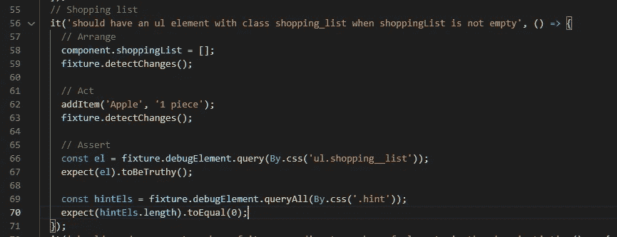

*Test shopping list shown correctly*

## NgFor

NgFor 指令允许我们在 HTML 上快速创建重复的元素。在 ShoppingListComponent 中，我们希望根据 shoppingList 变量中指定的元素在 HTML 上创建购物项目。我们可以通过下面的例子来测试这种行为:


*ngFor testcase*

在这个测试案例中，我们将随机数量的元素放入 shoppingList 数组，并测试 HTML 上呈现的元素数量是否正确。此外，我们使用 forEach 循环来检查每个元素是否正确显示其内容。

注意。在第 90 行到第 93 行，我们不是从 fixture.debugElement 查询，而是从之前已经获取的 itemEl 查询。这种查询将在 item 元素的范围内执行搜索。当您想要测试您正在寻找的元素是否是 HTML 元素的子元素时，这种方法特别有用。

# 父组件和子组件之间的通信

在我们的演示应用程序中，我们让 HomeComponent(作为父组件)与 ShoppingListComponent(子组件)来回通信。在角状发育中，这是很常见的。在这一部分，我们将演示如何测试他们的通信是否正常工作。

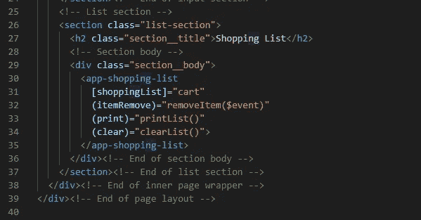

*ShoppingListComponent in the home.component.html*

父组件和子组件通过**@输入**和**@输出**指令进行通信。HomeComponent 将 cart 变量作为 **shoppingList** **输入**传递给 ShoppingListComponent，并从 ShoppingListComponent 接收 **itemRemove** 、 **print** 和 **clear** **输出事件**。

## 输入测试

在下面的测试用例中，我们向 HomeComponent 中的 **cart** 数组添加一个项目(第 192 行到第 199 行)。然后我们直接和 ShoppingListComponent 的 **componentInstance** 中的 shoppingList 变量进行比较(第 191 行和第 200 行)。

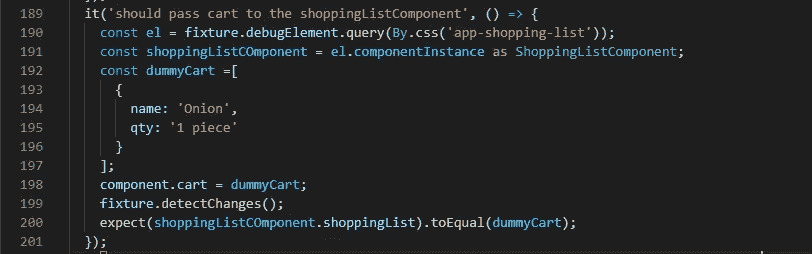

*Test input passes to the ShoppingListComponent*

在角度测试中，componentInstance 的工作方式与组件实例相同。它允许我们访问组件中定义的变量或函数。在这个测试用例中，我们首先使用 HTML 选择器从 HTML 中查询 ShoppingListComponent，然后直接从 componentInstance 访问 ShoppingListComponent 的 shoppingList 输入。

## 输出测试

通常，当一个子组件从它的输出中发出一个事件时，我们会从父组件中执行一个函数。我们可以在下面的测试案例中测试这种行为。

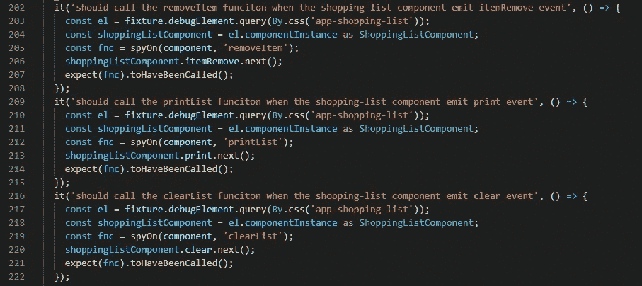

*Output binding test cases*

在上面的三个测试案例中，我们首先在父函数上设置一个 Spy 对象，当子函数发出事件时，我们希望执行这个对象(第 205 行、第 212 行和第 219 行)。

然后，我们使用它的 HTML 选择器查询 ShoppingListComponent(第 203 行、第 210 行和第 217 行)。

最后，我们通过 ShoppingListComponent 的 **componentInstance** 手动发出事件(第 206 行、第 213 行和第 220 行)，并测试我们的间谍是否被调用。

# 结论

在本教程中，我们已经讨论了为角度组件编写单元测试时的许多主题。尽管浏览这个购物清单演示应用程序的所有测试用例是相当困难的，但是我们已经涵盖了为了编写角度组件的单元测试而需要学习的大多数场景。完整的代码及其单元测试可以在 [GitHub 上找到。你可以找到我为这个演示应用程序准备的所有测试用例。](https://github.com/chen1223/unit-test-in-angular)

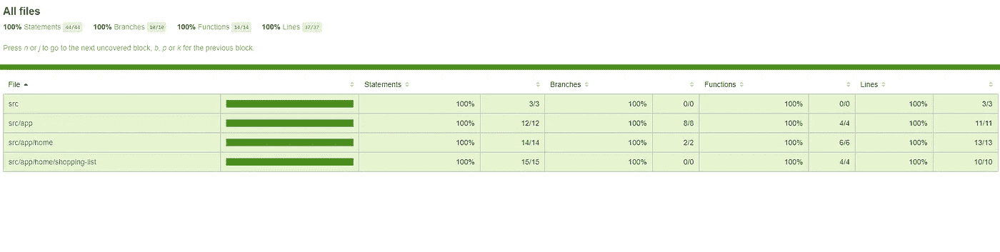

*Test Coverage of the Shopping List Application*

正如你可能已经注意到的，尽管我们已经在本教程中涵盖了这么多的主题，我们还是完全忽略了角形的单元测试。这是因为角形测试包含了大量的主题，这些主题本身就可以形成一个教程。在下一个教程中，我们将看看如何为角形编写单元测试。