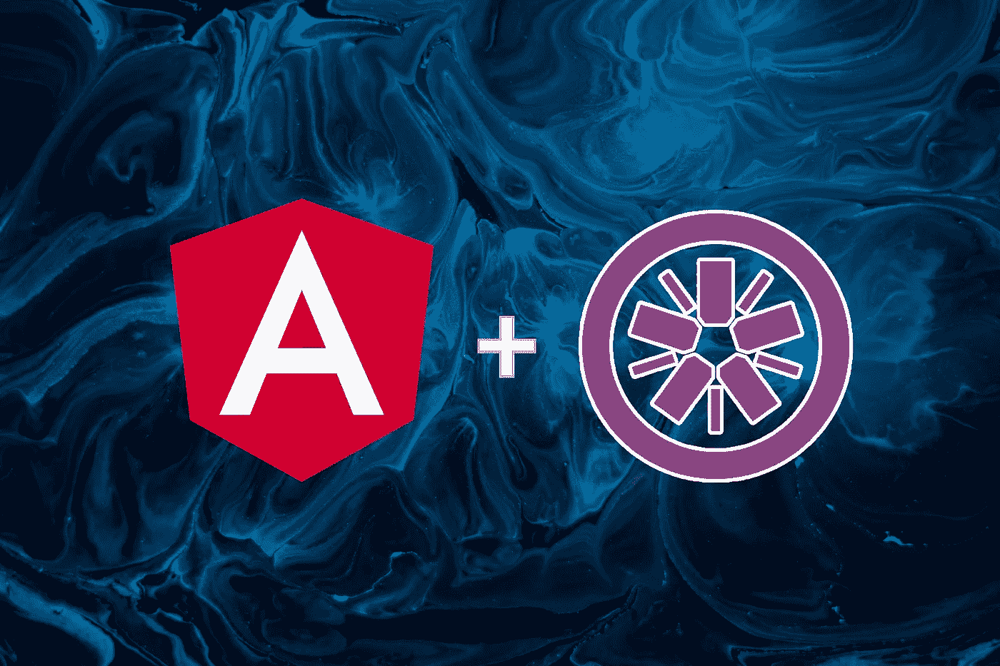

# 角形部件单元测试——常见用例

> 原文：<https://medium.com/geekculture/angular-components-unit-test-common-use-cases-ad5f90916f40?source=collection_archive---------5----------------------->



在本文中，我将提供一些用于单元测试角度组件的重要语句的集合。您可以在您的项目中直接使用以下任何示例，或者您可能更喜欢将其中一些提取到单独的帮助器函数中，并在整个项目中重用它们。本文涵盖了对以下场景的测试:

*   [文本插值](#9ed3)
*   [用户输入值改变](#05e7)
*   [点击 HTML 元素](#3c19)
*   [访问子(嵌套)组件](#1f82)
*   [内容投影](#da39)
*   [组件输入和输出](#a646)
*   [组件依赖关系](#a9d2)

为此，假设我们有以下使用 Angular CLI `ng g c ExampleComponent`生成的简单示例组件:

一个非常基本的组件由一个输入`header`和一个属性`name`组成，使用直接插值法显示在模板中，一个表单有一个输入字段和一个提交按钮，一个输出`nameChange`在用户提交表单时发出一个事件。

当您使用 Angular CLI 创建上述组件时，您将在组件所在的目录中自动获得一个单元测试文件。本文接下来的所有部分都基于这个文件，尤其是夹具对象`let fixture: ComponentFixture;`。如果您不使用 Angular CLI 生成您的组件文件，您可以在您的项目中复制上述文件，并用您的组件类名替换`ExampleComponent`。

# 文本插值:

在这里，我们确保我们的组件将绑定模板中的正确值。不要忘记调用`fixture.detectChanges()`，它会强制测试床执行数据绑定并更新视图。

# 用户输入值更改:

在这里，我们测试用户与文本输入的交互是否正确地反映在组件类中。注意这里 fakeAsync 和 tick 的使用，因为表单绑定涉及一些异步执行。

# 单击 HTML 元素

# 访问子(嵌套)组件:

假设我们的组件包含一个嵌套的子组件:

`<app-nested-component></app-nested-component>`

您可以按如下方式访问子组件并与之交互:

# 内容投影

测试内容投影并不简单，为此我们需要在被测试的组件周围添加一个包装器组件，并使用该包装器组件通过投影传递内容。让我们将以下投影内容添加到组件的视图中

```
<div class=”projected-content> 
 <ng-content select=”[description]”></ng-content>
</div>
```

我们可以通过添加如下包装器`ExampleWrapperComponent`来测试:

# 组件输入和输出

您可以像测试任何普通组件属性一样测试组件输入。另一方面，可以监视输出并检查它是否发出正确的值。

# 组件依赖关系

组件通常具有帮助组件正确运行的依赖关系(服务)，组件需要与这些依赖关系进行交互。当测试一个组件时，为了正确运行，我们需要为我们的测试提供那些依赖关系。这里我们需要区分提供依赖的两种方式:

## 根注入器中提供的依赖关系:

当组件依赖于根注入器中提供的服务时，您需要向测试床配置提供该服务，以便在运行测试时对组件可用:

请注意，我们在这里使用的是模拟服务，因为与它交互更容易、更安全。之后，您将能够通过调用`TestBed`的`inject`方法在您的测试中访问该服务。

## 组件注入器中提供的依赖关系:

当您的组件中提供了一个依赖项时，您不能使用测试床来访问它，因为它只在注入树的组件级别上可用。在这种情况下，我们需要覆盖组件提供者来提供这种依赖，然后您可以使用组件注入器来访问它。

您是否有或者需要一个本文没有涉及的特定测试场景？请随意添加到评论部分，我们将为您添加一个用例:)