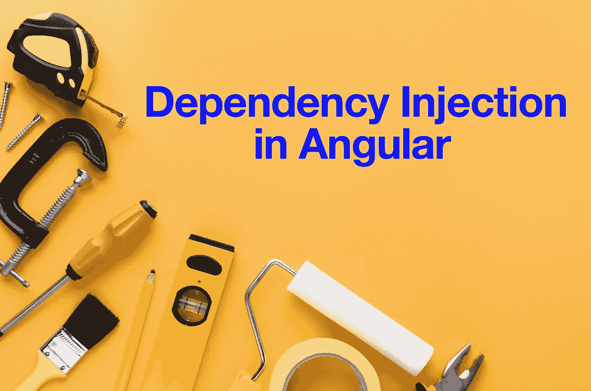
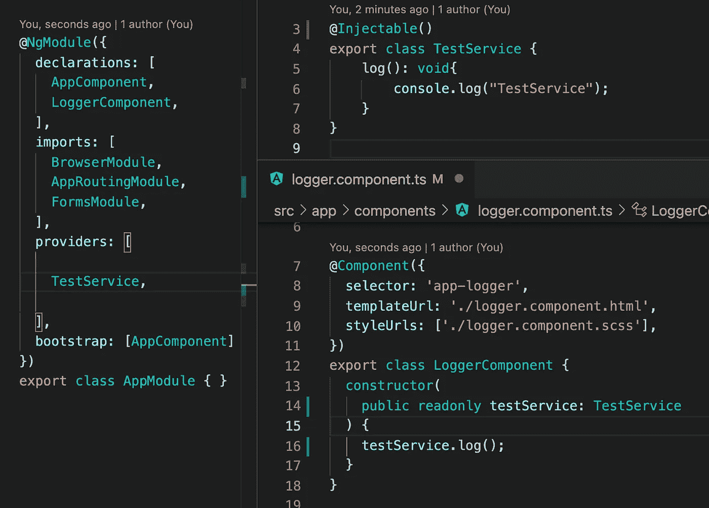
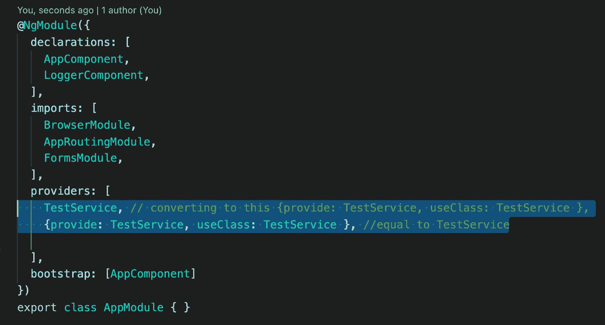
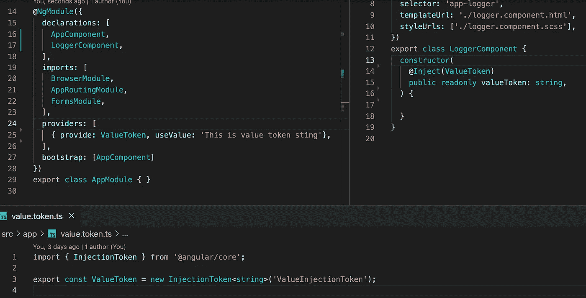
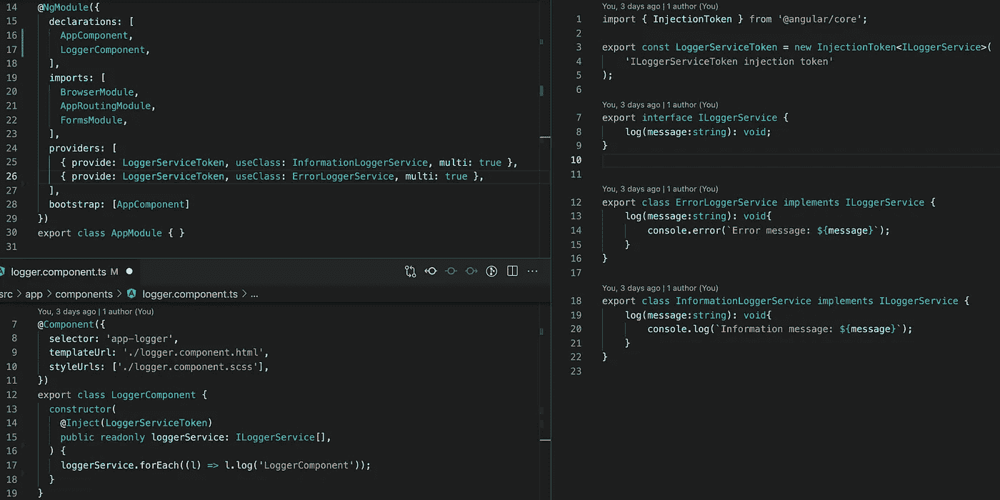
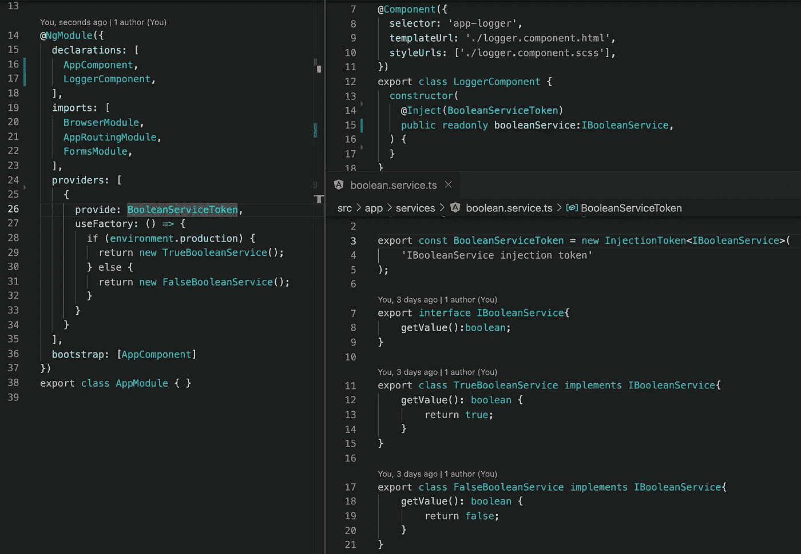

# 角度依赖注入

> 原文：<https://medium.com/geekculture/angular-dependency-injection-7337ecb69aae?source=collection_archive---------4----------------------->

我们都知道如何在 Angular 中使用服务的标准方法。创建一个可注入的服务标记，并将其放入模块的提供者部分。

依赖注入还有一些我们可以使用的技巧。例如，Angular 将模块中带有 TestService 的一行转换为另一行。

我们放入 provider 部分的每个服务都被转换成一个具有两个属性的对象。在提供的属性中，我们可以使用类的名称，也可以创建一个唯一的键，通过这个键将一个对象注入到一个类中。我们甚至可以注入一个变量。

另一个有趣的特性是，我们可以使用同一个键注入多个对象，并将它们作为一个数组使用。

此外，我们可以根据我们的环境注入不同的服务。换句话说，我们可以使用 if-else 语句。

现在你知道角度依赖注入的威力了。

如果你需要仔细看看这个项目[，这里是链接](https://github.com/8Tesla8/injection-token)。

*原载于 2022 年 2 月 7 日*[*【http://tomorrowmeannever.wordpress.com】*](https://tomorrowmeannever.wordpress.com/2022/02/07/angular-dependency-injection-2/)*。*