# Angular:提取模板和反应式表单中单选按钮组和复选框组的精确值

> 原文：<https://medium.com/geekculture/angular-extracting-the-exact-value-of-radio-button-groups-and-checkbox-groups-in-template-and-f1706b912aa6?source=collection_archive---------0----------------------->

获取单选按钮和复选框的值是我见过的一个问题，被多个平台的很多开发者提出过。

我也有这个话题的问题，我想这将是一个好主意，分享我用来解决这个问题的简单方法。

目标如下:

1.  单组单选按钮
2.  单组复选框
3.  多组单选按钮
4.  多组复选框

I .让我们从模板驱动和反应式表单中的**单组单选按钮**开始。

下面是应用程序的屏幕截图。我把它保持得非常简单，这样重点就不会放在其他无关的细节上。

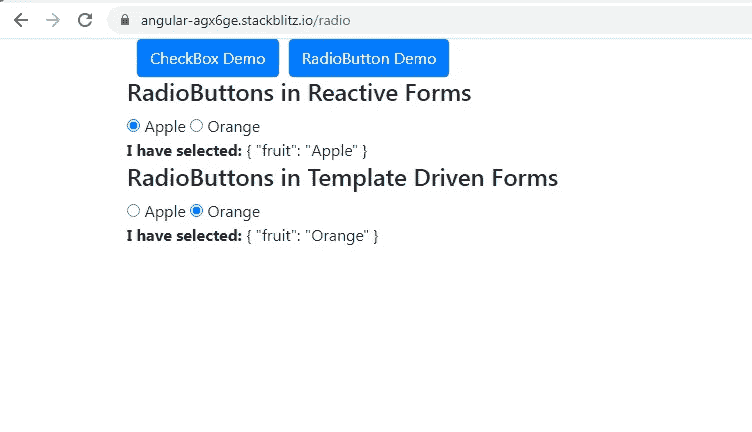

下面是 **RadioButtonComponent** 类。

```
export class RadioButtonComponent implements OnInit {

constructor(private fb: FormBuilder) {}

public radioButtonReactiveForm: FormGroup;
selected: string = ‘Orange’;
public list1: any = [‘Apple’, ‘Orange’];

ngOnInit() {
this.radioButtonReactiveForm = this.fb.group({
fruit: [‘Apple’],
});
}
}
```

我们定义了一个属性 **list1** ，它是一个包含两个水果的数组。我们将在模板和反应式表单中显示这两个单选按钮。

在反应式表单中，**单选按钮反应式表单**是根表单组，只有 1 个表单控件**结果。**我们知道单选按钮的目的是从多个值中选择一个值。我们只需要 1 个 FormControl 来跟踪所选单选按钮的值。

```
this.radioButtonReactiveForm = this.fb.group({
fruit: [‘Apple’],
});
```

我已经将**水果**表单控件的默认值设置为“苹果”。这意味着“苹果”的单选按钮将被选中，而“橙色”的单选按钮将被取消选中。

在**模板表单**中，单选按钮的 **ngModel** 被设置为 **selected** 属性。由于这个 **selected** 属性的值是“Orange ”,我们期望选择“Orange”单选按钮，而不选择“Apple”单选按钮。

让我们转到**单选按钮组件**模板:

```
<h4>RadioButtons in Reactive Forms</h4>
<form [formGroup]=”radioButtonReactiveForm”>
<ng-container *ngFor=”let option of list1; let i = index”>
<input type=”radio” [value]=”option” formControlName=”fruit” />{{ option }}
</ng-container>
</form>

<b>I have selected:</b> {{ radioButtonReactiveForm.value | json }}

<h4>RadioButtons in Template Driven Forms</h4>
<form #radioButtonTemplateForm=”ngForm”>
<ng-container *ngFor=”let option of list1; let i = index”>
<input type=”radio” name=”fruit” [value]=”option” [(ngModel)]=”selected” />
{{ option }}
</ng-container>
</form>

<b>I have selected:</b> {{ radioButtonTemplateForm.value | json }}
```

一、先看反应式表单代码。正如您在下面看到的，我们已经遍历了数组属性 **list1** 并显示了两个水果的单选按钮。

```
<ng-container *ngFor=”let option of list1; let i = index”>
<input type=”radio” [value]=”option” formControlName=”fruit” />{{ option }}
</ng-container>
```

单选按钮的**值属性**设置为水果名称本身，即“苹果”或“桔子”。这里有几点需要注意:

= >当我选择一个单选按钮时，FormControl **fruit** 的值被设置为单选按钮的**值**。

= >如果我最初将 FormControl **fruit** 的默认值设置为一个**空字符串" "**，而不是下面的“Apple ”,那么不会选择任何单选按钮。

```
ngOnInit() {
this.radioButtonReactiveForm = this.fb.group({
fruit: [‘’],
});
}
```

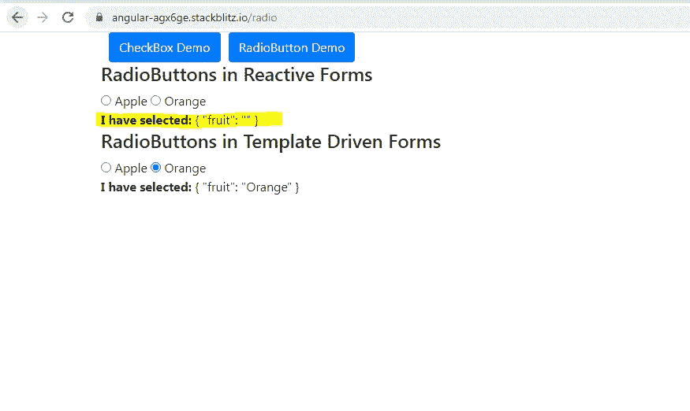

No Radio Buttons selected in Reactive Form

= >我还在模板中打印了表单的值，如下所示。**这意味着您可以使用表单的值轻松提取单选按钮的值。**

```
<b>I have selected:</b> {{ radioButtonReactiveForm.value | json }}
```

现在选择“橙色”单选按钮，将自动更新表单的值，如下所示。

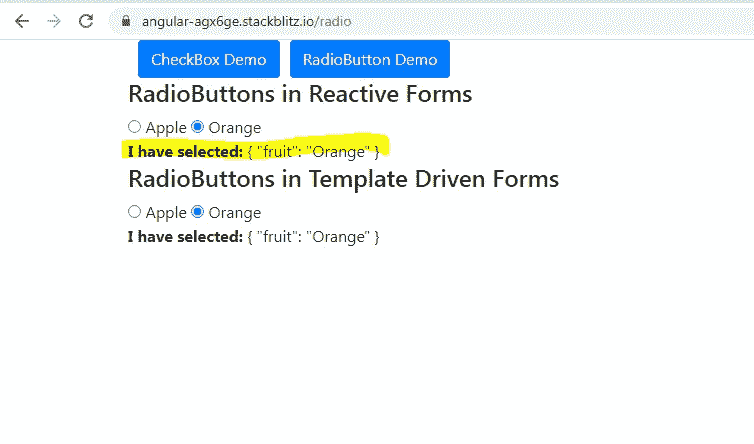

二。移动到模板表单代码。我们已经通过 **list1 属性**进行了类似的迭代。

```
<ng-container *ngFor=”let option of list1; let i = index”>
<input type=”radio” name=”fruit” [value]=”option” [(ngModel)]=”selected” />
{{ option }}
</ng-container>
```

单选按钮的**值属性**被设置为水果的名称。 **ngModel** 已经被设置为**选择的**属性。

我们还添加了一个**名称属性**，它被设置为一个字符串“fruit”。

让我们理解这一切的意义。

= >当我将一个 **ngModel** 添加到 input 元素时，Angular 会自动创建一个 **FormControl** ，将 **name 属性**的值作为键，ngModel 是与键对应的值。所以输入单选按钮必须有**名称属性**。

= >需要从中选择单个值的一组单选按钮必须具有相同的**名称属性**值，这一点很重要。

= >当我选择一个单选按钮时，**选择属性**的值被更新为单选按钮的**值属性。**

= >如果我最初将 **selected 属性**设置为**空字符串" "**而不是“Orange ”,那么没有单选按钮会被选中，如下所示。

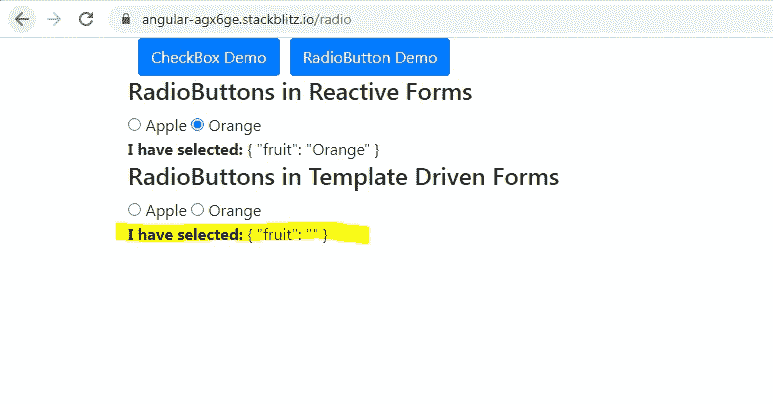

= >我们还打印了如下表单的值。这意味着您可以使用表单的值轻松提取单选按钮的值。

```
<b>I have selected:</b> {{ radioButtonTemplateForm.value | json }}
```

选择“Apple”单选按钮也会自动更新表单的值。请注意，表单的值只是一个对象，以**名称属性**作为键，以 **ngModel/selected 属性**作为值。

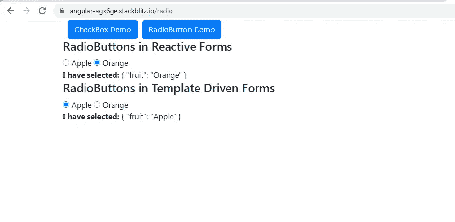

**二。移动到模板驱动和反应式表单中的单组复选框**

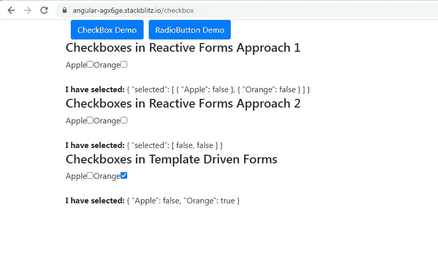

从**反应形式**开始，我已经展示了两种方法可以提取选中复选框的值。您选择的方式取决于您需要的值的格式。

在下面的截图中的**方法 1** 中，你可以看到，复选框值的格式是两个对象的数组: **{"Apple":false}** 和 **{"Orange":false}** 。我们添加了复选框的**值(苹果/橙色)**作为键，复选框的**选中/未选中状态(真/假)**作为键的值。

**表示“苹果”和“橙色”复选框未被选中。**

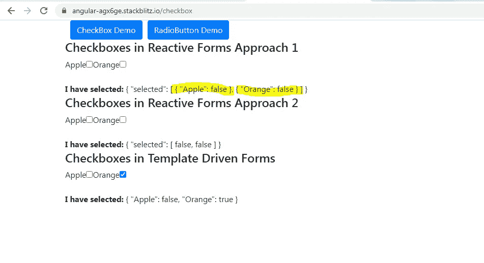

在下面截图中的**方法 2** 中，值的格式是 2 个复选框的选中/未选中状态的**数组。**这是一个布尔值数组。

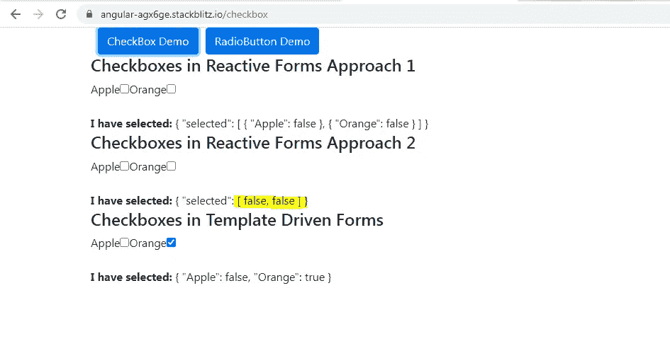

**复选框组件类**

```
export class CheckboxComponent implements OnInit {
constructor(private fb: FormBuilder) {}

public checkBoxForm: FormGroup;
public checkBoxAnotherForm: FormGroup;

public list: any = [
{ label: ‘Apple’, value: false },
{ label: ‘Orange’, value: true },
];
public list2: any = [‘Apple’, ‘Orange’];

ngOnInit() {
this.checkBoxForm = this.fb.group({
selected: this.fb.array(this.loadCheckboxes1()),
});

this.checkBoxAnotherForm = this.fb.group({
selected: this.fb.array(this.loadCheckboxes2()),
});
}

loadCheckboxes1() {
return this.list.map((item: any) => {
return this.fb.group({ [`${item.label}`]: [false] });
});
}

loadCheckboxes2() {
return this.list2.map((item: any) => {
return this.fb.control(false);
});
}
}
```

我们有 2 个根表单组:**复选框表单**和**复选框另一个表单**

**复选框形式**用于演示**方法 1** 和**复选框形式**用于演示**方法 2。**

对于数据，我们对**方法 1** 使用了**属性列表**，对**方法 2** 使用了**列表 2** 。请注意这两个属性的结构。对于这两种方法，我们显示了具有相同数据的复选框，但是使用的数据格式不同。这是因为两种方法中所需的复选框值的格式不同。

```
public list: any = [
{ label: ‘Apple’, value: false },
{ label: ‘Orange’, value: true },
];
public list2: any = [‘Apple’, ‘Orange’];
```

**下面的复选框形式**将包含一个选择的形式排列**。**该选择的表格**将包含 **2 个表格组**。2 个表单组依次包含 **1 个表单控件。**form control 的键将是**列表属性对象**的**标签属性**，键的值将是**列表属性对象**的**值属性****

```
this.checkBoxForm = this.fb.group({
selected: this.fb.array(this.loadCheckboxes1()),
});
```

**loadCheckbox1()** 将演示如何用 2 个 FormGroups 填充选中的 form array**，然后用 1 个 FormControl 填充。两个表单组中的 FormControl 的值已被初始化为 **false** 。这意味着“Apple”和“Orange”复选框最初不会被选中。**

```
loadCheckboxes1() {
return this.list.map((item: any) => {
return this.fb.group({ [`${item.label}`]: [false] });
});
}
```

****复选框另一个表单**是根表单组，包含一个选中的表单数组**。**这个表单数组只是一个 **2 表单控件**的数组。**

**下面的 loadCheckbox2() 将演示如何用 2 个 FormControls 填充选中的 form array**。这两个表单控件都被初始化为**假。**这意味着“Apple”和“Orange”复选框最初不会被选中。****

```
**loadCheckboxes2() {
return this.list2.map((item: any) => {
return this.fb.control(false);
});
}**
```

****对于**模板驱动的表单**，我们在类中没有代码。****

******复选框组件模板:******

```
**<h4>Checkboxes in Reactive Forms Approach 1</h4>

<form class=”form-group” [formGroup]=”checkBoxForm”>
<div formArrayName=”selected”>
<ng-container *ngFor=”let option of list; let i = index”
[formGroupName]=”i”
>
<label>{{ option.label }}</label>
<input type=”checkbox” [formControlName]=”option.label” />
</ng-container>
</div>
</form>

<b>I have selected:</b> {{ checkBoxForm.value | json }}**
```

****正如您可以在 ReactiveForms 的**方法 1 中看到的，我们已经遍历了**列表属性**并显示了 2 个复选框。将 **formControlName 指令**设置为列表属性数组中对象的**标签属性**。******

**请记住， **checkBoxForm** 中 FormControl 的**键也是 **list 属性数组中对象的**标签属性**。******

选择“Apple”复选框更新了**复选框表单的**值，如下所示。

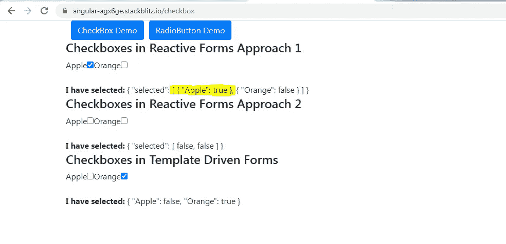

移动到**反应形式的方法 2**，

```
<h4>Checkboxes in Reactive Forms Approach 2</h4>
<form class=”form-group” [formGroup]=”checkBoxAnotherForm”>
<div formArrayName=”selected”>
<ng-container *ngFor=”let option of list2; let i = index”>
<label>{{ option }}</label>
<input type=”checkbox” [formControlName]=”i” />
</ng-container>
</div>
</form>
<b>I have selected:</b> {{ checkBoxAnotherForm.value | json }}
```

我们已经遍历了 **list2 属性**，并显示了 2 个复选框。将 **formControlName 指令**设置为迭代索引。

我选择了“苹果”和“橙色”复选框，表单的值更新如下。

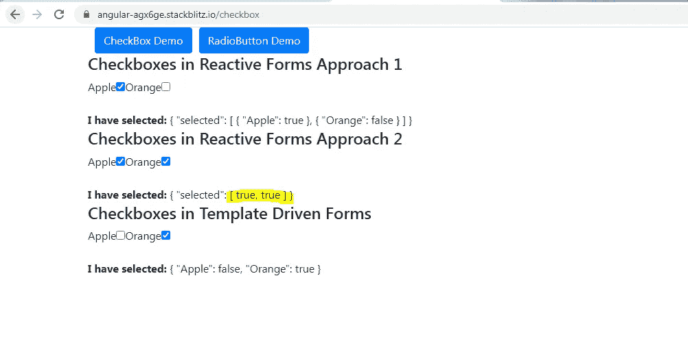

移动到**模板驱动表单**，

```
<h4>Checkboxes in Template Driven Forms</h4>
<form class=”form-group” #checkBoxTemplateForm=”ngForm”>
<ng-container *ngFor=”let option of list; let i = index”>
<label>{{ option.label }}</label>
<input type=”checkbox” [name]=”option.label” [(ngModel)]=”option.value” />
</ng-container>
</form>
<b>I have selected:</b> {{ checkBoxTemplateForm.value | json }}
```

我们已经遍历了**列表属性**并显示了 2 个复选框。正如在单选按钮的例子中已经提到的，对于复选框来说，输入复选框的 **ngModel** 和 **name 属性**也非常重要。

将 **ngModel** 设置为**列表属性**数组中对象的**值属性**。根据复选框是否被选中，复选框的 **ngModel** 可以为真/假。

**名称属性**设置为**列表属性**数组中对象的标签属性。**名称属性对于每个复选框**必须是唯一的，不像单选按钮，一组单选按钮的名称属性必须相同。

选中“橙色”复选框和取消选中“苹果”复选框时，突出显示的是表单的值。

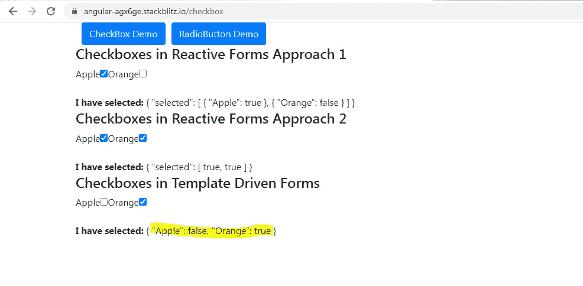

下面是单组单选按钮和复选框场景的完整工作示例。

[](https://stackblitz.com/edit/angular-agx6ge?file=src/app/checkbox/checkbox.component.ts) [## 角形(叉形)堆叠

### 一个基于 rxjs，tslib，jquery，core-js，zone.js，bootstrap，popper.js，@angular/core 的 angular-cli 项目…

stackblitz.com](https://stackblitz.com/edit/angular-agx6ge?file=src/app/checkbox/checkbox.component.ts) 

三。**模板和反应式表单中的多组单选按钮。**

我没有详细介绍这段代码，因为它只是我们之前看到的例子的扩展。

下面是应用程序中组件的屏幕截图。

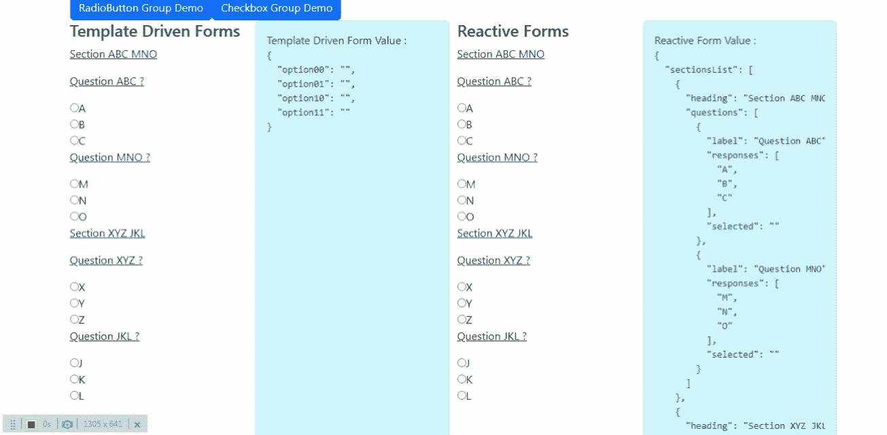

为了创建单选按钮组，我在下面创建了一些虚拟数据。

这是一个由两个对象组成的数组。每个对象是一个**部分**，包含部分**标题**和一组**问题**。每个问题都是一个对象，包含标签和问题可能的一系列**回答**。每个响应对应一个单选按钮。每个问题对象还包含一个 **selected** 属性，以指示为该问题选择了哪个响应。

下面是单选按钮被选中时表单值如何变化的屏幕截图。

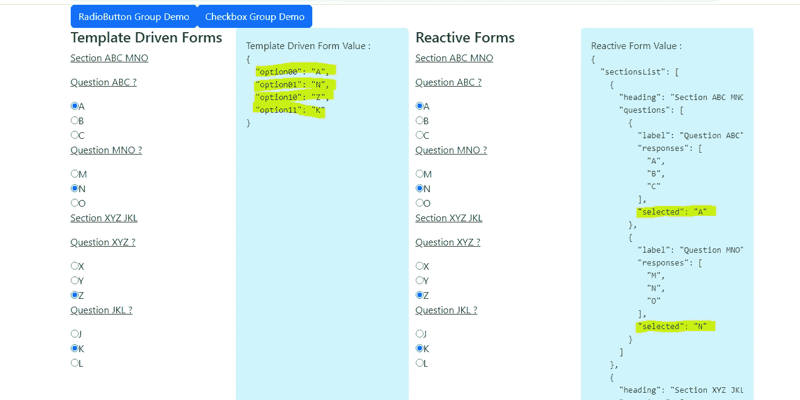

IV **模板和反应式表单中的多组复选框。**

我没有详细介绍这段代码，因为它只是我们之前看到的例子的扩展。

下面是应用程序中组件的屏幕截图。

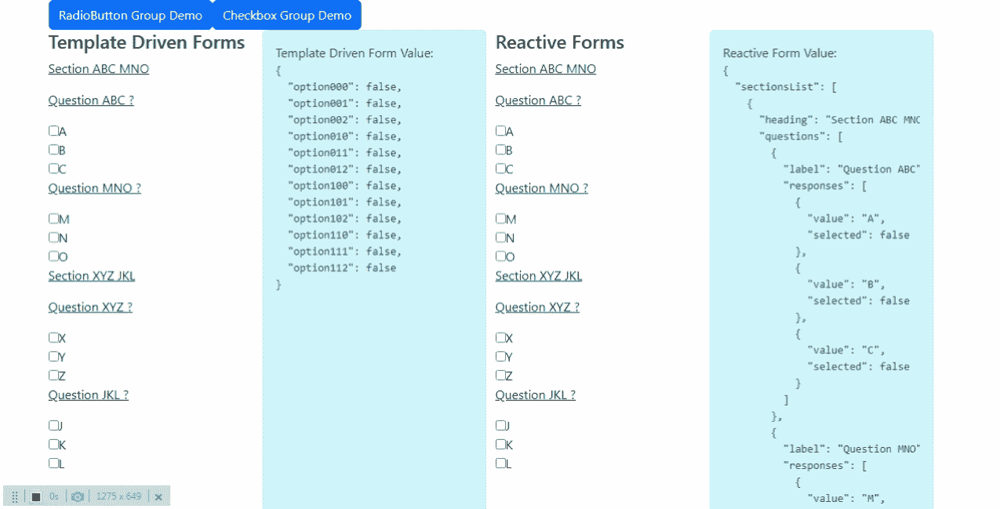

为了创建一组复选框，我使用了下面的虚拟数据。这和我们已经看到的结构相似。这里的每个响应对应一个复选框。但是请注意，整个问题没有**选择的**属性，**相反，每个回答**都有一个单独选择的属性。**这是因为复选框意味着多选，所以一个问题可能有多个答案。**

下面是勾选复选框时表单值如何变化的屏幕截图。

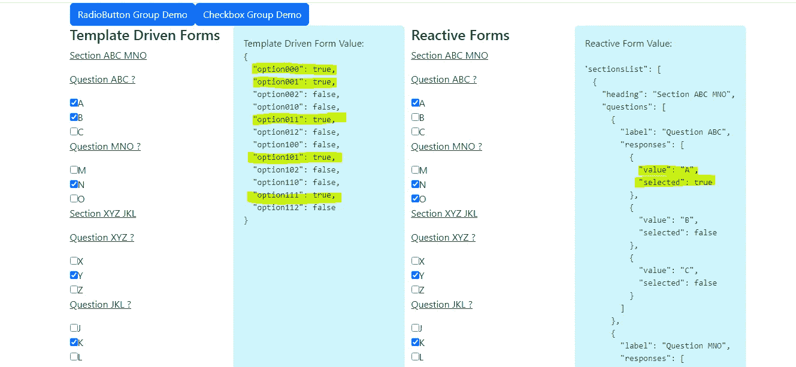

您可以在下面找到 III 和 IV 的完整工作示例。

[](https://stackblitz.com/edit/angular-lnpusu?file=src/app/app.component.html) [## 角形(叉形)堆叠

### 一个基于 rxjs，tslib，core-js，zone.js，@angular/core，@angular/forms，@angular/common 的 angular-cli 项目…

stackblitz.com](https://stackblitz.com/edit/angular-lnpusu?file=src/app/app.component.html)