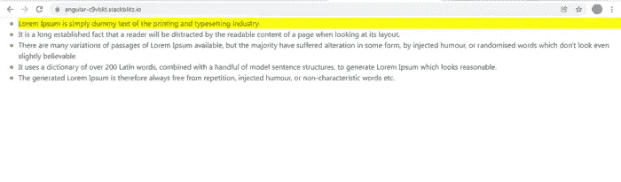
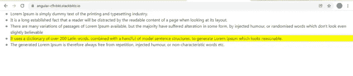
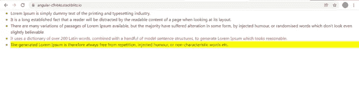

# Angular:应用于父元素的指令如何访问子元素

> 原文：<https://medium.com/geekculture/angular-how-a-directive-when-applied-to-the-parent-element-can-access-the-child-elements-as-well-1d83c2cb4602?source=collection_archive---------2----------------------->

当您将指令应用到元素 A 以执行某个操作时，这是一个非常常见的用例，但是这个操作还需要其他相关的元素。

考虑屏幕上显示的项目列表。假设我想选择一个列表项，并以不同的样式显示选定的项，以区别于其他列表项。在 Angular 组件中使用 JavaScript 和 jQuery 很容易实现这一点，但是我们的目标是完全使用 Angular 指令来实现。

这些是目标:

1.  我们将显示如下 5 个项目的简单列表。默认情况下，将选择第一个列表项。选定项目的背景颜色为黄色。



2.一次只能选择一个列表项目，当我选择任何其他列表项目时，例如:列表中的第三个项目，最初选择的项目即第一个项目应该取消选择，如下所示。



3.为了演示如何将第 2 点中使用的逻辑重用到任何其他类型的事件中，我们将在这个例子中添加另一个特性。每当**鼠标悬停在列表项**上，列表项文本将**从黑色变为红色**。当**鼠标离开列表项时，颜色从红色变回黑色**。

如下面的截图所示，我选择了**最后一个列表项**，因此它的背景颜色为黄色，但是因为我的鼠标悬停在**第三个列表项**上，所以它的文本颜色为红色。



下面是 **AppComponent 模板**。这只是一个简单的列表，通过遍历一个对象数组来创建— **optionsList1。**每个对象都有一个**属性值**，其中包含要在列表中显示的文本。

每个列表项

*   标签都被分配了一个 **ID** ，它基本上是字符串“ **option** ”后跟列表项索引。

此外，每个

*   标签也被分配了一个参考**#选项**。

自定义指令 **ListDirective** 应用于< ul >标签。我们将很快看到为什么该指令适用于 ul 标签而不是 li 标签。

**App 组件类:**组件类只是定义了数组 **optionsList1。**

**ListDirective 类:**

将指令应用于

= >使用@ContentChildren 捕获

*   标签。

= >监听

*   标签上的点击事件。

```
@ContentChildren(‘options’) options: QueryList<ElementRef>;ngAfterContentInit() {
this.renderer.addClass(
this.options.toArray()[0].nativeElement,‘activeOption’);
}
```

正如你在上面的代码中看到的，我们已经使用 **ContentChildren** 访问了引用 **#options** 的所有

*   标签。

在 **ngAfterContentInit()生命周期挂钩**中，我们正在访问第一个列表项，并向其中添加了 **activeOption** 类。这个类将为第一个选项添加一个**黄色背景色**。我们已经使用了 **Renderer2** 来操作 DOM。

```
.activeOption{
background-color: yellow;
}
```

这完成了我们的第一个目标。

2.为了监听

*   标签上的点击事件，我们添加了一个@HostListener，如下所示。每当我们单击任何列表选项，就会调用 **onClick()** ，它又调用另一个方法 **actionElement()** ，传递< li >标签目标细节和作为参数命名的类

```
@HostListener(‘click’, [‘$event.target’])
onClick(target: any) {
this.actionElement(‘activeOption’, target);
}
```

创建另一个方法 **actionElement()** 的目的是为任何其他可能使用不同 CSS 类的事件类型重用相同的逻辑。

```
actionElement(className: string, target: any) {

this.options.toArray().forEach((item) => {

if (target.id === item.nativeElement.id) {
if (!item.nativeElement.classList.contains(className)) {
this.renderer.addClass(item.nativeElement, className);
}
} else {
this.renderer.removeClass(item.nativeElement, className);
}
});
}
```

在这个方法中，我们迭代通过 **ContentChildren** 引用 **#options** 。在每次迭代中，我们检查哪个列表选项具有与目标< li >相同的 ID(即被点击的< li >标签)。

```
this.options.toArray().forEach((item) => {
if (target.id === item.nativeElement.id) {
//logic for adding css class
}
else{
//logic for removing css class
}
})
```

肯定会有匹配的。我们**将 activeOption** CSS 类添加到匹配的< li >列表选项中，**将 activeOption** CSS 类从其他< li >列表选项中移除。

这也完成了我们的第二个目标。

对于第三个目标，我们增加了 2 个@HostListener 来监听 **mouseover** 和 **mouseleave** 事件。这些事件分别触发 **onMouseover()** 和 **onMouseLeave()** 方法。这些方法依次调用现有的 **actionElement()** 传递目标< li >细节和一个新的类名作为参数。

```
@HostListener(‘mouseover’, [‘$event.target’])
onMouseover(target: any) {
this.actionElement(‘onHover’, target);
}
```

```
@HostListener(‘mouseleave’, [‘$event.target’])
onMouseLeave(target: any) {
this.actionElement(‘onLeave’, target);
}
```

完整的工作示例可以在下面找到。

[](https://stackblitz.com/edit/angular-c9vbkt?file=src/app/app.component.ts) [## 角形(叉形)堆叠

### 一个基于 rxjs，tslib，jquery，core-js，zone.js，bootstrap，popper.js，@angular/core 的 angular-cli 项目…

stackblitz.com](https://stackblitz.com/edit/angular-c9vbkt?file=src/app/app.component.ts)